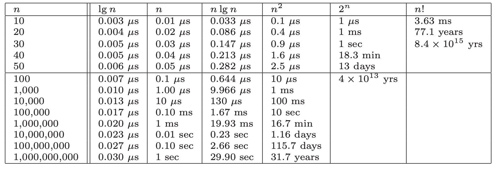
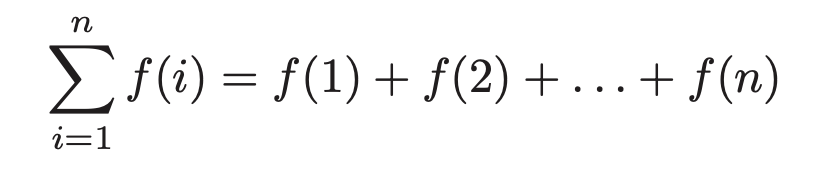
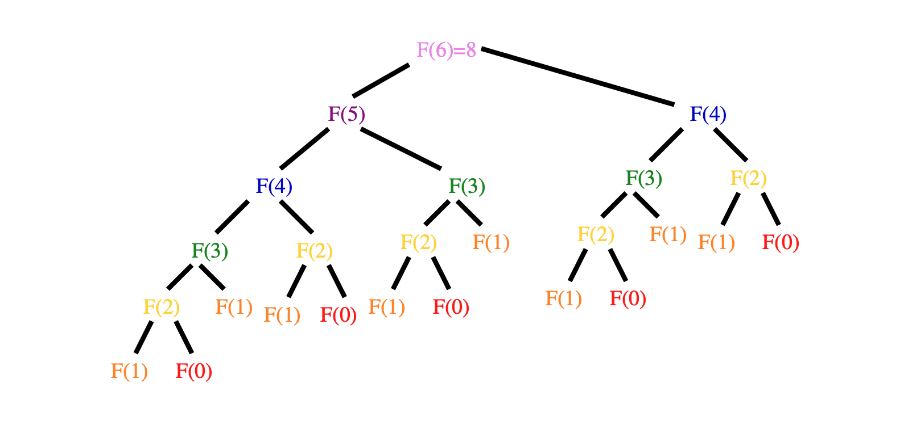
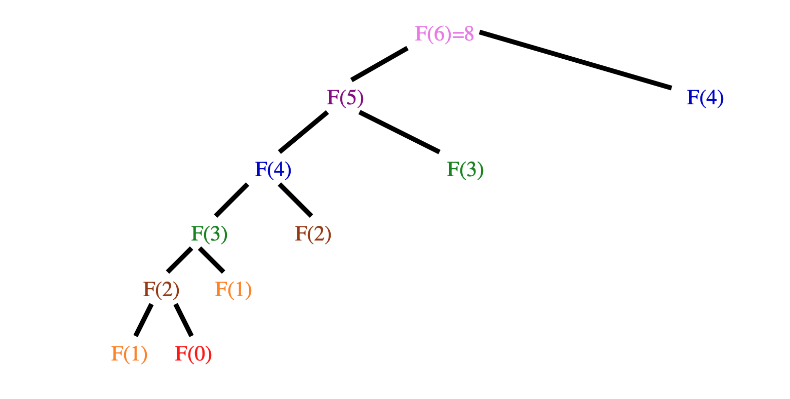

# Chapter 1 - Introduction to Algorithm Design
Algorithm's are procedures that solves *problems*.seta It must, in order to be correct, solve all *instances* of that problem. The difference between a general, well-specified problem and instances of that problem are key. Algorithms that only solve a subset of instances, and not the problem more generally, are incorrect.

Three desirable properties of a good algorithm:
1. Correct
2. Efficient
3. Easy to implement

These may not be achievable simultaneously.

An algorithm generally by describes as an input of some description and a desired output based upon that input.

Throughout the book he'll use the traveling salesman problem to describe various lessons on algorithms. In this chapter he ran through some of the naive approaches to solving the problem of how to minimize the total distance traveled when visiting a set of points exactly once. First was the idea randomly choosing a point and then walking the rest via a nearest neighbor search. This is obviously wrong as there's no way to choose the first point other than randomly. Then there was the idea of the closest-pair heuristic that would attempt to build a chain by repeatedly finding the closest pairs of points and then merging them correctly. This also has issues.

Generally the point is:
> There is a fundamental difference between *algorithms*, procedures that always produce a good result, and *heuristics*, which may usually do a good job but provide no guarantee of correctness.

## 1.2 Selecting the right jobs
He then describes the movie scheduling problem: if an actor has n number of possible jobs all of which pay equally but span different intervals, how do they select which jobs to take. The take home lesson is:
> Reasonable looking algorithms can easily be incorrect. Algorithm correctness is a property that must be carefully demonstrated.

## 1.3 Reasoning about Correctness
We need tool that we can use to determine which algorithms are correct. The primary tool is a mathematical proof. A proof has 3 parts:
1. A clear, precise statement of what you're trying to prove
2. A set of assumptions that can be taken as true
3. A chain of reasoning from the axioms to the statement being proved

Proofs are very hard and so aren't in the book. The work has been done by others, and so we learn about the available algorithm and not why they are correct.

### Problems and Properties
A problem has two parts:
1. The set of allowed input instances
2. The required properties of the algorithm's output

Remember: ask the wrong question -> get the wrong answer.

Often there can be a problem specification that allows too broad a class on instances for which no efficient algorithm exists. It's therefore usual and totally okay to restrict the problem specification to the point where such an algorithm does exist.

Defining the output requirements have two traps:
1. Asking an ill-defined question, like "find the best route". Without a definition of "best" this is meaningless.
2. Creating compound goals, where the output requires too many things. Such outputs may be well defined, but are complicated to reason about and solve.

### Expressing an algorithm
We can use human language, pseudocode, or actual code. Which depends on context. But we should always opt of the one that most clearly express the *idea* of the algorithm. If it's not clear enough, perhaps we're using too low-level a language.

### Demonstrating incorrectness
> Searching for counterexamples is the best way to disprove the correctness of a heuristic.

Good counter examples have two important properties:
1. **Verifiability**: A counterexample should calculate what answer the algorithm will give for a given instance and it should display a better answer to prove the algorithm didn't find it.
2. **Simplicity**: Good counterexamples strip everything unnecessary leaving the simplest form of why the algorithm didn;t work.

Techniques for hunting for counterexamples:
1. **Think small**: When algorithms fail, there is often a very simple example on which they fail. Amateurs tend to create big messy instances of how it fails, rather than finding the simplest test case.
2. **Think exhaustively**: For a small number of `n` (the size of the set of instances on which the algorithm is operated), there are usually only a small number of possible instances. Meaning a small number of outputs. One should think exhaustively in these possible outcomes when finding counterexamples.
3. **Hunt of the weakness**: Based on an definition of the problem, you can often use that to find a possible weakness. So if it's "find the biggest", then provide a case where two options are the same size.
4. **Go for a tie**: Provide instances of the same size.
5. **Seek extremes**: It's good to find extreme examples: big and small, left and right, few and many. These test the assumptions of the algorithm.

## 1.4 Induction and Recursion
Failure to find a counter example is not proof of correctness. For that we need a demonstration of correctness and for that mathematical induction is usually the way to go.

Induction is a chain of assumption that logically flow from one to another, starting with a base case. If A, then B, then C.

Two errors in inductive proofs we can look for:
1. **Boundary errors**: Assumptions can be made in an inductive proof that ignore boundary cases.
2. **Extension claims**: Inductive proofs often make a claim at a small scale and the assume that the same assumption holds for any size of `n`. This can often not be true.

Induction and recursion are both similar due to them both having general and boundary conditions. Induction has general claims and boundaries to which those claims are true. Recursion has a general function that has a boundary condition that stops infinite recursion. Therefore often recursive algorithms can be proved by induction.

## 1.5 Modeling the Problem
Modeling is the art of formulating your application in terms of precisely defined, well-understood problems. Algorithms in the literature are often designed to work on rigorously defined abstract structures, not specific real-world objects. Therefore in order to effectively use the many many algorithms that exist, we need to be able to model our application and the problems it solves in terms of these fundamental structures.

Remember though that not all problems always fit tidily within a well-defined abstract structure. Sometimes modeling in different ways is possible.

 > Modeling your application in terms of well-defined structures and algorithms is the most important single step towards a solution.

### Combinatorial objects
1. **Permutations**: arrangements, or orderings, of items. So {1,3,2,4} and {4,2,3,1} are distinct permutations of the same set.
	1. Likely the object in question when the problem seeks an "arrangement", "tour", "ordering", "sequence"
2. **Subset**: selections from a set of items. E.g. {1,3,4} and {2} are two distinct subsets of the first four integers. Order does not matter.
	1. Likely the object in question when the problem seeks an "cluster", "collection", "committee", "group", "packaging", "selection"
3. **Trees**: hierarchical relationships between items.
	1. Likely the object in question when the problem seeks an "hierarchy", "dominance relationship", "ancestor/descendant relationship", "taxonomy"
4. **Graphs**: relationships between arbitrary pairs of objects.
	1. Likely the object in question when the problem seeks an "network", "circuit", "web", "relationship"
5. **Points**: locations in geometric space.
	1. Likely the object in question when the problem seeks an "sites", "positions", "data records", "locations".
6. **Polygons**: regions in geometric space.
	1. Likely the object in question when the problem seeks an "shapes", "regions", "configurations", "boundaries".
7. **Strings**: sequences of characters, or patterns.
	1. Likely the object in question when the problem seeks an "text", "characters", "patterns", "labels".

### Recursive objects
**Thinking recursively is learning to look for bug things that are made from smaller things of *exactly the same type as the big thing*.**

Recursive structures occur everywhere in the algorithmic world. Each of the structures above have a way to describe in terms of recursion:
1. **Permutations**: Delete the first element of a permutation of `n` and you get a permutation of `n-1`.
2. **Subset**: Every subset of `{1, ..., n}` contains a subset of `{1, ..., n - 1}`.
3. **Trees**: Delete the root of a tree and you get a collection of smaller trees. Delete a leaf and you get a slightly smaller tree.
4. **Graphs**: Delete any vertex from a graph and you get a smaller graph. Divide vertices into groups of left and right and you get another collection of smaller graphs (and broken edges).
5. **Points**: Take a cloud of points and draw a line through them -> two groups of points.
6. **Polygons**: Inserting any internal chord between two non-adjacent vertices of a simple polygon cuts it into two smaller polygons.
7. **Strings**: Delete a character from a string -> still a string.

Recursive descriptions require both decomposition rules and basis cases. Basic cases = the specification of the smallest and simplest objects where the decomposition stops.

## 1.6 Proof by Contradiction
Basics of a contradiction argument:
1. Assume the hypothesis (the statement you want to prove) is false
2. Develop some logical consequences of this assumption
3. Show that one consequence is demonstrably false, therefore showing the assumption is incorrect hypothesis true.

Take Euclid's proof that there are infinite primes:
1. Let's take the negation and assume that there are a fixed number of primes `m`
2. If we take the product `N` of all of the primes in `m`, then it has the property that `N` is divisible by all primes within `m`.
3. But if we consider the integer `N + 1`. 1 effectively becomes a remainder of a division by any of the prime factors of `N`.
4. Therefore N is prime.
5. Therefore the assumption is wrong and the hypothesis true.

(I don't understand how this is true. Surely it only proves that N+1 is indivisible by any factor of N. But there are other integers between those factors, right?)

**NOTE**: 1.7 and 1.8 are the war stories that I'm not always making notes on.

## 1.9 Estimation
When you don't know the answer, estimate (principled guessing). E,g, the running time of a program.

Estimation is usually either principled calculation (function of quantities you already know or could easily find) or analogies (based on past experience). 

E.g. pennies in a jar. Using the prior calculation of how many pennies in a roll of pennies and how tall those rolls are, we can estimate how many rolls make up the volume.

A best practice in estimating is to use multiple methods to come up with an estimate to see if they are about equal.


# Chapter 2 - Algorithm Analysis
In order to understand the effectiveness of an algorithm, we need a way to compare it with others without actually implementing it. There are 2 important tools for this:

1. The RAM model of computation
2. The asymptotic analysis of computational complexity

Before we get started, remember that Big Oh is just a description of the asymptotic growth behaviour of a function as the size of its inputs grow. That wasn't always in my head as I read this, but always remember that's what we're doing is key.

## 2.1 The RAM model of Computation
Machine-independent algorithm design depends on a hypothetical machine called the *Random Access Machine*:

1. Each *simple* operation (+, \*, -, =, if, call) takes exactly one time step
2. Loops and subroutines are *not* considered simple operations. Instead they are a composition of many single-step ops.
3. Each memory access takes exactly one time step. We also have as much memory as we need. The RAM model doesn't differentiate between cache or disk access.


**Essentially: under RAM, we measure run time by counting the steps an algorithm takes.**

Although the assumptions made above are demonstratably not how a machine operates in reality, the simplified model proves to be a very good measure of real world performance. Think of it like the flat earth model. We know it's not reality, but in our daily lives, building houses, putting up shelves, etc, we use this model as a reliable measure of reality. The RAM model is the same.

### Best, Worst, and Average Complexity
To use the RAM model to understand the real-world performance of an algorithm, we need to use it to determine performance of an algorithm over *all possible instances*. Take sorting. With a sort algorithm, the possible instances include every arrangement of `n` keys, for all possible values of `n`. Each of these (a value of `n` and every arrangement of `n`) can be plotted on a graph:

```
                        │
            │
            │
            │                                                    .. x  Worst
            │                                                 ..    x
            │                                              .        x
            │                                            .          x
            │                                         .
            │                                     . x
            │                                  .                    x
Number of   │                               .                       x
  Steps     │                             .         x               x
            │                           .           x               x
            │                       .x
            │                    .                                  x
            │                 .            .     ..  .   .     .  ...  Average
            │             .     .    .                              x
            │          .   . .                      x               x
            │        x . ..   . ..                                  x
            │                        x .            x               x
            │                             .
            │                                .  .                   x
            │                                    .  x  .            x
            │                                              .    .   x
            │                                                       .  Best
            │
            └────────────────────────────────────────────────────────────

                     1               2              3               4

                                    Problem Size
```
Along the X axis is the size of the problem, with Y the number of steps, and the points the performance of a given arrangement of `n`.

There are 3 interesting plots over these points:

1. *Worst-case complexity*: the maximum steps taken in any instance of size `n`.
2. *Best-case complexity*: the minimum steps taken in any instance of size `n`.
3. *Average-case complexity* (or *expected time*): the average steps taken over all instances of size `n`.

Worst-case generally provdes to be the most useful. Best-case is often unlikely and so is useless to think about. Average case can often be difficult to determine. What does average even mean? Worst-case is often easy to calculate.

That said, average-case is useful with respect to *randomized algorithms* which use random numbers to make decisions in an algorithm.

## 2.2 Big Oh Notation
The best, worst, and average complexities are hard to work with in practice as their functions tend to:

1. *Have too many bumps*: There are often irregularities with the performance of algorithms based on some particular value of `n` (binary search is typically faster when `n = 2^k - 1` because the array partitions work out nicely). Capturing the irregularities exactly would serve no real purpose when talking about the generalized performance of an algorithm.
2. *Require too much detail to specify precisely*: We would essentially need to implement the entire algorithm to fully understand all the steps an algorithm could possibly take. Doing so would be exact, but offers little benefit over saying "the time grows quadratically with *n*".

Big Oh notation allows us to discuss the upper and lower bounds of an algorith while ignoring its impactless specifics.

**Note**: Big Oh ignores constants. So `f(n) = n == g(n) = 2n`. Constants tell us nothing aboout the performance of an algorithm as it scales. The constant might occur due to a difference in implementation (Java vs C) of the same algorithm.

Here are the formal definitions of Big Oh are:

1. `f(n) = O(g(n))` means `c · g(n)` is an *upper bound* on `f(n)`. Therefore, some constant `c` exists such that `f(n) <= c · g(n)` for every `n` large enough (meaning `n >= n₀` where `n₀` is some constant).
2. `f(n) = Ω(g(n))` means `c · g(n)` is a *lower bound* on `f(n)`. Therefore, some constant `c` exists such that `f(n) >= c · g(n)` for all `n >= n₀`.
3. `f(n) = Θ(g(n))` means `c₁ · g(n)` is an upper bound on `f(n)` and `c₂ · g(n)` is a lower bound on `f(n)`, for all `n >= n₀`, for all `n >= n₀`. Therefore, some constant `c` exists such that `f(n) <= c₁ · g(n)` and `f(n) >= c₂ · g(n)`, for all `n >= n₀`. This means that `g(n)` is a tight bound on `f(n)`. Essentially a marge of the previous two using two constants.

These all hold for a constant `n₀` such that `n >= n₀`. This reflects that there's always a lower bound on values of `n` that aren't particularly interesting and so we don't both modelling their complexity. E.g. evaluating a sorting algorithm for `n=4` isn't all that interesting, `n=10000` is far more interesting.

Generally when choosing constants we're looking for constants that prove the inequalities in an obvious way.


### Examples

Let's start with `O(g(n))`. Let's assume our function is `3n² - 100n + 6`. Let's figure out its `O(g(n))`. We're looking for a `g(n)` so that `f(n) <= c · g(n)`.

Let's start with `c=3`: is `3n² - 100n + 6` less than `3 · g(n)`? If `g(n)` is `n²`, then yes, because `3n² >= f(n) = 3n² - 100n + 6`. **So:** `f(n) = O(n²)`.

Let's see if it's `O(n³)`: starting with `c=1`, is `n³ >= 3n² - 100n + 6`? Yes, but only when `n > 3`. So, `f(n) = O(n³)` when `n₀ > 3`

Is it `O(n)`? Let's put `c=100` again: is `100n > 3n² - 100n + 6`? Well, yes, but only for values of `n <= (c + 100)/3` (derived from the `f(n)`). So even for a high constant, it only holds for small values of `n`. We're not intersted in that, so `f(n) != O(n)`.

There are examples in the book for `Ω(n)` and `Θ(n)`, but they follow the same logic as above. It's jarring to read `n² = O(n³)`. It's easier to read "=" as "one of the functions of". So `n²` is one of the functions of `n³`. To me it's also easy to read it as `n³` is an upper bound of `n²`.


One more: is `2ⁿ⁺¹ = O(2ⁿ)`? Well it is if there is a constant such that `2ⁿ⁺¹ <= c ·2ⁿ`. If `c=2` then, `2ⁿ⁺¹ = 2· 2ⁿ`, so clearly `2 · 2ⁿ ≤ c · 2ⁿ` for any `c >= 2`.


## 2.3 Growth Rates and Dominance Relations
It might seem crazy to ignore constants as it means `f(n) = 0.001n²` is identical to `f(n) = 1000n²`. How can that be? Growth rates baby. For most values of `n`, the constants become irrelevant, resulting in effectively the same runtime. 

Take a look at these runtimes to understand why:



From this we can see:

1. All algorithms take roughly the same time for `n=10`
2. Any algorithm with `n!` running time becomes useless for `n >= 20`
3. Algorithms whose running time is `2ⁿ` are useless for `n > 40`
4. Quadratic-time algorithms (`n²`) are usable up to `n = 10,000`, but deteriorate for larger inputs. `n > 1,000,000` is hopeless.
5. Linear-time and `nlogn` remain practical on inputs of one billion items.
6. Any `O(logn)` algorithm hardly sweats for any imaginable value of `n`.


Bottom line: even ignoring constant values, we get an excellent idea of performance for any given size of n.

### Function classes
The values of `g(n)` create distinct sets of classes we can use to describe most algorithms. Just a note, we say that a faster growing function *dominates* the slower growing one. So `n³` dominates `n²`. Sometimes written `n³ >> n²`.

The classes are:

1. *Constant functions*, `f(n) = 1`. No dependence on `n`.
2. *Logarithmic functions*, `f(n) = log n`. Shows up in binary search. Grows faster than constant, but still fairly slowly.
3. *Linear functions*, `f(n) = n`. Such functions measure the cost of looking at each item once (or twice, or ten times, remember constants aren't relevant) in an n-element array.
4. *Superlinear functions*, `f(n) = n log n`. Arise in algorithms like quicksort and mergesort.
5. *Quadractic functions*, `f(n) = n²`. Measure the cost of looking at most or all *pairs* of items in an n-element universe. Arise in insertion sort and selection sort.
6. *Cubic functions*, `f(n) = cⁿ` for any given constant `c > 1`. Functions like `2ⁿ` arise when enumerating all subsets of n items.
7. *Factorial functions*, `f(n) = n!`. Occur when generating all permutations or orderings of n items.

Using the dominance notation: `n! ≫ 2n ≫ n3 ≫ n2 ≫ nlogn≫ n≫ logn ≫ 1`.

## 2.4 Working with Big Oh
These various operations are common in simplifying functions to determine their complexity.

### Adding Functions
The sum of two functions is governed by the dominant one:

```
f (n) + g(n) → Θ(max(f (n), g(n)))
```

This is very useful in simplifying expressions. E.g. `n³ + n² + n + 1 = Θ(n3).` The intutition for this is that at least half of the bulk must come from the larger value. The dominant function will provide the larger value as `n → ∞`. Thus dropping the smaller functions has at most a factor of 1/2 reduction, which is just a multiplicative constant. Example, if `f(n) = O(n2)` and `g(n) = O(n2)`, then `f(n) + g(n) = O(n2)`.

### Multiplying Functions
Multiplication is like repeated addition. When multiplying by any constant, we know that the constant cannot affect its asymptotic behaviour, so `O(c · f(n)) → O(f(n))`.

But multipling a function with another function is different, as the two functions are increasing with `n`. So in general:

```
O(f (n)) · O(g(n)) → O(f (n) · g(n))
Ω(f (n)) · Ω(g(n)) → Ω(f (n) · g(n))
Θ(f (n)) · Θ(g(n)) → Θ(f (n) · g(n))
```

Also the Big Oh relationships are transitive, so if `f(n) = O(g(n)) and g(n) = O(h(n)), then f(n) = O(h(n))`.

## 2.5 Reasoning about Efficiency
Let's run through some examples of how to use Big Oh reasoning.

### Selection Sort
A selection sort in C:

```c

void selection_sort(item_type s[], int n) {
    int i, j; /* counters */
    int min; /* index of minimum */

    for (i = 0; i < n; i++) {
        min = i;
        for (j = i + 1; j < n; j++) {
            if (s[j] < s[min]) {
                min = j; }
        }
        swap(&s[i], &s[min]);
    }
}
```
It's a nested loop. The outer loop goes around `n` times, and the inner goes around `n - (i + 1)` times, where `i` is the index of the outer loop. So the number of steps is given by the series `T (n) = (n − 1) + (n − 2) + (n − 3) + ... + 2 + 1`. Each term in the series is the number of times for the inner loop, repeated `n` times.

One way to think of it is we're adding up `n - 1` terms, whose average value is `n/2`. So this gives: `T (n) ≈ (n − 1)n/2`. This becomes `(n² - n) / 2` which due to dominate addition, is `n² / 2`. As we ignore constants, it's therefore simply `O(n²)`.


### Insertion Sort
A basic rule of thumb is the worst-case running time follows from multiplying the largest number of times each nested loop can iterate. Take the insertion sort:

```c
for (i = 1; i < n; i++) {
    j = i;
    while ((j > 0) && (s[j] < s[j - 1])) {
        swap(&s[j], &s[j - 1]);
        j = j-1;
    }
}
```

So the question is how often does the inner loop go round? Well it has two termination conditions, one is to prevent out of bounds (`j > 0`) and the other is when it finds an element in its proper order. As worst-case seeks an upper bound, we ignore, and assume the inner loop always goes around `i` times. Since `i < n`, let's assume `n = i`. So therefore the inner loop goes `n` times. The outer loop also goes `n` times. Therefore it's worst-case is `O(n²)`.

### String Pattern Matching
Here's a basic pattern matching algorithm:

```c
int findmatch(char *p, char *t) {
  int i, j;       /* counters */
  int plen, tlen; /* string lengths */

  plen = strlen(p);
  tlen = strlen(t);

  for (i = 0; i <= (tlen - plen); i = i + 1) {
    j = 0;
    while ((j < plen) && (t[i + j] == p[j])) {
      j = j + 1;
    }
    if (j == plen) {
      return (i); /* location of the first match */
    }
  }

  return (-1); /* there is no match */
}
```

Again let's figure out the worst-case of the nested loops. The inner *while* goes around at most `m` times (where `m` is the number of characters in the substring). The outer loop goes around `n - m` times (as it makes no sense to go beyond `n - m` as there needs to be at least `m` characters to get a match). So the worst-case is: `O((n − m)(m + 2))`.

But we need to account of the time it takes to get the length of each string. As it has to count each character in the string it will be linear in the length of the string, so the worst-case is now `O(n + m + (n − m)(m + 2))`.

So now the job is to simplify using the rules of addition and multplication and when noticing when the terms satisfy the inequalities of the base function definitions.

So since `m + 2 = Θ(m)`, we get `O(n + m + (n − m)m)`. Multiplying this out yields `O(n + m + nm − m²)`.

In any interesting problem (this idea of only considering interesting values of `n` comes up a lot), `n >= m`, since the substring needs to be less than the text itself. This means that `n + m <= 2n`, which because of the Big Oh rules, means `n + m <= 2n = Θ(n)`. So replacing `n + m`: `O(n + nm − m²)`.

Next, we now that `n <= nm` as `m >= 1` for any intresting search pattern. Because in addition terms dominate, `n + nm` => `O(nm)`. We now have `O(nm - m²)`

Lastly, `-m²` is negative and therefore only lowers the value. Because we now `n > m` (pattern is less than the whole text), it implies `mn > m²`. It means then that `-m²` is not big enough to cancel out the `nm`. So finally, we have `O(nm)`.

### Matrix multiplication
Matrix multiplication involves 3 nested loops (for two-dimensional matrices). Because of that we should immediately think `O(n³)`. It can easily be derived by understanding that the number of steps in the multiplication (two matrices, one `X x Y`, the other `X x Z`) is calculated by knowing that the inner-most loop runs `z` times, the middle loop `y` times, and the outer `x` times. So `O(xyz)` The common case is where the dimensions of `x`, `y`, and `z` are all the same. So it can be written as `O(n³)`.

## 2.6 Summations
Summations often show up in algorithmic analysis due to the nature of computation (loops and such). So understanding how summations relate to complexity is key.

Summation formulae descrive the addition of an arbitrarily large set of numbers. The general formula:



For many simple summations, we can simplify. For example the sum of `n` ones, is just `n`, so we'd write that.

When `n` is even, the sum of the first `n = 2k` integers can be seen by pairing the `ith` and `(n - i + 1)th` integers. This ends up simplifying to `n(n+ 1)/2` (the same we saw in the selection sort), which we know simplifies to `O(n²)`.

Generally there are two base classes of summation formulae:

1. *Sum of a power of integers*: We know that the summation of the pairs evaluated in a selection sort is `n(n + 1)/2` = `O(n²)`. In general, for a sum of integers where the exponent is `p`, the complexity is `Θ(ⁿ⁺¹)`. Therefore the sume of sqaures is cubic, the sum of cubes is quartic.
2. *Sum of geometric progression*: In geomtric progressions, the index of the loop affects the exponent, that is the summation is `(aⁿ⁺¹ - 1)/(a - 1)`. How we interpret the sum depends on the base `a`. So if `a < 1`, then the complexity converges to a constant as `n -> infinity`. This is the "free lunch" of algorithmic analysis. If `a > 1` though, the sum rapidly grows with each new term -> `Θ(aⁿ⁺¹)` for `a > 1`.

## 2.7 Logarithms and Their Applications
A logarithm is simply an inverse exponential function. Saying `bٰˣ = y` is the same as saying `x = log_b(y)`. (Note: \_b means subscribt b but I can't easily write it).

Exponentials grow at a distressingly fast rate. Logarithms therefore grow refreshingly slow.

**Logarithms arise in any process where things are repeatedly halved**.

### Logarithms and Binary Search
Binary search is a good example of an `O(log n)` algorithm. You build the tree, and then on each iteration of the loop, you have the search space. Halving == logarithm. The number of steps is equal to the number of times we can halve `n` until we have only 1 left. By definition, this is exactly `log₂n`.

One of the most powerful ideas in algorithm design.

### Logarithms and Trees
If we consider a general tree, where each level of the tree multiplies the number of nodes by `d`. When `d=2`, we have a binary tree, so `n = 2ʰ`, where `h` is the height of the tree. So the height (and therefore the number of iterations until an algorithm exhausts the data structure) is `h = log₂n`.

But when `d` is larger it means that each level has more leaves. So each iteration has to consider more leaves, but discards more with each iteration. I think that's better but the book isn't clear.

**I believe that  log_3 is better than log_2, but I'm not sure. I should rewrite this when I've finished the book and am reviewing these notes.**

### Logarithms and Bits
To represent `n` different possibilities with bits, we need `n = 2ʷ`. So therefore `w` bits is needed: `w = log₂n` bits.

### Logarithms and Multiplication
Maybe feel this in when reviewing notes. By brain is too tired to remember multiplication rules for logs.

### Fast Exponentiation
The worst algorithm to compute `aⁿ` would just do `a x a x a ...` `n-1` times. But we can do better. We know that `n` is equal to itself times two. So we can use that to know that if `n` is even, then `aⁿ = (a^(n/2))²`. If it's odd, `aⁿ = a(a^(n/2)²)`. In either case, we've halved the size of the exponent (and therefore the amount of work) at the cost of two multiplications. So `O(lgn)` is enough to compute the value.

This generally leads us to *divide and conquer*. It always pays to divide a job as evenly as possible.

### Logarithms and Summations
Harmonic numbers are a special case of a sum of a power of integers, where the terms being summed are reciprocals of `i`. So `1 + 1 + 1/2 + 1/3 + 1/4` etc. The complexity is `θ(logn)`.

They are important as they arise in many algorithms are usually explain "where the log comes from" when one magically pops out of algebriac manipulation.

For example, analyzing quicksort requires the summation of `n * (sum of harmonic numbers up to n)`. Because the harmonic sequence is just `θ(logn)`, then the complexity of quicksort is `θ(nlogn)`.

### Properties of Logarithms
As we have seen `bˣ = y` is equivalent to `x = log_b(y)`. The `b` is the base of the logarithm. Three bases are important:

1. `Base b = 2`. The *binary logarithm*, usually denoted `lg x`. Arises when halving things. Most algorithmic applications imply binary logarithms.
2. `Base b = e`. The *natural logarithm*, using denoted `ln x`. Base is `2.71828...`. NOTE: He doesn't explain and I don't know where the number comes from.
3. `Base b = 10`. The *common logarithm*. Less common nowadays. Used before pocket calculators.

Important properties:
1. Log of the product is the sum of the logs of each: `logₐ(xy) = logₐ(x) + logₐ(y)`.
2. Easy to convert between bases: `logₐb = log_c(b) / logₐ(y)`. So converting from base a to c involves multiply by `log_c(a)`.

Two implications of these properties:
1. *The base of the logarithm has no real impact on the growth rate*: A big change in the base has little effect on the value. Because converting between bases involving multiplying, we can simply ignore bases in algorithmic analysis.
2. *Logarithms cut any function down to size*: The growth rate of the logarithm of any polynomial function is `O(lg n)`. This follow because:

```
logₐnᵇ = b · logₐn
```

which simplifies to `lgn` because we ignore the base `a` and the constant `b`. The effectiveness of binary search on a wide range of problems is a consequence of this observation. Note that a binary search on `n²` items is only twice as slow as `n` items.

**HEY**: this is important. The term binary search implies that its performance comes from the fact that each iteration splits the search space in half. So what if we were to split it not in half, but 1/3 and 2/3? So for a binaru tree of 1,000,000 items, the iterations is `log₂(1,000,000) = 20`. Taking 2/3 (worst case): `log_\[2/3\](1,000,000) = 35`. So not a lot.

**The main lesson:** changing the base of the log does not affect the asymptotic complexity. The effectiveness of binary search comes from its logarithmic running time, not the base of the log.


## 2.10 Advanced Analysis
These techniques are not used in the main text of the book and are considered optional. But to really understand some of the algorithms in the hitchikers guide part of the book, they will be useful.

**NOTE:** Come back to these and makes notes when I've finished the book.

## Chapter Notes
Little Oh notation: `f(n) = o(g(n))` if `g(n)` dominates `f(n)`. So asking for `o(n²)` means an algorithm that is better than quadratic in the worst case.


# Chapter 3 - Data Structures
Proper data structures are as crucial to performance as the algorithm itself. Although data structures can be swapped out in order to improve performance, it's better to design your algorithm around the appropriate data structure from the beginning.

There are 3 important *abstract data types* that will be focused on in this chapter:
1. Containers
2. Dictionaries
3. Priority queues

Each of these have many concrete data types. Some of those will be discussed in this chapter.

## 3.1 Contiguous vs Linked Data Structures
Data structures can be classified as either *contiguous* or *linked*, depending upon whether they are based on arrays or pointers.

*Contiguous allocated structures* are composed of single slabs of memory. They include:
1. Arrays
2. Matrices
3. Heaps
4. Hash tables

*Linked data structures* are composed of distinct chunks of memory bound together by *pointers* and include:
1. Lists
2. Trees
3. Graph adjacency lists

### Arrays
Arrays are the fundamental contiguous structure. They are fixed-sized data records such that each element can be efficiently located by its index or (equivalently) address.

Advantages:
1. *Constant-time access given the index*: As an index -> address, we can arbitrary data items instantly provided we know the index.
2. *Space efficiency*: Arrays are pure data - no data is wasted on linkage information. End-of-record info is not needed as arrays are built from fixed-sized records.
3. *Memory locality*: They have excellent memory locality when iterated through sequentially - common in programming. Physical continuity between successive data access helps exploit the high-speed *cache memory* on modern computer architectures (L1 cache and all that).

Downside: cannot adjust their size in the middle of execution. We can compensate by allocating more than we initially need, but this is wasteful.

A better technique is to use dynamic arrays. These start with a given array size and double when we run out of space (when `i` == `j - 1` if `j` is the length of the array). This seems wasteful, but surprisingly is not.

If we assume we start at an array of 1 and double until we get to `n`, it takes `ln(n)` (due to doubling every iteration) number of doubles until we get there. Plus 1 more when `i=n`. Each iteration involves `2ⁱ⁻¹` copy operations. So the complexity is given by the sum of `2ⁱ⁻¹` terms starting from `i=1` to `i=lg(n)`. This works out and simplified to `2n`. This means that each element is moved on average twice. ANd the total work in managing the array is `O(n)`, the same cost of allocated a fixed sized array.

What we lose with dynamic arrays is the guarantee that an insertion is constant time in the *worst case*. But all accesses and *most* insertions will still be constant. What we get is a promise that the nth element insertion will be completed quickly enough to give `O(n)` total effort expended in managing the array. This is an example of *amortized* guarantees, which occur frequently in data structure analysis.

### Pointers and linked data structures
*Pointers* are the connections that hold the pieces of linked structures together. They represent the address of a location in memory.

A linked list is defined by the following struct:

```c
typedef struct list {
    item_type item; /* data item */
    struct list *next; /* point to successor */
} list;
```

1. Each node in the data structure (here `list`) contains one or more data fields (here `item`) that stores the data.
2. Each node contains a pointer to another node (`next`). Much of the data in linked data structures therefore is devoted to pointers, not data.
3. We need a pointer to the head of the structure.

The list is the simplest linked data structure. There are three basic operations supported by lists:
1. Searching
2. Indexing
3. Deleting

In *doubly linked lists*, each node points to the predecessor and its successor, which simplifies certain operations at the expense of extra space.

#### Searching a list
Follow the links either recursively or iteratively until you find the element, or not.

#### Insertion into a list
Inserting into an unordered list simply involves adding it to the front of the list and updating some pointers.

#### Deletion from a list
We first find a pointer to the predecessor of the element to delete, update its next pointer to the element after the element to delete, then free the deleted element's memory.

### Linked vs static arrays
Advantages of linked structures over static arrays:
1. Overflow of linked structures never occur unless we run out of memory.
2. Insertion and deletion are simpler.
3. With large records, moving pointers is easier and faster than moving the items themselves.

Advantages of static arrays:
1. Space efficiency: no wasted space holding pointers.
2. Efficient random access to items in arrays.
3. Better memory locality and cache performance that random pointer jumping.

Both can be though of as recursive structures:
- *Lists*: Chopping the first element from a list leaves another list. Same or strings.
- *Arrays*: Splitting an array gives two smaller arrays.

This insight leads to simpler list processing and efficient divide-and-conquer algorithms such as quicksort and binary search.

## 3.2 Containers: Stacks and Queues
*Containers*: an abstract data type that permits storage and retrieval of data items *independent of content*. They store objects in an organized way that follow specific access rules. They are distiguished by the particular retrieval order they support.

Two important types:
1. *Stacks* support retrieval by LIFO. Easy to implement and are very efficient, so are good to use when retrieval order doesn't matter (e.g. processing batch jobs). The two *put* and *get* operations are `push` and `pop` which insert and remove from the top of the stack. LIFO exists in lots of places in the world. Tends to occur in recursive algorithms.
2. *Queues* support retrieval by FIFO. Jobs processed in FIFO order minimize the *maximum* time spent waiting. Average time is the same whether we use FIFO or LIFO. They are slightly tricker to implement than stacks so are good when insertion order matters. The *put* and *get* operations are usually called *enqueue* and *dequeue* which insert at the back and remove from the front of the queue, respectively.

## 3.3 Dictionaries
The *dictionary* date type permits access to data items by content. You stick an item into a dictionary so you can find it when you need it. The primary operations are:
1. *Search (D, k)*: Given a search key *k*, return a pointer to an element in the dictionary *D* whose key value is *k*, if it exists.
2. *Insert (D, x)*: Given a data item *x*, add it to the dictionary *D*.
3. *Delete (D, x)*: Given a pointer *x* to a given data item in the dictionary *D*, remove it from *D*.

Certain dictionaries structures efficiently support other useful operations:
1. *Max(D)* or *Min(D)*: Retrieve the item with the largest (or smallest) key from *D*. With this the dictionary can serve as a priority queue.
2. *Predecessor(D, x)* or *Succcessor(D, x)*: Retrieve the item from *D* whose key is immediately before (or after) item *x* in *sorted* order. With this we can iterate through the dictionary in sorted order.

Dicitonaries are often used for common data processing tasks. E.g. we could easily remove all duplicates names from a mailing list (construct the dictionary from the names (avoiding dupes by *search*), use *min* and *max* to iterate through using *successor*).

### Implementing dictionaries via arrays
Imagine we implement a dictionary via both an array and a sorted array. Below are the complexities of each operation:

| Dictionary Operation | Unsorted Array | Sorted Array |
|---|---|---|
| Search(A, k) | O(n) | O(logn) |
| Insert(A, x) | O(1) | O(n) |
| Delete(A, x) | O(1) | O(n) |
| Successor(A, x) | O(n) | O(1) |
| Predecessor(A, x) | O(n) | O(1) |
| Minimum(A) | O(n) | O(1) |
| Maximum(A) | O(n) | O(1) |

It's obvious why the above are so, so I won't go into detail. Just note that `O(logn)` for sorted arrays is due to using binary search. 

**Remember**: there are often trade-offs when considering which structures to use. Often increased efficiency on some set of operations will reduce efficiency on another set.

### Implementing dictionaries via linked lists

**Remember**: successor and predecessor refer to the keys in sorted order.

| Dictionary Operation | Single linked unsorted | Singly linked sorted | Doubly linked unsorted | Doubly linked sorted |
|---|---|---|---|---|
| Search(L, k) | O(n) | O(n) | O(n) | O(n) |
| Insert(L, x) | O(1) | O(n) | O(1) | O(n) |
| Delete(L, x) | O(n)\* | O(n)\* | O(1) | O(1) |
| Successor(L, x) | O(n) | O(1) | O(n) | O(1) |
| Predecessor(L, x) | O(n) | O(n) | O(n) | O(1) |
| Minimum(L) | O(1)\ | O(1) | O(n) | O(1) |
| Maximum(L) | O(1)\* | O(1)\* | O(n) | O(1) |

Most of these are self-explanatory, with the exception of those with an \*.

1. \*Deletion: Because we need to correct the link of the prior node in the list, when deleting from a singly linked list we need to traverse the list to the find the predecessor.
2. \*Maxmium: Usually for both singly and doubly linked list, we have to traverse the list to get to the tail, where the maximum lives. But we can maintain a pointer to the tail to, allowing O(1) for *Maxmimum(L)*. We just have to pay the maintenance cost on each insert and deletion to ensure the pointer remains up to date. For doubly linked lists this is O(1) as we just need to check if the `last` pointer's `last->next` is still `NULL` on inserts and change the `last->next` to `last->predecessor` if `last` is deleted. For singly linked lists, we just need to charge the cost to deletion operations. One linear sweep per deletion gives us constant time for max/min.

## 3.4 Binary Search Trees
So far the data structures have had fast search or flexible updating, but not both:
1. Unsorted, doubly linked lists support insertion and deletion in O(1) but search is linear in the worst case.
2. Sorted arrays support binary search (log query times) but at the cost of linear updates.

As binary search requires fast access to two element: median elements above and below the given node. Combining these ideas forms a linked list with two pointer nodes. This is the basic idea of binary search trees.

A *rooted binary tree* is defined as being either empty or consisting of a node called the *root* along with two rooted binary trees called the left and right subtrees. Order of the subtrees matters.

In a binary search tree, each node is uniquely labeled `x`, with its left subtree all with labels `< x`, and its right subtree all with labels `> x`.

### Implementing Binary Search Trees
Nodes have *left* and *right* pointer fields, with an optional *parent* pointer, along with a data field:

```c
typedef struct tree {
    item_type item;
    struct tree *parent;
    struct tree *left;
    struct tree *right;
} tree;
```

#### Searching in a Tree
Super simple:

```c

tree *search_tree(tree *l, item_type x) {
  if (l == NULL) {
    return (NULL);
  }

  if (l->item == x) {
    return (l);
  }

  if (x < l->item) {
    return (search_tree(l->left, x));
  } else {
    return (search_tree(l->right, x));
  }
}
```

This runs in `O(h)` where `h` is the height of the tree.

#### Finding the Min and Max Elements in a Tree
By definition the min and max live in the left-most and right-most descendants of the root, respectively.

```c
tree *find_minimum(tree *t) {
  tree *min; /* pointer to minimum */

  if (t == NULL) {
    return (NULL);
  }

  min = t;
  while (min->left != NULL) {
    min = min->left;
  }
  return (min);
}
```

#### Traversal in a Tree
Visiting everynode in a rooted binary tree is important in many algorithms. It's a special case of traversing all nodes and edges in a graph.

A simple application of traversal is listing all the labels in the tree. Doing so in *sorted* order is especially trivial due to the structure of the tree.

```c
void traverse_tree(tree *l) {
  if (l != NULL) {
    traverse_tree(l->left);
    process_item(l->item);
    traverse_tree(l->right);
  }
}
```

It obviously runs in `O(n)`.


#### Insertion in a Tree
Due to the structure of the tree, there is exactly one place to place a given node.

To implement this recursively, we need:
1. `l`: A pointer to the current node we're searching
2. `x`: The element to insert
3. `parent`: A pointer to the parent so we can hook up the new node to its parent

The algorithm then checks if `l` is `NULL`, if it is it means we've found the place to insert, otherwise search the next subtree (either left or right depending on the value of x):

```c
void insert_tree(tree **l, item_type x, tree *parent) {
  tree *p; /* temporary pointer */

  if (*l == NULL) {
    p = malloc(sizeof(tree));
    p->item = x;
    p->left = p->right = NULL;
    p->parent = parent;

    *l = p;
    return;
  }

  if (x < (*l)->item) {
    insert_tree(&((*l)->left), x, *l);
  } else {
    insert_tree(&((*l)->right), x, *l);
  }
}
```

Creating the node and linking it is `O(1)` but searching is `O(h)`.

#### Deletion from a Tree
There are 3 cases:
1. The node has no children: easy just remove it and unlink from the parent.
2. The node has a single child: easy just remove it and link the parent to the deleted node's child.
3. The node has two children: tricky, but there's an elegant solution: relabel the deleted node with the label of it's immediate success in sorted order. This is the left-most node in the right subtree of the node we're deleting. This results in a properly label tree.

It takes `O(h)` in the worst-case (the two children requires a search).

#### Performance of Binary Search
When implemented using binary search trees, each dictionary operation takes `O(h)`. The smallest height we can get is when the tree is perfectly balanced which means that `h = lg(n)`.

The balance, or lackof, depends on insertion order. The data structure has no control over where to insert as there is exactly one correct place for it to live. It entirely depends on the order in which we're given them. E.g. if we used a list of sorted numbers for insertion, we'd have a tree with only the right-most subtrees being used.

So therefore the heights of binary trees range from `lg(n) -> n`. In a complete random case (where we consider all `n!` possible insertion orders), we average to `lg(n)` so all is good. So random search trees are okay.


#### Balanced Search Trees
Random search trees are *usually* good. But what if we adjusted the tree a little after each insertion/deletion so that a balanced tree always remains?

There are sophisticated algorithms (which we get to later in the book) that efficiently rebalance, giving us `O(lg(n))` for the insert, delete, query operations.

It's usual to exploit balanced search trees and their `O(lg(n))` behaviour by treating them as a black box. It's possible for example to use them to sort a list in `O(nlgn)` using only a subset of the dictionary operations.


## 3.5 Priority Queues
We often need to process items in a specific order. A job queue that ranks jobs in importance for example. Rather than using a regular array and resorting on each new job insertions, we can use the much more cost-effective *priority queue*.

There are 3 primary operations:
1. *Insert(Q, x)*: Give item *x*, insertt it into priority queue *Q*.
2. *Find-Minimum(Q) / Find-Maximum(Q)*: Return a pointer to the item whose key is the smallest or largest among all keys.
3. *Delete-Minimum(Q) / Delete-Maximum(Q)*: Remove the item whose key value is the min or max from Q.

Example: dating. New people are introduced into our lives but we rank them according to some score (the key).

### Performance
| Operation | Unsorted Array | Sorted Array | Balanced Tree |
|---|---|---|---|
| Insert(Q, x) | O(1) | O(n) | O(lgn) |
| Find-Minimum(Q) | O(1) | O(1) | O(1) |
| Delete-Minimum(Q) | O(n) | O(1) | O(lgn) |

The trick to getting `O(1)` on Find-Minimum is to store a pointer to the min. On insertion we can just update the current min pointer if it's lower. Then on deletion we just search for the new minimum. On unsorted arrays this is `O(n)` but for sorted it's `O1()` and balanced trees is `O(lgn)`.

The other operations's cost is obvious.


## 3.7 Hashing
Hash tables are a very practical way to maintain a dictionary. It exploits the fact that with an index, lookup time in an array is constant.

A hash function is a mathematical function that maps keys to integers, which are then used as the index. It's important that the hash function maps to exactly the number of indices we have in our dictionary. So to do accomplish that we must take the remainder: `hash mod size`. With a well chosen table size (should be a large prime) the resulting hash values should be fairly uniformly distributed.

### Collision Resolution
But obviously with taking the remainder, we provide the opportunity for collisions.

Assume table size is `m`.

**For both these methods below, each item is stored along with its key.**

There are two approaches to maintaining a hash table:
1. *Chaining*: the hash table is an array of `m` linked lists (buckets). Each `ith` element contains all the items that hash to the value of `i`. If `n` keys are uniformly distributed in a table, each list will containy roughly `n / m` elements. A considerable amount of memory is used in this method to maintain all the pointers. That memory weould be better spent on increasing the size of the table and therefore collisions.
2. *Open addressing* maintains the hash table as a simple array of elements. The `ith` element contains the first element that was hashed to a given index. During insertion, if an item exists for a given hash, the array is sequentially probed for the next open slot. The same happens for searching. This is called *sequential probing*. There are other methods (double hashing, quadratic probing, etc). Deletion gets tricky as we have to make sure all items remain accessible. So we have to move all items of a given hash and reinsert them.

Chaining and open address both cost `O(m)` to initialize an m-element hash table to null elements prior to insertion.

Here are the given expected and worst-case times for chained hash table with doubly linked lists:


| Operation | Hash table (expected) | Hash table (worst case) |
|---|---|---|
| Search(L, k) | O(n/m) | O(n) |
| Insert(L, x)) | O(1) | O(1) |
| Delete(L, x)) | O(1) | O(1) |
| Successor(L, x)) | O(n + m) | O(n + m) |
| Predecessor(L, x)) | O(n + m) | O(n + m) | 
| Minimum(L)) | O(n + m) | O(n + m) | 
| Maximum(L)) | O(n + m) | O(n + m) | 

Some notes on this:
- Deletion seems to be `O(1)` for one of two reasons not made clear in the book:
  1. The item `x` is the item in the linked list *along with its next and prev* pointers. So deletion just involves fixes the linked list.
  2. The amortized cost is `O(1)` if the hash function has low-collision and the table size is sufficiently sized.
- For traversing all elements, with chaining it's `O(n + m)` as each bucket needs to be traversed. For open addressing, it's `O(m)` as we just iterate over the flat array (the number of elements must be not more than the size of the table).

### Duplicate Detection via Hashing
The key idea of hashing is to map a large obect (string, key, whatever) by a single number. Udi Manber, at one time the head of all search products at Google, said the three most important ideas in CS were "hashing, hashing, and hashing".

Example applications of duplicate detection:
1. *Is a large document unique with a large corpus?*: Searching via the context is obviously impractical. Instead we can generate a hash of the document and use that to compare with the hash codes of all other documents.
2. *Is part of this document plagiarized?*: As a single character will change a hash code of the whole document, we can instead generate hash codes from overlapping windows (substrings) within the document. We should make the length of the substring long enough to avoid chance collisions. The biggest downside: the hashtable is large. Later in the book we'll talk about how to create a well-chosen subset of hashcodes (min-wise hashing).
3. *How can I convince you that a file isn't change?*: We can simply use cryptographic hashing to ensure that a given file is the same at some other point in time.

Although the worst-case of anything involving hashing is dismal, with a well-chosen hash function we can confidently expect good behavioour.

### Canonicalization
We can take advantage of collisions to make otherwise complex problems far quicker. For example, say we're given a string of letters and we want to find all the words that can be made from those words (a,e,k,l => kale, lake, leak). If we were to search each word in a dictionary of `n` words, then the performance of that is `O(n)`.

We can instead hash each word to a sorted string of its letters. That way all words comprised of the same letters hash to the same key. That way finding all the words is simply running the hash function and then looking it up via a hash table. Now the complexity is proportional just to the number of words matching the key.

We can also use it to determine the list of letters that create the most words. Simply find the key with the greatest collisions. If we were to maintain a sorted list of the hash codes, then this becomes super simple.

This is generally an example of *canonicalization*: reducing complication objects to a standard (canonical) form. Another example is stemming: removing the suffixes like -ed and -s or -ing from words.

### Compaction
Sorting a large number of objects with large values is slow. E.g. sorting a library of books by their actual content. Instead of that, we can instead hash the first say 100 words of each book and sort those. Then we just need to sort the books that collide. This is called *compaction*, also called fingerprinting, whose goal is to reduce the size of the objects we're dealing with.


## 3.8 Specialized Data Structures
All the data structures so far represent an unstructed set of items designed for retrieval operations. There are data structures that are designed for a specific type of data:

1. *String data structures*: Suffix trees/arrays are special data structures that preprocess strings to make pattern matching operations faster.
2. *Geometric data structures*: Geo data typically consists of data points and regions. Regions in the plane are described by polygons, with a boundary of a closed chain of line segments. A polygon is described by a set of verts, with each consecutive pair of verts forming an a boundary of the polygon. Spatial data strucutures such as kd-trees organize points and regions by geometrics location to support fast search operations.
3. *Graph data structures*: Graphs are typically representing either using adjacency matrics or lists. The choice has a big impact on the algorithms we use on them. They'll be discussed later in [Chapter 7](#Chapter 7)
4. *Set data structures*: Typically represented using a dictionary to support fast membership queries. Alternatively, *bit vectors* are boolean arrays such that the *ith* bit is 1 if *i* is in the subset.


# Chapter 4 - Sorting
Sorting is considered one of the most fundamental categories of algorithms for several reasons:

1. Sorting is the basic building block of many other algorithms. Understanging sorting leads to an amazing amount of power to solve other problems.
2. Most of the interesting ideas used in the design of algorithms appear in the context of sorting.
3. It's the most studied problem in computer science.

## 4.1 Applications of Sorting
Before discussing the algorithms themselves, know this: **clever sorting algorithms run in `O(nlogn)`**. This is a big improvement over naive `O(n²)` algorithms.

Many important problems can be reduced to a sorting problem. So achieving an `O(nlogn)` sort allows us to avoid the otherwise required quadratic algorithm. Because of this, sorting is a basic build block of designing many solutions to other problems.

Consider the following applications of sorting:
1. *Searching*: Binary search allows us to test whether a dictionary holds an item in `O(logn)` only when the keys are all sorted. Search preprocessing might be the single most important application of sorting.
2. *Closest pair*: Finding the numbers in a list with the smallest difference between them becomes trivial once their sorted. It just requires a linear scan through a sorted list so is `O(nlogn)`.
3. *Element uniqueness*: This is a special case of the closest pair problem, where we're just finding pairs with zero difference.
4. *Finding the mode*: Which element occurs the most? Easy. We just sort, then sweep left to right counting occurences. To find the occurences of an arbitrary item `k`, use binary search in a sorted array of keys until we find `k`. Then we just sweep left from that point until we see a non-`k`, then do the same to the right, which is just `O(log n + c)` where c is the number of `k` occurences.
5. *Selection*: What is the kth largest item in the array? Well in a sorted array it's just the kth item in the array. We can also grab the median item in constant time: it's just an `n/2`.

Note: selection and median can be solved in linear time with more sophisticated algorithms. The point is that sorting is a route to very simple solutions to a large range of problems.

### Finding the Intersection
Problem: Determine if two sets (m and n) are disjoint (have no overlap). Assume m < n.

Three options involving sorting:
1. Sort the big array (n), then do a binary search through the big array using elements from the small array (m). Total time: `O((n + m)logn)`.
2. The reverse. Sort the small array and do a binary search through it using the items from the big array. Total time: `O((n + m)logm)`.
3. Sort both sets. Not sure I understand how this one works. Maybe research more when I come back to this.

Basically the end result is that the sorting the small array is fastest.

### Hashing vs Sorting
For the given problems, let's compare sorting with hashing:
1. *Searching*: Hash tables are great here as they allow searching in constant expected time, instead of `O(logn)` with binary search.
2. *Closest pair*: Hash tables can't help as normal hash functions scatter keys around the table.
3. *Element uniqueness*: Hashing is even faster than sorting. Build the hash using chaining, then check for duplicates within a given hash's bucket. No duplicates in the bucker => no duplicates at all.
4. *Finding the mode*: This isn't great; it's linear expected-time. We have to search each bucket and count elements within it.
6. *Finding the median*: Hashing is no good here. The median might be in any bucket, so we have to do it manually.

## 4.2 Pragmatics of Sorting
Each sorting algorithm presents a question: in what order do we sort the items?

1. *Increasing or decreasing order*
2. *Sorting just the key or an entire record*
3. *What should we do with equal keys*: Sometimes relative order within matching keys matters, so we might need a secondary key. Sometimes it's required to leave the items in their relative order pre- and post- sort. This is called *stable* sorting. Few fast algorithms are naturally stable. It can be achieved though by adding the initial position as a secondary key. We could just let it run, however some algorithms have quadratic performance unless ties are explictly handled.
4. *Non-numerical data*

The way to deal with these is to use an application-specific *comparison function*. It takes `a, b` and returns `<` if `a < b`, `>` if `a > b`, and `=` if `a = b`.

## 4.3 Heapsort
A selection sort is perhaps the simplist to implement. Here it is in pseudo:

```
SelectionSort(A)
    For i = 1 to n do
        Sort[i] = Find-Minimum from A
        Delete-Minimum from A
    Return(Sort)
```

It's time is `O(n²)` due to iterate through the list each time we iterate over an index. Classic nested loop badness.

But we have to iterate through the list each time to find the next smallest item, so what if we used a better data structure instead of a simple array? As the operations required (remove an item, find the smallest) are the same as required for a Priority Queue, we could use either a heap or a balanced binary tree. Then the search time within the nested loop take `O(logn)` vs `O(n²)`. Lovely.

This is the *heapsort*: a selection sort with a better data structure.

### Heaps
Heaps are a simple and elegant data structure for efficiently supporting the priority queue operations *insert* and *extract-min*. They work by maintaining a partial order of its elements that is weaker than sorted (so it's efficient) but strong than random (so it's quick to find the min).

It can do this because heaps are essentially binary trees. Binary trees are often space-inefficient due to pointer storage, but due to the requirements of a selection sort (priority queue semantics), we can actually implement a binary tree using a simple array and so removing the need to follow pointers.

A heap stores data as an array of keys, and use the position of the keys to *implicitly* play the role of pointers.
The root is stored in the first position of the array, with its direct children (left and right), in the 2nd and 33rd positions. Generally: we store the `2ˡ⁻¹` keys of the `lth` level of a complete binary tree from left to right in positions `2ˡ⁻¹` to `2ˡ - 1`. We're assuming the array starts at 1 here to simplify. From this we have simple operations to get a key's children and parents based on its position: `k`'s children are at `2k` and `2k + 1` and the parent is at `k/2`.

In order to maintain those operations above, we need to not have any holes in our tree. Normally it wouldn't matter, but here it's crucial. So for any given level, we have to pack every position with data, with the last level having all its data packed to the left. This means that for `n` nodes we only need an `n`-sized array.

We also can't easily do other operations normally used with a binary tree like moving subtrees. But for heapsort, it's great.

*min-heap*: parents are less than their children
*max-heap*: parents are greater than their children

### Constructing Heaps
We need to both fill the entire tree but also maintain the rule that any parent dominates its children. This is the only rule, the relationship between the children is irrelevant.

To do this:
1. Insert each item to the left-most open space in the arra.y
2. If the new element has the wrong relationship with its parent, swap them.
3. Then check the new parent with its parent, recursively until we're at the root. This bubbles up ensuring that the tree is properly organized.

Each insertion takes at most `O(logn)` (as the maximum bubbles is the height of the tree). And so for `n` elements, building the heap takes `O(nlogn)`.

### Extracting the Minimum
The heap should be built in a min-heap way. That means the minimum is simply the root of the tree. But we obviously need to fill the gap. We can do this moving the right-most leaf (sitting in `H[n]`) to the root. Then we need to ensure the relationships between each parent->children is correct. We can do this by doing the reverse of when we creating the heap: bubbling-down from the root to the right-most position but comparing each node with its right-most child.

This process of bubbling down is called *heapify* (as it techincally merges two heaps).

So repeatedly exchanging the maximum element with the last elent calling heapify yields a `O(nlogn)` sorting algorithm, called *heapsort*.

Pros:
1. It sorts in-place so no extra memory
2. Worst-case `O(nlogn)` is pretty good.
3. Simple to code.

Other algorithms are slightly faster in practice, this is great.

### Faster Heap Construction
Notice that half of the heap are leaves, namely the last half of the array. But by starting at the root and using bubble up to keep the tree organized, we're actually wasting time. We can instead place all items in the array without bubbling up each time (as we did before), and then use `bubble_down` on the last half items.

Although this is a time saver, constructing the heap wasn't significant in the runtime. But still, it shows how with careful analysis we can grab some free time.

### Insertion Sort
Insertion sort is where we iterate through an unsorted set and place it in the correct position in a sorted array. In it's worst case is `O(n²)`, but if the set is almost sorted then relatively few iteration of insertion sort will sort the entire array.

Insertion sort is an example of *incremental insertion*, where we build a complicated structure (of `n` items) by building it up from smaller stuctures (`n - 1` items). Faster algorithms based on incremental insertion exist where the data structure itself provides more efficiency.

## 4.5 Mergesort
Recursive algorithms reduce large problems into smaller ones. A recursive sorting algorithm involves splitting the array into two, then again and again, until we reach the basis case of a single element array. We then merge the split lists until we get a single sorted list. This is called *mergesort*.

Generally:

```
Mergesort(A[1, . . . , n])
    Merge( MergeSort(A[1, . . . , ⌊n/2⌋]), MergeSort(A[⌊n/2⌋ + 1, . . . , n]) )
```

Mergesort efficiency is dependent on how efficiently we can merge the two sorted halves. Concatenating them + running another algorithm like heapsort would destroy all the work spent sorting the component lists.

Instead notice that the smallest overall item must sit at the top of either of the two lists. So we can just grab that and then get the next smallest item. We can repeat until both sorted lists are empty and we have a single sorted list. We're essentially interleaving. This will require at most `n - 1` comparisons or `O(n)`.

As each level's merge requires `n` comparisons, the overall complexity is the product of `n` comparisons at each level by the total number of levels. `n` is halved at each level so the complexity is `O(nlogn)` in the worst-case.

Mergesort is great for sorting linked lists as it does not rely on random access to elements like heapsort and quicksort. Primary disadvantage: the auxiliary buffer required when soting arrays.

**Mergesort is a class divide-and-conquer algorithm**. The trick in reducing a complex problem to smaller chunks is ensuring the resolution of the those subproblems is efficient, as it is with the merge in mergesort.

### Implementation
A crucial concern with the merge in mergesort is ensuring we don't overrwrite data of each of the arrays. So we'll need to use a buffer.

## 4.6 Quicksort
Quicksort is similar to mergesort in that it's a recursive algorithm that works by repeatedly splitting the array into smaller subarrays.

The quicksort algorithm works by:
1. Pick a random element `p` from the array (size `n`)
2. Iterate through each element other than p, splitting the array into those < `p` and those `>=` p.
3. The pivot element `p` is now in its final position, as the items to the left are all < p and those to the right are >= p. And because of that no item from either subarray will ever need to jump across. Therefore each subarray can be sorted independently.
4. Repeat recursively until we hit the basis case of a single element.

Partitioning the array (equivalent to the merge step in mergesort) takes time linear in the number of keys. And as with mergesort it runs in `O(n · h)`, but the difference here is `h` isn't fixed (in mergesort it's `logn` as we're always splitting in two). Instead `h` is dependent on the random value of `p` we choose. In the best case, we choose the median and so end up with `logn`, but the worst case is choosing the smallest or largest element and so each partition level results in only a single element smaller than the parent array, resulting in `h = n` and so total time is `O(n²)` (as each step is linear in `n` so if `h` is `n` we have `n · n`).

To justify it's name the average case for quicksort will need to be a lot better than the worst case. In fact it's `O(nlogn)`. Understanding why requires some intution about random sampling.

### The Expected Case for Quicksort
Picking the median has a probably of 1/n so it's not very likely. To understand the expected case we have to understand what the expected random pivot point will be. Well it turns out it's the median between the worst possible point (`p = 1` or `p = n`) and the best possible case (`p = n/2`). A pivot around this expected point would leave `1n/4` to one side and `3n/4` on the other. The expected case then is when the height of the tree is `3n/4` at each level. The question is then how many times can we multiply `n` by `3/4` before reaching 1:

```
(3/4)ʰ ·n = 1 => n = (4/3)ʰ => h = log₄/₃(n)
```

Careful analysis shows that the average height after *n* insertions is approximately `2ln(n)`, which is `~1.386lgm`, only 39% taller than the perfectly balanced binary tree. The average time is then `O(nlogn)` as `n` work is done at each level. `O(n²)` is possible but vanishingly unlikely.

### Randomization
The above analysis makes the assumption that `p` is chosen randomly. But in the code presented in the book, `p` is chosen by selecting the last element of the array. If the array comes with some biased sort order, then we're not getting our randomness guarantees. Suppose instead we spent `O(n)` time pre-randomizing the array. Well then we're guaranteed our `O(nlogn)`.

Generally *randomization* is a great technique to improve algorithms with terrible worst-case but good average-case. It makes them more robust to boundary cases and efficient on highly structured input instances that cofound heuristic decisions.

Here's some basic approaches to randomized algorithms:
1. *Random sampling*: Want to get the median of a set but have neither the time not space to do it properly? Take a small random sample and calculate the median of that. The result should be representative of the full set. This is essentially what opinion polling is. The key is selecting truly random samples.
2. *Randomized hashing*: We only get `O(1)` expected time in a hashed dictionary search if the we have good distribution in the hash. The worst-case is where all elements hash to the same bucket. By randomly selecting from a large family of good ones, we get the same type of improved guarantee that we did with randomized quicksort.
3. *Randomized search*: Randomization can be used in search techniques. We'll see that later in the book.

### Is Quicksort really fast?
The question is it faster than heapsort and mergesort, all of which have `O(nlogn)`. We can't do this analysis using Big Oh and the RAM model as their too coarse. When algorithms have the same asymptotic complexity, the implementation details start to matter.

For quicksort, it's proved to be 2 to 3 times faster than mergesort or heapsort. The primary reason is the operations in the innermost loop are more simply. So less cache lookup, less procedure calls, etc. It's also an in-place algorithm so there's no memory overhead.

## 4.7 Distribution Sort
Say we have an address book we want to sort. We could partition the names based on the first letter of the last name. We now have 26 piles. All we need to do is sort the piles and concatenate and boom: sorted names. Assuming even distribution among the names, each of the 26 piles should be far smaller than the original list. Now we can partition again on the 2nd letter of the last name. We keep doing that until we have a lists with only a single name.

This is the *bucketsort* or *distribution sort*.

It's very effective when we're confident in the roughly uniform distribution of our data. This idea underpins hash tables, *kd*-trees, and a variety of other practical data structures. The downside: when the distribution is not uniform, the performance is terrible (in the worst-case, you end up with `n²` again).

We can give guarantees on data structures like balanced binary trees, but no such promise exists for heuristic data structures on unexpected input distributions, which often occur in real life (consider how frequency of last names is highly region-dependent).

### Lower bounds on sorting
So far we've spoken only about the upper bounds of sorting algorithms, which are often `O(logn)`, but none are linear `O(n)`. Could it be possible?

Well sorting `n` elements requires at least looking at them all so our lower bound has to be `Ω(n)`. What about the upper bound? Well it order for sorting to actually do it's job each inspect of `n` needs to be at least a comparison with something else, as if we did exactly the same operation for each of `n`, we couldn't possibly be doing anything useful.

We can think of all possible executions of pairs of `n` but considering a tree with `n!` leaves, where each leaf represents a unique permutation. The minimum height of this tree represents the faster algorithm and it turns out it's `lg(n!) = θ(nlogn)`.

# Chapter 5 - Divide and Conquer
One of the most powerful techniques in solving problems is breaking them down into smaller, more easily solved pieces. Smaller problems == less overwhelming. Recursive algorithms become more apparent when we can break a problem down into smaller problems of the same type.

*Divide and conquer* splits a problem into (say) halves, solves each half, then stiches the pieces back together to form a full solution.

Whenever merging the smaller parts of a bigger problem is more efficient than solving the big problem, we get an efficient algorithm.

Examples of divide and conquer: mergesort, the Fourier transform, Strassen's matrix multiplication algorithm.

## 5.1 Binary Search and Related Algorithms
Binary search is the key divide-and-conquer algorith. It's a fast algorithm for searching in a sorted array of keys `S`. To search for `q` we compare it to the middle key `S[n/2]`. If `q < S[n/2]` then its in the left-side of the array, otherwise it's the right. We repeat this process on each subset. It means we find the right answer in a total of `lg(n)` comparisons - much better than n/2 expected if we did sequential search.

```c
int binary_search(item_type s[], item_type key, int low, int high) {
  int middle; /* index of middle element */

  if (low > high) {
    return (-1); /* key not found */
  }

  middle = (low + high) / 2;

  if (s[middle] == key) {
    return (middle);
  }

  if (s[middle] > key) {
    return (binary_search(s, key, low, middle - 1));
  } else {
    return (binary_search(s, key, middle + 1, high));
  }
}
```

### Using Binary Search to Count Occurences
As binary search allows us to find a key quickly, naturally we can use it to count occurences of a given key within a sorted array. The simple method would be to find the key, then seqentially scan left and right to find the boundaries. However this leads to `O(ln + s)` where `s` is the length of occurences.

Instead we can modify the original binary search so that instead of returning the index when the key is found `s[middle] == key`, we instead let it run. It'll then keep moving right until it finds the right boundary. We can reverse the condition (`s[middle] > key`) to find the left boundary. This will be `O(lgn)`.

Another solution: search of the keys `k - e` & `k + e` where `e` is some small constant such that it resolves to a key that is the prev/next key in the sorted list. That way we know that finding this key represents the boundary. Presumably this fails if there happens to not be an instance of that key in the array.

### One-Sided Binary Search
Say we have a run of 0s then an unbounded run of 1s and we want to find the transition point `p`. If we had a bound on the array size, then we could use binary search as above.

Without a bound, we can instead repeatedly test at larger intervals (`A[1]`, `[2]`, `A[4]`) until we find a non-zero value. Now we have a window in which to perform binary search. It will find the transition point `p` in max `2[lgp]` regardless of array length.

### Square and Other Roots
We can use binary search to find the square root of a number.

For any number `n` > 1, the root is `>= 1` and `<= n`. So `1` and `n` are our bounds for binary search. If the swuare of the midpoint `m` is great that `n`, then we continue in the left-half, otherwise we countinue in the right-half. It will find it in `lgn` rounds to within +-1/2.

The same can be done for finding roots of a polynomial equation.

This is called the *bisection method* in numerical analysis. There are faster methods, but this shows the utility of binary search.

## 5.3 Recurrence Relations
A recurrence relation is an equation in which a function is defined in terms of itself. E.g:
1. Fibonacci
2. Any polynomial
3. Any exponential

The self-reference property of recurrence relations is shared with recursive programs or algorithms. Essentially: recurrence relations provide a way to analyze recursive structures, such as algorithms.

### Divide-and-Conquer Recurrences
A given divide-and-conquer algorithm breaks a problems into `a` smaller pieces, each of which is size `n/b`. It then spends `f(n)` time combining these subproblems into a complete result. The worst-case, `T(n)`, is given by:

```
T(n) = a · T(n/b) + f(n)
```

Essentially: (the number of subproblems * the time to solve the subproblem) + the time to combine.

Let's look at how this applies to other algorithms:

1. *Mergesort*: `T(n) = 2T(n/2) + O(n)`, as the algorithm divides the problem into two smaller pieces and spends linear time merging. We know this evaluates to `O(nlgn)`.
2. *Binary search*: `T(n) = T(n/2) + O(1)`. `a` is 1 because no merging happens, we just throw away a half. It's n/2 as we have the problem each step. And `O(1)` combining as there is no combining. We know this evaluates to `O(lgn)`.
3. *Fast heap construction*: THe *bubble_down* method of heap construction builds an n-element heap by constructing two n/2 element heaps and then merging them with the root in log time. So `T(n) = 2T(n/2) + O(lgn)`. This evaluates to `O(n)`.

## 5.4 Solving Divide-and-Conquer Recurrences
There are three distinct cases of the solution to divide-and-conquer recurrences. There all variations of the so-called *master theorem*:

1. If `f(n) = O(n^(logb a−ε))` for some constant `ε > 0`, then `T(n) = Θ(n^(logb a))`.
2. If `f(n) = Θ(n^(logb a))`, then `T(n) = Θ(n^(logb a) lgn)`.
3. If `f(n) = Ω(n^(logb a+ε))` for some constant `ε > 0`, and if `af(n/b) ≤ cf(n)` for some `c < 1`, then `T(n) = Θ(f(n))`.

This looks scary but it's fairly simple. It's essentially describing the dominant cost for a given variant of a recurrence. Case 1 generally holds for heap construction and matrix multiplication. Case 2 holds for mergesort. Case 3 generally arises with clumsier algorithms, where the cost of combining the subproblems domaintes everything.

Generally we can think of the master theorem as a black-box that we can invoke as needed. It can be understood by looking at the recursion tree associated with a typical `T(n) = aT(n/b) + f(n)` divide-and-conquer algorithm:

```
                                                                         ▲
                                                                         │
parition size = n                     /x              vertex degree = a  │
                                   / /   \                               │
                                 /        \                              │
                               /            \                            │
                             /                \                          │
                            /                   \                        │
     n/b                   x           x          \x                     │
                          /│\         /│\         /│\                    │
                           │           │           │                     │
                         / │ \       / │ \       / │ \                   │
                           │           │           │                     │
                        /  │  \     /  │  \     / /│  \                  │
     n/b^2              x  x  x     x  x  x     x  x  x                  │
                                                                         │   height = log_b(n)
                                                                         │
                                                                         │
                                                                         │
                                                                         │
                                                                         │
                                                                         │
                                                                         │
                                                                         │
     b         x           x           x                  x              │
              /│\         /│\         /│\                /│\             │
               │           │           │                  │              │
             / │ \       / │ \       / │ \     ....     / │ \            │
               │           │           │                  │              │
            /  │  \     /  │  \     /  │  \            /  │  \           │
     1      x  x  x     x  x  x     x  x  x            x  x  x           │
                                                                         │
                                                                         ▼

         ◄───────────────────────────────────────────────────────►

        width (number of leaf nodes) = a^(log_b(n)) = n^(log_b(a))
```

1. *Case 1: Too many leaves*: If the number of leaves outweights the overall internal evaluation cost (the cost of evaluating a subproblem), the total running time is `O(n^(log_b(a)))`.
2. *Case 2: Equal work per level*: If the sum of the internal evaluation cost at each level is equal (as we move down the tree there are more problems to solve), then the total cost is simply cost per level (`n^(log_b(a))`) times the number of  levels (`log_b(n)`): `O(n^(log_b(a)) lgn)`.
3. *Case 3: Too expensive a root*: If the internal cost grows rapidly with `n`, then the cost of the root evaluation may dominate everything: `O(f(n))`.

## 5.5 Fast Multiplication
There are two ways we're taught how to do multiplication:
1. Add A lots of B: `O(n · 10ⁿ)` to multiple two n-digit base-10 numbers
2. Digit by digit: So 121 * 541 = 121 * 1 + 121 * 40 + 121 * 500 = 65,461. Assuming we perform each real digit-bydigit product (knowing that 121 * 40 is really just 121 * 4 with some digits moved to the correct place) by looking it up in a times table, this algorith multiplies two n-digit numbers in `O(n²)`.

But wait for it, there's an even faster method using divide-and-conquer. Suppose that each number has `n = 2m` digits. Well we can split `2m` and work on them independently. Asusume `w = 10ᵐ⁺¹` (essentially padding with zeroes) and represent `A = a₀ + a₁w` and `B = b₀ + b₁w`, where `aᵢ` and `bᵢ` are the pieces of each respective nummber, then:

```
A × B = (a0 + a1w) × (b0 + b1w) = a0b0 + a0b1w + a1b0w + a1b1w2
```

This procedure reduces the problem of multiplying two n-digit numbers to four products of (n/2)-digit numbers. We also have to add together these four products, which requires `O(n)` work.

We can assertain the time for this algorithm by describing it given its recurrence:

```
T(n) = 4T(n/2) + O(n)
```

Using master theorem (case 1), we see the algorithm runs in `O(n²)`. But this is the same as the digit-by-digit method. We divided it but did not conquer.

There's a better algorithm that describes the product of A * B such that there are 3 multiplications and a constant number of additions (I'm not writing it here, feels overboard). It reduces the recurrence to:

```
T(n) = 3T(n/2) + O(n)
```
Since `n = O(n^(log_2(3)))`, we have the first case of the master theorem., so `T(n) = Θ(n^(log_2(3))) = Θ(n^1.585)`. Much better than `O(n²)` for large numbers.

The notion of defining a recurrence that uses less multiplications and more additions is also behind faster matrix multiplication. Normally matrix multiplication takes `O(n³)`, but Strassen discovered a divide-and-conquer algorithm that has a recurrence:

```
T(n) = 7 · T(n/2) + O(n²)
```
Because `log₂7 ~= 2.81`, `O(^log₂7)` dominates `O(n²)`, so case 1 applies and `T(n) = Θ(n².⁸¹)`. This algorithm has been increasing improved with increasingly complicated recurrences so now its n^2.3727.

## 5.6 Largest Subrange and Closest Pair
Let's think about an algorithm to find the largest subrange within an array that sums to the largest number (assuming the array contains negative numbers). It provides an index pair such that the sum from index `i` to `j` is the largest within the array. The niave approach has `O(n²)`.

Divide-and-conquer can give us `O(nlogn)`. The book has a bad description, or I just don't understand, so I won't make notes. Basically it divides it, gets the best range on each side and then sees if they cross the middle, if they do the union is the largest. 

But generally the idea of "find the best on each side, then check what is straddling the middle" can be applied to other problems. For example, finding the smallest distance between pairs among a set of `n` points. The closest pair is defined by two points in the left half of points, or the right half, or the pair in the middle, so this algorithm must find it (assuming a sorted array of numbers):

```

ClosestPair(A, l, r)
  mid = ⌊(l + r)/2⌋
  lmin = ClosestPair(A,l,mid)
  rmin = ClosestPair(A,mid+1,r)
  return min(lmin, rmin, A[m + 1] − A[m])

```
This doesn't have a termination condition?? I don't get it.

But apparently: this does contant work per call, so it's recurrence is: `T(n) = 2 · T(n/2) + O(1)`, which is case 1 of the theorem, so `T(n) = Θ(n)`. This can be extended to two dimensions to get `Θ(n log n)`.

## 5.7 Parallel Algorithms
Divide-and-conquer is ideal for parallelization. If we can partition our problems into `p` equal-sized parts, then `O(n)` necomes `O(n/p)` plus whatever it costs to combine the results.

But this is only possible if the data is independent. So *data parallelism* is key.

Tasks that can easily be broken into independent chunks that can be handled in parallel is known as *embarrassingly parallel*.

Generally such data parallel approaches are not algorithmically interesting, but they are simple and effective.

### Parallel Pitfalls
1. *There's often a small upper bound on the potential win*: If have a lot of machines, say 24, that gives you a potential 24x speedup. Sounds great, but often more work spent on the algorithm itself can yield a far higher improvement.
2. *Speedup means nothing*: Speedup as a measure can often mean nothing, because throwing more machines at the problem doesn't mean you have a good algorithm. For example, there's a brute-force chess algorithm that's embarassingly parallel, but there's a better algorithm that reduces 99.99% of the work.
3. *Parallel algorithms are tough to debug*: For obvious reasons. Especially the combining of results at potentially random times.

Generally: parallel is only useful after you're stuck at improving the algorithm itself.

## 5.9 Convolution 
**NOTE: more work is needed for me to understand this, possibly implementing some of these algorithms.**

A convolution `C[k]` of two vectors `A, B` is defined as the sum of `A[j] · B[k - j]` from `j=0 -> m-1`, where `m`, `n` are the length of `A` and `B`, respectively.

Essentially convolution is the dot product of A over shifts of `B`. The shift can be either backwards or forwards (above is backwards). It describes how A is affected by B.

It sounds like convolution is a more general term that's described in terms of functions, but here is specifically referencing vectors. Here's a good description I found online:

> The convolution of two vectors, u and v, represents the area of overlap under the points as v slides across u. Algebraically, convolution is the same operation as multiplying polynomials whose coefficients are the elements of u and v.


Convolutions can be used to handle *polynomial multiplication*. Essentially polynomial multiplication works out by summing various products from the two polynomials (I remember this from score). The coefficients of each term within the resulting product is given by the convolution.

So implementing convolutions is important for us to do.

Convolution multiplies every possible pair of elements of A and B, so we'd expect quadratic. But it turns out there's a divide-and-conquer method to get `O(nlogn)` assuming `n >= m`). 


### Applications
`n²` -> `nlogn` is a huge win. So it's important to recognize when we're dealing with a convolution. They often arise when trying all possible ways of doing things that up to `k`, for a large range of values of `k`, or when sliding a mask or pattern `A` over a sequence `B` and calculating each position.

1. *Integer multiplication*: Any integer can be considered a polynomial in base `b`. E.g 632 = 6·b² + 3 · b¹ + 2 · b⁰, where b = 10. So integer multiplication acts like integer multiplication without the carry. Using fast convultions allows multiplication even faster than that clever algorithm mentioned before. There are two ways to deal with the carry, but both easy. But anyway: `O(nlogn)`.
2. *Cross-correlation*: For two times series A and B, the cross-correlation function measures the similarity as a funtion of the shift or displacement of one relative to the other. So we could look at sales and advertising expenditures to find correlation. It's defined as convolution of A over forward-shifted B.
3. *Moving average filters*: Often we want to smooth out a window within a time series by averaging over the window. E.g. C[i−1] = 0.25B[i−1]+ 0.5B[i]+0.25B[i+1] over all positions i. This is just another convolution. Where A is the vector of weights within the window around B[i].
4. *String matching*: The algorithm given before is `O(nm)`. But as the string matching works by moving a subset window over the larger string, we can think of this as convolution. Specifically we can define each character within the string as a bit vector of its alphabet (so in the alphabet {A,B}, A = `10` and B = `01`). Combining these bit vectors gives us a bit vector of the string and the pattern. The dot product over a window will indicate whether the substring matches at a given position.


### Fast Polynomial Multiplication
It's complicated. Not making notes. Just know that fast convolution can be done via divide-and-conquer.

# Chapter 6 - Hashing and Randomized Algorithms
The algorithms discussed so far have all optimized the worst-case: guarantees that every problem instance runs within a given time.

But we can't always do that, so instead we can design algorithms that don't guarantee always efficient or always correct. These lead to randomized algorithms that can still have performance guarantees, but where performance issues are due to getting unlucky on coin flips rather than adverserial input data.

There are two types of randomized algorithms that differ in their guarantees (efficient or correct):

1. *Las Vegas Algorithms*: Guarantee correctness, and are usually (but not always) efficient. Quicksort is a good example.
2. *Monte Carlo Algorithms*: Provably efficient, and usually (but not always) correct. Examples include random sampling methods where a best solution is found by samplying (say) 1,000,000 samples.

Avoiding the need for caring about all edge cases makes randomized algorithms usually simple to describe and implement. But they also can be difficult to analyze due to their unpredictable nature. We therefore need to reach for probablity theory to analyze them.

## 6.1 Probability Review
Probability theory provides a formal frameowkr for reasoning about the likelihood of events.

Definitions:
1. *Experiment*: A procedure that yields one of a set of possible outcomes.
2. *Sample space S*: The set of possible outcomes.
3. *Event E*: A specified subset of outcomes of an experiment. So rolling 7 on a dice has multiple outcomes that would result in 7 (4 + 1, 6 + 1, etc).
4. *Probability of an outcome s*: Denoted *p(s)*, it's a number with two properties:
  1. For each outcome *s* in sample space *S*, `0 <= p(s) <= 1`.
  2. The sum of probabilities of all outcomes equals one.
5. *Probability of an event E*: Sum of the probabilities of the outcomes of the event. An alternative is to use the *complement* of the event E' - the case where E does not occur. Often easier to analyze the complement.
6. *Random variable V*: A numerical function on the outcomes for a probability space. E.g. the function "sum the values of two dices" produces an integer between 2 and 12. This implies a probability distribution of the possible values of the random variable -> P(V(s) = 7) = 1/6,  P(V(s) = 12) = 1/36.
7. *Expected value of a variable E(V)*": The sum of the probabilities within the sample space implied by the variable V.

### Compound events and independence
Here are a list of set operations considering two events A and B:

1. *Difference*: Outcomes of A that are not outcomes of B: `B - A`
2. *Intersection*: Outcomes common to A and B: `A ∩ B = A − (S − B)`
3. *Union*: Outcomes appearing in either A or B: `P(A ∪ B) = P (A) + P (B) − P (A ∩ B)`
4. *Independence*: Events A and B are independent (no special structure of outcomes shared between events) if: `P (A ∩ B) = P (A) × P (B)`

On independence: if we had a class of 50% female / make and half of the students were above average, we'd expect the number of above average females to be 25%. Independence makes calculations much easier. Randomized algorithms often are designed around independent samples, so we can safely multiply probabilities (which we do when they're independent) to understand compound events.

**Question for Ben to answer later:** why do unions substract the probability of the A and B outcome?
- Answer: if we didn't subtract, then we'd be counting the outcomes that are present in both A and B twice. So we need to subtract `A ∩ B` to remove that duplicate count.

### Conditional Probability
Assuming, `P(B) > 0`, the *conditional probability* of A given B, is:

```
P(A|B) = P(A ∩ B) / P(B)
```

If A and B are independent, then:

```
P(A|B) = P(A ∩ B) / P(B) = P(A)P(B) / P(B) = P(A)
```

So B has no impact. P(A|B) is just P(A) if B is irrelevant.

Our primary tool for compute conditional probabilities is *Bayes' theorem*, which reverses the direction of dependencies:

```
P(B|A) = P(A|B)P(B) / P(A)
```

It can often be easier to calculate the reverse.

### Probability Distributions
Random variables are numerical functions where the values are associated with probabilities of occurrence. Such random variables can be represented by their *probability density function* (pdf).

This is simply a graph who's x-axis represents the values the random variable can take on, and the y-axis is the probabalities of each value.

### Mean and Variance
There are two main types of summary statistics:

1. *Central tendency measures*: Captures the center around which the random samples or data points are distributed.
2. *Variation or variability measures*: Describes the spread - how far the random samples or data points can lie from the center.

The primary centrality measure is the *mean*. The mean of a random variable, E(V), also known as the expected value, is given by the sum of the probabilities within the sample space implied by the variable V.

When all the elementary events are of equal probablity, the mean is computed as the sum of all elements over the number of elements. Basic stuff.

*Standard deviation*: The most common measure of variability. The standard deviation of a random variable V is given by `σ = sqrt(E((V − E(V ))²)`.

The standard deviation for a data set is computed from the sum of squared differences between the individual elements and the mean:

```
σ = √((∑ⁿᵢ₌₁(xᵢ − X')²) / (n - 1))
```

A related stastic, the *variance*: `V = σ²`, is the square of the standard deviation. They measure exactly the same thing, it's just the variance is easier to say.

### Tossing Coins and Intuition
It's obvious that that the probability of heads for n = 10,000 is 5,000. The distribution for heads `h` out of `n` is given by a binomial distribution: can't write it here. Essentially a binomial distribution is the distribution of probablities that some parameter `p` happens for `n` independent experiements. But know it's a bell shaped symmetrical distribution about the mean when `p` is 1/2. 

What I may not know: just how tight the variance around the mean is for a 50% probability. Although it can be 0 to `n`, it's almost always within a few standard deviations of the mean. For a 50%, `σ = Θ(√n)`.

Generally for any probability distribution, at least `1 - (1/k²)` of the mass of distribution lies within `±kσ` of the mean.

Remember: for something like quicksort it may seem likely that some number of runs will produce bad results, but in reality, like winnin the lottery is unlikely, it's very likely quicksort will run how we want.

## 6.2 Understanding Balls and Bins
This one is tricky to understand. Let's try.

So balls and bins is a classic problem in probability theory. Given x identical balls to toss at random into y labelled bins. How many bins are expected to contain a given number of balls. The distribution is what we're interested in.

This is similar to hashing: we're hashing the balls into bins or keys into buckets. A good hash function should behave like a random number generator. So suppose we hash `n` keys into `n` buckets, then we'd expect a key per bucket.

But what happens when we pull `n` integers from a uniform distribution? Again we'd want 1 key per bucket, but this isn't what happens.

Instead, when running the simulation, we see 36.78% of the buckets are empty. Why?

Well let's look at the probability of the first bucket always being empty. It'll be empty if the all keys `n` get assigned to the other `n - 1` buckets. The probability `p` of missing for each particular key is then `p = (n - 1)/n`, which approaches `1` as `n` gets large. Intuition: as the number of buckets increases its increasingly likely that it'll miss the first bucket.

But for the first bucket to miss, we must miss for all `n` keys, the probability of which is `pⁿ`, meaning the probability of missing one ball multiplied by itself `n` times. Makes sense.

What's the probability of this:

```
P(missing the first bucket) = ((n - 1) / n)ⁿ -> 1 / e = 0.367879
```
So as `n` gets larger, the probability tends to 1/e = 0.367..

Wow this is so weird. But I guess it's just how probabilities play out as `n` gets large.

### The Coupon Collector's Problem
What's the expected time to fill all the buckets with at least one key?

For a given probability `p`, the number of repeated attempts required before we expect the given outcome is `1/p`.

After filling `i` buckets, the probability that our next key placement will hit an empty bucket is `p = (n - i) / n`. This gives the run `rᵢ`: the number of attempts before we hit an empty bucket.

So the the number of required attempts to fill all buckets is given by the sum of the number of expected attempts per bucket:

```
E(n) = sum(n / (n - i)) from i=0 -> n - 1
```

This simplifies to `nH_n` where `Hn` is harmonic number: `∑ⁿᵢ₌₁1/i` which is also `ln(n)`.

So simply the expected attempts to fill the buckets with at least 1 key is: `ln(n)`.

## 6.3 Why is Hashing a Randomized Algorithm?
A hash function should map keys `s` to integers in the range `m - 1` uniformly. As good hash functions scatter keys around the integer range in a similar manner to a uniform random number generator, we can analyze hashing by treating the values as drawn from tosses of an `m`-sided die.

Even though we can analyze hashing in terms of probabilities doesn't make it a randomized algorithm. In fact a hashing algorithm has to be deterministic for a given key.

For any given hashing algorithm it's possible to construct a worst-case example. To avoid this we need to randomize the algorithms we use to do the actual hashing.

How? Typically `h(x) = f(x)(mod m)` where `f(x)` turns the key into a large value and taking the remainder keeps it in a given range. The range is typically governed by resource constrains so it can't be random. Instead we can mod the value of `f(x)` by some value smaller than `f(x)` but larger than `m`.

I don't totally get how this is randomly choosing an algorithm. It feels more like a salt. Perhaps it's talking about the principle of using multiple mods to take a value through multiple stages of hashing.


## 6.4 Bloom Filters
Let's imagine building a web crawling index. Using a hash table makes sense as hashing to an empty bucket means it must be new. But two keys hashing to the same value doesn't mean they're the same necessarily, so we must check. That requires the chained hash table we've seen before that uses a linked list. But in the case of a web index, collisions are the worst thing, so let's just use a single bit vector. 0 = new, 1 = seen.

But how do we avoid conflicts? Even if a table is 5% full there's still now a 5% chance of a collision, which is much too high.

A better solution: a *bloom filter*. It's also just a bit-vector hash table. Instead of a document hashing to a single position, we instead hash each document `k` times using `k` different algorithns. Then when we insert the document we set each of the bits corresponding to each hash function. To test whether the doc is present, we hash with each function and then check the corresponding bits. They all must be set for a collision to have occured.

The likelihood of this happening is interesting. For a `n` bit vector with `m` documents, the probability of a single collusion is `km / n` where `k` is the hashing number. But for a collision for all `k`, it becomes `(km/n)ᵏ`.

This is interesting as a probability raised to a power becomes smaller, but the probability itself here is increasing.

The result of that is there's a sweet spot for a given `k` and a given load `m/n` (how full the hash table is). So for a given load it would counter productive to increase `k` beyond a certain amount.

## 6.5 The Birthday Paradox and Perfect Hashing
We know that the worst-case for a hash function is `Θ(n)`. But we pay this price because we don't know the data that will be given to us. What if we did? Can we guarantee no collisions?

The first attempt might look to see how big of a hash table we'd need to makeit effectively impossible to create a collision. This is similar to the birthday paradox. The math is simple, but just know that it basically comes down to `n²`. So for `n` items we need `n²` space. Not great.

What if we used this idea of multiple hash functions?

Well that's what *perfect hashing* is: using multiple hash functions and a multi-level table to ensure that a given key within `m` keys hashes to a unique place within a `m` sized table with some fixed length second table. 

The second table is just another linear table that is big enough to fit all the collision lists (list of items that hashed the same index in the first table). The second table is built by first hashing the value, then picking a second hash function such that each of the values that collided map to a unique place in the 2nd table. We then store the hash function used and the start and stop points.

To lookup a value then is simple: hash the value, find the element in the first table, this gives us the hash function and the start and stop positions. We then hash the value again using the second hash function and the star and stop values to create a `mod` function.

Perfect hashing is great any time we want to make a large number of queries to a static dictionary. There's a lot of fiddling we can do to this general scheme to minimize space required. *minimum perfect hashing* guarantees `O(1)` and zero empty slots.

## 6.6 Minwise Hashing
Hashing allows us to quikcly check whether a specific word `w` in a document `D₁` is also in `D₂`. Just build a hash table for `D₂` then check for `h(w)`.

If we were to do this for each word in `D₁`, we'd get a count of the two document's intersection, from which we can then get a measure in similarity called the *Jaccard similarity*. It's the intersection over the union. Effectively the probability that the two documents are similar. 

But ideally we could measure similarity without looking at each word. Then the question is which word should we use? We could just use the most frequent word. That'll be something like `the` so that's useless. We could use a random word but then it's unlikely we pick the same random word in both, even for identical documents.

This is where *minwise hashing* comes in. It allows us to pick a random word, but one that's guaranteed to be the same for identical documents. It's simple: we hash each word and select the one with the minimum hash code. We do this for both documents and compare the min hashcode.

If the docs are identical, then the min hash code will be same. If we had chosen a word at random, the probability of choosing the same word would have been `1/v`.

If the docs are not identical, the probability that the min hash codes are the same depends on the number of words they have in common, meaning the intersection of the vocabularies, and the total vocabulary size of the documents. This is exactly the *Jaccard similarity*. So the probability of choosing the same min hashcode for two documents is *exactly* the Jaccard similarity.

So the the variable `minhash(D₁) == minhash(D₂)` is an estimator of the Jaccard similarity. But there's significant variance of this variable. So we need to average together several variables in a similar way to reduce this variance.

There are two ways to do this:
1. *Use multiple hash functions*: Computing the minhash of two documents using multiple hash functions reduces the variance. It can be shown that using 400 hash functions would estimate the Jaccard similarity with an error <= 0.05.
2. *Single hash function, multiple values*: If multiple hash functions are too CPU heavy, we can hash the first `k` min hash codes for each document. This creates a signature that can be used to determine similarity.

But irrespective of the method, the key is to compute the min hash codes once and store it in an index.

## 6.7 Efficient String Matching
Strings are sequences of characters where order matters. We need an indicator to mark the end of the strings, usually either a special end-of-string character or a count `n` of the characters in the string.

Substring search is a fundamental operation.

The simplest algorithm overlays pattern `p` over text `t` and checks each character. As discussed in #2.5, this is `O(nm)` where `n` = `t` and `m` = `p`.

There are algorithms with worst-case linear time (discussed later in the hitchhiker's guide). Here we discuss a hashing-based on with *expected* linear time.

It's called the Rabin-Karp algorithm.

It works by first hashing the pattern `p` and then the `m` sized substring starting at the `ith` position of `t`. If they match then they're most likely the same. Considering how rare the collision will be, we can spend a small amount of time checking when they do agree.

We do this for each of the `ith` characters of `t` up to `n - m` (as that's the last position that contains a `m`-length substring).

This leaves `n - m + 2` hashes (the `n - m + 1` windows of `t`, plus one hash of `p`). But it takes `O(m)` to hash an `m` length substring and `O(n)` hashes, leaving us with `O(nm)` expected again. THe worst-case is where there are lots of collisions and so we have to spend manual time checking.

But the key is that when two hashes differ by a single character, we can use the previous hash to calculate the next. I won't go into the math but it's fairly simply. Just a two multiplications, one addition, and one subtraction needed. We can even just compute the hash of the entire text `t` and use it each time we need to compare. That way we have constant time hashing (we do it once and use it for all substring comparisons).

That leaves us with `O(n + m)`. But we still have that randomization issue that can cause worst-case time with lots of collisions.

Like before we solve that with some randomization. So if we just `mod` the result by some large `M`, we introduced randomization and reduce the likelihood of collisions. In fact it's `1/M`. So picking a good `M` is key. E.g. if `M = n`, we'd expect one collision per string. If we made `M = nᵏ` for `k >= 2`, we'd never see false collisions.

## 6.8 Primality Testing
Checking if an integer `n` is prime can be done naively by checking all integers in `2 <= x < n`. But obviously we only need to go up to `√n` (as any integer higher than that yields a product greater than `n`). So it's `O(√n)`. But this is still bad. Especially as `n` is the value of the number to check. If we check a huge number, then we'll be waiting a long time.

A better solution involves randomization along with *Fermat's little theorem*.

The theorem states: `aⁿ⁻¹ = 1(mod n) for all a not divisible by n".`

So in Ben's english: if `n` is prime, then for any integer `a` that's not divisible by `n`, then `aⁿ⁻¹ - 1` is an integer multiple of `n`.

Another way: `aⁿ⁻¹ mod n` is always `1` if `n` is prime and `a` is not divisible by `n`.

But of course there can be cases where `aⁿ⁻¹ mod n = 1` for values of `n` that aren't prime. E.g. `a=4, n=15` then `a¹⁴ mod 15 = 1`, but `15` is not prime.

So we need a statistical approach that will yield an answer to the is prime question with a high enough probability. We can do this by taking some sample of `aⱼ`, say 100 of them, that aren't divisible by `n` and if all those numbers `mod n` equal 1 then there's a good chance it's prime. The actual probability it's false positive will be `(1/2)¹⁰⁰`. So very unlikely.

There is another issue: a very small fraction of numbers that violates Fermat's little theorem. They're called *Carmichael numbers*. They're infrequent enough that we can ignore.

As the running time is always fast (as the number of tests is fixed) but there is a possibility of incorrect answwers, this is an example of a Monte Carlo type of randomized algorithm.

Last thing: it might seem `aⁿ⁻¹ mod n` is complex. But (as we discussed in the section on fast exponenation) it can be calculated in `O(logn)`.

## Where Do Random Numbers Come From?
In the real world we can use physical processes to create outcomes that are unpredictable and hence indicative of true randomness. How do we do that in a machine?

Well we use what is essentially a hash function. It's called a *linear congruential generator* or more commonly a *pseudo-random number generator*. It basically creates a new number that appears random based on a previous value:

```
Rₓ = (aRₓ₋₁ + c) mod y
```
Where `a, c, y, and R₀` are carefully selected constants. Essentially: we hash the previous random number to get the next one.

Obviously these aren't truly random. Given a previous random number we calculate the next. If you really want to, given enough samples, you can calculate the constants and therefore the series of random numbers.

But the numbers provide the appearance of randomness. And that randomness has the same statistical properties that woould be expected from a truly random source. So that's enough for our randomized algorithms.

Obviously for cryptographic uses, these aren't enough. The hitchhiker's guide will have more on this.

# Chapter 7 Graph Traversal
Graphs are a unifying theme of computer science due their ability to model so many different structures. They can essentially represent any relationship.

Graph theory provides a language for talking about the properties of relationships which is crucial to solving many algorithmic problems. It's pragmatically more important to be aware of the many types of graph problems than it is to be aware of the specifics of particular graph algorithms.

## 7.1 Flavors of Graphs
A graph `G = (V, E)` is defined as a set of *vertices* `V` and contains a set of *edges* `E` of ordered or unordered pairs of veritices from `V`.

There are several fundamental properties of graphs that determine which algorithms and data structures we'll use when analyzing them:

1. *Undirected vs. directed*: A graph is *undirected* if an edge `(x, y)` in `E` implies an dege `(y, x)` is also in `E`. Otherwise it's *directed*. Most graphs of graph-theoretic interest are undirected. E.g. is a social network undirected? Depends on if you being my friend means I am your friend.
2. *Weight vs. unweighted*: Each edge or vertex in a *weighted* graph is assigned a numerical value, or weight. E.g a road network might be weighted by road length. In *unweighted* graphs there are no weights. The differences between weighted and unweighted are particularly important when doing things like finding the shortest path.
3. *Simple vs. non-simple*: Non-simple edges include *self-loops* and *multi-edges* (the same edge is present multiple times in the graph, e.g. two people are friends from college but also work together). Any graph without them is *simple*. All the algorithms in this book only work with simple graphs.
4. *Sparse vs. dense*: Graphs are *sparse* if only a small fraction of verts have edges between them. The opposite is *dense*. A graph is *complete* if it contains all possible edges. There's no official definition of dense, but they typically have `Θ(n2)` edges while sparse graphs are linear in size.
5. *Cyclic vs. acyclic*: A *cycle* is a closed path of 3 or more vertices that has no repeating vertices except the start/end point. An *acyclic* graph does not contain any cycles. *Trees* are undirected graphs that are connected and acyclic. Directed acyclic graphs are called *DAGs*. They arise naturally in scheduling problems (where an edge indicates order of operations). An operation called *topological sorting* orders the vertices of a DAG to respect these precedence constraints. Topological sorting is typically the first step of any algorithm on a DAG.
6. *Emebdded vs topological*: A *topological* graph is one that is described only by its verts and edges. An *embedded* graph has its verts and edges described with geometric positions. Sometimes a graph can be described entirely from its geometry with no topological relationships. E.g the travelling salesman problem.
7. *Implicit vs. explicit*: Implicit graphs are not explicitly constructed but instead built as we use them. A web crawler is a good example. If possible, it's typically easier to work with an implicit graph rather than construct and store the entire thing prior to analysis.
8. *Labeled vs. unlabeled*: In a *labeled* graph each vert is assigned a unique name or identifier. If not, it's *unlabled*. Commonly graphs are labeled.

Some other concepts:
1. The *degree* of a vertex is determined by how many edges it is connected to. E.g. how popular someone is might be determined by the number of edges in a social network.
2. A *regular* graph has equal degrees for all vertices.

## 7.2 Data Structures for Graphs
There are two basic choices for graph data structures: adjacency matrices and adjacency lists. For the following, assume the graph `G = (V, E)` has `n` vertices and `m` edges.

1. *Adjacency Matrix*: We can represent G using an `n x n` matrix `M`, where `M[i, j] = 1` is an edge of `G` and `0` if it isn't. This allows fast answers to is if `(i, j)` is in `G` and rapid updates for edge insertion and deletion. But obviously considering it's `n x n` size, it wastes a lot of space if the graph has few edges.
2. *Adjacency Lists*: We can more efficiently represent sparse graphs using linked lists to store the neighbors of each vertex. Obviously it's harder to verify if `(i, j)` is in `G`. But it's suprisingly easy to design graph algorithms that don't need to check this.


Here are the relative trade-offs of each approach:

| Comparison | Winner |
| - | - |
| Faster to test if (x, y) is in graph? | adjacency matrices |
| Faster to find the degree of a vertex? | adjacency lists |
| Less memory on sparse graphs?| adjacency lists (m + n) vs. (n2) |
| Less memory on dense graphs? | adjacency matrices (a small win) |
| Edge insertion or deletion? | adjacency matrices O(1) vs. O(d) |
| Faster to traverse the graph? | adjacency lists Θ(m + n) vs. Θ(n2) |
| Better for most problems? | adjacency lists |


Let's use lists as they're generally more useful.

Here's a data type to represent a adjacency list:

```c
#define MAXV 100 /* maximum number of vertices */

typedef struct edgenode {
  int y;                 /* adjacency info */
  int weight;            /* edge weight, if any */
  struct edgenode *next; /* next edge in list */
} edgenode;

typedef struct {
  edgenode *edges[MAXV + 1]; /* adjacency info */
  int degree[MAXV + 1];      /* outdegree of each vertex */
  int nvertices;             /* number of vertices in the graph */
  int nedges;                /* number of edges in the graph */
  int directed;              /* is the graph directed? */
} graph;
```

Each vertex is identified using an integer between 0 and `nvertices`. This is used as an index into `edges`. So the 10th vertix has an edge at `graph->edges[9]`. Inside `edges` are `EdgeNodes`, then connect the vertex given by the index into `graph->edges` and `EdgeNode->y`. The `EdgeNode` also has a `next` pointer to other edges that connect the original vertex to another vertex. So `graph->edges[x]` points to a linked list of edges from `x`.  

```c
void initialize_graph(graph *g, bool directed) {
    int i; /* counter */

    g->nvertices = 0;
    g->nedges = 0;
    g->directed = directed;

    for (i = 1; i <= MAXV; i++) {
        g->degree[i] = 0;
    }

    for (i = 1; i <= MAXV; i++) {
        g->edges[i] = NULL;
    }
}
```


```c
void read_graph(graph *g, bool directed) {
    int i; /* counter */
    int m; /* number of edges */
    int x, y; /* vertices in edge (x,y) */

    initialize_graph(g, directed);

    scanf("%d %d", &(g->nvertices), &m);

    for (i = 1; i <= m; i++) {
        scanf("%d %d", &x, &y);
        insert_edge(g, x, y, directed);
    }
}
```

The `insert_edge` function is the key one. The new `edgenode` is inserted into the beginning of the appropriate adjacency list since order doesn't matter.

```c
void insert_edge(graph *g, int x, int y, bool directed) {
    edgenode *p; /* temporary pointer */

    p = malloc(sizeof(edgenode)); /* allocate edgenode storage */

    p->weight = 0;
    p->y = y;
    p->next = g->edges[x];

    g->edges[x] = p; /* insert at head of list */

    g->degree[x]++;

    if (!directed) {
        insert_edge(g, y, x, true);
    } else {
        g->nedges++;
    }
}
```

Printing just involves two nested loops:

```c
void print_graph(graph *g) {
    int i; /* counter */
    edgenode *p; /* temporary pointer */
    
    for (i = 1; i <= g->nvertices; i++) {
        printf("%d: ", i);
        p = g->edges[i];
        while (p != NULL) {
            printf(" %d", p->y);
            p = p->next;
        }
        printf("\n");
    }
}

```

## 7.5 Traversing a Graph
Visiting every edge and vertex is perhaps the most fundamental graph algorithm. All the basic book keeping ops on graphs are actually just traversals: printing or copying the graph, or converting between alternative representations.

Some rules:
1. *Efficiency*: We must not visit and vertex/edge more than once.
2. *Correctness*: We must visit every vertex/edge once.

The behind graph traversal is to just keep track of each vertex we have visited using one of three states:
1. *Undiscovered*: initial state
2. *Discovered*: vertex found but we have not checked all incident edges
3. *Processed*: all vertex edges have been visited

Initially only the root index is discovered. We then visit each edge discovering new vertices as we go. Once we have visited each edge, we move the vertex to processed and move on to another discovered edge and repeat.

Undirected edges will be visisted twice, once from each direction. Directed edges will be visited once.

## 7.6 Breadth-First Search
In a breadth-first search of an undirected graph, we mark each discovered edge a direction, from the discoverer *u* to the discovered *v*. So *u* is the parent of *v*. Since each node has exactly one parent, except the root, this defines a tree of the verts in the graph. We build this parent connections not for the algorithm, but as useful information that can be used for other applications.

Here's the pseudocode:

```
BFS(G, s)
    Initialize each vertex u ∈ V [G] so
        state[u] = “undiscovered”
        p[u] = nil, i.e. no parent is in the BFS tree
    state[s] = “discovered”
    Q = {s}
    while Q ̸= ∅ do
        u = dequeue[Q]
        process vertex u if desired
        for each vertex v that is adjacent to u
            process edge (u, v) if desired
            if state[v] = “undiscovered” then
                state[v] = “discovered”
                p[v] = u
                enqueue[Q, v]
        state[u] = “processed”
```

Here it is in C.

We use two booleans to maintain the processed/discovered (although a enum type would be better IMO):

```c
bool processed[MAXV+1]; /* which vertices have been processed */
bool discovered[MAXV+1]; /* which vertices have been found */
int parent[MAXV+1]; /* discovery relation */
```

```c
void initialize_search(graph *g) {
    int i; /* counter */
    time = 0;

    for (i = 0; i <= g->nvertices; i++) {
        processed[i] = false;
        discovered[i] = false;
        parent[i] = -1;
    }
}
```
Once the vertex is discovered, it's placed on the queue. We process verts in FIFO, so the oldest verts are expanded first (closer to the root):

```c
void bfs(graph *g, int start) {
  queue q;     /* queue of vertices to visit */
  int v;       /* current vertex */
  int y;       /* successor vertex */
  edgenode *p; /* temporary pointer */

  init_queue(&q);
  enqueue(&q, start);
  discovered[start] = true;

  while (!empty_queue(&q)) {
    v = dequeue(&q);
    process_vertex_early(v);
    processed[v] = true;
    p = g->edges[v];

    while (p != NULL) {
      y = p->y;

      if ((!processed[y]) || g->directed) {
        process_edge(v, y);
      }

      if (!discovered[y]) {
        enqueue(&q, y);
        discovered[y] = true;
        parent[y] = v;
      }

      p = p->next;
    }

    process_vertex_late(v);
  }
}
```

There are three functions that are called during the traversal: `process_vertex_early()`, `process_vertex_late()`, `process_edge()`. These are hooks that can do various things with (basic example: printing verts or counting edges).

### Finding Paths
The parent tree built during traversal represents a tree of discovery. The parent of `i` is defined as the vert that discovered it. The path has a unique property: it represents the shortest path from the root to a given node. Due to the way the parents are discovered and built, we have to find the path from the point `x -> root`, not `root -> x`:

```c
void find_path(int start, int end, int parents[]) {
    if ((start == end) || (end == -1)) {
        printf("\n%d", start);
    } else {
        find_path(start, parents[end], parents);
        printf(" %d", end);
    }
}
```
Two points to remember when using BFS for finding the shortest path:
1. Only useful if we started the traversal from the root.
2. Only works if the graph is unweighted.

## 7.7 Applications of Breadth-First Search
Many elementary graph algorithms work by doing one or two traversals while doing something useful along the way. Implemented using adjacency lists, any algorithm using BFS will be linear as BFS runs in `O(n + m)`. This is optimial as we have to visit all `n` verts and `m` edges.

### Connected Components
A graph is *connected* if there's a path between any two vertices. E.g. In a friendship graph, it's connected if it's possible to get from any person A to any person Z through friendship.

A *connected component* of an undirected graph is a subset of verts for which there is a path between every pair of verts but no paths between subsets. E.g. tribes that haven't been discovered would be separate pieces within the global friendship graph.

An amazing number of seemingly complicated problems reduce to finding or counting connected components.

Connected components can be found using breadth-first search as order does not matter. The process:
1. Start at an arbitary vert and search for connected verts. These all belong to the same component.
2. Then find an undiscovered vertex and build the connected graph for it.
3. Repeat until no undiscovered vertices remain.

```c
void connected_components(graph *g) {
    int c; /* component number */
    int i; /* counter */

    initialize_search(g);

    c = 0;
    for (i = 1; i <= g->nvertices; i++) {
        if (!discovered[i]) {
            c = c + 1;
            printf("Component %d:", c);
            bfs(g, i);
            printf("\n");
        }
    }
}
```

### Two-Coloring Graphs
The *vertex-coloring* problem assigns a color to each vertex of a graph such hthat no edge inks any two verts of the same color.

Easy solution: unique color per vertex. But what if we wanted to minimize the colors used?

This problem arrises in scheduling applications, such as register allocation in compilers.

A graph is *bipartite* if it can be colored using only two colors. They're important because they arise naturally in many applications. E.g. an "mutually interested-in" graph amongst heterosexual people: in this, gender defines a two-coloring of the graph.

We can augment BFS to determine if the graph is bipartite. When descending from parent to child, give the child the opposite color to the parent. Then check any non-tree edges and if one connects two verts of the same color, then the graph is not bipartite.

## 7.8 Depth-First Search
For certain problems, BFS vs DFS makes no difference, but in others it's crucial.

THe difference is the order in which they explore vertices. This is entirely dependent on the data structure used to store and access the *discovered* verts (processed doesn't matter):

1. *Queue*: Using FIFO, oldest unexplored verts are processed first.
2. *Stack*: Using LIFO, verts are explorered as soon as they are discovered, only switching to neighbouring ones once we're surrounded by previously discovered verts.

DFS can use recursion to avoid the need for an explicit stack data structure. In pseudo:

```

DFS(G, u)
    state[u] = “discovered”
    process vertex u if desired
    time = time + 1
    entry[u] = time
    for each vertex v that is adjacent to u
        process edge (u, v) if desired
        if state[v] = “undiscovered” then
            p[v] = u
            DFS(G, v)
    state[u] = “processed”
    exit[u] = time
    time = time + 1
```

The time here isn't needed for traversal but it an interesting value to build up (similar to parents in BFS). As we're incrementing by one it gives us useful information:

1. *Who is an ancestor*: If `x` is an ancestor of `y`, then the time interval of `y` must be nested within `x`.
2. *How many descendants*: The delta between exit and entry times for a given vert tells us how many descendants the vert has (as the time is incremented on entry and exit, the number of descendants is half the delta). Neat trick.

Timing is useful for things like topological sorting and biconnected/strongly connected components.

An important property of DFS is that it inherently partitions the edges of an undirected graph into two classes:
1. *tree edges*: those that discover new verts and are encoded in the parent relation of a given node
2. *back edges*: those who's endpoint is an ancestor of the vert being expanded, so it points back into the tree

As DFS expanded along a path before moving to neighbours, this partitioning means that we never travel along edges connecting a sibling or cousin node, only ancestors.


DFS in C:

```c
void dfs(graph *g, int v) {
  edgenode *p; /* temporary pointer */
  int y;       /* successor vertex */

  if (finished) {
    return; /* allow for search termination */
  }

  discovered[v] = true;
  time = time + 1;
  entry_time[v] = time;

  process_vertex_early(v);

  p = g->edges[v];
  while (p != NULL) {
    y = p->y;

    if (!discovered[y]) {
      parent[y] = v;
      process_edge(v, y);
      dfs(g, y);
    } else if (((!processed[y]) && (parent[v] != y)) || (g->directed)) {
      process_edge(v, y);
    }

    if (finished) {
      return;
    }

    p = p->next;
  }

  process_vertex_late(v);
  time = time + 1;
  exit_time[v] = time;
  processed[v] = true;
}
```

DFS is very similar to backtracking: Both involve exhaustive searching all possibilities along a path backing up only when there are no remaining options for futher advance.


## 7.9 Applications of Depth-First Search
**NOTE**: I didn't fully understand how to check for articulation vertices. More work will need to be done when reviewing this chapter.

Although DFS is simple but suprisingly simple. The details of implementation are important. (Note to Ben: a lot of these issues I had to discover first hand when building Gather. Should have read this book to save pain.)

The correctness of DFS depends on when we process a discovered edge and vert. In an undirected graph we have two edges connecting `x` with `y`. What if we want to take a different action depending on if it's the first or second time we visit?

If `y` is undiscovered, then `(x, y)` is the first visit. But what if `y` is discovered? Well there are two options: it's either the 2nd time (which we know because `y` is completely processed), *or* `y` is an ancestor of `x`. So we have to have an ancestory check in there. This can be simplified to the rule that it must be a first traversal *unless* y is the parent of x (as on the first visit `y` must have become the parent to `x`).

### Finding Cycles
Back edges are key to finding cycles. If there are no back edges, only tree edges, then we have no cycles. Cycles can easily be detected with DFS when processing edges. If a given edge between `x` -> `y` does not have `x` as the parent of `y`, then we have a cycle:

```c
void process_edge(int x, int y) {
    if (parent[y] != x) { /* found back edge! */
        printf("Cycle from %d to %d:", y, x);
        find_path(y, x, parent);
        finished = true;
    }
}
```
This only works if we only process each directed edge exactly once. Above uses the `finished` flag to exit after the first cycle.

### Articulation Vertices
Any graph that's connected by a vertex that, if removed, would create two connected compontents is inherently fragile. The removal of that vertex destroys the connected of the graph. The vert is called the *articulation vertex* or *cut-node*.

In general, the *connectivity* of a graph is the smallest number of vertices that if removed would disconnect the graph. The connectivity is obviously 1 if the graph has an articulation vertex. More robuest graphs without such a vertex are *biconnected*.

A naive algorithm would temporarily delete each vertex and then traverse the remaining graph to determine if it's connected. But this would be `O(n(n + m))`.

Instead we can take advantage of how DFS partitions a graph into two edges: tree edges and back edges. The tree edges can be thought of as the main route through the graph and the back edges as security cables connected pairs of verts along the tree with each other, such that any verts inbetween can be deleted without the graph becoming disconnected. Without these security cables, deleting any of these verts would disconnect the tree.

So finding articulation verts depends on keeping track of the extent to which these back edges (security cables) link chunks of the DFS tree back to ancestor nodes.

Let's keep track of `reachable_ancestor[v]` which denotes the oldest ancestor of `v` that can be reached from a descendant of `v` using a back edge. Initially we set the reachable ancestor of `v` to itself. Then when processing an edge from `x -> y`, if the edge is a back edge and if `y` is earlier than the previous reachable ancestor of `x` (initially itself), then we update `y` to be the reachable ancestor of `x`. The "age" of the vert can be determined by its age (when it was first reach by the algorithm).

Using the reachability to determine whether the vert `v` is an articulation vertex depends on the type of articulation vertex (these are not mutually exclusive - note they're all the invention of the author):

1. *Root cut-nodes*: If the root has two or more children, it must be an articulation vertex, as no edges from the subtree of the first child can connect to the subtree of the second child.
2. *Bridge cut-nodes*: If the earliest reachable ancestor from `v` is itself it tells us the only edge connecting `v` is its parent. So therefore deleting this edge will disconnect the graph. So `parent[v]` must be an articulation index as well as `v` (as long as it's not a leaf).
3. *Parent-cut nodes*: If the earlist reachable vert from `v` is the parent of `v`, then deleting the parent will sever `v`, unless the parent is the root. The reason this is not a bridge node is it has back edges.

 A single edge whose deletion disconnects the graph is called a bridge; any graph without such an edge is said to be *edge-biconnected*.

 Determining whether a given edge is a bridge can be done in linear time: we delete the edge and test for connectness in the resulting graph. We can also check if an edge `(x, y)` is a bridge if 1) it it a tree edge and 2) has no back edges from `y` or below to `x` or above. 

## 7.10 Depth-First Search on Directed Graphs
DFS is very useful due to the way it organizes the edges of a graph in a very precise way. From any given vertex, each edge will be assigned one of four labels: `tree`, `back`, `forward`, `cross`.

For an *undirected* graph, every edge is either `tree` or `back`. But why is an edge `(x, y)` directed toward a descendant not a "foward" edge? No because we would have first traversed `(x, y)` when exploring `y`, making the edge a "back" edge.

Could an edge `(x, y)` linking two unrelated verts be a "cross" edge? No because we would have discovered the edge when exploring `y`, making it a tree edge.

So the way DFS works for undirected graphs means we'll only ever encounter `tree` and `back`.

But for *directed* graphs, all edges are possible. Each edge type can be determined from the state, the discovery time, and the parent of each vertex:

```c
int edge_classification(int x, int y) {
    if (parent[y] == x) {
        return(TREE);
    }

    if (discovered[y] && !processed[y]) {
        return(BACK);
    }

    if (processed[y] && (entry_time[y]>entry_time[x])) {
        return(FORWARD);
    }

    if (processed[y] && (entry_time[y]<entry_time[x])) {
        return(CROSS);
    }

    printf("Warning: self loop (%d,%d)\n", x, y);
    
    return -1;
}
```

The only important difference between BFS and DFS is how they organize and label the edges. Other than that, they both traverse all edges and verts in a connected component. Both require a vertex in each component to traverse a disconnected graph.

### Topological Sorting
Topological sorting is the most important operation on DAGs. It orders the verts so that all directed edges go from left to right. This ordering literally doesn't exist if the graph has cylces and so is only approppriate for DAGs.

Each DAG has at least one topological sort. Topological sorting is important because it gives us an ordering so we can process each vertex before any of its successors. E.g. data processing.

Suppose we seek the shortest (or longest) path from `x` to `y`. If a vertex `v` is after `y`, we know it can't contribute to the path between `x` and `y` as there's no possible way to get from `v` back to `x`.

Topological sorting can be done easily using DFS. A directed graph is a DAG if DFS encounters no back edges. Labeling the verts in **reverse** order that they are marked `processed` defines a topological sort of a DAG.

To understand why consider what happens when we encounter each edge `(x, y)` from vertex `x`:

1. If y is currently undiscovered, then we start a DFS of y before we can continue with x. Thus, y must be marked processed before x is, so x appears before y in the topological order, as it must.
2. If y is discovered but not processed, then (x,y) is a back edge, which is impossible in a DAG because it creates a cycle.
3. If y is processed, then it will have been so labeled before x. Therefore, x appears before y in the topological order, as it must.

### Strongly Connected Components
A directed graph is *strong connected* if there's a directed path between any two vertices. Road networks are a good example of strongly connected graphs.

For a graph `G = (V, E)` to be strongly connected, two rules must be satisfied for any vert `v` in `G`:
1. All verts must be reachable from `v`.
2. All verts can reach `v`.

To test 1), we just do a BFS or DFS from `v` and check all verts in `V` get discovered.
To test 2), we first transpose `G` (reverse all edges) into `Gᵗ`, then do a BFS or DFS from `v` in `Gᵗ` to check all verts can be reached. Because we're dealing with a reversed graph, this check is equal to say "can all verts reach v".

**NOTE: I don't properly understand this. Feeling tired. Come back to it**
Know that all directed graphs can be partitioned into *strongly connected components*, such that a directed path exists between every pair of vertices in the component.


# Chapter 8 - Weighted Graph Algorithms
All the algorithms discussed so far have been for weightless graphs. Now let's discuss weighted graphs. The data structures are the same as before (as the `edgenode` contains a `weight`).

## 8.1 Minimum Spanning Trees
A *spanning tree* of a connected graph `G = (V, E)` is a subset of edges from `E` that creates a tree from all the verts in `V`. A *minimum spanning tree* is the spanning tree who's edges sum to the smallest weight possible.

We use them wherever we need to reduce the cost of connecting a set of points, depending on the given unit of cost. For a road network it'd be the cost of the asphalt and construction.

For a geometric set of points, the weight on an edge is just the distance between the two points it connects.

There can be more than one spanning tree for any graph. 

### Prim's Algorithm
This algorithm is a greedy one: it starts at an arbitrary vertex and selects the next vertex not in the tree by choosing the one with the smallest weight.

In psuedo:
```
Prim-MST(G)
    Select an arbitrary vertex s to start the tree Tprim from.
    While (there are still non-tree vertices)
        Find the minimum-weight edge between a tree and non-tree vertex
        Add the selected edge and vertex to the tree Tprim.
```

It's obvious this builds a spanning tree (as it only stops once all non-tree verts are included and never incluces verts already in the tree), but how do we know it selects the minimum? How can it be sure that by selecting one edge we didn't discount a future edge that would have reduced the overall weight of the tree?

Apparently it's just proof by contradiction. You can show that for it to have failed, an edge must have taken us away from the minimum tree. But for that to have happened the edge must have been the minimum one connecting the tree to a non-tree vertex, which means it must be in the minimum tree. So we therefore cannot inadvertenly choose the wrong edge.

The simple implementation of this would be to just select from the remaining non-tree verts, calculating the minimum edge each time. But we can be smarter by caching the distances. On insert only the new edges possible need to be recalculated.

The pseudo is `O(nm)` (as it sweeps through m edges on each pass), but the optimized version that uses caching is `O(n²)`.

### Kruskal's Algorithm
Similar to Prim's, Kruskal's is greedy. But it works differently. Instead of working from a single vert and building a single tree, Kruskal's builds multiple connected components, eventually combinining them into a single tree. On each iteration it considers the next smallest edge and as long as it doesn't start and end in an existing component (thus creating a cycle), it adds it.

The proof is again proof by contradiction.

Naively, it runs in `O(nm)`, with each iteration doing a BFS/DFS on the graph to test if a given edge creates a tree or a cycle. But with a clecer use of a data structure called a *union-find* (which can support the component test in `O(n)`), we can lower the time complexity to `O(mlogm)`.

### The Union-Find Data Structure
A *set partition* breaks out subsets of some universal set of integers into a collection of disjoint subsets. The connected components in a graph can be represented as a set partition.

For Kruskal's algorithm, we need a data structure that efficiently supports:
1. *Same Component(v₁, v₂)*: Do verts v₁ and v₂ occur in the same connected component?
2. *Merge components(C₁, C₂)*: Merge the given pairs of connected components into one component in response tothe insertion of an edge between them.

THe *union-find* data structure represents each subset as a "backwards" tree, with pointers from a node to its parent. Each node of this tree contains a set element. The name of the set is taken from the key at the root. We also keep track of the num elements in each of the subtrees.

It supports two operations:
1. *Union(i, j)*: Links the roots of two trees such that `find(i)` == `find(j)`.
2. *Find(i)*: Find the root of the tree containing *i*, returning the label of the root.

To limit the cost of *Find* we want to limit the height of the tree. So that means when merging we want to merge in a way that minimizes the height. This is dependent on which of the two trees to merge we choose to be the new root. Turns out making the subtree with the least number of nodes the child of the other minimizes the height increase. This is because the height of the larger sub tree remains the same, with only the smaller one increasing by one. Basically because the subtree is smaller, making its root the root of the larger ones, means the height of the larger one dominates the smaller one, so no height change in the bigger one happens. The smaller one was given a new root, so it increases by one. If we did it the other way, the larger one would increase by 1, but because it contains a larger number of verts, the overally cost of that height increase is larger.

Garding the cost: if we merge two trees of height 1, we get a tree of height 2. But now if we keep merging trees of height 1, the resulting tree is still 2. We would need to merge two height 2 trees, to get a tree of height 3. To get an extra unit of height we need to double the number of nodes. So at most `lgn` doublings can happen for `n` verts. So unions and finds are both `O(logn)`.

### Variations on Minimum Spanning Trees
1. *Maximum spanning trees*: If we simply negate the weight of the edges, Prim's or Kruskal's algorithms now return the maximum spanning tree.
2. *Minimum product spanning trees*: Minimizes the product of weights rather than the sum. As `lg(a · b) = lg(a) + lg(b)`, the min spanning tree of a graph who's weights were replaced with their logs gives the min product tree of the original graph.
3. *Minimum bottleneck spanning tree*: Finds the tree that minimizes the maximum edge weight in the graph. So the result is the tree who's max edge weight is the smallest it can be. Useful when dealing with costs.

Other trees not solvable with the techniques discussed so far:
1. *Steiner tree*: A minimum spanning tree that allows paths between verts.
2. *Low-degree spanning tree*: The tree that minimizes the highest degree of a vert. The minimal graph would be a single tree with all verts degree 2, with the start and end degree 1 (caled a *Hamiltonian path*).


## 8.3 Shortest Paths
A *path* is a sequences of edges connecting two verts. There are often a huge number of paths between any two nodes in a large network. The shortest path is often of interest.

BFS can identify the minimum-edge path in a graph, but only if unweighted.

### Dijkstra's Algorithm
Starting from a given vert, Dijkstra's finds all the shortest paths to all verts in the graph, including the designation we're looking for.

The algorithm is built upon the fact that for the shortest path between two points `a` and `c` that goes through another point `b`, it must also go through the shortest path from `a` to `b`. So Dijkstra's is built in rounds, until all the verts have been exhausted.

Starting with the given vert `s`, it finds the next vert that has the shortest distance to `s`. Once we've found the shortest distance to a node `x`, we will look at all outgoing edges of `x` to see whether there's a shorter path from `s` through `x` to some unknown vert. Very similar to Prim's.

Each interation adds exactly one new vert to the tree of verts for which we known the shorted path from `s`. We keep track of the best path seen to date for all verts outside the tree and insert them in order of increasing cost.

Pseudo:
```
ShortestPath-Dijkstra(G, s, t)
    known = {s}
    for each vertex v in G, dist[v] = ∞
    dist[s] = 0
    for each edge (s, v), dist[v] = w(s, v)
    last = s
    while (last ̸= t)
        select vnext, the unknown vertex minimizing dist[v]
        for each edge (vnext, x), dist[x] = min[dist[x], dist[vnext] + w(vnext, x)]
        last = vnext
        known = known ∪ {vnext}
```

So basically we start with `s` and set its distance to itself to 0. Then for all edges from `s`, we set the distance to the weighted edge between `s` and that vert. All other points are set to distance infinity. Then we choose the next closest vert `vnext`, and then for each edge from that vert, we set its destination vert `x`'s distance from `s` to min of either its current distance or the distance to `x` from `s` via `vnext`. Then `last` is set to `vnext`. We keep going until `last` is the destination vert we're looking for. 

It's essentially the same algorithm as Prim's except the condition on when to add a vert to the tree is different. They minimize different things. So like Prim's it has `O(n²)` running time.

### All-Pairs Shortest Path
To compute the "center" of a graph that is the average distance between all verts requires computing the shortest path between all pairs of verts in a graph. So the algorithm returns a length for each path connecting every vert in a graph.

This is done via *Floyd's Algorithm*. It produces an `n x n` matrix for the length of the path between each pair.

We use an adjacency matrix to map out the verts in the graphs and the weights of the edges between them. Non-edges are indicated by MAXINT (the other option `0` could be a valid edge weight).

The algorithm works by `n` rounds of increasing `k`, where `k` is the number of verts allowed between two given verts. Each iteration will increase `k` and then re-evaluate whether that now allows for a shorter path between all pairs. So it's just 3 nested loops:


```c
void floyd(adjacency_matrix *g) {
    int i, j; /* dimension counters */
    int k; /* intermediate vertex counter */
    int through_k; /* distance through vertex k */

    for (k = 1; k <= g->nvertices; k++) {
        for (i = 1; i <= g->nvertices; i++) {
            for (j = 1; j <= g->nvertices; j++) {
                through_k = g->weight[i][k]+g->weight[k][j];
                if (through_k < g->weight[i][j]) {
                    g->weight[i][j] = through_k;
                }
            }
        }
    }
}
```

This obviously is `O(n³)`. The path between two points can be given by retaining the parent matrix that contains the choice of the last intermediate index that gave the shortest distance between two points. We recursively use this matrix for each level. This gives us the path. Presumably the memory footprint of that is not insignificant for big graphs.

### Transitive Closure
We often want to know which verts are accessible from a given node. Floyd's gives us this. If for any pair the matrix's value is MAXINT, then it means no pairs exists between them.

### A Quick War Story
This one was interesting: how to use numeric keypad to quickly type a sentence. Each number refers to a letter, so a combination of numbers could be a word; a hash. The challenge is how to hash the numbers into the correct word as each list of numbers could represent many words. The answer is to somehow use the context in which the word appears.

The solution they used was to tokenize the numbers into each possible word and then consider the token in context of the sentence. They modeled the context as a DAG, where each token was one step down (or right) in the tree, and each token having one or more word possilities. The goal then was to find the path through the graph that was most likely the correct sentence.

It can easily be modelled as a shortest path problem by assigning weights to each edge that indicate the likelihood of that word being correct. So using statistics and grammatical constraints, a single Dijkstra pass gave the most likely sentence.

The lession: hunting for a graph formulation to solve your problem is often the right idea.

## 8.5 Network Flows and Bipartite Matching
We can interpret an edge-weighted graph as a network of pipes, where the edge weight represents the capacity of that pipe. So using that we can ask questions like the *network flow problem*, which asks for the max amount of flow that can be sent from two given verts in a weighted graph while respecting the max capacities of each pipe.

### Bipartite Matching
**NOTE:** The book's description of matching is poor. A lot of these notes come from reading from other sources like wikipedia.

The network flow problem is interesting, but its importance is in solving other graph problems. A classic example is *bipartite matching*.

A *matching* in a graph `G = (V, E)` is a subset of edges `E' ⊂ E` such that no two edges of `E'` share a vertex.So to make that extra clear: a vert is strictly only in a single edge in that subset.

A graph is *bipartite* or *two-colorable* if the verts can be divided into two sets, `L` and `R`, such that all edges in G have one vertex in `L` and one in `R`. This is another way of saying bipartite matching is finding an independent set of edges in a graph. A lot of naturally ocurring graphs are bipartite, e.g. jobs and people who can perform them.

The maximum cardinality bipartite matching (the matching that contains the largest number of indepement edges) can be found by creating a source node `s` and connect to each vert in `L` with a weight of 1. Then create a node `t` connected by edge 1 to each vert in `R`. Then the maximum flow from s to t defines the largest matching in G. (not sure this is a good explanation..)

I believe what the source and sink do is connect the otherwise disjoint edges so that a path can exist between them. So finding the maximum matching and the connecting it up means we're guauranteed to have maxed the possible flow through the network.

A *perfect matching* is one that matches all verts in the graph - that is every vertex is an endpoint to an edge within the match.

A *matched* vert is one that's an endpoint of one of the edges in the match. Otherwise it's unmatched.

An *alternating path* is a path that begins with an unmatched vert and whose edges alternate between matching edges and non-matching edges. An *augmenting* path is an alternating path that starts and ends with a unmatched vertex. The relevance of this is that it's known that a matching `M` is only maximum (the largest number of edges) if and only if there is no augmenting path with respect to `M`. Basically an augmenting path represents extra capacity for a given matching.

I believe the relevancy of all this matching stuff is that it allows us to find routes through networks of pipes with a given capacity that maximize flow. The reason that we need matches (edges that don't share verts) is that a vert can only carry as much as its minimal edge capacity. So a match with no augmenting paths means that there exists no extra capacity through the network.

I'm not making notes on it as it's quite complicated - I'll save proper understanding for when I come back to the exercices. But know that the main algorithm for implementing this is called the `Edmonds-Karp` algorithm and it runs in `O(n³)`.

## 8.6 Randomized Min-Cut
The min-cut problem seeks to partition the verts in a graph into two sets so that there is the smallest number oed edges connecting the two sets. These edges represent the edges that if all removed would disconnect the graph.

It's useful in analyzing network failure.

An edge contraction merges two verts. The edge between those two points still exists, but it's a self-loop.

The randomized min-cut algorithm takes advantage of the observation that if we contract an edge that is **not** a min-cut edge, then the number of min-cut edges remains the same, and also that if we contract enough edges so that we only have two verts left, then all the remaining parallel edges between those two points have to be min-cut edges.

So the algorithm starts by random edge in `G` and contract it. Then keep doing this `n - 2` times until we have 2 verts. The number of edges are the min-cut edges, but not necessarily the smallest set of min-cut edges. So repeat the process some number of times and take the min of the result.

This is a monte carlo algorithm as it has predictable efficiency but might not always be correct.

What's the chances of it being wrong? Well we have to avoid the cut edges and doing that math this works out as the chance of success having the probability: `Θ(1/n²)`. So this isn't great but if we run it a bunch of times we're much more likely to stumble across the correct answer.

## 8.7 Design Graphs, Not Algorithms
There are lots of existing graph problems with great algorithms. The key to wielding them is not to come up with new algorithms, but correct model our own problem such that an existing solution becomes available.

# Chapter 9 - Combinatorial Search
There are some problems worth solving by using exhaustive search techniques. The boundaries of the usefullness of these techniques exist, but due to the speed of modern machines, it can be worth it.

Backtracking is a technique for listing all the possible solutions for a combinatorial algorithm problem.

## 9.1 Backtracking
Backtracking is a systematic way to run through all the possible configurations of a search space, either:
1. All possible arrangements of objects (permutations)
2. All possible ways of building a collection of them (subsets)

Other examples: all spanning trees of a graph, all paths between two verts, all possible ways to partition verts into color classes.

What all of these have in common is the need to generate each possible configuration *exactly once*, which requires that we define a systematic generation order.

We can define a given configuration as a vector `a = (a₁, a₂, ... an)`. This could represent a subset, a unique ordering, etc.

Backtracking works by building up a tree of partial solutions that eventually completed, where an edge between x and y means that the solution at `y` means it extends the partial solution at `x`. A partial solution is defined as  `a = (a₁, a₂, ... ak)`. Each iteration of the backtracking algorithm builds upon the partial solutions until they're considered complete.

We can think of backtracking then as a DFS on the implicit graph of partial solutions, which gives us a recursive algorithm:

```
Backtrack-DFS(a, k)
    if a = (a1, a2, ..., ak) is a solution, report it.
    else
        k=k+1
        construct Sk, the set of candidates for position k of a

        while Sk ̸= ∅ do
            ak = an element in Sk
            Sk =Sk−{ak}
            Backtrack-DFS(a, k)
```

So essentially backtracking works by enumerating all possibilites and ensures efficiency by never visiting a complete configuration more than once.

In C:
```c
void backtrack(int a[], int k, data input) {
  int c[MAXCANDIDATES]; /* candidates for next position */
  int nc;               /* next position candidate count */
  int i;                /* counter */

  if (is_a_solution(a, k, input)) {
    process_solution(a, k, input);
  } else {
    k = k + 1;
    construct_candidates(a, k, input, c, &nc);
    for (i = 0; i < nc; i++) {
      a[k] = c[i];
      make_move(a, k, input);
      backtrack(a, k, input);
      unmake_move(a, k, input);
      if (finished) {
        return;
      }
    }
  }
}
```
It's pretty simple:
1. On each iteration we check whether the first `k` elements of vector `a` make a complete solution (for whatever problem is being solved). If it is we "process" it, e.g. print it out, add it to a list, etc.
2. Generate all new configuration from the `kth` position of `a`, given the existing contents of the first `k - 1` positions. So this method just generates the all the possible answers for the `kth` position.
3. Recursively backtrace of each new configuration (which branches out from that configuration, building a tree).

## 9.2 Examples of Backtracking
Let's take that  algorithm from above and see how it allows us to solve particular problems.

### Constructing All Subsets
So first step here is to figure out how many objects are needed to represents all subsets of an `n`-element set. There are `2ⁿ` sets of `n` elements. Each object is an `n` size boolean vector, where the value for a given cell indicates whether it's included in the set.

For our backtrace algorithm, the solution is complete whenever `k` == `n` and new candidates are constructed by simply returning two options: `true, false`.

So here are the methods in C:

```c
int is_a_solution(int a[], int k, int n) {
    return (k == n);
}

void construct_candidates(int a[], int k, int n, int c[], int *nc) {
    c[0] = true;
    c[1] = false;
    *nc = 2;
}
```

We start the process like so:

```c
void generate_subsets(int n) {
    int a[NMAX]; /* solution vector */
    backtrack(a, 0, n);
}
```

### Constructing All Permutations
Again we need to start by counting the number of possible permutations `{1, ..., n}`. For the first element element, there are `n` choices, then `n - 1` choices, etc. So with that we know that the permutations are given by `n!`.

So each solution again is sized `n`. But this time the candidates for each element `i` are given by all elements that have no appeared in the `i - 1` elements of the partial solution, specifically: `Sk = {1, ..., n} - {a₁, ..., ak}` and the solution is complete when `k = n`.

```c
void construct_candidates(int a[], int k, int n, int c[], int *nc) {
  int i;              /* counter */
  bool in_perm[NMAX]; /* what is now in the permutation? */

  for (i = 1; i < NMAX; i++) {
    in_perm[i] = false;
  }

  for (i = 1; i < k; i++) {
    in_perm[a[i]] = true;
  }

  *nc = 0;
  for (i = 1; i <= n; i++) {
    if (!in_perm[i]) {

      c[*nc] = i;

      *nc = *nc + 1;
    }
  }
}
```
This involves creating a bit-vector data structure to make the `in_perm` check constant.

### Constructing All Paths in a Graph
A *simple* path through a graph is one where no verts are repeated. We can't figure out how many paths they'll be ahead of time as it depends on the internal structure of the graph.

Candidates can be constructed by evaluating possible verts from the `kth` vert that have no already been included in the solution:

```c
void construct_candidates(int a[], int k, paths_data *g, int c[], int *nc) {
  int i;                 /* counters */
  bool in_sol[NMAX + 1]; /* what's already in the solution? */
  edgenode *p;           /* temporary pointer */
  int last;              /* last vertex on current path */

  for (i = 1; i <= g->g.nvertices; i++) {
    in_sol[i] = false;
  }

  for (i = 0; i < k; i++) {
    in_sol[a[i]] = true;
  }

  if (k == 1) {
    c[0] = g->s; /* always start from vertex s */
    *nc = 1;
  } else {
    *nc = 0;
    last = a[k - 1];
    p = g->g.edges[last];

    while (p != NULL) {
      if (!in_sol[p->y]) {
        c[*nc] = p->y;
        *nc = *nc + 1;
      }

      p = p->next;
    }
  }
}
```

A solution is complete where the last vert equals the destination vert:

```c
int is_a_solution(int a[], int k, paths_data *g) {
    return (a[k] == g->t);
}
```

## 9.3 Search Pruning
Backtracking is guaranteed to be correct as it enumerates all possibilities. But this obvious can be wasteful as it will carry on evolving a partial solution even if it could either never be a complete solution or the complete solution would never satisfy the goal we have in mind. E.g. say we knew that a solution that went from `a -> b` was illegal. It would be pointless to keep evaluating the solution.

Take the travelling salesman problem (where we're looking for the cheapest tour of all points). If we discover along the way a complete tour `t` of cost `Ct`. If we then find a partial solution `a` whose cost > `Ct`, why keep exploring it?

So *pruning* is the technique of abandoning a search direction the instant we know it can't be extended into a full solution. How we know depends on the application.

## 9.4 Sudoku
I won't go into detail as it's very similar to the previous problems. The interesting parts are:
1. We really can't afford to explore every possible configuration of a Sudoku board as it could take a long time if the board doesn't have many filled squares. So we need to do some sort of lookahead to determine paths worth exploring.
2. Each iteration involves selecting which new square in the 9x9 to attempt to fill.
3. We want to minimize filling squares that will lead to another square that cannot be filled (no legal candidates).
4. So how we choose that next square has a big impact on performance. If we choose squares that only have a single possible candidate, then we massively reduce the search space of possible next squares.
5. How we determine the possible candidate values is key too. We could just only consider the 3x3, the row, and the columns when selecting (the *local count*). But we can do better. If instead we were to look at the other *open squares* and see how the possible values found via the *local count* method would effect the possible values for those open squares. If we find that any possible value for the current square has the effect of making it impossible for another square to be legally filled, then we know our current route is illegal. So we should backtrack immediately rather than waiting until we eventually get to that square and discover it can't be filled.

So in this case we're using `make_move` and `unmake_move` to track squares that have been set and then unsetting them if the recursive call doesn't yield a valid solution. We obviously want to minimize the backtracks, so how we choose the next square to explore, or how we prune the search space, is key to creating a performant algorithm.

## 9.6 Best-First Search
The general idea of the backtrack implementation above is to explore your best options before you least promising ones. Above the search order was determined by which candidate solutions were given first. Items near the front were explored before those further back. Ordering this candidate list is key to finding the right solution as far as possible.

The problems so far have been *exististential* - there was one solution being sought after. But there's another class where we instead look for the solution that minimizes some cost. These are called *optimization problems*.

The naive approach would be to generate all solutions then choose the one with the smallest cost. But instead we can use *Best-first search* (also called *branch and bound*). We use a priority queue to keep track of the partial solutions by cost and then explore the most promising solutions first. So similar to the Sudoku algorithm where we tried to choose the best next square. The difference here is we're judging the entire solution by some score rather than selecting a single square.

But because we're not looking for a single solution, we must keep exploring partial solutions until they either beat or are beaten by the current best complete solution. We need the cost of a partial solution to be the lower bound of the complete solution for this optimization to work, otherwise a partial solution that's more expensive now might become less expensive that the current best. Essentially: cost must always increase.

## 9.7 The A\* Heuristic
The best-first search mentioned above, even with the lower bound optimization, is still extraordinarily slow for moderate search spaces.

So instead of just taking the cost of the current partial solution and using that as the lower bound used to determine whether the solution should be abandoned, we instead try to extrapolate the minimum cost of the full solution from the current partial solution. If we find the lower bound for the cost of an edge in the graph, we can use that to estimate the final cost of a solution from its current partial solution. So `cost = partial solution cost + (edges left for a complete solution * minimum edge cost)`.

Best-first search is sort of like breadth-first search. BFS uses more memory than DFS as it has to keep track of all partial paths, whereas DFS uses memory proportional to the height of the tree.

So take home lesson:
> The promise of a given partial solution is not just its cost, but also includes the potential cost of the remainder of the solution. A tight solution cost estimate which is still a lower bound makes best-first search much more efficient.

# Chapter 10 - Dynamic Programming
The most challenging algorithmic problems involve optimization, where we seek to find the best solution according to some objective function. Algorithms for optimization problems need to always return the best possible solution. Greedy algorithms try to make the best local decision on each iteration, so it's fast, but it doesn't always return the correct answer. Exhaustive algorithms explore every possiblity so they for sure return a correct answer, but at the cost of inefficiency.

Dynamic programming combines the best of both worlds. We get to search all possibilites (correctness) but while caching any intermediate results to avoid recomputing them (efficiency).

Specifically, it's a technique for efficient implementation of a recursive algorithm, where intermediate results are calculated once and stored avoiding recomputing the same subproblem over and over.

Dynamic programming is often good for problem on combinatorial objects that have an inherent left-to-right order (as that has the require to recompute the same subproblems).

## 10.1 Caching vs Computation
There's obviously a space vs time trade-off here.

### Fibonacci by Recursion
Fibonacci is inherently a recursive algorithm. It therefore creates a *recursion tree*. The tree is evaluated depth-first (as are all recursive algorithms), but due to the nature of how recursive paths are generated, for fibonacci there is duplication of computation on the two sides of the recursion tree. And this duplication causes huge inefficiency. In fact it takes at least 1.6ⁿ computations - it's exponential,



### Fibonacci by Caching
As a fibonacci calculation on a given integer is required mutliple times when calculating the fibonacci number for a larger number, we can cache the results of each `F(k)` - a technique called *memoization*.



From this it's obvious it's `O(n)`A

This only works for recursive algorithms that have repeated computation of subproblems. Those problems where each call has distinct parameters won't benefit from caching, like quicksort, backtracking, DFS.

### Fibonacci by Dynamic Programming
As fibonacci explictly depends on only the previous two results, we can simple calculating it via iteration while only caching the previous two values:

```c

long fib_dp(int n) {
    int i; /* counter */
    long f[MAXN+1]; /* array for caching values */

    f[0] = 0;
    f[1] = 1;

    for (i = 2; i <= n; i++) {
        f[i] = f[i-1] + f[i-2];
    }

    return(f[n]);
}
```
So we've removed recursion by specifying the order of evaluation.

### Binomial Coefficients
Binomial coefficients are the integers that occur as coefficients in the binomial theorem. The binomial theorem states how to algebriacally expand the powers of a binoial. A binomial simply means the sum of two terms. So the binomial theorem states how to example `(x + y)⁴`.

So the binomial coefficients descibe the coeffiecents that result from the expansion. The way they're written is `(n k)` (they should be vertically stacked but I can't do that with markdown) and it spoken "n choose k", meaning how many ways to choose k elements from n elements in an unordered set. It shows up in the binomial theorem because the expansion requires some multiple of the expanded terms. But they also show up elsewhere in math, specifically combinatorics.

How do we calculate the binomial coefficients? Well the theory gives us: `(n k) = n! / (k!(n - k)!)` but it's not great for us because the intermediate terms requires a number larger than a 32 bit int even if the result is well within that range.

Another way to compute it is to use the recurrence relation implicit in the construction of Pascal's triangle, which produces the binomial coefficients. So by computing pascal's triangle using efficient recursion caching, we get the binomial coefficients.

## 10.2 Approximate String Matching
We often want to search for a pattern P within a substring T allowing for slight misspelling. To do so we  must define a cost function that tells us how non-similar two strings are. A reason distance measure reflects the number of changes. There are three types of changes:

1. *Substitution*: Replacing a character
2. *Insertion*: Insert a character
3. *Deletion*: Deleting a character

We can assign each change a cost of `1`.

### Edit Distance by Recursion
To determine similarity we want to calculate the number of edits that would take the pattern P to the text T. So 1 insertion, 1 substitution, etc.

We can define a recursive operation that computes this distance. We can compare the last two characters of P and T and know that a character in P vs T must have either been: matched, substituted, inserted, or deleted. For each recursion of comparing the characters Pᵢ and Tⱼ we can compare the characters, delete from the pattern or delete from the text (simulating an insertion), and compute the cost of each of those operations. The deletion and insertion operations remove a character from the substring being looked at and recursively calls itself. That way we calulate the costs of each possible substring, which then bubbles up to a single cost. We stop at i=0, j=0.

We take the lowest cost of each of the operations. That way if two strings "foo" and "foo" exactly match, the path that would have compared "foo" with "fo" would be ignored.

```c
int string_compare_r(char *s, char *t, int i, int j) {
  int k;           /* counter */
  int opt[3];      /* cost of the three options */
  int lowest_cost; /* lowest cost */

  if (i == 0) { /* indel is the cost of an insertion or deletion */
    return (j * indel(' '));
  }

  if (j == 0) {
    return (i * indel(' '));
  }

  /* match is the cost of a match/substitution */
  opt[MATCH] = string_compare_r(s, t, i - 1, j - 1) + match(s[i], t[j]);
  opt[INSERT] = string_compare_r(s, t, i, j - 1) + indel(t[j]);
  opt[DELETE] = string_compare_r(s, t, i - 1, j) + indel(s[i]);

  lowest_cost = opt[MATCH];
  for (k = INSERT; k <= DELETE; k++) {
    if (opt[k] < lowest_cost) {
      lowest_cost = opt[k];
    }
  }

  return (lowest_cost);
}
```

But it's really slow because each recursion branches 3 ways. So grows at least 3ⁿ.

### Edit Distance by Dynamic Programming
We can define a matrix to store the cached cost for a given `i` and `j`, along with the parent cell that generated the given cost. We can use the parent to get the path of operations that led to the given cost.

The solutions to a dynamic programming problem are given by paths through the dynamic programming matrix. So walking this matrix allows us to build the solution that provided the optimal solution.

Here's the full function in C:

```c
int string_compare(char *s, char *t, cell m[MAXLEN + 1][MAXLEN + 1]) {
  int i, j, k; /* counters */
  int opt[3];  /* cost of the three options */

  for (i = 0; i <= MAXLEN; i++) {
    row_init(i, m);
    column_init(i, m);
  }

  for (i = 1; i < strlen(s); i++) {
    for (j = 1; j < strlen(t); j++) {
      opt[MATCH] = m[i - 1][j - 1].cost + match(s[i], t[j]);
      opt[INSERT] = m[i][j - 1].cost + indel(t[j]);
      opt[DELETE] = m[i - 1][j].cost + indel(s[i]);

      m[i][j].cost = opt[MATCH];
      m[i][j].parent = MATCH;

      for (k = INSERT; k <= DELETE; k++) {
        if (opt[k] < m[i][j].cost) {
          m[i][j].cost = opt[k];
          m[i][j].parent = k;
        }
      }
    }
  }

  goal_cell(s, t, &i, &j);
  return (m[i][j].cost);
}


row_init(int i) {
  m[0][i].cost = i;
  if (i>0)
     m[0][i].parent =  INSERT;
  else
     m[0][i].parent = -1;
}
}

column_init(int i) {
  m[i][0].cost = i;
  if (i>0)
     m[i][0].parent = DELETE;
  else
     m[i][0].parent = -1;
}


void goal_cell(char *s, char *t, int *i, int *j) {
    *i = strlen(s) - 1;
    *j = strlen(t) - 1;
}
```

Functions we need:
1. `[row|column]_init`: We need to populate the matrix with something for that initial recursion. We can do so by taking the known cases (e.g. comparing the zero string with T: it's 5 insertions) and filling in the zeroth row and column.
2. `match`: We need to define functions to provide a cost for a given operation. Easy enoough.
3. `goal_cell`: We need a way to know the endpoint of a solution. This function returns the indices of the cell marking the endpoint. For edit distance, this is defined by the length of the two input strings.

By having these general functions, we can do minor edits to them to solve other problems:
1. *Substring matching*: In order to find where in a string a given pattern occurs, we can adapt the string compare algorithm by changing it so that matching in the middle of the text isn't punished (without that it would be punished by a bunch of deletions before getting to the match). In other words: we want the edit distance to be independent of the position in the text. That requires two changes: the first is to make the initial row in the matrix set to zero cost, and the second is to update `goal_cell` so it returns the solution with the least cost anywhere in the string.

```c
void row_init(int i, cell m[MAXLEN+1][MAXLEN+1]) {
    m[0][i].cost = 0; /* NOTE CHANGE */
    m[0][i].parent = -1; /* NOTE CHANGE */
}

void goal_cell(char *s, char *t, int *i, int *j) {
  int k; /* counter */

  *i = strlen(s) - 1;
  *j = 0;

  for (k = 1; k < strlen(t); k++) {
    if (m[*i][k].cost < m[*i][*j].cost) {
      *j = k;
    }
  }
}
```
2. *Longest common subsequence*: For two strings, what is the longest subsequence shared between them? We can determine that by changing `match` so that it only allows substitutions of non-matching characters. That forces it to use insertion and deletion, guaranteeing the matches found are the original matches.

Generally we should learn to recognise when problems are a special case of approximate string matching, and then adapt the generic functions accordingly.

## 10.3 Longest Increasing Subsequence
There are three steps to use dynamic programming:
1. Formulate the answer you want as a recurrence relation or recursive algorithm
2. Show the recurrence relation takes parameters bounded by a small polynomial (so it can be cached)
3. Give an evaluation order so cached partial results are there when you need them

The author goes through the example of finding the *maximum monotone subsequence* - basically just the longest subsequence where each element increases. This is different to a run, where the increase must be 1 per element. Here the sequence can skip decreasing values.

So the first step is to define the recurrence relation. The easiest way to think about it is to take the subset `s' = {s₁, ..., sn-1}` of `s = {s₁, ..., sn}` and determine what would enable to use that subset to determine the length of the max increases sequence of the entire set. Well we can see that the last element `sn` will only increase the length of the max subsequence if it's larger that the last element of the subsequence. But in order to know the longest sequence that uses `sn`, we really need to know the length of the max subsequence of each element preceeding `sn`.

So this defines our recurrence relation: the longest increasing sequence containing `sn` is formed by appending it to the longest increasing sequence to the left of `n` that ends on a smaller number than `sn`. If we apply this recursively using dynamic programming we can see how that would spit out the longest subsequence. In order to build the chain that gave the longest subsequence, we'll need to store the *predecessor*.

## 10.5 Unordered Partition or Subset Sum
The *knapsack* or *subset sum* problem asks whether there exists a subset of a given set of positive integers that adds up to a given target `k`.

So again to solve this using dynamic programming we need to determine its recurrence relation. Again the way to do this is to ask what the subset up to `sn - 1` would need to tell us in order to determine whether `sn` should be included. Easy enough: either it's a part of it or not. If it is, then there must be a way to make the subset proceeding `sn` add up to `k - sn`. If not, then the solution does not use `sn`.

So the recurrence is defined by eveluating the proceeding sum to determine if the current element is included or not.

Note: not going to include all the code here. The key is just to know how to use the recurrence relation to build out the dynamic programming algorithm.

## 10.7 The Ordered Partition Problem
The ordered partition problem asks how to partition an arrangement `S` into `k` fewer ranges that minimizes the maxmium sum over all the ranges, without reordering any of the numbers. Essentially: how do we partition such that each partition is fairly equal?

The novice instinct might suggest finding the average weight of a partition and then doing your best to insert the dividers such that each partition approximated that average weight. But any such heuristic method will fail on certain inputs.

Instead we can use a recursive, exhaustive approach. It's easy to see why:
1. Any divider `k` must start immediately after the `k - 1`st divider (e.g. 1 2 | 3 4 - the divider ends at 2 and startrs at 3).
2. Let's see this is the last divider, where do we place it? Say it's between some `i` and `i + 1` elements. That means the cost after the insertion is the right plus the left costs after the partition. If this is the last divider, the cost of the last partition is clear: it's the sum of `S(і + 1)` up to `Sn`. What's the cost of the left partition?
3. Well we have `k - 2` remaining dividers to partition to the space and we want to do that in a way that minimizes each partition. This is just a smaller instance of the same problem (of where to place a divider) and so it can be solved recursively.

So essentially the recurrence relation is defined as the minimum possible cost of all partitions of `S` into `k` ranges, where the cost of a partition is the largest sum of elements in one of its parts. So in order to to compute this we keep subdividing to get the sum of the largest part until that part is just a single element. The dynamic programming approach just builds up this sub part costs via a matrix.

After we've figured out this recurrence relation, we need to define the boundary conditions. It's obvious: it's when we get down to a partition of size `n=1`.

The time complexity of this pans out to be `O(kn³)`. But with some caching of partial parts, we get it to `O(kn²)`.

Again, like with the other examples, we can store auxillary information to reconstruct the partition used to minimize cost.

## 10.8 Parsing Context-Free Grammars
Context-free grammers are precise descriptions of language syntax that can be used to determine whether a given expression is legal for a given programming language. With the grammar, a *rule* or *production* defines an interpretation of a named symbol on the left side of a rule as a sequence of symbols on the right side of the rule. The right side can be a combination of *nonterminals* (defined by more rules) or *terminals* (don't break down any further).

Parsing a given text string according to this grammer involves breaking it down according to these rules into a *parse tree* of rule substitutions that take us from that raw string to terminals. By now it should be obvious that this is a clear recursive problem and so dynamic programming is approriate.

The recurrence relation is simple: a symbol X is defined on the right side by either a) two nonterminal symbols `X -> YZ` or b) a single terminal symbol `X -> a`.

So we can use the dynamic programming approach: start at the root of the parse tree, keeping track of each of the noterminals generated by each contiguous subsequence of our string `S`. The boundary conditions are when the sequence breaks into a single terminal symbol.

The cost is `O(n³)`.

This method can be extended to give the edit distance of two strings based on the rules of the grammar.

> Take-Home Lesson: For optimization problems on left-to-right objects, such as characters in a string, elements of a permutation, points around a polygon, or leaves in a search tree, dynamic programming likely leads to an efficient algorithm to find the optimal solution.

## 10.9 Limits of Dynamic Programming
Dynamic programming requires the problem to object the *principle of optimality*. Simply put: partial solutions must be able to be optimally extended given the *state* after the partial solution, instead of the specifics of the partial solution itself. Essentially due to the nature of the recursion used, we can't know anything about how we got to a particular state (the path we took to get to a given vert on a graph for example), just that given that current state, we know how to advance it in a way to get the optimial next step.

We based future decisions based on the *consequences* of previous decisions, not the actual decisions themselves. Problems that can't be solved with dynamic programming are those that require knowledge of the specific operations not just the cost of those operations.

For example, a specific case of edit distance where only specific operations done in a particular order were allowed would not be solvable with dynamic programming.

Regarding the efficiency of dynamic programming, it all depends on the input objects having an inherent left-to-right ordering. Without that we're forced to evaluate all possible orderings of the input objects, which rapidly increases the required spaced to the point of making it impossible to run the program.

Generally the runtime is dependent on 1) the number of partial solutions to keep track of and 2) how long it takes to evaluate each partial solution. The number of partial solutions is usually bounded by the implicit order of the elements. Without it, we get a huge size of state space.

# Chapter 11 - NP-Completeness
This chapter introduces techniques that can be used to show no efficient algorithm exists for a given problem. It might seem a waste of time to do this, but it allows us to focus on problems that are actually solvable efficiently. Without this we would be wasting time trying to solve unsolvable problems. NP-Completeness gives us a language which we can use to express the "hardness" of a problem and what specifically makes it hard.

The key idea to this all is *reduction*: showing by reducing two seemingly unrelated problems that they are actually the same problem and what a solution to one problem, or lackthereof, tells us about another problem.

## 11.1 Problems and Reductions
A *reduction* between two problems can be thought of as a *translation* between the two problems. In order to determine "hardness" we need some external standard that can be used to measure it. With that we can then reduce other problems into the same problem and prove hardness by deduction.

E.g If A fights B, then B fights C, what does that really tell us about the "toughness" of any of them? Not much. But if we knew that C was actually a UFC world champion, well then we can know a lot more about A and B  and their toughness.

Reductions are algorithms that convert one problem into another. To do so we need to be rigorous in our definitions:
1. *Problem*: a general question with parameters for input and conditions for what constitutes a satisfactory answer.
2. *Instance*: a problem with specified input parameters.

### The Key Idea
```
Bandersnatch(G)
  Translate the input G to an instance Y of the Bo-billy problem.
  Call the subroutine Bo-billy to solve instance Y .
  Return the answer of Bo-billy(Y) as the answer to Bandersnatch(G).
```
This will solve the Bandersnatch problem assumes the translation preserves the correctness of the answer. If it does, then:

```
Bandersnatch(G) = Bo-billy(Y)
```

Let's say that the reduction from G to Y takes `O(P(n))`. Then:
1. If Bo-Billy takes `O(P'(n))`, then this gives us an algorithm that's `O(P(n) + P'(n))`.
2. If I know that `Ω(P'(n))` is the lower bound on Bandersnatch, then Bo-Billy must have a lower bound of `Ω(P'(n) - P(n))` because the reduction above would not hold if they weren't equal complexity. (the subtraction here is to account for the cost of conversion). So if two problems are reducable to each other, they must have shared time complexity.

### Decision Problems
Reductions translate problems so that their answers are identical in every problem instance. Problems can have different ranges or types of possible answers, so in order to translate two problems, there needs to be a shared restriction of possible answers.

Decision problems are those who's answers are restricted to true or false. For the rest of the chapter, we'll often consider decision problems as they simplify the discussion while retaining their ability to demonstrate NP-Completeness.

## 11.2 Reductions for Algorithms
Reductions allow us to translate the input for a problem into the input of another problem we already know how to solve. Let's look at several such reductions.

### Closest Pair
Closest pair asks for the closest two numbers within a set. We can reduce this to a decision problem by asking if there exists a pair whose difference is less than some threshold:

*Input*: A set S of n numbers, and threshold t.
*Output*: Is there a pair `si,sj ∈ S` such that `|si−sj| ≤ t`?

Reducing the problem to a decision problem gives us the following algorithm:

```
CloseEnoughPair(S,t)
    Sort S.
    Is min1≤i<n |si+1 − si| ≤ t?
```
1. This decision version still captures what's interesting about the general problem, so it's no easier than finding the actual closest pair.
2. The complexity depends on sorting, so it's `Ω(nlogn)`.
3. But even though it's `Ω(nlogn)` in the worst-case as a decision problem does not mean that it's the same worst-case as a closest-pair problem.
4. But if we actually knew that the close-enough pair required `Ω(nlogn)`, then we would know that no algorithm for sorting can be better than `Ω(nlogn)` as that would imply there was a faster version of this close-enough algorithm. Essentially we reduced it to a sorting problem and that tells us what we can expect in complexity.

### Longest Increasing Subsequence
We earlier modelled the longest increasing subsequence problem as a version of edit distance. We simply made the cost of substitution infinite such that it would never happen, which would therefore always return the longest common subsequence between them and delete everything else:

```
LongestIncreasingSubsequence(S)
    T = Sort(S)
    cins = cdel = 1
    csub = ∞
    Return (|S|− EditDistance(S,T,cins,cdel,csub)/2)
```

In order to reduce the problem to the edit distance problem, we first have to sort, so the cost of reduction is `O(nlogn)`. We then have to do edit distance, which is `O(|S| · |T|)`, essentially quadratic. But LIS actually has a `O(nlogn)` algorithm, so this reduction gives us a simple algorithm but not an optimal one.

### Least Common Multiple
*least common multiple* (lcm) and *greatest common divisor* (gcd) problems arise when dealing with integers. We say *b divides a* (`b | a`) if there exists an integer *d* such that `a = bd`.

The two problems could solved easily after reducing `a` and `b` to their prime factorizations. Unfortunately no efficient algorithm is known for factoring integers. But fortunately Euclid gave an efficeint algorithm for solving the greatest common divisor. It's a recursive algorithm that uses a couple observations that I won't bother listing.

But essentially Euclid's algorithm coupled with another observation that relates gcd and lcm, we can solve LCM in terms of GCD:

```
LeastCommonMultiple(x,y)
    Return (xy/gcd(x, y)).
```

## 11.3 Elementary Hardness Reductions
The previous section demonstrated reductions between pairs of problems for which efficient algorithms exist. But with NP-Completeness we're actually interested in using reductions to prove hardness.

The author wants us to take it as fact that a *Hamiltonian cycle* and *vertex cover* are hard problems.

### Hamiltonian Cycle
This is a famous problem in graph theory. It seeks a tour that visits each vertex exactly once. Obviously it's similar to the traveling salesman problem, with the differences that the Hamiltonian is on an unweighted graph and TSP weighted, but due to their similarities we can properly reduce:

```
HamiltonianCycle(G = (V, E))
    Construct a complete weighted graph G′ = (V ′, E′) where V ′ = V .
    n = |V |
    for i = 1 to n do
      for j = 1 to n do
        if (i,j) ∈ E then w(i,j) = 1 else w(i,j) = 2
```
This shows that a fast algorithm for TSP would imply a fast algorithm for Hamiltonian cycle, while a hardness proof for Hamiltonian cycle would imply that TSP is hard. Since the latter is the case, it shows that TSP is hard and at least as hard as Hamiltonian cycle.

### Vertex Cover and Independent Sets
1. Vertex cover seeks a small set of verts that touch every edge in a graph.
2. A set of verts S of graph G is *independent* if there are no edges (x,y) where both x ∈ S and y ∈ S. So no edges between any two verts in an independent set.

Both of these problems are alike and in fact can be reduced. If S is a vertex cover of G, then the remaining verts V - S must form an independent set, as otherwise there would be remaining edges that would mean S was not a full vertex cover (which has to include all edges in the graph). So because of that:

```
VertexCover(G, k)
    G′ = G
    k′ =|V|−k
    Return the answer to IndependentSet(G′, k′)
```
This shows the hardness of vertex cover implies that the independent set must also be hard. It's easy to reverse this reduction showing that the problems are as hard as each other.

**Notice how reduction doesn't require knowing the answer, just the inputs.**


### Clique
A clique in a friendship group is where everyone in the group knows each other. Let's look at the problem of asking whether a friendship graph has a clique of `k` verts.

We can consider this the opposite of the independent set problem, as it requires that all verts share an edge rather than none of them. So because of this we can actually reduce the clique problem into the independent set problem by simply flipping the roles of edges and non-edges in the graph, known as *complementing*:

```
IndependentSet(G, k)
    Construct a graph G′ =(V′,E′) where V′ = V, and
        For all (i,j) ̸∈ E, add (i,j) to E′
    Return Clique(G′, k)
```
So this forms a chain: clique -> independent set -> vertex cover. So the hardness of clique is implied by independent set which is implied by vertex cover. The work of chaining is complete once we arrive at a problem that can be accepted as hard. Satisfiability is the problem needed for this first link in the chain.

## 11.4 Satisfiability
In order for this chaining to work, we must start with a problem that is undeniably hard to compute. The of all NP-complete problems is a logic problem named *satisfiability*.

*Problem*: Satisfiability (SAT)
*Input*: A set of Boolean variables V and a set of logic clauses C over V .
*Output*: Does there exist a satisfying truth assignment for C — in other words, a way to set each of the variables {v1, ... , vn} either true or false so that every clause contains at least one true literal?

Essentially, given a set of logical clauses involving some set of variables, are all clauses satisified? Given the set of variables we can of course verify whether that's true. But can we come up with an algorithm that solves for the problem not just an instance of the problem?

Well we've attempted to come up with a polynomial time algorithm that can verify whether a set of clauses are generally satisifiable, but none has ever been discovered, in spite of nearly everyone trying. We therefore consider it a "hard" problem.

So if we can prove that a given algorithm is as hard as satisfiability, then we know it too is "hard".

### 3-Satisfiability
Just because a problem is hard in its worst-case, doesn't mean it's hard in all cases. Indeed with satisfiability we can see that if two clauses within the set of clauses contain single literal (`not a` for example) directly contradict each other, we can determine satisfiability.

So the question is how many literals per clause do we need to turn it from polynomial to hard? It turns out it's 3.

We can show that 3-SAT is hard, and because we can also reduce any general satisfiability problem (4-SAT, 5-SAT, K-SAT where k >= 3) into a 3-SAT problem, we can see all problems involving 3 or more clauses are "hard". Without that it could be conceivable that the hardness of general satisfiability depended on some long clause.

We can also show that 2-SAT can be solved in linear time uses BFS.

## 11.5 Creative Reductions from SAT
So because we know that SAT and 3-SAT are hard, we can use either of them in future reductions. We tend to use 3-SAT due to it being simpler to work with. This allows us to increase our collection of known hard problems.

Quoting directly from the book as it's important:

> One perpetual point of confusion is getting the direction of the reduction right. Recall that we must transform any instance of a known NP-complete problem (Bandersnatch) into an instance of the problem we are really interested in (Bo-billy). If we perform the reduction the other way, all we get is a slow way to solve the problem of interest, by using a subroutine that takes exponential time. This always is confusing at first, because it seems backwards. Make sure you understand the direction of reduction now, and think back to this whenever you get confused.

So essentially we need to rewrite the problem we want to prove as hard in terms of 3-SAT.

### Vertex Cover
As we need to formulate the problem of vertex cover in terms of 3-SAT, we need to essentially "program" a graph and it's bound `k` in terms of 3 clauses and their variables.

It's complex and honestly not worth me knowing in detail, but in general the key is that we're using the variables and their clauses to construct the graph and do so in a way that ensures that any satisfication of the clauses would provide a full vertex cover.

With 3-SAT and therefore vertex cover, integer partition and hamiltonian cycle, we can prove the hardness of most other hard problems.

### Integer Programming
Integer programming is a fundamental combinatorial optimization problem. It's essentially linear pgoramming with the variables restricted to take only integer (instead of real) values. Stated:

```
Problem: Integer Programming (IP)
Input: A set of integer variables V , a set of linear inequalities over V , a linear maximization function f(V ), and an integer B.
Output: Does there exist an assignment of integers to V such that all inequalities are true and f(V ) ≥ B?
```
So it's defining a a set of inequalities over a set of variables, a function over the variables, and another integer. Then the problem asks whether there are a set of variables that satisfy the inequalities and the function.

It can be shown that 3-SAT can be reduced to this problem and thus integer programming is hard. Again not going into detail, it's far too much for this stage.

## 11.6 The Art of Proving Hardness
Proving that problems are hard is a skill. But it turns out generally proving NP-completeness is easier than explaining them. SOrt of like how rewriting code can be easier than understanding its behaviour.

Generally we should just look up a given problem to see if it has already been proven to be hard. But here are some general tips for doing it manually:
1. Restrict the problem as much as possible and use 3-SAT. It's much easier to reduce 3-SAT into a restricted hard problem than general satisfiability into a widely defined hard problem.
2. Make your target problem as hard as possible. Then simplifying to the an easier problem is easy.
3. Select the right source problem for the right reason. It's tempting to fish around for various known hard problems when trying to prove another problem's hardness. But it's better to choose from only a small set, 4 in the author's case: 3-SAT (when the other 3 don't work), integer partition (when the problem seems to require large numbers), vertex cover (for any graph problem that requires selection), hamiltonian path (for graph problems that depend upon ordering).
4. Amplify the penalties for making the undesired selection. In other words make it so that when the algorithm fails, it does so in an obvious way, e.g. "if you select this element, then you must pick up this huge set that blocks you from finding an optimal solution".
5. Think strategically at a high level, then build gadgets to enforce tactics. So e.g. How can i force that A or B is chosen but not both?
6. If you get stuck, look for an algorithm. Sometimes you can get stuck proving hardness when an actual efficient algorithm exists to solve your problem.

## 11.9 P vs NP
The primary question in P vs NP is whether *verification* is really an easier task that initial *discovery*.

This is obviously true for the hard problems discussed so far:
1. It's easy to verify a TSP tour but not to find it.
2. Verifying a truth assignment represents a solution to a given satisfiability problem is easy: just plug them in an evaluate the clauses.
3. Verifying a k-vertex subset of S is a vertex cover of graph G is easy: just traverse the edges.

But the problem is that we have no lower bound *proof* that prevents the existing of fast algorithms to solve these problems. Perhaps we're too blind to see them.

### The Classes P and NP
Class P = algorithm problems **solvable** in *polynomial time*. So in other words, most of the algorithms in this book that have a Big Oh worst-case.

The less exclusive club, NP (not necessarily polynomial time), are those algorithms that can be **verified** in polynomial time. 3-SAT, vertex cover, etc can all be verified in polynomial time, but cannot be solved in polynomial time.

Obviously all P problems are NP problems. But the big question is whether there are problems in NP that are not member of P. So are there truly algorithms that are only verifiable in polynomial time but NOT ever solvable in polynomial time. If so P != NP. Otherwise P = NP.

Most people think that P != NP, but we need a proper proof. No one has one.

There exists a super-reduction called *Cook's theorem* that reduces all the problems in NP to satisfiability. it shows that satisfiability is as hard as any problem in NP, and thus all NP-complete problems are as hard as each other. Thus, if we prove that there exists a polynomial solution to satisfiability, then we P = NP. This would be huge.

Our inability to find a fast algorithm for any NP-complete problem strongly suggest P != NP.

Final thing: NP-hard vs NP-complete. NP-hard means that its at least as hard as any problem in NP. We say NP-compelte if it's as hard as any problem in NP (meaning it can be reduced from 3-SAT) and is actually in NP (it can be verified in polynomial time). There are problems that are NP-hard (at least as hard as 3-SAT) but are not in NP (not verifiable in polynomial time).

An example is from chess. If someone moves their first piece and says checkmate, full verification would require constructing the full tree of possible moves and verify one of them does or does not cause checkmate. This tree will have nodes exponential in its height (the number of moves before you lose) clearly cannot be constructed and analyzed in polynomial time, so the problem is not in NP.

# Chapter 12 - Dealing with Hard Problems
Even if we have a problem we prove or know to be NP-complete, presumably we still want to solve the problem in some way. Well for that there are 3 types of solutions we can reach for:
1. *Algorithms for the fast-case*: E.g. Backtracking with search pruning.
2. *Heuristics*: E.g. simulated annealing (probabilistic technique to estimate some global optimization of a search space) or greedy approaches that quickly find a solution, but no guarantee of correctness.
3. *Approximation algorithms*: NP-completeness stipulates that it's hard to get an *exact* answer. But with clever, problem-specific heuristics, we can get provably *close* to the optimal answer for all problem instances.

## 12.1 Approximation Algorithms
Approximation algorithms are efficient algorithms that provide approximate solutions to hard optimization problems with mathematically provable guarantees on the distance to the optimal solution.

Sometimes though it's possible for a heuristic (no guarantees) to actually provide a better solution. So sometimes it's possible to use both an approximation and a heuristic and use whichever produces the better answer.

## 12.2 Approximating Vertex Cover
We know that finding the *minimum* vertex cover is NP-complete, but there's a very simple method that always finds a cover that is at most twice as large as the optimal:

```
VertexCover(G = (V, E))
  While (E ̸= ∅) do:
    Select an arbitrary edge (u, v) ∈ E
    Add both u and v to the vertex cover
    Delete all edges from E that are incident to either u or v.
```
The reason the optimal solution has half the verts: here we're selecting both verts for a given edge.

Some things to note:
1. *It's simple, not stupid*: Why not select a single vert? Well apparently it's possible that would return `n - 1` verts in the worst case; worse than this algo.
2. *Greedy isn't always the answer*: Similar with greedy. E.g. a heuristic that would select the vertex with the highest degree. Again it can go wrong in the worst-case.
3. *A more complicated heuristic isn't necessarily better*: E.g. we could add some smartness about edge selection but apparently that doesn't improve the worst-case and just makes the algo more difficult to analyze.
4. *Post-processing is useful*: E.g. we could just have an extra step to remove any unnecessary vertices without changing the algo's worst-case.


Another interesting approximation: the non-leaf nodes in a DFS tree created during DFS is a vertex cover. 

### A Randomized Vertex Cover Heuristic
The idea of only choosing a single vert when we randomly select an edge is good, but it falls down in practice due to awful worst-case. But in order to hit that worst-case we have to get unlucky a bunch of times. What have we seen before than can offset this bad luck? Randomization. If we randomly select which vert to choose when we randomly select our edge, we actually make it much more difficult to hit that worst-case.

## 12.3 Euclidean TSP
For the most part, in a TSP direct routes are inherently shorted than indirect routes. As the crow flies is just faster. Specifically this is the case when the TSP involves Euclidean geometry. Within Euclidean geometry, any three vertices will satisfy the *triangle inequality*: the distance between `a -> c` is less than `a -> b -> c`.

TSP is hard when the edge weights are defined by Euclidean distances between points. But we can approximate graphs that obey the triangle inequality using minimum spanning trees.

TSP tours have no cycles so are therefore trees. Distances are also non-negative, so removing an edge from the tour leaves a path with a weight no greater than the original tour. This means that the minimum spanning tree must be a lower bound on the optimal tour.

So we can use a DFS with some extra work to remove duplicate vertices and get a solution to TSP on `O(n + m)`, which has a weight at most twice that the of the optimal tour.

### The Christofides Heuristic
This is quite complex so don't expect a solid explanation. A Eulerian cycle is a circuit that traverses each edge of a graph exactly once. A eulerian cycle requires each vertex to have an even degree as we need to have the same number of ways to get to a vert as there are to leave it (otherwise we'd get stuck). A eulerian cycle has exactly the same properties as a DFS circuit.

So the question is can we construct a eulerian cycle from our graph? Turns out you can. But first you need to alter the graph so that each vertex has even degree. To do that we can find a *matching* of the graph for all odd vertices and add it to the original graph (the result being a *multigraph*). The resulting graph is Eulerian and so we can therefore find a Eulerian circuit to get our TSP approximation.

The overall algorithm then needs to find the minimum spanning tree of G plus the minimum weight set of matching edges between odd-degree vertices in this tree.

I can't give a good explanation for this, but the important point is that the Eulerian cycle provides a better approximation than the minimum spanning tree.

## 12.4 When Average is Good Enough
### Maximum K-SAT
A more general problem of 3-SAT is the *maximum* 3-SAT, where we seek the boolean variable assignment that makes the largest number of the clauses true. It's still hard, bt now we have an optimization problem, so we can think about approximation algorithms for it.

Apparentlt just randomly assigning values can actually be a pretty good approximate.

### Maximum Acyclic Subgraph
Sometimes it's useful to simplify a graph to make it acyclic. How can we do so in the simplest way possible?

If we construct any permuation of the vertices and intepret it as left-to-right ordering (similar to topoligcal sorting), then we will have split the graph in two: one subset of edges going left to right, and the other going right to left. One of thes sets must be bigger than the other and one of them must be ayclic (as the go in one direction). So we just take that larger subset and we're done.

## 12.5 Set Cover
The previous sections all gave algorithms that approximated the optimal answer within some constant factor. But that's not the case for all problems. Some problems you can't approximate within any interesting factor. An approximation algorithm for set cover is somehwere in the middle: it's `Θ(lg n)`.

Set cover is a general version of vertex cover. The universal set is some set of elements `{1, ..., n}`. A collection of subsets `S` each of which contains elements from the universal set and for which the union of all sets in `S` is the universal set. The set cover problems asks which is the smallest subcollection of `S` who's union is still the universal set.

There exists a greedy heuristic that can solve the problem fairly well:

```
SetCover(S)
  While (U ̸= ∅) do:
    Identify the subset Si with the largest intersection with U Select Si for the set cover
    U = U − Si
```
With this is possible to find solutions that are `Ω(lg n)` times optimal.

## 12.6 Heuristic Search Methods
Backtracking is a method that can find the *best* of all possible solutions, as scored by a given objective function. But obviously evaluating every possiblilty is untenable for large values. So heuristic search methods give an alternative method to these hard combinatorial optimization problems.

We'll look at three: random sampling, gradient descent search, and simulated annealing. All there share two components:
1. *Solution candidate representation*: A way to store all possible solutions for the problem. So for TSP it's `(n - 1)!`: all possible permutations of the verts. 
2. *Cost function*: A way to assess the quality of a possible solution.

### Random Sampling
Pretty simple: we search the solution space using random sampling (known as the *Monte Carlo method*) and stop once the cost is good enough (or we get tired of waiting).

It's important that we randomly select from the solution space *uniformly*, meaning any randomly chosen solution has equal probability of being the best candidate selected.

When is it a good idea to use?
1. Any time there's a good chance of finding the optimal solution randomly. Finding primes is a good one. Roughly one out of every `ln(n)` ints is prime, so we don't need that many random samples to find one several hundred digits long.
2. When there is no coherence in the solution space. So when there's no way to determine when we're getting *closer* to a solution, so our only hope is to just randomly select. Primes are randomly scattered so random sampling is good a solution as any.

Random sampling for TSP is pretty bad as the solution space is filled with mediocre solutions. Most problems tend to have a highly coherent solution space and relatively few good solutions.

### Local Search
Local search only scans the neighbourhood around elements in the solution space. If we consider a given solution as a vertex on a graph, then the local search considers solutions that have an edge to that vertex.

We can't generate an actual graph from the solution space. For TSP the solution space is huge, so it'd be highly inefficient. Instead we need a general transition mechanism that modifies the current solution slightly.

The benefit of this is that the cost function only needs to be done partially on the modified solution. In fact it's proportional to the size of the change.

The problem with local search (and other related heuristics like hill climbing and greedy search) is arriving at a local maximum (or minimum).

When to use?
1. *When there is great coherence in the solution space*: Hill climbing works great if there's a single hill. Many natural problems have this property, e.g. starting the middle of a binary search tree.
2. *Whenever the work of calculating the cost of a partial solution is smaller than a global solution*: E.g. if it takes `O(n)` to evaluate the cost of a TSP tour, but only `O(1)` if the solution has only changed by a single vertex.

The main negative: if we hit a local optimum there's not much we can do.

### Simulated Annealing
Simulated annealing, unlike local search, allows for occasional modifications that actually increase the cost of a solution. This allows us to be less likely to get stuck in a local optimum. It takes inspiration from te physical process of cooling molten metals: when the energy state of a system is cooling, some partictles randomly jump to a higher energy state, which helps it get to it's mimnimum energy state. Random jumps are more likely at higher energy points.

For the algorithm, like the physical process, we want to allow more random jumps at the beginning of the search to quickly explore the solution space. Various parameters to the algorithm control the intitial "temperature" (which governs the randomness), functions to decrement temp, how many iterations between lowering the temp, acceptance criteria for how to accept a "good" transition, and stop criteria for when the current solution should be considered the best.

#### Applications of Simulated Annealing
1. *Maximum cut*: This seeks to partition a graph into two sets to maximize the edges (either by weight or number) between the sets. E.g. the max data rate in a circuit. The space is all possible vert partitions and the cost is the sum of weights of the current config. Each transition just flips a vert from one set to another.
2. *Independent set*: An independent set is a subset of verts such that there is no edge with both ends in that set. The space is all subset of verts, the transition is just a single vert change, and the cost is the number of edges in the set.
3. *Circuit board placement*: How to place modules and wires to maximize data rate.

## 12.9 Genetic Algorithms and Other Heuristics
Many heuristic search methods, like simulated annealing, rely on analogies to real-world process: including genetic algorithms, neural networks, and ant colony optimization.

Generally the author considers these not good. They add restrictive complexity with no measurable gain in performance, in fact that can be far less efficient.

Genetic algorithms create new candidation solutions by "reproducing" a solution from two parents and then pruning those solutions not "fit enough". It's similar to simulated annealing, but with a more restrictive solution mutation strategy. Often these new candidate solutions, because they make no use of problem-specific structures, produce inferior candidate solution and so take a long time to converge (the analogy of millions of years eveolution is good here).

## 12.10 Quantum Computing
The state of traditional machines is determined by the `n` bits of memory. We can think of the current state of the machine as a probability distribution over its state, so that the probability of the machine state being `i` is equal to `2^n - 1`. The probability distribution can only be in a single state at any time.

Quantum computers exploit quantum mechanics so that the probability distribution of its *qubits* is much richer; its possible that the machine is in all possible states at one time. Being able to manipulate this probability distribution for all states `N = 2^n` is the real win of quantum computing.

The operations of a quantum computer:
1. *Initialize-state*: Inits the probability distribution of the n qubits based on some probabilit description (.e.g set all probabilities to be equal). The complexity is `O(D)`, where `D` is the description.
2. *Quantum-gate*: Akin to a logic gate for for qubits. Typically this is `O(1)`.
3. *Jack*: Increase the probabilities of all states defined by a condition. Typically `O(1)`.
4. *Sample*: Select exactly on of the N states as per the current probability distribution. Takes `O(n)`.

Quantum algorithms are sequences of these operations.

### Database Search
A search algorithm that is able to find an answer in `O(sqrt(N))` vs traditional `O(N)`.

For every state of the qubits, we assign a key of size `m` qubits. So each entry in our DB can be `n + m`. We init the state so that any `n + m` qubit state has the probability (1/2)^n and the rest has zero probability. Then we proceed with the algorithm:

```
Init so that all 

Search(Q,S)
  Repeat
    Jack(Q,“all strings where S = qn . . . qn+m−1”)
  Until probability of success is high enough
  Return the first n bits of Sample(Q)
```
Remember each *jack* operation is constant time. That's how it can perform so well.

We can actually use this search algorithm to solve satisfiability. We can init the state with an extra qubit for each state `i`, such that that qubit indicates whether the state `i` satisfies the clauses of satisfiability. We can then pefrom our search to find a state that satisfies.

It allows us to reduce the time down to `O(1.414^n)`, but this is still not polynomial.

### The Faster Fourier Transform
Fast Four Transform (FFT) is the most important algorith in signal processing. It converts an N-element numerical time series into an equivalent representation as the sum of N periodic functions of different frequencies. It essentially changes the representation of a signal from its original domain (either time or space) into the frequency domain, so that it can be described via a collection of frequencies functions. The purpose is to allow us to work with signal data in the frequency domain, which opens up more algorithms, e.g. compression and filtering as well as many more.

The best traditional algorithm we have is a divide-and-conquer algorithm that's `O(nlogn)`, but a quantum algorithm allows for `O(n²)`. The catch is that we can't actually pull out the coeffiecents of each of these 2^n terms in the frequency series, only a random one. But it lays the groundwork for the most famous algorithm: Shor's.

### Shor's Algorithm for Integer Factorization
Integer factorization has a connection to periodic functions: 7 is factor of 7 14 21 28, etc. So this is clearly a periodic function of period 7. 

The FFT allows us to convert the series from the time domain (here it's multiples of 7 less than N) into the frequency domain, with non-zero value for the seventh Fourier coefficient signifying a repeating function of period 7. 

We can setup our quantum machine in a time domain such that the integers of factors of some integer `M` that is `M < N` have large probabilties. Therefore sampling from the machine will give us a random multiple of a factor of `M`. But it doesn't give us an actual factor of `M`. But we can use the greatest common divisor to get the factor using `M` and the integer multiple we sampled.  Here's the pseudo:


```
Factor(M)
  Set up an n-qubit quantum system Q, where N = 2n and M < N.
  InitializeQsothatp(i)=1/2n forall0≤i≤N−1.
  Repeat
    Jack(Q,“all i such that (gcd(i,M) > 1)”)
  Until the probabilities of all terms relatively prime to M are very small.
  FFT(Q).
  For j = 1 to n
    Sj = Sample(Q)
      If ((d = GCD(Sj,Sk)) > 1) and (d divides M)), for some k < j
        Return(d) as a factor of M
  Otherwise report no factor was found
```

## Prospects of Quantum Computing

1. *It's going to happen*: The author can detect BS and feels quantum computing has gotten passed the sniff test.
2. *Unlikely to impact the problems in this book*: With the exception of integer factorization, there doesn't seem to be any way quantum algorithms can do better than the algorithms discussed.
3. *The big wins will be in problems computer scientists don't care about*: The biggest applications seem to be in simulating quantum systems. This is a big deal in chemistry and material science, and potentially drug design and engineering. But it's not clear if computer science will benefit all that much.

### Differences to actual quantum mechanics
The description so far has been simplified. In reality:
1. *Probabilities are complex numbers*
2. *Reading the state of a quantum system destroys it*: Any observation collapses the wave function so we're forced to recreate the state each iteration.
3. *Quantum systems decohere*: The main engineering challenge is to limit decoherence of the quantum system. Currently we can't do it for very long so the algorithms we can run are limited.
4. *Initializing the quantum system is more complex than we implied here*


# Chapter 13 How To Design Algorithms
All the previous chapters provide the basic ideas underlying all combinatorial algorithms. The problem catalog from Chapter 14 onwards helps us model our application, informing what is known about a given problem and the algorithms available.

They key to algorithm design (or any problem-solving task) is to ask questions to guide your thought process. What if we do this? What if we do that? If we get stuck, move onto another question. The best approach in brainstorming is to ask more questions.

What follows is some questions we can ask when designing an algorithm. Each should be answer not with a single answer, but an explanation of the reasoning.

It's important to distiguish strategy (the big picture framework) and tacitcs (minor battles along the way). If you have no stategy, tactics are pointless. E.g. strategy: can I use a graph algorithm?. Tactical: adjacency list vs matrix.


1. Do I really understand the problem?
  (a) What exactly does the input consist of?
  (b) What exactly are the desired results or output?
  (c) Can I construct an input example small enough to solve by hand? What happens when I try to solve it?
  (d) How important is it to my application that I always find the optimal answer? Might I settle for something close to the best answer?
  (e) How large is a typical instance of my problem? Will I be working on 10 items? 1,000 items? 1,000,000 items? More?
  (f) How important is speed in my application? Must the problem be solved within one second? One minute? One hour? One day?
  (g) How much time and effort can I invest in implementation? Will I be limited to simple algorithms that can be coded up in a day, or do I have the freedom to experiment with several approaches and see which one is best?
  (h) Am I trying to solve a numerical problem? A graph problem? A geometric problem? A string problem? A set problem? Which for- mulation seems easiest?

2. Can I find a simple algorithm or heuristic for my problem?
  (a) Will brute force solve my problem correctly by searching through all subsets or arrangements and picking the best one?
    i. If so, why am I sure that this algorithm always gives the correct answer?
    ii. How do I measure the quality of a solution once I construct it?
    iii. Does this simple, slow solution run in polynomial or exponential time? Is my problem small enough that a brute-force solutionwill suffice?
    iv. Am I certain that my problem is sufficiently well defined to ac-tually have a correct solution?
  (b) Can I solve my problem by repeatedly trying some simple rule, like picking the biggest item first? The smallest item first? A random item first?
    i. If so, on what types of inputs does this heuristic work well? Do these correspond to the data that might arise in my application?
    ii. On what inputs does this heuristic work badly? If no such examples can be found, can I show that it always works well?
    iii. How fast does my heuristic come up with an answer? Does it have a simple implementation?

3. Is my problem in the catalog of algorithmic problems in the back of this book?
  (a) What is known about the problem? Is there an available implementation that I can use?
  (b) Did I look in the right place for my problem? Did I browse through all the pictures? Did I look in the index under all possible keywords?
  (c) Are there relevant resources available on the World Wide Web? Did I do a Google Scholar search? Did I go to the page associated with this book: www.algorist.com?

4. Are there special cases of the problem that I know how to solve?
  (a) Can I solve the problem efficiently when I ignore some of the input parameters?
  (b) Does the problem become easier to solve when some of the input parameters are set to trivial values, such as 0 or 1?
  (c) How can I simplify the problem to the point where I can solve it efficiently? Why can’t this special-case algorithm be generalized to a wider class of inputs?
  (d) Is my problem a special case of a more general problem in the catalog?

5. Which of the standard algorithm design paradigms are most relevant to my problem?
  (a) Is there a set of items that can be sorted by size or some key? Does this sorted order make it easier to find the answer?
  (b) Is there a way to split the problem into two smaller problems, perhaps by doing a binary search? How about partitioning the elements into big and small, or left and right? Does this suggest a divide-and-conquer algorithm?
  (c) Does the set of input objects have a natural left-to-right order among its components, like the characters in a string, elements of a permutation, or the leaves of a rooted tree? Could I use dynamic programming to exploit this order?
  (d) Are there certain operations being done repeatedly, such as searching, or finding the largest/smallest element? Can I use a data structure to speed up these queries? Perhaps a dictionary/hash table or a heap/priority queue?
  (e) Can I use random sampling to select which object to pick next? What about constructing many random configurations and picking the best one? Can I use a heuristic search technique like simulated annealing to zoom in on a good solution?
  (f) Can I formulate my problem as a linear program? How about an integer program?
  (g) Does my problem resemble satisfiability, the traveling salesman problem, or some other NP-complete problem? Might it be NP-complete and thus not have an efficient algorithm? Is it in the problem list in the back of Garey and Johnson [GJ79]?

6. Am I still stumped?
  (a) Am I willing to spend money to hire an expert (like the author) to tell me what to do? If so, check out the professional consulting services mentioned in Section 22.4 (page 718).
  (b) Go back to the beginning and work through these questions again. Did any of my answers change during my latest trip through the list?

## 13.1 Preparing for Tech Company Interviews
Algorithm problems tend to creep into interviews into two ways:
1. Pre-screening
2. Blackboard coding challenge

Use LeetCode or HackerRank. Start with the examples problems at the end of each chapter. Start slow and simple and then build up your speed. Figure out whether your weak spot is ini the correctness of boundary cases or errors in your algorithm itself, and then work to improve. The author has a book *Programming Challenges* that could be useful.

Once past the screening, an onsite will happen, which most likely will include a blackboard algorithm design challenge. They'll be similar to the problems given at the end of each chapter. Some of them have been lablled *interview questions* as they have been rumored to be in use at tech companies.

For the whiteboard questions:
1. Ask clarifying questions
2. Start with a simple, slow and correct algorithm before trying to get fancy
3. Speak out loud - they want to hear your thought process
4. Don't be intimidated: most interviewers are just asking question they were asked by others

# Chapter 15 - Data Structures

## 15.1 Dictionaries
**Input Description**: A set of `n` records, each identified by one or more keys.
**Problem Description**: Build and maintain a data structure to efficiently locate, insert, and delete the record associated with any query key.

The dictionary is one of the most important data structures we have. Because of that, there have been many implementations of them: hash tables, skip lists, balanced/unbalanced binary trees. But don't get hung up on that: it's more important to pick the right data structure than figure out which implementation of that data structure to use.

A key piece of advice is to build the interface in an implementation agnostic way (I imagine that's key for any data structure).

When choosing the dictionary implementation, think about:
1. **How many items will it have?** Can this be known in advance? Are there memory constraints?
2. **How often will you insert, delete and search?**
3. **Will the access pattern for keys be uniform and random?**: Often searches exhibit skewed access distribution, meaning some elements are accessed more often than others.
4. **Is it crucial that each operation be fast, or only that the total work is minimized?**

### Implementations

**Unsorted linked lists or arrays**: For small data sets, an unsorted array is probably the easiest to maintain. Linked structures such for cache performance. Arrays suck too if it gets too big. An interesting variant is the *self-organizing list*: when accessing an element, we move it to the head. This exploits how access patterns often reflect popularity of some subset.

**Sorted linked lists or arrays**: Sorting isn't usually worth it unless eliminating duplicates is the point.

**Hash tables**: For a moderate-to-large number of keys, a hash table is the way to go. Here's how it works:

1. We use a function that maps keys (strings, number, whatever) to integers between 0 and `m` - 1, where `m` is the number of buckets.
2. We maintain `m` buckets, each containing a unsorted linked list of the items that hashed to the buckets hash.
3. Then we insert, search, delete from that linked list. Hopefully the distribution of the hash is even enough that means that each bucket contains relatively few items.

Question for implementation:
1. How to deal with collisions? Ideally the number of buckets would be equal to the number of elements. But we migt not know that ahead of time. Generally we're trying to minimize load factor (ratio of occupancy to capacity).
2. How big should the table be? With bucketing, we want `m` to be about the same as the max elements we expect. With open addressing, make tha table 30 to 50% larger. If `m` is prime, we minimze the danger of a bad hash function.
3. Which hash function? For strings, use a function that maps it to a character code. Use an established one like Horner's rule. 

Ensure that you test how distributed the hash function really is.

**Binary Search Trees**: Supports fast insertion, deletions, and queries. The differentiating factor between different trees is whether they rebalance on insertion or deletion. Random trees don't rebalance, so insertions are quick but as most apps aren't random, they become unbalanced so searching/deletion becomes slow. Inserting in sorted order just degnerates to a linked list.

Balanced trees use local *rotation* operations for restructuring, moving more distance nodes closer to the root, all while maintaining the rigid ordering required for a binary tree. There are many implementations of this rotation. A popular one is *red-black trees*. Also *splay tree*.

**B-trees**: If the data set is too large to fit in memory, then go for some variation of a B-tree, a self-balancing variation of a binary search tree. The key idea is that some number of levels of a binary tree are compacted into a single large node, meaning a node can have more than 2 children. Each inner node will have a number of keys 1 less than number of children, with the keys subdividing the range of values found in each children. Similar to binary tree, but just generalized. The contents of that node could then be stored on disk, usually sized in a page-structured way. So we can search quickly within the outer tree, before needing to do a disk read. Knowing the performance of your disk is key to knowing if a b-tree is appropriate. There's no different in time complexity with a binary tree.

**Skip lists**: An easy to analyze and implement alternative to binary trees. They have O(lgn) query time. It contains a heirarchy of linked lists. At each level, we flip a coin to decide whether to store a given element in that list. This means that each list has half the previous list. Searches start at the smallest list and work upwards.

## 15.2 Priority Queues
**Input description**: A set of records with totally ordered keys.
**Problem description**: Build and maintain a data structure for providing quick access to the smallest or largest key in the set.

Good for: storted events by time. They're called priotity queues because retrieval is done not based on insertion time (stack or a queue), nor by key match (dictionary), but by highest priority of retrieval. If no insertion happens after query, then just use an array sorted by priority.

### Implementations
Choose from these based on whether you need other operations (searching for arbitrary keys, deleting keys, etc), do you need to know the maximum size up-front, or could the priority of an element change while in the queue.

**Sorted array or list**: Very efficient to identify the smallest element and delete it (decrement the top index). New insertions are slow though.

**Binary heaps**: Supports insertion and extra-min in O(lgn). They maintain an implicit binary tree such that each node is smallest than its children, thus the smallest element is the root. New keys are inserted by placing in an open leaf, and percolating up until it's in the right place. They're the right choice when you know the upper bound on the number of items since you need to specify the array size (could be mitigated using dynamic arrays).

**Bounded-height priority queue**: Array-based structure that supports constant-time insertion and find-min ops whenever the range of possible keys is limited. If we know the limit is `n`, then we create `n` linked lists, so that `ith` list contains all items within the `i` key. We maintain a *top* pointer to the smallest non-empty list. To insert an item with key `k`, add to `kth` bucket and update `top = min(top, k)`. To extract the min, get the first item from the *top* bucket, delete it, and move *top* down if its become empty. 

Very useful for maintaining verts of a graph sorted by degree.

**Binary search trees**: They make effective priority queues, since the smallest element is always the left-most leaf, the largest the right-most. Great when you need other dictionary operations or have an unbounded key range.

**Fibonacci and pairing heaps**: Complicated. Designed to speed up *decrease-key* ops. Great for very large computations.

## 15.3 Suffix Trees and Arrays
**Input description**: A reference string S.
**Problem description**: Build a data structure for quickly finding all places where an arbitrary query string q occurs in S.

They often speed up string processing algorithms from O(n²) to linear. In its simplest implementation, its a *trie* of the `n` suffixes of an `n`-character string `S`. A trie is a tree, where each edge represents one character, and the root represents the null string. Each path from the root represents a string. Every finite set of words defines a distinct trie and two words with common prefixes branch from each other at the first distiguishing character. Each leaf denotes the final string.

Tries are useful because to find whether a query `q` is in a set of strings, we simple try to traverse the tree using `q`. Very simple to build (just repeatedly insert the strings) and very quick to search (just walk), but they use lots of memory.

A suffix tree is just a tie of all proper suffixes of `S`. It allows us to easily determine whether `q` is a substring of `S` because any substring of `S` is the prefix of some suffix. (that's so cool). Search time is linear.

The catch is it can take O(n²) time to build and even worse O(n²) space. But we can be clever by realizing that all paths are suffixes and so can be represented using an index into an array containing the original string. This allows us to use O(n) space. There are also O(n) algorithms to construct the trie.

### Uses
1. *Find all occurences of character q as a substring of S*. The first substring is from the root to the node associated with q. All other occurences are then in the subtree of `nq`. We use DFS on that to find them. Takes O(q + k).
2. *Longest substring common to a set of strings*. Basically we build a single suffix tree of all strings, with each node labeled with its original string. We then do DFS on the tree, marking each node with the length of its common prefix and the number of distinct strings that are children of it. With this info, we can select the best node in linear time.
3. *Find the longest palindrom in S*: Build a single tree using S and the reverse of S. A palidrom is defined by any node in the tree that has formward and reversed children in the same position.

Linear time construction of suffix trees is not trivial: use an existing implementation. But actually it's usually much easier and as fast to use suffix arrays, while using far less space. A suffix array contains all the suffixes in sorted order. Thus a binary search on it will find `q` in O(lgn). Trees should be used when the linear search time is really important vs the O(lgn) time.


## 15.4 Graph Data Structures
**Input description**: A graph G.
**Problem description**: Represent the graph G using a flexible, efficient data structure.

There are two basic data structures for graphs: *adjacency matrics* (an n x n matric where 1 in an element means an edge between the corresponding row, column) and *adjacency lists* (collection of unordered lists, where each list contains the neighbours of a some vertex. Implementations differ on how these neighbours and their common element are stored). The matrix will use O(n²) whereas the list is proportional to the edges and verts. Generally, adjacency lists are the way to go.

Questions that could determine which to use:
1. *How big is the graph?*: Matrices only make sense for small graphs (< 1000 verts say).
2. *How dense?*: If most verts have edges, then there's no use in adjanency lists, as you'll probably end with O(n²) anyway.
3. *Which algorithms are to be used?*: Some algos are natural fits for matrices (all-pairs shortest path) where most DFS algos favor lists. Matrices are great of yoou need to answer is (i, j) in G. Most algos can elimate the need for this question.
4. *Will you modify the graph while running the computation?*: Most of the time we don't modify the topology, we modify attributes. These are best stored as attributes attached to the vertex in the matrix or edge records of adjacency lists.
5. *Is it persistent?*: Don't use in-memory, use neo4j or similar.

Building a good graph structure is hard. Use an existing implementation.

Other types of graphs:
1. Planar graphs: graphs that could be draw on a plane such that no two edges cross. Always sparse, so use adjacency lists.
2. Hypergraphs: A graph where an edge may link more than 2 verts. E.g. which representative is on which committee. Two structures we could use:
  1. Incidence matrices: similar to adjacency matrices, but where the row is a vert and the column is an edge. A 1 in an element means vertex `i` is adjacent to edge `j`.
  2. Bipartite incidence structures: similar to adjacency lists, so good for sparse hypergraphs.

## 15.5 Set Data Structures
*Input description*: A universe of items U = {u1, . . . , un} on which is defined a collection of subsets S = {S1, . . . , Sm}.
*Problem description*: Represent each subset so as to efficiently (1) test whether ui ∈ Sj, (2) compute the union or intersection of Si and Sj, and (3) insert or delete members of S.

It's usually good to represent each set in a single canonical order, typically sorted, to speed up or simplify various operations. Sorted order makes finding the union or intersection of two subsets a linear-time op (sweep left to right and see what's missing). It makes possible element searching sublinear time.

It's useful to distinguish sets from dictionaries and strings: a collection of objects *not* drawn from a universal set is best thought of as a dictionary, and strings are structures where order matters.

When every subset is only two elements, we have a graph, where the sets are edges from the universal set of verts. A system of subsets with no restrictions on the cardinality of sets is a hypergraph.

The primary alternatives for representing arbitrary subsets are:
1. *Bit-vectors*: An n-bit vector or array can represent any subset S on a universal set U containing n elements. Very space efficient. Element insertion or deletion is just bit flipping. Intersection or union is just and or or on the bits together. Main drawback: inefficient on sparse subsets. 
2. *Containers or dictionaries*: A subset can represented using a linked list, array, or dictionary containing just the elements of S, with no notion of the universal set. Dictionaries are more space and time efficient for sparse subsets thatn bit vectors and easier to work with. For efficient union and intersection, keep the subsets sorted so linear-time merge can identify dupes. Python implements them as dictionaries with None values (with some optimization (presumably ordering) so that intersection is linear in the smallest list).
3. *Bloom filters*: Mainly just to make it more space-efficient vs hash tables. Emulates a bit vector essentially.

There's some extra implementation details around pairwise disjoint subsets (where a given element is in exactly one subset). Refer to the source if needed.

## 15.6 Kd-trees
**Input description**: A set S of n points (or more complicated geometric objects) in k dimensions.
**Problem description**: Construct a tree that partitions space by half-planes such that each object is contained in its own box-shaped region.

Kd-trees decompose space into a small number of cells, each with only a few points from the input. This gives us a fast way to access an object by position. We traverse the heirarchy to find the smallest cell containing a point, and then iterate through its elements.

Typically implemented by partitioning point sets. Each node is defined by a plane that cuts through one of the dimensions, ideally equally down the middle. The children of each half are then split again through a different dimension. We stop after lgn levels.

Each region is defined by two planes (cuts through the space) * the dimension. So in 2D space, it takes 4 planes to define the box. "kd" means "k-dimensional".

There are different ways to choose which dimension to select when cutting:
1. Round-robin through dimensions
2. Use the largest dimension: select the dimension that makes the regions as square or cube-like as possible
3. Quadtrees or octrees: Use all dimensions with each cut. For 2D, each split creates 4 regions. Popular with image data as a leaf cell means all pixels in the region have the same color (as the regions where split based on something like RGB).
4. Random projection trees: Choose a random dimension.
5. BSP-trees: *Binary space partitions* uses plans no axis parallel (called general planes), so that each cell ends up containing only a single object (e.g. polygon). Downside is the result KD-tree is more complicated to work with. A key structure for representing scene info in a renderer.
6. Ball trees: Each node represents a ball with a center and radius. Each node's ball is the smallest that contains the balls of its children (weird sentence). Very good for nearest-neighbour search, but regions can intersect and do not partition the entire space.

We want regular fat regions and evenly split sets of points, both doing both is impossible. Benefits of fat cells:
1. *Point location*: At each node, check which side of the partition out query point lies. Recur. If split evenly, this will be proportional to the height of the tree.
2. *Nearest-neighbour search*: Simply find the cell containing the neighbour and search within the cell. As the point may lie on an edge of the cell, we'll need to search all other cells < the distance to the nearest point in the origin cell.
3. *Partial key search*: If we on't have an exact information about `q`, we can find all cells that are within some range. Much quicker than checking all points.

Kd-trees are bad when the dimensions are too big, say 20. Things get exponential. Just avoid it if possible by projecting away the least important dimensions.

# Chapter 16 - Numerical Problems
Numerical computation has been increasing in importance due to the rise of machine learning. But numerical algorithms are a different beast vs combinatorial algorithms due to:

1. *Issues of precision and error* - Numerical algorithms tend to perform over continuous data sets and so perform floating point computations. These can accumulate over many iterations, compounding the error.
2. *Extensive library of codes*: There are many algorithms that have existed since the 60s to solve numerical computations. So the algos mentioned in this section rarely need to be manually implemented.

## 16.1 Solving Linear Equations
**Input description**: An m × n matrix A and an m × 1 vector b, together representing m linear equations on n variables.
**Problem description**: What is the vector x such that A · x = b?

Solving a system of linear equations is crucial to many scientific computing needs, e.g. analyzing electrical circuits to preduct the current through each branch of the circuit requires it. Many machine learning algorithms like linear regression and singular value decomposition (SVD) require it too. Even finding the point of intersection between multiple lines required it.

The basic algorithm to solve a linear system is Gaussian elimiation. The key realization behind it is that a solution to a system is invariant under scaling (if x = y, then 2x = 2y) and adding equations. Guassian elimiation scales and adds the equations to elimate variables from all but one equation, which can then be used to read off a solution.

For an n x n system of equations, its O(n³).

Key lession: just use a library.

## 16.2 Bandwidth Reduction
**Input description**: A graph G = (V, E), representing an n × n matrix M of zero and non-zero elements.
**Problem description**: Which permutation p of the vertices minimizes the length of the longest edge—i.e., minimizes max(i,j)∈E |p(i) − p(j)|?

The **bandwidth problem** seeks a linear ordering of the vertices, which minimizes the length of the longest edge. Useful for things like minimizes the longest edge wire in a circuit.

Other variations exist. **Linear arrangement** seeks to minimize the sum of the lengths of the edges. In **profile minimization** we seek to minimize the sum of one-way distances.

All of these are NP-complete. Therefore the only options are brute-force search and heuristics. Fortnuately there are a bunch of well-researched high-quality heuristics out there.

## 16.3 Matrix Multiplication
**Input description**: An x × y matrix A and a y × z matrix B.
**Problem description**: Compute the x × z matrix A × B.

Its main signficance to combinatorial algorithms is its equivalence to many other problems, like transitive closure/reduction, parsing, solving linear systems, and matrix inversion. Faster matrix mult => faster solutions to these problems. It's also important in its own right in coordinate systems.

Matrix multiplication is often used for data rearrangement problems instead of hard-coded logic. Essentially: matrix mult can be used in place of many other, more computationally difficult, solutions.

Generally: it's very difficult to beat the O(n³) of a basic nested loop. You can get better performance if the matrices are of a certain type. There are also faster algorithms (fastest is O(n².1)) but they're less numerical stable. (I think there's a faster one since the time this book was written).

## 16.4 Determinants and Permanents
**Input description**: An n × n matrix M .
**Problem description**: What is the determinant |M| or permanent perm(M) of the matrix M?

The determinant of a matrix M is defined as a sum over all n! possible permutations πi of the n columns of M. Useful in solving various liner algebra problems: whether a matrix is singular (no inverse), whether a set of d points lie on a plane of less than d dimenions, testing whether a point is on the left or right of a line or plane, or computing the area of a triangle or volume of a tetrahedron (or other simpical complex).

## 16.5 Constrained/Unconstrained Optimization
**Input description**: A function f(x1,...,xn).
**Problem description**: Which point p = (p1, . . . , pn) maximizes (or minimizes) the function f?

This problems has skyrocketed in importance due to its need in machine learning, specifically linear regression and deep learning.

Optimization arises whenever you have an objective function that must be tuned for optimal performance. ML is filled with these. Unconstrained optimization problems also arise in scientific computation. Physical systems from protein molecules to galaxies of stars naturally seek to minimize their “energy” or “potential function.”

Global optimization problems tend to be difficult. These questions can help:

1. **Constrained vs unconstrained**: Unconstrained = no limitations on the values of the parameters. Constrained = there are limits. E.g. you can't have less than zero employees.
2. **Is there a formula?**: If there's a mathematical formula that describes the objective function. If so, we can use things like Mathematica.
3. **Is the function convex?**: The main issue with global optimization is local optima. Convex functions have exactly one maxima or minima. So these don't have that issue as we just use gradient descent to walk in whichever direction leads to the goal. Knowing whether a function is convex is hard.
4. **Is the function smooth?**: Even if the function is not convex, there's a good chance it's smooth, meaning neighbours of a point are usually close in value to that point. If the value was random, it'd be very hard to use any algorithm to find the optima (short of sampling every point).
5. **Is the function expensive to compute?**: If it is, we probably want a simple grid search rather than something like gradient descent.

The most efficient algorithms for convex optimization use derivates and partial derivates, either computically analytically or numerically by sample nearby points.

Simulated annealing is a fairly robust approach to constrained optimization, particularly when we are optimizing over combinatorial structures (permuta- tions, graphs, subsets)

## 16.6 Linear Programming 
**Input description**: A set S of n linear inequalities on m variables and a linear optimization function f(x).
**Problem description**: Which variable assignment X′ maximizes the objective function f while satisfying all inequalities S?

Linear programming is the most important problem in mathemat- ical optimization and operations research. Applications include:

1. Resource allocation (where to spend money, who to layoff, etc).
2. Approximating the solution of inconsistent equations (when no solution solves all the equations in a linear system so we want to find the most optimimum solution).
3. Graph algorithms (shortest path, bipartite matching, and network flow can all be solved using LP).

The simplex method is the standard algorithm for linear programming. Each constraint removes some region in the space of possible solutions. We then seek the point that maximises or minimizes the function in the remaining region. By rotating the space, we can make the optimal solution the "highest" point, and so can simply "walk" to it.

Sounds simple but it can be very complex. Just use existing LP code.

## 16.7 Random Number Generation
**Input description**: Nothing, or perhaps a seed.
**Problem description**: Generate a sequence of random integers.

Random numbers are very important. Why:
1. Simulated annealing and related heuristic optimiztion techniques.
2. Discrete event simulations (for simulating everything from cities to poker)
3. Passwords and cryptographic keys
4. Randomized algorithms

Unfortunately it is fundamentally impossible to produce random numbers on a deterministic device. Von Neumann [Neu63] said it best: “Anyone who considers arithmetical methods of producing random digits is, of course, in a state of sin.” The best we can hope for are pseudorandom numbers, a stream of numbers that appear as if they were generated randomly.

One common way around this is using a seed, something like the low-order bits of the system clock. This way, at least the numbers are random each time its run. Good for things like games, but still not at all secure. There are much smarter ways that exist and we should use them, not write our own.

One thing to consider: Monte Carlo simulations only increase in performance up until the time the repetitions exceeds the period, or cycle length, of the random number generator. After that they start to repeat. It's usually better to do many smaller iterations using different seeds.

## 16.8 Factoring and Primality Testing
**Input description**: An integer n.
**Problem description**: Is n a prime number? If not, what are its factors?

Super important. The RSA public-key cryptography system is based on the computational intractability of factoring large integers. We know the hash table performance typically improves when the table size is a prime number.

Factoring and primality testing are related, but different algorithmically. Algos exist that prove not prime (compsite) that don't give factors.

The simplest algo is just brute force. You can speed these up using a precomputed table. Surprisingly we can store a lot of them in relatively small space. E.g. all odd numbers less than 1,000,000 fits in under 64KB. There are even more tight encodings.

The fastest known factorization algorithm is called the *number field sieve*, which uses randomness.

Testing primality can be done using randomization and Fermat's little theorem.

## 16.9 Arbitrary-Precision Arithmetic
**Input description**: Two very large integers, x and y.
**Problem description**: What is x + y, x − y, x × y, and x/y?

Using numbers larger than what can fit in 64-bits is useful. E.g. RSA recommends 2048-bit integers for keys.

Some things to consider:
1. Do you need to build solution or perform a computation? If its' the latter, just use Python. It has built-in support for arbitrary-precision arithmetic.
2. Is it really unbounded or just high? If so, a simple large array will suffice, rather than a linked-list of digits.
3. What base? Although decimal is obviously easier, use the highest base possible (ideall the square root of the largest int supported). The reason: the higher the base, the less bits are needed to represent it.
4. How low-level are you willing to go? Assembly can be quicker, as too are using bit-level masking and shifts instead of arithmetic operations.

The algos of choice for each op:
1. **Addition**: There are parallel algos, but the basic add and carry method from school is good. It's linear in the number of digits.
2. **Subtraction**: Just a special case of addition. Machine's use two's complement to simplify.
3. **Multiplication**: Repeated addition is super slow, don't use. The digit by digit method from school is okay, its O(n²). The best algo is Karatsbua O(n1.59).
4. **Division**: Repeated subtraction is exponential, so long-division is the best. It can actually be reduced to integer multiplication.
5. **Exponentiation**: aˣ can be done using x - 1 multiplications. But a much better route is a divide-and-conquer algo.

## 16.10 Knapsack Problem
**Inpue description**: A set of items S = {1, . . . , n}, where item i has size si and value vi. A knapsack capacity C.
**Problem description**: Find the subset S′ of S that maximizes the value of 􏰁i∈S′ vi, given 􏰁i∈S′ si ≤ C; that is, all the items fit in a knapsack of size C.

Discussion: The knapsack problem arises in resource allocation with financial constraints. How do you select what things to buy given a fixed budget? Everything has a cost and value, so we seek the most value for the given cost.

Choicing the best algo depends:
1. Does each item have the same cost? If so, just sort by size, and add the biggest first. 
2. Do all items have the same "price per pound"?: If so, our problem is equivalent to ignoring the price and just trying to minimize the amount of empty space left in the knapsack. Unfortunately, even this restricted version is NP-complete, so we cannot expect an efficient algorithm that always solves the problem. The constant “price-per-pound” knapsack problem is often called the sub- set sum problem, because we seek a subset of items that adds up to a specific target number C; that is, the capacity of our knapsack.
3. Are all the sizes relatively small integers? – When the sizes of the items and the knapsack capacity C are all integers, there exists an efficient dynamic programming algorithm that finds the optimal solution in time O(nC) and O(C) space.
4. What if I have multiple knapsacks? – When there are multiple knapsacks, your problem might be better thought of as a bin-packing problem.

Exact solutions for large capacity knapsacks can be found using integer programming or backtracking.

Heuristics must be used when exact solutions prove too costly to compute. The simple greedy heuristic inserts items according to the maximum “price per pound” rule described previously. Often this heuristic solution is close to optimal, but it might prove arbitrarily bad depending upon the problem instance. The “price per pound” rule can also be used to reduce the problem size in exhaustive search-based algorithms by eliminating “cheap but heavy” objects from future consideration

## 16.11 Discrete Fourier Transform
**Input description**: A sequence of n real or complex values hi, 0 ≤ i ≤ n − 1, sampled at uniform intervals from a function h.
**Problem description**: The discrete Forurier transform for 0 ≤ m ≤ n − 1.

Functionally, Fourier transforms provide a way to convert samples of a standard time-series into the frequency domain. This provides a dual representation of the function, in which certain operations become easier than the original time domain. Applications of Fourier transforms include:


1. **Filtering**: Taking the Fourier transform of a function is equivalent to representing it as the sum of sine functions. So for image noise removal we can drop some of those sine functions, convert back, and we've removed noise.
2. **Image compression**: We can eliminate the coefficients of some of the sine transforms while doing relatively little to the actual image.
3. **Convolution and deconvolution**: A convolution is the pairwise product of elements from two different sequences, such as in multiplying two n-variable polynomials f and g or comparing two character strings. Direct comparison is O(n²) but the fast fourier transform is O(nlgn). Another use: image processing. It takes the original signal from an image scanner and turns it into a Gaussian point-spread functin.

FFT is so important that's its usually implemented in hardware for signal-processing systems.
