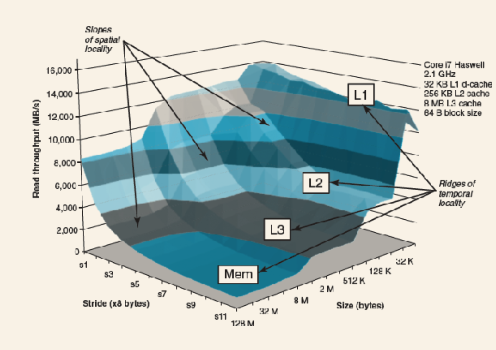
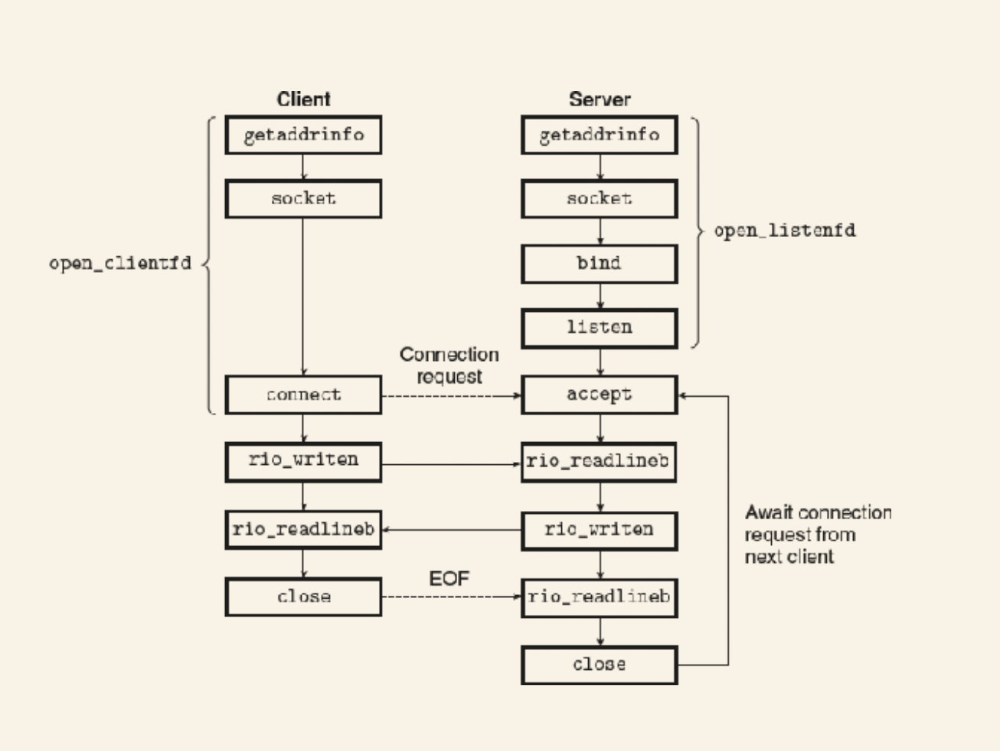
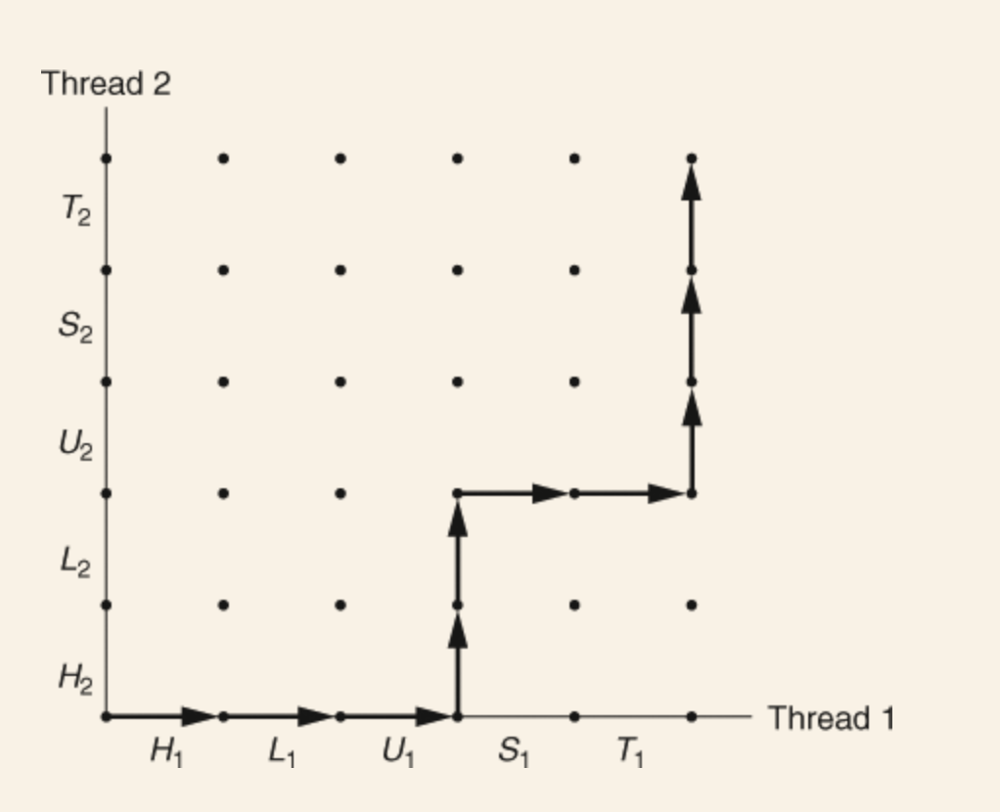
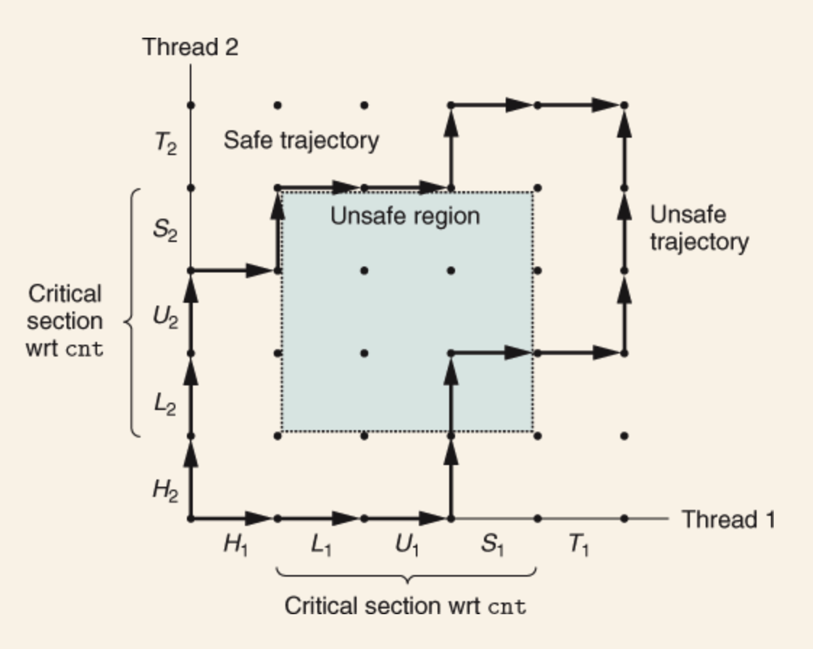
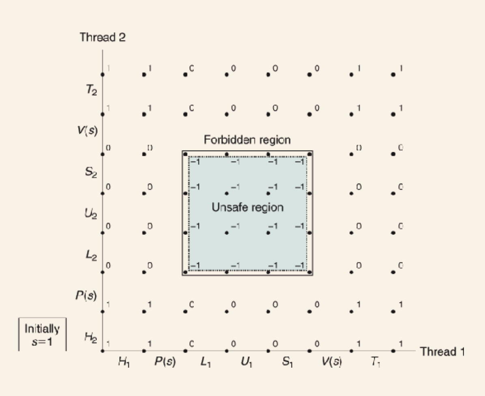
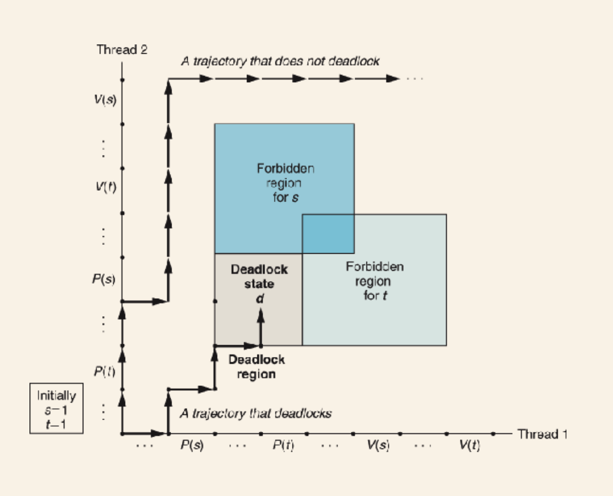

 Computer Systems: A Programmer's Perspective

* [Things I should revise once finished:](#things-i-should-revise-once-finished:)
* [Chapter 1 - A Tour of Computer Systems](#chapter-1---a-tour-of-computer-systems)
  * [Compilation](#compilation)
  * [Elements of a machine](#elements-of-a-machine)
    * [Hardware](#hardware)
      * [Buses](#buses)
      * [I/O](#i/o)
      * [Main memory](#main-memory)
      * [Processor](#processor)
        * [Performance:](#performance:)
      * [Operating system:](#operating-system:)
        * [Amdhal's law](#amdhal's-law)
      * [Concurrency & parallelism](#concurrency-&-parallelism)
        * [Types of concurrency](#types-of-concurrency)
* [Chapter 2 - Representing and manipulating information](#chapter-2---representing-and-manipulating-information)
    * [C data types](#c-data-types)
    * [2.1.6 Boolean Algebra](#2.1.6-boolean-algebra)
    * [2.1.9 Bit shifting](#2.1.9-bit-shifting)
  * [2.2 Integer Representations](#2.2-integer-representations)
    * [2.2.2 Unsigned encoding](#2.2.2-unsigned-encoding)
    * [2.2.3 Two's-Complement Encoding](#2.2.3-two's-complement-encoding)
    * [2.2.4 Conversions between signed and unsigned](#2.2.4-conversions-between-signed-and-unsigned)
    * [2.2.5 Signed and unsigned in C](#2.2.5-signed-and-unsigned-in-c)
    * [2.2.6 Expanding the bit representation of a number](#2.2.6-expanding-the-bit-representation-of-a-number)
    * [2.2.8 Advice](#2.2.8-advice)
  * [2.3 Integer Arithmetic](#2.3-integer-arithmetic)
    * [2.3.1 Unsigned Addition](#2.3.1-unsigned-addition)
    * [2.3.2 Two's-Complement Addition](#2.3.2-two's-complement-addition)
    * [2.3.4 Unsigned Multiplication](#2.3.4-unsigned-multiplication)
    * [2.3.5 Two's-Complement Multiplication](#2.3.5-two's-complement-multiplication)
    * [2.3.6 Multiplying by constants](#2.3.6-multiplying-by-constants)
    * [2.3.7 Dividing by powers of 2](#2.3.7-dividing-by-powers-of-2)
    * [2.3.8 Thoughts on integer arithmetic](#2.3.8-thoughts-on-integer-arithmetic)
  * [2.4 Floating Point](#2.4-floating-point)
    * [2.4.2 IEEE Floating-Point Representation (need to come back to this and properly understand it)](#2.4.2-ieee-floating-point-representation-(need-to-come-back-to-this-and-properly-understand-it))
    * [2.4.4 Rounding](#2.4.4-rounding)
    * [2.4.5 Floating-point operations](#2.4.5-floating-point-operations)
  * [2.5 Summary](#2.5-summary)
* [Chapter 3 Machine-Level Representation of Programs](#chapter-3-machine-level-representation-of-programs)
  * [3.1 A Historical Perspective](#3.1-a-historical-perspective)
  * [3.2 Program Encodings](#3.2-program-encodings)
    * [3.2.1 Machine-level code](#3.2.1-machine-level-code)
  * [3.3 Data Formats](#3.3-data-formats)
  * [3.4 Accessing Information](#3.4-accessing-information)
    * [3.4.2 Data Movement Instructions](#3.4.2-data-movement-instructions)
    * [3.4.4 Pushing and popping stack data](#3.4.4-pushing-and-popping-stack-data)
  * [3.5 Arithmetic and Logical Operations](#3.5-arithmetic-and-logical-operations)
    * [3.5.1 Load Effective Address](#3.5.1-load-effective-address)
    * [3.5.2 Unary and Binary Operations](#3.5.2-unary-and-binary-operations)
    * [3.5.3 Shift Operations](#3.5.3-shift-operations)
    * [3.5.4 Discussion](#3.5.4-discussion)
    * [3.5.5 Special Ops](#3.5.5-special-ops)
  * [3.6 Control](#3.6-control)
    * [3.6.1 Condition codes](#3.6.1-condition-codes)
    * [3.6.2 Accessing condition codes](#3.6.2-accessing-condition-codes)
    * [3.6.3 Jump Instructions](#3.6.3-jump-instructions)
    * [3.6.4 Jump Instructions](#3.6.4-jump-instructions)
    * [3.6.5 Implementing Conditional Branches with Conditional Control](#3.6.5-implementing-conditional-branches-with-conditional-control)
    * [3.6.6 Implementing Conditional Branches with Conditional Moves](#3.6.6-implementing-conditional-branches-with-conditional-moves)
    * [3.6.7 Loops](#3.6.7-loops)
    * [3.6.8 Switch Statements](#3.6.8-switch-statements)
  * [3.7 Procedures](#3.7-procedures)
    * [3.7.2 Control Transfer](#3.7.2-control-transfer)
    * [3.7.3 Data Transfer](#3.7.3-data-transfer)
    * [3.7.4 Local Storage on the Stack](#3.7.4-local-storage-on-the-stack)
    * [3.7.5 Local Storage in Registers](#3.7.5-local-storage-in-registers)
    * [3.7.6 Recursive Procedures](#3.7.6-recursive-procedures)
  * [3.8 Array Allocation and Access](#3.8-array-allocation-and-access)
    * [3.8.2 Pointer Arithmetic](#3.8.2-pointer-arithmetic)
    * [3.8.3 Nested Arrays](#3.8.3-nested-arrays)
    * [3.8.4 Fixed-Sized Arrays](#3.8.4-fixed-sized-arrays)
    * [3.8.5 Variable-Sized Arrays](#3.8.5-variable-sized-arrays)
  * [3.9 Heterogeneous Data Structures](#3.9-heterogeneous-data-structures)
    * [3.9.1 Structures](#3.9.1-structures)
    * [3.9.2 Unions](#3.9.2-unions)
    * [3.9.3 Data Alignment](#3.9.3-data-alignment)
  * [3.10 Combining Control and Data in Machine-Level Programs](#3.10-combining-control-and-data-in-machine-level-programs)
    * [3.10.1 Understanding Pointers](#3.10.1-understanding-pointers)
    * [3.10.3 Out-of-Bounds Memory References and Buffer Overflow](#3.10.3-out-of-bounds-memory-references-and-buffer-overflow)
    * [“3.10.4 Thwarting Buffer Overflow Attacks”](#“3.10.4-thwarting-buffer-overflow-attacks”)
    * [3.10.5 Supporting Variable-Size Stack Frames](#3.10.5-supporting-variable-size-stack-frames)
  * [3.11 Floating-Point Code](#3.11-floating-point-code)
    * [3.11.1 Floating-Point Movement and Conversion Operations](#3.11.1-floating-point-movement-and-conversion-operations)
    * [3.11.2 Floating-Point Code in Procedures](#3.11.2-floating-point-code-in-procedures)
    * [3.11.3 Floating-Point Arithmetic Operations](#3.11.3-floating-point-arithmetic-operations)
    * [3.11.4 Defining and Using Floating-Point Constants](#3.11.4-defining-and-using-floating-point-constants)
    * [3.11.5 Using Bitwise Operations in Floating-Point Code](#3.11.5-using-bitwise-operations-in-floating-point-code)
    * [3.11.6 Floating-Point Comparison Operations](#3.11.6-floating-point-comparison-operations)
  * [3.12 Summary](#3.12-summary)
* [Chapter 4 - Processor Architecture](#chapter-4---processor-architecture)
  * [4.1.3 - Instruction Encoding](#4.1.3---instruction-encoding)
  * [4.1.4 Exceptions](#4.1.4-exceptions)
  * [4.2 Logic Design and the Hardware Control Language HCL](#4.2-logic-design-and-the-hardware-control-language-hcl)
  * [4.2.1 Logic Gates](#4.2.1-logic-gates)
  * [4.2.2 Combinational Circuits](#4.2.2-combinational-circuits)
  * [4.2.3 Word-level Combinational Circuits](#4.2.3-word-level-combinational-circuits)
  * [4.2.4 Set Membership](#4.2.4-set-membership)
  * [4.2.5 Memory and Clocking](#4.2.5-memory-and-clocking)
  * [4.3 Implementation of a CPU from an ISA (renamed from the real chapter name for my own understanding)](#4.3-implementation-of-a-cpu-from-an-isa-(renamed-from-the-real-chapter-name-for-my-own-understanding))
  * [4.3.1 Organizing Processing into Stages](#4.3.1-organizing-processing-into-stages)
  * [4.3.2 Hardware Structure](#4.3.2-hardware-structure)
  * [4.3.3 SEQ Timing](#4.3.3-seq-timing)
  * [4.4 General Principles of Pipelining](#4.4-general-principles-of-pipelining)
  * [4.4.1 Computational Pipelines](#4.4.1-computational-pipelines)
  * [4.5 Building a Pipelined CPU](#4.5-building-a-pipelined-cpu)
    * [Branch Prediction](#branch-prediction)
    * [Hazards](#hazards)
      * [Avoiding data hazards by stalling](#avoiding-data-hazards-by-stalling)
      * [Avoiding data hazards by forwarding](#avoiding-data-hazards-by-forwarding)
      * [Avoiding control hazards](#avoiding-control-hazards)
      * [Exception handling](#exception-handling)
      * [Multicycle Instructions](#multicycle-instructions)
* [Chapter 5 Optimizing Program Performance](#chapter-5-optimizing-program-performance)
  * [5.1 Capabilities and Limitations of Optimizing Compilers](#5.1-capabilities-and-limitations-of-optimizing-compilers)
  * [5.2 Expressing Program Performance](#5.2-expressing-program-performance)
  * [5.4 Eliminating Loop Inefficiencies](#5.4-eliminating-loop-inefficiencies)
  * [5.5 Reducing Procedure Calls](#5.5-reducing-procedure-calls)
  * [5.6 Eliminating Unneeded Memory References](#5.6-eliminating-unneeded-memory-references)
  * [5.7 Understanding Modern Processors](#5.7-understanding-modern-processors)
  * [5.8 Loop Unrolling](#5.8-loop-unrolling)
  * [5.9 Enhancing Parallelism](#5.9-enhancing-parallelism)
  * [5.11 Other limiting factors](#5.11-other-limiting-factors)
  * [5.12 Understanding Memory Performance](#5.12-understanding-memory-performance)
  * [5.13 Real-world performance improvement techniques](#5.13-real-world-performance-improvement-techniques)
  * [5.15](#5.15)
* [Chapter 6 The Memory Hierarchy](#chapter-6-the-memory-hierarchy)
  * [6.1 Storage Tech](#6.1-storage-tech)
    * [RAM](#ram)
      * [SRAM](#sram)
      * [DRAM](#dram)
      * [Conventional DRAM](#conventional-dram)
      * [Memory Modules](#memory-modules)
      * [Enhanced DRAMs](#enhanced-drams)
    * [Nonvolatile Memory](#nonvolatile-memory)
      * [Programmable ROM (PROM)](#programmable-rom-(prom))
      * [Erasable Programmable ROM (EPROM)](#erasable-programmable-rom-(eprom))
      * [Electronically Erasable Programmable ROM (EEPROM)](#electronically-erasable-programmable-rom-(eeprom))
      * [Flash Memory](#flash-memory)
      * [Accessing Main Memory](#accessing-main-memory)
    * [Disk Storage](#disk-storage)
      * [Disk Geometry](#disk-geometry)
      * [Disk Operation](#disk-operation)
      * [Logical Disk Blocks](#logical-disk-blocks)
      * [Disk formatting](#disk-formatting)
      * [Connecting I/O Devices](#connecting-i/o-devices)
      * [Accessing Disks](#accessing-disks)
    * [SSDs](#ssds)
      * [Geometry](#geometry)
    * [Trends](#trends)
  * [6.2 Locality](#6.2-locality)
    * [Program instruction locality](#program-instruction-locality)
  * [6.3 The Memory Hierarchy](#6.3-the-memory-hierarchy)
    * [Cache](#cache)
  * [6.4 Cache Memories](#6.4-cache-memories)
    * [Issues with writes](#issues-with-writes)
    * [Anatomy of a real cache hierarchy](#anatomy-of-a-real-cache-hierarchy)
    * [Performance of caches](#performance-of-caches)
  * [6.5 Writing Cache-Friendly Code](#6.5-writing-cache-friendly-code)
  * [6.6 The impact of caches on program performance](#6.6-the-impact-of-caches-on-program-performance)
  * [6.7 Summary](#6.7-summary)
* [Chapter 7 Linking](#chapter-7-linking)
* [7.1 Compiler Drivers](#7.1-compiler-drivers)
* [7.2 Static Linking](#7.2-static-linking)
* [7.3 Object files](#7.3-object-files)
* [7.4 Relocatable Object Files](#7.4-relocatable-object-files)
* [7.5 Symbols and Symbol Tables](#7.5-symbols-and-symbol-tables)
* [7.6 Symbol Resolution](#7.6-symbol-resolution)
  * [Static Libraries](#static-libraries)
* [7.7 Relocation](#7.7-relocation)
  * [Relocation entries](#relocation-entries)
* [7.8 Executable Object Files](#7.8-executable-object-files)
* [7.9 Loading Executable Object Files](#7.9-loading-executable-object-files)
* [7.10 Dynamic Linking with Shared Libraries](#7.10-dynamic-linking-with-shared-libraries)
* [7.11 Loading and Linking Shared Libraries from Applications](#7.11-loading-and-linking-shared-libraries-from-applications)
* [7.12 Position-Independent Code (PIC)](#7.12-position-independent-code-(pic))
* [7.13 Library Interpositioning](#7.13-library-interpositioning)
* [8.1 Exceptions](#8.1-exceptions)
  * [Exception Handling](#exception-handling)
  * [Classes of exceptions](#classes-of-exceptions)
    * [Interrupts](#interrupts)
    * [Traps and system calls](#traps-and-system-calls)
    * [Faults](#faults)
    * [Aborts](#aborts)
  * [Linux Exceptions (for x86)](#linux-exceptions-(for-x86))
* [8.2 Processes](#8.2-processes)
  * [Logical Control Flow](#logical-control-flow)
  * [Concurrent Flows](#concurrent-flows)
  * [Private Address Space](#private-address-space)
  * [User and Kernel Modes](#user-and-kernel-modes)
  * [Context Switches](#context-switches)
* [8.4 Process Control](#8.4-process-control)
  * [Process IDs](#process-ids)
  * [Creating and terminating processes](#creating-and-terminating-processes)
  * [Reaping Child Processes](#reaping-child-processes)
  * [Loading and Running Programs](#loading-and-running-programs)
  * [Using `fork` and `execve`](#using-`fork`-and-`execve`)
* [8.5 Signals](#8.5-signals)
  * [Sending a signal](#sending-a-signal)
  * [Receiving a signal](#receiving-a-signal)
  * [Blocking and Unblocking Signals](#blocking-and-unblocking-signals)
  * [Writing Signal Handlers](#writing-signal-handlers)
  * [Correct signal handling](#correct-signal-handling)
* [8.6 Nonlocal Jumps](#8.6-nonlocal-jumps)
* [8.7 Tools for manipulating processes](#8.7-tools-for-manipulating-processes)
* [8.8 Summary](#8.8-summary)
* [9.1 Physical and Virtual Addressing](#9.1-physical-and-virtual-addressing)
* [9.2 Address Spaces](#9.2-address-spaces)
    * [Practice Problem 9.3](#practice-problem-9.3)
* [9.3 VM as a Tool for Caching](#9.3-vm-as-a-tool-for-caching)
  * [Page Tables](#page-tables)
    * [Practice Problem 9.2](#practice-problem-9.2)
      * [NOTE: How I calculated the above:](#note:-how-i-calculated-the-above:)
* [9.4 VM as a Tool for Memory Management](#9.4-vm-as-a-tool-for-memory-management)
* [9.5 VM as a Tool for Memory Protection.](#9.5-vm-as-a-tool-for-memory-protection.)
* [9.6 Address Translation](#9.6-address-translation)
  * [Multi-level page tables](#multi-level-page-tables)
  * [Putting it all together](#putting-it-all-together)
      * [Practice Problem 9.4](#practice-problem-9.4)
* [9.7 Case Study of a real system (i7)](#9.7-case-study-of-a-real-system-(i7))
* [9.8 Memory Mapping](#9.8-memory-mapping)
  * [Sharing objects](#sharing-objects)
  * [Forking](#forking)
  * [execve](#execve)
* [9.9 Dynamic Memory Allocation](#9.9-dynamic-memory-allocation)
  * [Malloc & Free](#malloc-&-free)
  * [Requirements of the allocator](#requirements-of-the-allocator)
  * [Goals of an allocator](#goals-of-an-allocator)
  * [Fragmentation](#fragmentation)
  * [Implementation issues](#implementation-issues)
  * [Implicit free lists](#implicit-free-lists)
  * [Placing Allocated Blocks](#placing-allocated-blocks)
  * [Splitting Free Blocks](#splitting-free-blocks)
  * [Getting more heap memory](#getting-more-heap-memory)
  * [Coalescing Free Blocks](#coalescing-free-blocks)
  * [Explicit Free Lists](#explicit-free-lists)
  * [Segregated free lists](#segregated-free-lists)
* [9.10 Garbage collection](#9.10-garbage-collection)
  * [Basics](#basics)
  * [Mark&Sweep](#mark&sweep)
* [9.11 Common Memory-related Bugs in C](#9.11-common-memory-related-bugs-in-c)
* [9.12 Summary](#9.12-summary)
* [10.1 Unix I/O](#10.1-unix-i/o)
* [10.2 Files](#10.2-files)
* [10.3 Opening and closing files](#10.3-opening-and-closing-files)
* [10.4 Reading and writing files](#10.4-reading-and-writing-files)
* [10.5 Unbuffered / Buffered I/O](#10.5-unbuffered-/-buffered-i/o)
* [10.6 Reading File Metadata](#10.6-reading-file-metadata)
* [10.7 Reading Directory Contents](#10.7-reading-directory-contents)
* [10.8 Sharing Files](#10.8-sharing-files)
* [10.9 I/O Redirection](#10.9-i/o-redirection)
* [10.10 Standard I/O](#10.10-standard-i/o)
* [10.12 Summary](#10.12-summary)
* [11.1 The Client-Server Programming Model](#11.1-the-client-server-programming-model)
* [10.2 Networks](#10.2-networks)
* [11.3 The Global IP Internet](#11.3-the-global-ip-internet)
  * [IP Addresses](#ip-addresses)
  * [Internet domain names](#internet-domain-names)
  * [Internet Connections](#internet-connections)
* [11.4 Sockets Interface](#11.4-sockets-interface)
  * [Socket address structures](#socket-address-structures)
  * [`socket` function](#`socket`-function)
  * [`connect` function](#`connect`-function)
  * [`bind` function](#`bind`-function)
  * [`listen` function](#`listen`-function)
  * [`accept` function](#`accept`-function)
  * [Host and Service Conversion](#host-and-service-conversion)
* [11.5 Web servers](#11.5-web-servers)
  * [Web content](#web-content)
  * [HTTP Transactions](#http-transactions)
  * [HTTP Requests](#http-requests)
  * [HTTP Responses](#http-responses)
  * [Dynamic Content](#dynamic-content)
* [11.6](#11.6)
* [12.1 Concurrent Programming with Processes](#12.1-concurrent-programming-with-processes)
  * [Pros and Cons](#pros-and-cons)
* [12.2 Concurrent Programming with I/O Multiplexing](#12.2-concurrent-programming-with-i/o-multiplexing)
  * [Event-Driven server based on I/O multiplexing](#event-driven-server-based-on-i/o-multiplexing)
  * [Pros and cons](#pros-and-cons)
* [12.3 Concurrent programming with threads](#12.3-concurrent-programming-with-threads)
  * [Execution model](#execution-model)
  * [Posix Threads](#posix-threads)
  * [Threads terminate based on](#threads-terminate-based-on)
  * [Reaping terminated threads](#reaping-terminated-threads)
  * [Detachable threads](#detachable-threads)
  * [Building a thread based web server](#building-a-thread-based-web-server)
* [12.4 Shared variables in threaded programs](#12.4-shared-variables-in-threaded-programs)
  * [Threads Memory Model](#threads-memory-model)
  * [Mapping Variables to Memory](#mapping-variables-to-memory)
* [12.5 Synchronizing threads with semaphores](#12.5-synchronizing-threads-with-semaphores)
  * [Process graphs](#process-graphs)
  * [Semaphores](#semaphores)
  * [Semaphores to schedule shared resources](#semaphores-to-schedule-shared-resources)
    * [Producer-Consumer](#producer-consumer)
    * [Readers-Writers Problem](#readers-writers-problem)
  * [Prethreading](#prethreading)
* [12.6 Using threads for parallelism](#12.6-using-threads-for-parallelism)
  * [Parallel Program Performance](#parallel-program-performance)
* [12.7 Other concurrency issues](#12.7-other-concurrency-issues)
  * [Thread Safety](#thread-safety)
  * [Reentrancy](#reentrancy)
  * [Races](#races)
  * [Deadlocks](#deadlocks)
* [12.8 Summary](#12.8-summary)

## Things I should revise once finished:
1. Two's compliment and its effect on the possible arithmetic
2. Logical/arithmetic bit shifting, especially in relationship to the integer encoding used.


## Chapter 1 - A Tour of Computer Systems
All information in a system is just bits. The only thing that distinguishes them is the context in which we view them. A text file is still just bits, but a "text file" is a file of bits that only correspond to text. 

### Compilation
Compilers transform source into *executable object programs|files*. Four stages:
1. **Preprocessing** - Macros, includes, etc are bundled into a single text file, `.i`
2. **Compilation** - Translates the `.i` into assembly text file `.s`. Useful as a common language between different languages & processors.
3. **Assembly** - Translates the assembled file into machine language binary file known as a *relocatable object program*, `.o`.
4. **Linking** - Merges other object files referred to by included headers into a single executable.

### Elements of a machine
**Shells**: A command-line interpreter

#### Hardware
##### Buses
- Electrical conduits that carry bytes between components.
- Typically designed to transfer fixed-sized chunks of bytes known as `words`.
- The number of bytes in a word (word size) is a fundamental system parameter that varies across systems.
        - Most systems have a word size of 4 bytes (32 bit) or 8 bytes (64 bit).

##### I/O
- Each I/O device is connected to the I/O bus by either a *controller* or *adapter*.
        - Controllers are built-in (to either the motherboard or the device), adapters are separate cards that plug into the motherboard.
##### Main memory
- Temporary storage for data used by the program.
- Physically a collection of dynamic random access memory (DRAM).
- Logically, memory is organized as a linear array of bytes, each with its own unique address (array index) starting at zero.
- The size of various C data types (short, etc) vary depending on machine type (x86-64, etc).

##### Processor
Executes instructions stored in main memory. At its core is a word-size storage device (a register) called the program counter. At any point the PC points at (container the address of) some machine-language instruction in main memory. For the duration of the time the CPU has power it will execute the instruction pointed to by the program counter and updates the PC to point to the next instruction.

Appears to operate according to a simple model defined by its *instruction set architecture*. In this model, instructions are executed in a strict sequence.

There are only a few of these simple operations and they revolve around main memory, the register file, and the arithmetic/logic unit (ALU).

**Register file**: small storage device that consists of a collection of word-size registers, each with a unique name.

**ALU**: computes new data and address values.

Example instruction in the instruction set:
- **Load**: Copy a byte or word from main memory into a register, overwriting previous data.
- **Store**: Copy a byte or word from a register to a location in main memory, overwriting.
- **Operate**: Copy to registers to ALU, perform arithmetic operation, and store result in register, overwriting.
- **Jump**: Copy word from the instruction itself and copy it into the program counter.

CPUs appear simple, but actually they have a lot of complex mechanisms to speed up program execution. The *microarchitecture* is actually how its implemented.

**DMA**: Direct memory access - Data travels direct from disk into ram, bypassing the CPU.

###### Performance:
A lot of the slow down in processing is the overhead of moving data from disk to memory to registers to display devices. So a lot of effort is put into increasing the efficiency of the I/O. Due to physical laws, the smaller the device the faster they are.

Storage performance:
- So disk is large but slow.
- Ram is smaller, but faster (10,000,000x disk).
- Register file is much smaller (few hundred bytes), but much faster (100x RAM access)

There's a processor-memory gap: it's easier and cheaper to make processors faster than it is to make main memory faster. To account for slow memory we have *cache memories* (caches).

**Caches**:
- Temporary staging area for information the CPU is likely to need in the near future.
- L1 cache holds 10s of K of bytes and can be accessed almost as faster as the register file.
- Large L2 holds 100s of K of bytes. 5x longer to access than L1. But still 5-10x faster than ram.
- L1/L2 implemented using SRAM (static random access memory).
- Newer systems have three levels of cache.
- Caching relies on exploiting *locality*: the fact that programs tend to access data in localized regions.

**Storage hierarchy**:
- All storage in a system forms a hierarchy: starting with registers -> L1 ... RAM -> Disk -> Remote Disk.
- As we move down, storage gets slower, large, and cheaper.
- L0 is registers.
- *Main idea*: each level acts as cache for the layer below.

##### Operating system:
Layer of software interposed between apps and hardware. All attempts to manipulate hardware must go through OS.

It has 2 purposes:
1. Protect hardware from misuse by apps
2. Provide apps with a simple and uniform mechanism, for manipulating often wildly different low-level hardware devices.

The OS does this by some fundamental abstractions:

**Processes**: abstractions for the processor, main memory, and I/O.
- When a program is run the OS provides the illusion that its the only one running on the system.
- Appears to have exclusive use of CPU, main memory, and I/O.
- Multiple processes can be running concurrently with each appearing to have exclusive use.
- The OS does this with a single core by interleaving the instructions of separate programs.
        - Known as *context switching*.
        - Each process is composed of the values of the PC, the register file, and the contents of main memory. Each time it context switches, these are saved and restored.
        - System calls are used to request context switching.
- The transition from one process to another is managed by the OS *kernel*.
        - When the program requires action from the OS it uses a system call like read or write from a file, which transfers control to the kernel.
        - The kernel is not a separate process, its a collection of code and data structures the system uses to manage all the processes.
- Threads
        - Multiple execution units running in the context of the process - sharing code and global data.
        - Easier to share data between threads than processes.
        - Typically more efficient than processes.

**Virtual memory**: abstraction for main memory and disk I/O devices
- Provides a process the illusion it has exclusive use of memory.
- Each process has the same uniform view of memory: its virtual address space.
- Virtual address space from bottom to top (0 address to N)
        - Program code: code begins at the same fixed address for all processes. Fixed in size once it starts running.
        - Heap: run-time heap expands and contracts dynamically at run time based on calls to malloc and free.
        - Shared libraries 
        - Stack: used for function calls, expands and contracts.
        - Kernel virtual memory: reserved for kernel, not accessible to user apps.
- Requires a hardware translation of every address.

**Files**: abstractions for I/O devices
- A sequence of bytes, nothing more, nothing less.
- All input and output in the system is performed by reading and writing files, using a subset of system calls known as Unix I/O.
- Simple but powerful way to have uniform view of all the varied I/O devices.
- Networks
        - From the POV of a process, the network can be viewed as another I/O device.

###### Amdhal's law
A speed up of a part of system is dependent on how significant that part is to the overall system; its fraction of the overall time it takes to run the operation. So a 6x speed up for a part of the system that is 50% responsible is only 3x in the end.

##### Concurrency & parallelism
**Concurrency**: general concept of a system with multiple, simultaneous activities.
**Parallelism**: the use of concurrency to make a system faster.

###### Types of concurrency
1. Thread-level:
        - We get thread-level currency in a single process, even though its simulated.
        - Multi-core systems
                - Multiple processors in the system, each with their own L1, registers, etc.
        - Hyperthreading
                - Essentially gives hardware support to the idea of threading.
                - Some parts have multiple copies like program counters and register files, while sharing an ALU.
                - Allows the CPU to take better advantage of resources. For example, while it waits to load data into cache, the CPU can execute a different thread.
        - For single process to take advantage of multiple processors or hyperthreading, the program must have been written with it in mind.
2. Instruction-level parallelism
        - Allows the processor to execute multiple instructions per clock cycle.
        - Done via pipelining, where discrete stages of an instruction are broken into steps that can be ran in parallel.
3. Single-instruction, multiple-data (SIMD) parallelism
        - Special hardware that allows a single instruction to cause multiple operations to run in parallel.
        - Mostly used to speed up processing image, sound, and video.

Regardless of the parallelism used in running something, the simple sequential model of execution implied by the CPUs instruction set is always maintained.

**Virtual machines**: Abstracts the entire computer, including the OS, the processor, and the programs.


## Chapter 2 - Representing and manipulating information
Base 10 makes sense for humans (10 fingers and all that), but base 2 makes more sense for storage of information due to the simplicity of representing two states.

Three representations of numbers:
1. **Unsigned**: numbers greater than 0
2. **Twos-complement**: positive or negative
3. **Floating point**: Is not associative due to the finite precision of representation

Pointers contain the address and a type of a byte in memory. Binary notation for a byte is verbose, so instead we use base-16, or hexadecimal.

Hexidecimal uses the chars 0-9 and A-F, giving 16 possible values. A single byte can range from $O0_16$ to $FF_16$. C uses `0X` to indicate hex values.

- Problems:
	- Problem: 2.1
		- 0x39A7F8: 0011 1001 1010 0111 1111 1000
		- 1100 1001 0111 1011: 0xC97B
		- 0xD5E4C: 1101 0101 1110 0100 1100
		- (00)10 0110 1110 0111 1011 0101: 0x26E7B5
	- Problem 2.2:
		- When X is a power of 2^n, the binary will be 1 followed by n zeroes
		- To convert to hex, let `n = i + 4j`, where 0 <= i <= 3. Where the leading hex is `i` 2^i, followed by j hex 0s.
		- So 2048 = 2^11
			- So n = 3 + 4*2
				- i = 3
				- j = 2
			- So hex: 0x800

			- 
			| n | 2^n | 2^n hex|  
			| - | - |-|
			| 19 | 524288 | 0x80000 |
			| 14 | 16384 | 0x4000 |
			| 16 | 65356  | 0x10000 |
			| 17 | 131072 | 0x20000 |
			| 5 | 32 | 0x20 |
			| 7 | 128 | 0x80 |
	- Problem 2.3
		- To convert decimal x to hex, we repeatedly divide x by 16, giving x = q * 16 + r for each iteration
			- We then use the hex for r as the least significant digit and the generate the remaining digits repeating the process on `q`.
		- To convert from hex to decimal, take each hex digit and multiple it by 16^n, where n is the position of the digit, with the right-most digit starting at 0. Add each term together.
		- 
		| Decimal | Binary | Hexadecimal|  
		| - | - |-|
		| 167 | 1010 0111 | 0xA7  |
		| 62 | 0011 1110 |  0x3E |
		| 188 | 1011 1100  | 0xBC  |
		| 52  | 0011 0111  | 0x37  |
		| 136  | 1000 1000  | 0x88  |
		| 243  | 1111 0011  | 0xF3  |

	- Problem 2.4
		- 0x503c + 0x8 = 
		- Not doing these as I don't get how to add in a different base

**Word size**: the nominal size of pointer data. The size of an address puts a limit on the maximal addressable space, so 32 bit words, gives a limit of 2^32 - 1 = 4,294,967,295 bytes (4GB), as that's the total number of bytes that can be individually addressed using 32 bit words. 64-bit has 16 exabytes of addressable memory.

#### C data types
- Signed or unsigned ints
- `char` is a singe byte, usually, but not necessarily, for storing a character
- Some types vary based on the word size of the systems the programs are built for. But there are standardized types like `int32_t`
- Whether its signed or unsigned is up to the programmer

**Objects that span multiple bytes**:
- We need two conventions:
        - what the address of the object shall be
        - how we order the bytes in memory
- Virtually all machines, multi-byte object is stored as a contiguous sequence of bytes with the address of the object the smallest address of the bytes used
        - E.g if a 4-byte in has address 0x100, then the bytes 0x100, 0x101, 0x102, 0x103 are used.
- Once we know the bytes, we now need to know how the bytes are ordered to represent the object
        - Little endian: least significant byte comes first
        - Big endian: most significant byte comes first
        - Most intel use little-endian
        - Arm is bi-endian - can do either, up to the OS. iOS and Android are both little-endian
        - Which is chosen has no intrinsic advantage, but machines operating over a network have to agree.

**Problems**:
- 2.5
        - A: 21, 87
        - B: 21 43, 87 65
        - C: 21 43 65, 87 65 43
- 2.6
        - A: `00000000001101011001000100100001`
           `01001010010101100100010010000100`
        -  B: 21 bits
        -  C: everything else

Strings are encoded as an array of characters terminated by the null (value: 0) character. Each character is represented by some standard encoding, with ASCII being the most common.

The ASCII code results in any digit x by represented by 0x3x and the null character is 0x00. That is the same across all platforms, meaning text data is more platform independent that binary data.

**Problems**:
-  2.7
        -  0x61 0x62 0x63 0x64 0x65 0x66
        -  `strlen` doesn't give give the length including the null character

If we convert some source code to machine code, the resulting bytes will be very different depending on OS and instruction set/machine. Meaning binary data is rarely portable.

**A key concept is that from the perspective of the machine, a program is simply a sequence of bytes.**

#### 2.1.6 Boolean Algebra
As we can easily represent binary code physically, it allows us to formulate an algebra that captures the basic principles of logical reasoning.

We can use the four boolean operations to operate on bit vectors, strings of 0s and 1s of some fixed length $w$. For example, let $a = [0110]$ and $b = [1100]$, then $a & b$, $A | b$, $a ^ b$ and $~b$:
| & | \| | ^ | ~ |
| - | - | - | - |
| `0110` | `0110` | `0110` |  |
| `1100` | `1100` | `1100` | `1100` |
| `0100` | `1110` | `1010` | `0011` |

- Problem 2.9:
	- This uses 3 bit vectors to encode RGB values. Using bitwise boolean operators we can manipulate the colors.
	- A
		- 111
		- 110
		- 101
		- 100
		- 011
		- 010
		- 001
		- 000
	- B:
		- Blue | Green = Cyan
		- Yellow & Cyan = Green
		- Red ^ Magenta = Blue
- Problem 2.10
	- We can use bitwise operations to swap the values at an address as an element is its own additive inverse: `a ^ a = 0`.
	
	  Step 1: a - a ^ b
	  Step 2: 
	  Can't be bothered to finish this
 - Problem 2.11
	 - A: k
	 - B: Exclusive or with itself is 0
	 - C: Skip when first == last
 - Problem 2.12
	 - A: `x & 0xFF`
	 - B: `x ^ ~0xFF`
	 - C: `x | 0xFF`
- Logical operators
	- Different to their bitwise counterparts
	- The time they equal is when the arguments are 0 or 1.
	- Logical operators short circuit
- Problem 2.14
	- `x = 0x66; y = 0x39`
	- `x & y`: `01100110 & 00111001 = 00100000 = 0x20`
	- `x && y`: `0x01`
	- `x | y`:  `01100110 | 00111001 = 01111111 = 0x7F`
	- `x || y`: `0x01`
	- `~x | ~y`:  `01100110`
	-                     `00111001 = 11011111 = 0xDF`
	-  `~x || ~y`: `0x00`
	-  `x & !y`:  `01100110`
	-                     `00000000 = 0x00`
	-  `x && ~y`: `0x1`

#### 2.1.9 Bit shifting
- `<<` shifts `k` bits to the left, dropping `k` significant bits, padding with zeroes at the right end.
- Associates left to right, so `x << j << k` == `(x << j) << k`.
- Right shifts - a bit more complicated - two types:
	- **Logical**: Shifts fills the left end k zeroes
	- **Arithmetic**: Fills left end with `k` repetitions of the most significant bit. It might seem weird, but it's useful for operating on signed integer data.
- Practically all compiler/machine combinations use arithmetic right shifts for signed data. For unsigned, right shifts must be logical.
	- Java: `>>` arithmetic; `>>>` logical.
- Shift sizes larger than the word size are weird and not specified by the C standard. Java uses modulo to get the remainder and use that. Basically, just use < wordsize.

### 2.2 Integer Representations
#### 2.2.2 Unsigned encoding
Each bit $x_i$ has value 0 or 1. The latter indicates that $2^i$ should be included as a part of the numeric value, i.e. it contributes to it. So if the number is [1001], the number is 2^3 + 2^0 = 9. So for vector x, the binary to unsigned is defined as the sum of $2^i$ for $x_i$.

Max range for $w$ is defined as the sum of $2^i$ for i through the range $i=0$ to $i=w - 1$. Which simplifies to $2^w - 1$.

Unsigned binary representation has the important property that every number between 0 - $2^w - 1$ has a unique encoding as a w-bit value. Which is said to be a mathematical `bijection` meaning that it's two way: reversible.

#### 2.2.3 Two's-Complement Encoding
Allows us to support negative numbers.

The most significant bit is called the `sign bit`. Its "weight" is  $-2^{w-1}$, the negation of its weight in unsigned representation. When the bit is set to 1, the represented value is negative, when set to 0 the value is non-negative

- The rest of the numbers are the same as the unsigned. It's the sign bit that either zeroes out (in the case of positive integer) or is equal to -2 x sum-of-of-the-rest. Due to it being raised to +1 exponent and made negative.

The least representable integer is [1 0 0 .. 0 0] = $-2^{w-1}$, the most is [0 1 1 ... 1 1] = $2^{w-1} - 1$.

1. Two's complement is also a `bijection`.
2. Two's complement is asymmetrical: there's no positive counterpart to TMin. This happens because half the bit patterns represent negative numbers and half represent positive numbers. Since 0 is positive, we have asymmetry.

#### 2.2.4 Conversions between signed and unsigned
Generally when casting in C the bits are kept the same, but the interpretation changes.

There are general relationships between the same bit patterns in unsigned and two's complement. Not bothering to write them down here.

#### 2.2.5 Signed and unsigned in C
There's some implicit casting when making comparisons in C expressions: signed is implicitly cast to unsigned.

#### 2.2.6 Expanding the bit representation of a number
To convert an unsigned number to a larger data type, we can add leading zeroes to the representation: known as *zero extension*.

To convert two's complement: we add copies of the most significant bit.

#### 2.2.8 Advice 
Most languages don't have unsigned as they're more trouble than they're worth. Comparisons don't work how you'd expect, etc.
- Unsigned arithmetic is equivalent to modular addition.

C is pretty much the only language that supports them
- Actually that is not true: rust does. Seemingly because addresses are unsigned so it makes sense.

### 2.3 Integer Arithmetic
#### 2.3.1 Unsigned Addition
The issue with addition is that if you have two integers, both of which can be represented by w-bit unsigned number, then their addition could require w + 1 bits. If you sum this results with another, then you've got w + 2 bits.

This is called "word size inflation", and unless restricted could mean that we take up an arbitrary amount of memory, which presumably would require lots of dynamic resizing of the words of memory used to store the number.

Lisp allows for this, but most languages put in a limit with fixed-sized arithmetic.

Unsigned addition requires discarding any bits that have overflowed the bit size determined by the data type. This is essentially results in the result being mod [max number that can be stored in the data type + 1]. So for a 4-bit number (which has a max of 15), if the sum was 21, then the result would be 21 mod 16 = 5.

Which is essentially decrementing the number by $2^w$. So 4-bit = $2^4$ = 16. Overflow happens when the result is more than $2^w$. We can detect if the result overflowed if its less than either of the operands.

#### 2.3.2 Two's-Complement Addition
Similar to above, but taking into account negative overflow as well as positive overflow.

The way the math works out is that for:
- Negative overflow: add $2^w$
- Positive overflow: subtract $2^w$

1. Detectable for positive overflow if x > 0 and y > 0 but s <= 0
2. Detectable for negative overflow if x < 0 and y < 0 but s >= 0

#### 2.3.4 Unsigned Multiplication
Integers x and y in the range $0 <= x, y <= 2^w - 1$ can be represented by as w-bit unsigned numbers, but their product can be between 0 and $(2^w -1)^2 = 2^{2w} - 2^{w + 1} + 1$.

This could require as many as 2w bits to represent. So C truncates to the lower-order w bits of the 2w-but integer product.
- `$(x*y) mod 2^w$`.


#### 2.3.5 Two's-Complement Multiplication
Again it truncates the same way as unsigned.


#### 2.3.6 Multiplying by constants
Addition, subtraction, bit-level operations, and shifting all require 1 clock cycle.

Multiplication (on i7 from 2015) takes 3 clock cycles. Therefore an optimization made by compilers is to replace multiplications with constant factors with combinations of shift and addition operations.

- Examples:
	- Multiplication by a power of 2:
		- $x2^k$
		- Shift x $k$ bits to the left, replacing with k zeroes.

So in order to more effectively use this a compiler might replace `x*14`, knowing that its the same as `14 = 2^3 + 2^2 + 2^1`, with:
- `(x<<3) + (x<<2) + (x<<1)`.
- Which can be simplified to
- `(x<<4) - (x<<1)`.
- Although I suppose it'll still make that determination knowing how difficult it is for the given machine to do multiplication.

This all assumes that the right side of the multiplication is a known constant: either a literal or a const.


#### 2.3.7 Dividing by powers of 2
Integer division is even slower. You can do the same as multiplication, but with a right shift instead of left shift.


#### 2.3.8 Thoughts on integer arithmetic
"integer" arithmetic is really just modular arithmetic due to the inherent limitations of fixed word sizes.

Modular arithmetic is just where integers wrap around beyond a modulus. A 12 hour clock is modular arithmetic.

Same bit-level arithmetic operations such as addition, subtraction, etc are used on twos-complement as are used on unsigned.

### 2.4 Floating Point
All computers now use the standard known as IEEE floating point. Prior to this every chip maker would have their own standard.

Decimal notation for fractions:
- $12.34_{10}$ = $1 * 10^1 + 2 * 10^0 + 3 * 10^{-1} + 4 * 10^{-2} = 12\frac{34}{100}$
- So the digits to the left of the "decimal point" are weighted by nonnegative powers of 10, while digits to the right are weight by negative powers of 10.

For binary it's the same idea:
- Bits to the left of the "binary point" are weighted by nonnegative powers of 2, while digits to the right are weight by negative powers of 2.

So with that we can represent any fraction as a fractional decimal number in a fractional binary decimal number.
- Assuming we only have finite-length encodings, 1/3 cannot be represented exactly.
- We must therefore decide on a binary precision.
- To convert between decimal fractions to binary fractions:
	- Consider the fraction $\frac{x}{y}$ as $\frac{x}{2^k}$
	- Then convert x into binary and move the binary point `k` places from the right.

#### 2.4.2 IEEE Floating-Point Representation (need to come back to this and properly understand it)
The previous section's approach is not efficient.

So IEEE:
- $V = (-1)^s \times m \times 2^E$
- S: the sign that determines if the number is negative
- M: Significand is fraction number (between 0 and 1 or 1 and 2)
- E: The exponent weights the value by a (possibly negative) number.

Basically it's $x \times y^a$
- Where x determines the floating part of it and y weights it.

Bit rep is divided into three fields:
- The single bit `s`
- The k-bit exponent field `exp` encoded the exponent E
- The n-bit fraction field `frac` that encodes the significand M, but the value encoded also depends on whether the exponent field equals 0.

The combined is either 32-bit (single-precision) or 64-bit (double-precision):
- `float`: `s, exp, frac` = 1, k = 8, n = 23
- `double`: `s, exp, frac` = 1, k = 11, n = 52


There three cases of point representation:
1. Normalised: When `E` is not all zeroes or ones. This is the most usual case. E is signed. M is between 0 and 1 but it's considered between 1 and 2 and the first bit is a free implied bit.
2. Denormalised: When `E` is all zeroes. Two purposes:
	1. Allows us to represent numeric 0.
	2. Numbers very close to zero.
3. Special case: When `E` is all ones. Used to represent infinity.


#### 2.4.4 Rounding
IEEE gives 4 rounding modes. Default is to find the closest match. While the other three can be used to find upper and lower bounds.

1. Round-to-even (default): i.e. round to nearest integer where the least significant digit is even. It "prefers" even.
        - We can do this for binary fractions too: just consider the least significant bit 0 to be even and 1 to be odd.
2. Round-toward-zero: positive numbers down, negative numbers up. "towards zero".
3. Round-down
4. Round-up

#### 2.4.5 Floating-point operations
Floating point ops are commutative (order doesn't matter) but not associative (parentheses do matter). This is because an operation loses precision, so the result of applying it to one parenthetical group is not the same as one of the operands with another.

This means generally compilers are very conservative when optimizing floats. 

### 2.5 Summary
Computers encode information as bits, generally organized as sequences of bytes. Different encodings are used for representing integers, real numbers, and character strings. Different computers = different conventions of encodings.

Most machines encode signed numbers using two's complement and floating point using IEEE Standard 754.

Finite length of encodings means arithmetic in a computer is quite different to real arithmetic.
- This can cause numbers to overflow
- It can cause floats to collapse to zero when they are super close.
- This leads to oddities like `x*x` resulting in a negative number due to overflow.

Unsigned and two's complement satisfy many of the characteristics of real integer arithmetic, like associativity, commutativity, and distributivity. That allows compilers to do many optimizations like the power of 2 trick.

**Basically there are lots of bit-level operations that due to their relations to arithmetic operations can be exploited to get performance.**

## Chapter 3 Machine-Level Representation of Programs

Computers execute machine code, sequences of bytes encoding low-level operations that manipulate data, manage memory, read and write data on storage devices, and communicate over networks.

Compilers generate machine code through a series of stages.
1. GCC outputs assembly, a textual representation of machine code.
2. GCC then invokes an assembler and a linker to generate executable machine code.

x86-64 is a machine language (instruction set) created by Intel and still in use today. Because it's been around since 1978 it has a lot of arcane features that GCC/clang handles for us.


### 3.1 A Historical Perspective
- All intel are backwards compatible
- Hyperthreading introduced on the Pentium 4E, which also added 64-bit support, which was inspired by AMD.
- Core 2 - first multi-core. Dropped hyperthreading
- Core i7 - multicore and hyperthreading
- AMD developed the first 64-bit extension to Intel's IA32.
	- AMD build processors compatible with the same instruction set

### 3.2 Program Encodings
GCC process:
1. **Pre-processor**: expands source code to include any files specified with `#include` and any macros specified by `#define`.
2. **Compiler**: generates assembly 
3. **Assembler**: Generates object code - a form of machine code (binary representations of all of the instructions). But the addresses of all global values are not filled in.
4. **Linker**: merges the object-code files along with library code to generate the final executable.


#### 3.2.1 Machine-level code
Machine-level code format and behaviour is defined by the *instruction set architecture*. Most instruction sets are sequential. Hardware will optimize and run in parallel sometimes but will guarantee sequential behaviour.

Machine-level memory addresses are virtual addresses. A memory model that appears to be a very large byte array.

Assembly code is very close to machine code. It's most about that assembly is more readable.

Assembly deals with things usually hidden to the programmer of C:
- `Program counter`: memory address of next instruction
- `Register file`: 16 named locations storing 64-bit values. Can hold addresses (C pointers) or integer data. Used for critical state of the program, temp data like args or local vars, or returned data from a function.
- `Condition code registers`: status information about recent executed arithmetic or logical instruction. Used to implement conditional changes in control or data flow. For if and while loops.
- `Vector registers`: one or more integer or floating-point values.

C provides a model of objects with different data types allocated in memory, but machine code just views memory as a large byte-addressable array. Arrays and structures in C are just contigouos collections of bytes. Scalar types are all the same, no differnece between types of pointers, integers, etc.

Program memory includes:
1. Machine code for the program
2. Info required by the OS
3. Run-time stack for managing procedure calls and returns
4. Blocks of memory allocated by the user

The OS manages translating virtual addresses to physical addresses.

Machine instructions are very simple, e.g:
- Add two numbers in registers
- Move value between memory and register
- Conditionally branch to a new instruction address

The compiler must construct sequences of machine instructions to implement program constructs: arithmetic expressions, loops, proc calls, etc.

Assembly files contain sequences of bytes that correspond to machine instructions. Which can be sees by:
1. Compiling an object-code file.
2. Then using `objdump` to disassemble it. It'll show the byte offset, the bytes themselves, and the assembly code it corresponds to.

x86-64 instructions range from 1 to 15 bytes. Commonly used instructions and those with fewer operands use less bytes. The instruction format is encoded in such a way that, from a given starting position. there's a unique decoding of the bytes into an instruction. So `53` is always the starting byte (and only byte) for `pushq %rbx`.

Instructions like `callq` will need to be provided the address of the proc to call. This is performed by the linker. Prior to this an individual object file can only provide placeholder addresses for unlinked procs. They're not actually real address in the file (AFAIK). It's the linker that actually provides links to these functions to produce an executable program. Linkers also insert (or is it the compiler?) insert noop instructions to make more efficient use of space.

Lines beginning with `.` are directives to guide the assembler and linker.

### 3.3 Data Formats
Most instructions have suffixes that denote the size of the operand.
- `moveb` (move byte)
- `movew` (move word)
- `movel` (move double word)

Different data types have different suffixes, each of which corresponds to different intel data type / c declarations.
- E.g C: `long`: Suffix: `q`, intel: `Quad Word`

### 3.4 Accessing Information
x86 CPUs have 16 general-purpose registers storing 64-bit values. All of them are begin with `%r`.

Instructions can operate on different data sizes by storing them in the low-order bytes of the 16 registers. This is how can you have instructions like `moveb` to move a single byte even though the word size maybe be 8 bytes.

Different registers have have different conventions for how they're used. E.g %rsp is the stack pointer, used to indicate the end position in the run-time stack.

Most instructions have 1 or more operands: inputs and destinations. Source values for these can be constants, read from registers or read from memory:

1. Immediate: constants are given. Start with `$`. like `$0x1f`. Different instructions dictate different allowed values. The assembler will determine the most compact way of representing the value.
2. Register: The contents of a register, using 8-, 4-,2-, or 1 byte low-order portions of the register to use .
3. Memory: Access some memory location according to a computed address, often called `effective address`. There's a general format used to determine the address, but will have 4 components: `offset: Imm`, `base register`, `index register` and `scale factor`. Not all are required, e.b `(%rdi, %rcx)`.
        1. The form in assembly is `Imm(rb, ri, s)`. Rb and Ri are registers, `s` is a scale factor.
        2. The effective address is calculated by `Imm + R[rb] + R[ri] * s`
        3. R[rb] just means the value of the register rb


#### 3.4.2 Data Movement Instructions
There are many different types of movement instructions. The simplest move from one register to another and there are 4 based on data size: `moveb`, `movw`, `movl`, `moivq`.

A location can be a register or a memory address, but x86 requires one of them be a register. That's because moving from memory to memory requires going through a register.

There are conventions around how movements modify the upper bits of a destination register. There are corresponding movement instructions for each of these different space-filling behaviors.

There's an instruction that explicitly moves pre-specified registers, for space saving as its a common instruction.
- `%rax` is used to store the returned value of a function.
- Dereferencing a point in C involves copying that pointer into a register, and then using this register in a memory reference.

#### 3.4.4 Pushing and popping stack data
Stack data operates as a last in, first out array.

As the stack grows, the top of the stack has the lowest memory address with `%rsp` containing the address of the top stack element.

Two operations:
- `pushq`: pushes onto the stack
- `popq`: pops from it

Both takes a single operand.

To push to the stack:
1. Decrement the stack pointer (e.g. 8 bytes for a 64-bit address)
2. Then move your address to the stack pointer register

To pop from the stack:
1. Read from stack
2. Increment stack pointer


### 3.5 Arithmetic and Logical Operations
Most of these instructions have size suffixes. There are 4 categories:
1. Load effective address (leaq)
2. Unary
3. Binary
4. Shifts

#### 3.5.1 Load Effective Address
Variant of `movq`. Copies the effective address given to the memory location given. It's what `&` uses in C. It copies the address of a memory location into another memory location. It creates pointers.

Can also be used for compactly describing arithmetic. E.g:
1. If `%rdx` contains `x`, then
2. `leaq 7(%rdx,%rdx,4),%rax`
3. will set `%rax` to `7 + x + (4 * x) = 5x + 7`.

- Problem 3.6
	- 6 + x
	- x + y
	- 4y + x
	- 7 + x + 8x = 9x + 7
	- 4y + 10
	- 2y + x + 9
- Problem 3.7
	- = 5x
	- = 5x + 2y
	- = (5x + 2y) + 8z
	- = 5x + 2y + 8z
	- t = `5 * x + 2 * y + 8 * z`


#### 3.5.2 Unary and Binary Operations
Unary
- Single operand as both source and dest
- Operand can either be a register or mem location
- `incq (%rsp)` = 8-byte element on top stack gets incremented
- What ++ and -- from C use

Binary ops
- Second operand is both source and dest
- So `x -= y`. x is the source and destination (but it's first here, in assembly its second): `subq %rax, $rdx` where %rdx has value of x.

#### 3.5.3 Shift Operations
Shift amount is given first and the value to shift is second. Both arithmetic and logical shifts are possible.

The shift amount can be given as either an immediate value or with the single-byte register %cl. This means that's it's possible to shift in principal by 255 (max integer encodable by 8 bits). But it depends on the value to be shifted. And so as we only have max 64-bit values, that's the top end (for `w` bits long, the low-order `m` bits are used from %cl where `2^m = w`).

The different sized values again have different ops: `salb (8)`, `salw (16)`, `sall (32)`, `salq (64)`.
- `sal`: left shift
- `sar`: right arithmetic (fill with sign bit)
- `shr`: right logical (fill with zeroes)

Problem 3.
	- `salq $4, %rax`
	- `sarq %cl, %rax`

#### 3.5.4 Discussion
Most arithmetic/logical ops can be used on both unsigned and two's compliment (with the exception of right shift). So (inc, dec, neg, not, add, sub, imul, order, and, sal, etc).

Problem 3.10
	- t4 = `!((y || x) << 3) - z`
1. t1 = x | y
2. t2 = t1 << 3
3. t3 = !t2
4. t4 = z = t3

Problem 3.11
- a: Sets `rdx` to zero
- b: `movq $0, %rdx` 


#### 3.5.5 Special Ops
Multiplying two 64-bit integers requires 128 bit answer.
- x86 has limited ability to do this
- `imul/mul/div` can except two 64-bit operands and produces a 64-bit answer
- `imul/imul/idiv` with one operand will full multiply with the value stored in `%rax`, storing the higher-order 64 bits in `%rdx` and the low-order 64-bits in `%rax`.G
	
### 3.6 Control
#### 3.6.1 Condition codes
In addition to integer registers, the CPU maintains a set of single-bit condition code registers. Describes attributes of most recent arithmetic or logical operation. The codes indicate what just happened and some attribute of it.

Useful condition codes:
- CF: Carry flag. Most recent op generated a carry out of the most significant bit. Used to detect over-flow for unsigned operations.
- ZF: Zero flag. Most recent op yielded zero.
- SF: Sign flag. Most recent op yielded a negative value.
- OF: Overflow flag. Most recent op caused a two's compliment overflow - either negative or positive.

`leaq` does not alter condition codes, as its intended to be used in address computations. Otherwise all modify.

There are instructions that only alter condition codes without modifying the registers.
- `CMP` behaves similar to SUB, except it sets the condition codes according to the differences of their two operands.
        - Set's zero flag if the two operands are equal
- `TEST` behave similar to AND, except they modify condition codes. Commonly used to test if a register is negative.
	
#### 3.6.2 Accessing condition codes
3 ways to access:
1. We can set a single byte to 0 or 1 depending on some condition of the condition codes
2. We can conditionally jump to some other part of the program
3. We can conditionally transfer data

For setting 0 or 1, we use the `SET` instructions. There are several `SET` instructions each of which differ based on what the conditions are. The suffix refers to the conditions not the size if the operands. So `setl` is set less not set long.

Uses one of the low-order single-byte registers or single-byte memory location. For 32-bit or 64-bit results, the higher order bits are cleared.

The process is: we use a `CMP` or `TEST` instruction to set the condition codes, then a `SET` instruction to set the lower-order byte of a register (usually `%eax`) based on the condition code.

#### 3.6.3 Jump Instructions
JUMP causes the execution to switch to a completely new position in the program. Generally indicated in assembly by a `label` defined elsewhere in the code.

During assembly, the assembler determines the addresses of all labeled instructions and encodes the jump targets as a part of the jump instructions. The target can also be read from a register - called an *indirect* jump, vs a *direct* jump in the case of a label.

There are two JUMP instructions for direct and indirect jumps, then there's a bunch that jump based on condition codes. Conditional jumps can only be direct.
	
#### 3.6.4 Jump Instructions Encodings
The assembler and then the linker generate proper encodings for the jump targets - initially they're the human-readable labels in the object code.

Jump encodings are usually `PC relative`. They encode the difference between the address of the target instruction and the address of the instruction immediately following the jump.Offsets encoded using 1, 2 or 4 bytes.

Second encoding method: absolute address using 4 bytes to specify the target. Assembler chooses which to use.

#### 3.6.5 Implementing Conditional Branches with Conditional Control
The general process: an if/else is broken into a labeled block for the `else`, and the `if` as an initial block with a conditional jump inserted in (as `cmp` or similar followed by a `jump`). If the condition is matched, it jumps to the else.

#### 3.6.6 Implementing Conditional Branches with Conditional Moves
3.6.5 is the conventional way to implement control flow. But it can be very inefficient on modern processors.

An alternative is through a conditional transfer of data. It only works for simple conditions, where both outcomes of the condition can be computed, then one is chosen based on the condition.

How it works:
1. So the one outcome is set to `rax`.
2. Then another outcome is moved to another register `rdx`.
3. Then a `cmp` is used to compute the condition.
4. Then a `cmove` is used to conditionally move `rdx` to `rax` if the condition was true.

This method can be more efficient due to pipelining of modern processors. Pipelined operations are broken into smaller steps, some of which can be ran in parallel. Conditional branching based on data moves allows for more efficient pipelining. 

In order to keep executing efficiently (keep the pipeline full of instructions), when a CPU encounters a conditional branch (not data move), it will go down both branches as it hasn't yet computed the condition. Processes use sophisticated `branch predicition logic` to try to guess whether or not each jump instruction will be followed.

As long as it can guess reliably (modern processors aim for 90%), the instruction pipeline will be kept full of instrutions. Mispredicting though requires discarding work and going back down the other branch. It can be super expensive.

So conditional branches via data moves requires a fixed number of clock cycles regardless of the data being tested. So this makes it easier for the CPU to keep its pipeline full.

Not all conditions can use data moves.
- If the branch could possibly error, then branching must be used.
- Generally only the most simple expressions will use conditional moves as its hard to have enough info to reliably predict the computation required for both branches.


#### 3.6.7 Loops
We have `do-while`, `while`, `for` - none of these have an equivalent instruction. So they are implemented using a combination of jumps and conditional tests.

`do-while`:
1. Label the start of the loop
2. List of the instructions of the body
3. Run a condition
4. Have a conditional jump that will return to the beginning of the labeled blocked if the condition passes

`while`:
1. Two ways.
2. First is called *Jump to middle*:
        1. First an unconditional jump to a `test` block at the end of the loop
        2. Another block called `loop` that contains the body of the loop
        3. Run the condition
        4. Conditionally jump to `loop` otherwise return
3. Second is called *guarded do*:
        1. Translates the code to a do-while by using a conditional branch to skip over the loop if the initial test fails.
        2. So the test of the while is ran first, if its false, just jump to the end. Otherwise now go into do while mode, where the body is executed then the condition, then back to the body if it passes.
        3. Generally used if a higher level of optimization is required/requested (by a gcc flag).

`for`:
- General form: `for (init-expr; test-expr; update-expr) body-statement`
- Identical to:
        ```
        init-expr
        while (test-expr) {
            body-statement;
            update-expr;
        }
        ```
- So for loops are implemented with one of the while methods above.
	
#### 3.6.8 Switch Statements
Provides a multiway branching capability based on the value of an integer index. Can be efficiently implemented using a jump table: an array where the entry `i` is the address of a code segment implementing the action the program should take when the switch index equals `i`. The code performs an array reference to get the target for the jump instruction.

Benefit over lots of if statements is the time taken to perform the switch is independent of the numbers of switch cases. GCC will choose the implementation method based on the number of cases and the sparsity of case values (typically jump tables are used when the cases exceeds 3).

The compiler can do a bunch of optimizations based on the case values used (stripping the length of the integer being tested for, for example). It can take advantage of the nature of two's complement (it gets large when its negative) if the case values are all positive.

Implementation in assembly:
1. Jump table defined by using the `.rodata` directive (read only data). It requires an `.align` directive to indicate the size of each address in the jump table.
2. Within the section, list the jump labels. Each line is the next switch case.


### 3.7 Procedures
Provides a way to package code that implements some functionality with a designated set of arguments and an optional return value.

Attributes that must be handled (suppose proc `P` calls proc `Q` and then `Q` returns `P`):
1. **Passing Control**: Program counter must be set to the starting address of the code for `Q` upon entry and then set to the instruction in `P` following the call to `Q` upon return.
2. **Passing Data**: `P` must be able to provide one or more parameters to `Q` and `Q` must be able to return a value back to `P`.
3. **Allocating and deallocating memory**: `Q` may need to allocate space for local variables when it begins and then free that storage before it returns.

x86 implementation of procedures involves a combination of special instructions and a set of conventions on how to use machine resources. It makes a big effort to minimize the overhead in calling procedures.

**Key feature**: Most languages make use of last-in, first-out memory management (a stack).
- While `Q` is running, only it needs the ability to allocate new storage and to set up calls to another procedure. The calls prior to `Q` are suspended.
- When `Q` returns, storage it used needs to be freed.
- Therefore a stack can be used to manage the procedures in a program.
	
x86 provides a stack for implementing the call stack. `%rsp` points to the top element of the stack. Data can be stored and retrieved with `pushq` and `popq`. Space can be allocated be decrementing the pointer; space can be deallocated by incrementing the pointer. The region of space is called its *stack frame*.

The frame for the current procedure is always at the top of the stack.

When calling another procedure, the return address will be pushed to the stack before the new procedure's frame is added. The return address is stored in the caller's frame. Most of the time the stack frames are the same size.

x86 supports 6 integral values in a frame; if a procedure requires more, the previous stack is used.

Not all procedures require stack frames: if they don't call anything and have arguments that fit within the registers, no frame is needed.

#### 3.7.2 Control Transfer
Passing control only requires setting the program counter to the starting address of the procedure's code. The instruction to call a procedure will first push the return address onto the stack and the set the PC.

`call`: operation to call a procedure: handles pushing the return address and setting the PC. The target is the address of the procedure and can be either indirect or direct (whether a label is used or a memory address).
`ret`: operation to return from a procedure: pops the return address and set the PC to it


#### 3.7.3 Data Transfer
Most passing of data as arguments is done via registers. For example, arguments are passed into `%rdi`, `%rsi`, and values returned via `%rax`. The available registers are `%rdi`, `%rsi`, `%rdx`, `%rcx`, `%r8`, `%r9` for 64 bit registers (there are others for 32, 16, and 8 bits). They must be used in that order.

When a function has more than 6 arguments, the others are passed on the stack. They are stored in the stack frame of the calling procedure. Arguments on the stack are rounded up to multiples of 8. `%rsp` is the pointer for the top of the stack, so it's used when adding arguments from the stack.

#### 3.7.4 Local Storage on the Stack
Sometimes procedures need more storage that what's available via registers:
- More local data than registers
- The address operator `&` is used so we need to generate an address for it
- Some local vars are arrays or structures.

Typically procedures allocate space on the stack frame by decrementing the stack pointer. It will do this at the beginning of the procedure. Afterwards space in the stack is referred to in relation to the decremented stack pointer and an offset in multiples of 8 bits.

#### 3.7.5 Local Storage in Registers
As program registers are shared among all procedures, there are conventions that prohibit overwriting registers used by callees.

*callee-saved* registers must be preserved by the called function, so that when it returns, their values are the same.

*caller-saved* registers can be used by the callee however it wants.

#### 3.7.6 Recursive Procedures
Creating stacks for each procedure call naturally allows for recursive procedures.

### 3.8 Array Allocation and Access
Allocating space for an array requires the size of the data type and an integer representing multiples of that size. An address pointing to the beginning of the allocated space is then given.

This can easily translate to machine code (as the `mov` instruction is specified in a way easily compatible with array indexing notation).

#### 3.8.2 Pointer Arithmetic
C allows for easily modifying pointers using simple arithmetic. An integer `i` can be added to an address to get the address to get the `ith` element in an array.

#### 3.8.3 Nested Arrays
Nested arrays are stored in *row-major* order, meaning contiguous layout. The compiler generates the appropriate offsets to index into a multi-dimensional array.

#### 3.8.4 Fixed-Sized Arrays
A bunch of optimizations can be made if arrays are fixed size. I'm not going to go into what they are - way too much information.

#### 3.8.5 Variable-Sized Arrays
Historically C didn't allow for variable sized arrays. But C99 introduced it. It's essentially the same as fixed-size, but the computed size of the array is loaded into a register and that's used as in calculating the offsets required when reading into the array.

As this requires a multiplication instruction (instead of a combination of shifts and adds that are used for fixed-size), it can have a decent performance hit.

When a variable-sized array is used in a for loop, the compiler can exploit the regular access patterns to make the address computation more efficient.

### 3.9 Heterogeneous Data Structures
In C, two types for combined types: structures and unions.

#### 3.9.1 Structures
A data type that groups objects of possibly different types into a single object, with each object given a label.

Similar to arrays, data is laid out contiguously, with the compiler storing the size of each label and using that for computing address lookup.

#### 3.9.2 Unions
Allows a single object to be referenced according to multiple types. Declared with a similar syntax to structs. But instead of storing each named field, it stores only one of them, with the size of the union being the max size of all of the fields.

They're dangerous as we're circumventing the type system. But they're space-saving if we know that any of the fields are mutually exclusive.

Example: to create a binary tree, we need a `node`. But a leaf node will have a value, whereas internal nodes have children and no value. Using a struct would always waste data whereas a union will use only what's needed.

#### 3.9.3 Data Alignment
Typically computer systems restrict allowable addresses of primitive types, requiring the address to some multiple of K (typically 2, 4, 8). This simplifies hardware design between the processor and the memory system. So a double of 8 bytes can always be retrieved with one memory operation. Being able guarantee simplistic lookups improve memory performance.

Often, with data types like structs, the natural layout of data could result in addresses that are not aligned in a given multiple. So often the compiler will pad different fields in a struct to ensure data alignment.

### 3.10 Combining Control and Data in Machine-Level Programs

#### 3.10.1 Understanding Pointers
- Every pointer has a type (malloc returns a generic pointer  `void`)
- Every pointer has a value (except NULL(0) which indicates it points nowhere).
- Pointers are created with &
- Pointers are dereferenced with *
- Arrays and pointers are closely related - array referencing is essentially the same as pointer arithmetic a dereference `(*(a+3))`, with both being scaled by the object size.
- Casting pointers changes its type but not its value
- Pointers can also point to functions


#### 3.10.3 Out-of-Bounds Memory References and Buffer Overflow

C does not perform any bounds checking on array references. And with local variables stored on the stack along with state information like register values and return address, unchecked memory access could read or write to parts of the program outside of the function.

This is a buffer overflow. A typical case is allocated space for a string, but then a value larger is written to it, overflowing into the rest of the stack frame and beyond. Carefully crafting the bytes could lead to arbitrary code execution

#### “3.10.4 Thwarting Buffer Overflow Attacks”

Buffer overflows require injecting code into a known address so that it can be provided as a return address. Historically stack address were highly predictable across machines (known a a security monoculture).

**Stack Randomization**
Stack randomization randomizes stack addresses by adding some random number of bytes to the start of a program. Needs to be large enough to cause sufficient randomization but small enough to not consume too much memory. Typical randomization can be around 2^32.

Apart of a class of techniques called *address-space layout randomization*, or ASLR. Essentially randomization around how all data for a program is stored in memory.

But it's still possible to circumvent this. An attacker can add a bunch of no-ops to force the PC to go through a large address space. As long as the exploit code is in there somewhere, it'll eventually hit. It's called the "nop sled".

**Stack Corruption Detection**
A way to detect buffer overruns. GCC can incorporate a *stack protector*. Idea is to store a canary value (also called guard value) in the stack frame between any local buffer and the rest of the stack state. Its value is random so there's no easy way to determine what it is.

Before the register state and returning from the function, the program checks if the canary has been altered and if it has it aborts with an error.

GCC will try to detect if a function is vulnerable to an overrun and insert the protection automatically. Based on whether there's a `type char` in the function.

**Limiting Executable Code Regions**
Memory is broken into pages, with a given page containing a single bit that determines it's access (read, write, executable). A program contains both read/write and executable regions. For safety we should only execute code we actually intend to execute and allow the others be only read and/or write.

Historically Intel required read/write to also be executable. But now (prompted by AMD), it's possible to have read/write but not executable. So now the stack can be read/write and not executable.

Checking whether a page is executable is done in hardware so has no penalty in efficiencies.

JIT compilers require dynamically executing code (like JVM) so it can't be offered the same protection.

#### 3.10.5 Supporting Variable-Size Stack Frames
Sometimes functions require space dynamically, such that the compiler cannot ahead of time determine the space required. E.g. using `alloc` or declaring a local array of variable size.

To handle this, x86 uses `%rbp` to serve as a *frame pointer* (or base pointer, hence `bp` in `%rbp`). As it's a callee-saved register, it must be reverted after the function returns.

`%rbp` is set to the stack pointer `%rsp` at the beginning of the procedure and remains there for the duration. Remember that the stack pointer is always pointing to the top of the stack so the only way it can be used to access local variables is by pointer addition of **known** sized local variables, as allocating dynamically would change the required offset to an unknown amount. It would essentially need to know how big the dynamically allocated space is so it could "jump" over that region to the local vars.

But with `rbp`, it will always be pointing the the base of the stack, so local variables can now referred to relative to the base pointer (as they have known sizes so their locations can be inferred). They are allocated at the beginning of the stack frame after the base pointer is saved. Then after local vars, any dynamic space is allocated (with the stack pointer still pointer to the top of the stack which is not determinable at compile time).

At the end of the function the stack pointer is set back to the base pointer (rather than use arithmetic as again the size of the stack is not known). This effectively deallocates the frame.

Frame/base pointers are only used when variable allocation is needed. So it's considered an optimization.

### 3.11 Floating-Point Code
Since Pentium/MMX in 1997, Intel and AMD have used *media* extensions to support graphic and image processing. These originally focused on allowing *single instruction, multiple data* SIMD (sim-dee). In this model, the same operation is performed on multiple data in parallel. There have been multiple versions of the media extensions. MMX -> SSE (streaming SIMD extensions) -> AVX (advanced vector extensions).

With each extension there have been new registers, supporting 64, 128, and 256 bit values.

Starting with SSE2 in 2000, the media instructions have support floating point data, using single values in the low-order 32 or 64 bits of XMM or YMM registers (which go along with AVX). To use them, it needs to be in *scalar mode*.

#### 3.11.1 Floating-Point Movement and Conversion Operations
There are dedicated instructions for copying floating point data into the XMM/YMM registers and memory. There are also instructions for converting to integer values. When converting from floating-point to integer, they are truncated, rounding values towards zero.

There's also a dedicated floating point register `%xmm0` for returning floating point data from procedures.

#### 3.11.2 Floating-Point Code in Procedures
XMM registers are used for passing floating point data to procedures. There are 8, with more being passed via the stack. They're all caller save - the callee can overwrite without saving.

#### 3.11.3 Floating-Point Arithmetic Operations
There are instructions for all arithmetic operations for both single (32) and double (64) precision floats.

#### 3.11.4 Defining and Using Floating-Point Constants
Unlike integer arithmetic operations, AVX floating-point instructions can't have immediate values as operands (as there's no way to accurately represent them). So the compiler must allocate and initialize storage for any constant values.

#### 3.11.5 Using Bitwise Operations in Floating-Point Code
There are dedicated instructions for bitwise operations on floating-point data.

#### 3.11.6 Floating-Point Comparison Operations
There are two instructions for comparing floating point values, one for single, one for double. Similar to `CMP` instruction, in that they compare values and set the condition codes.

An extra condition flag is used called parity flag which is used to indicated NaN (in integer it's used to indicate whether the result was even).

### 3.12 Summary
> In this chapter, we have peered beneath the layer of abstraction provided by the C language to get a view of machine-level programming. By having the compiler generate an assembly-code representation of the machine-level program, we gain insights into both the compiler and its optimization capabilities, along with the machine, its data types, and its instruction set. In Chapter 5, we will see that knowing the characteristics of a compiler can help when trying to write programs that have efficient mappings onto the machine. We have also gotten amore complete picture of how the program stores data in different memory regions. In Chapter 12, we will see many examples where application programmers need to know whether a program variable is on the run-time stack, in some dynamically allocated data structure, or part of the global program data. Understanding how programs map onto machines makes it easier to understand the differences between these kinds of storage.
>
> Machine-level programs, and their representation by assembly code, differ in many ways from C programs. There is minimal distinction between different data types. The program is expressed as a sequence of instructions, each of which performs a single operation. Parts of the program state, such as registers and the run-time stack, are directly visible to the programmer. Only low-level operations are provided to support data manipulation and program control. The compiler must use multiple instructions to generate and operate on different data structures and to implement control constructs such as conditionals, loops, and procedures. We have covered many different aspects of C and how it gets compiled. We have seen that the lack of bounds checking in C makes many programs prone to buffer overflows. This has made many systems vulnerable to attacks by malicious intruders, although recent safeguards provided by the run-time system and the compiler help make programs more secure.
> 
> “We have only examined the mapping of C onto x86-64, but much of what we have covered is handled in a similar way for other combinations of language and machine. For example, compiling C++ is very similar to compiling C. In fact, early implementations of C++ first performed a source-to-source conversion from C++ to C and generated object code by running a C compiler on the result. C++ objects are represented by structures, similar to a C struct. Methods are represented by pointers to the code implementing the methods. By contrast, Java is implemented in an entirely different fashion. The object code of Java is a special binary representation known as Java byte code. This code can be viewed as a machine-level program for a virtual machine. As its name suggests, this machine is not implemented directly in hardware. Instead, software interpreters process the byte code, simulating the behavior of the virtual machine. Alternatively, an approach known as just-in-time compilation dynamically translates byte code sequences into machine instructions. This approach provides faster execution when code is executed multiple times, such as in loops. The advantage of using byte code as the low-level representation of a program is that the same code can be "executed" on many different machines, whereas the machine code we have considered runs only on x86-64 machines.


## Chapter 4 - Processor Architecture
This chapter describes the architecture of a processor by creating a fake instruction set called Y86-64, a simplified version of x86-64.

I won't make extensive notes on the ISA specifically, but will make notes on the new information it introduces.

### 4.1.3 - Instruction Encoding
Each instruction, along with any data required for that instruction, needs to be encoded. This is determined by the ISA.

How the bytes in an instruction are used:
1. Instructions can reuse code from other instructions, if there share functionality. This is determined by the lower-order 4 bits in the initial byte of the instruction.
2. Another byte can be used to specify registers that should be used as operands.
3. Another byte that is used for some instructions is a *constant word*, used for immediate data.

**All instructions must have a unique interpretation.**

There are two main types of instructions sets, *CISC* and *RISC*:

1. *CISC* are complex instructions sets like x86-64 and represent a gradual increase in complexity as new features were added to ISAs. Instructions can be in the thousands.
2. *RISC* is the opposite worldview, where the instruction set is specifically restricted, allowing for much simpler and efficient hardware. Instructions are typically less than 100 (nowadays RISC is more complex with more instructions but still small relative to CISC).

Generally this means that compilers targeting RISC have to do a lot more work than CISC as complex behaviors have to be constructed from simpler instructions rather than using an existing one provided by the ISA. For example, RISC ISAs have no condition codes, instead requiring the result of a condition be stored in an explicitly provided register. They also have simple addressing, just base and displacement.


### 4.1.4 Exceptions
A program's state can be accessed via a status code, with an enum of states based on what's happening. E.g. invalid memory access, invalid instruction, etc.


### 4.2 Logic Design and the Hardware Control Language HCL
0s and 1s are represented by either the presence of a high or low voltage, with high = 1v and low = 0v.

Three major components are required for a digital system:
1. Combinational logic: compute functions on bits
2. Memory elements: to store bits
3. Clock signals: regulate updating of memory elements

Modern processors / digital circuits are designed by using an HCL, from which a real schematic can be derived.

### 4.2.1 Logic Gates
Logic gates are the basic computing elements for digital circuits. They generate an output equal to some Boolean function on the bit values of their inputs. The are always active (always producing an output).

### 4.2.2 Combinational Circuits
Combinational circuits are a network of logic gates.

Rules for circuits:
1. All gate inputs must be connected to either: 1) a system input (primary input), 2) the output of a memory element, 3) the output of a logic gate.
2. Outputs of two or more logic gates cannot be connected together.
3. The network must be acyclic.

**Multiplexor**: switches between two inputs based on a control input.

### 4.2.3 Word-level Combinational Circuits
Circuits are designed to operate on data words, but they're constructed from logic gates that operate on the individual bits of the input words. The HCL allows the specification of the word size and the circuit will be constructed accordingly.

Multiplexors are designed using switch-like expressions in the HCL. They can be built from more than just two inputs. The control input can also be a two-bit binary number, allowing for more conditions based on the control.

An example of this is the ALU (arithmetic/logic unit). It supports the 4 integer operations from x86: addition, subtraction, AND, OR. Based on two inputs, the control input switches between these 4 operations. Note in modern processes the ALU is responsible for instruction execution and supports many more operations than the 4 listed here.

### 4.2.4 Set Membership
It's common in circuit design to want to compare a signal to a number of possible matching signals. We can model this in HCL using set notation.

### 4.2.5 Memory and Clocking
Combinational circuits, by their nature, do not store state, and instead simply react to input signals, generating output signals based on some function.

To create *sequential circuits* we need devices that store information represented as bits.

Storage devices are controlled by a single *clock*, a periodic signal that determines when new values are loaded into devices.

There are two types of memory devices used in circuits:
1. *Clocked registers*: store individual bits or words. The clock signal controls when to change state based on the clocked register's input.
2. *Random access memories*: stores multiple words addressable by an address.

In hardware a register means a storage device directly connected to the circuit by its input and output wires. In machine-level programming, registers represent a small collection of addressable words in the CPU.

A hardware register stores its input as internal state, but only updates when the clock signal is "high", even if the input is different. Registers serve as barriers between the logic in a circuit - they stop the signal from flowing through the circuit unimpeded.

Registers are written to and read from via the *register file*, an array of registers containing multiple *ports* that allow the simultaneous updating multiple registers. The ports define which port and what to update it with and the update happens with the rising of the clock signal.

### 4.3 Implementation of a CPU from an ISA (renamed from the real chapter name for my own understanding)

### 4.3.1 Organizing Processing into Stages
In general, processing an instruction involves a number of operations. We organize these into a sequence of stages, with each instruction following a uniform sequence of stages. Having uniform stages allows the best use of the hardware.

Operations:
1. **Fetch**: Reads bytes of an instruction from memory, using the program counter as the memory address. From the instruction, two 4-bit portions are extracted, the first called the icode (the instruction code) and the second the ifun (the instruction function). It can also fetch a register specific byte or an 8-byte constant word. It then computes the next instruction which is simply the PC plus the length of the fetched instruction.
2. **Decode**: Reads up to two operands of the instruction from the register file.
3. **Execute**:  The ALU performs the operation specified by the instruction (according to *ifun*), computes the effective address of a memory reference, or increments or decrements the stack pointer. Condition codes are also possibly set.
4. **Memory**: May write data to memory or read data from memory.
5. **Write back**: Writes up to two results to the register file.
6. **PC update**: Set to the address of the next instruction.

A processor loops indefinitely, performing these stages.

**Note:** 5 stages were typical of a 1980s processor. Nowadays they can have > 15.

It's up to the processor to map the instructions it provides in its ISA to these stages.

### 4.3.2 Hardware Structure
A sequential CPU would treat each stage a sequential operation, with each stage happening in order. The building of a sequential CPU requires a combination of hardware registers with values passed via single bit wires, hardware units (ALU, memory, etc) that perform some dedicated function, and control logic that switch between input signals.

### 4.3.3 SEQ Timing
Many elements of a CPU (the combinational logic, reading from random access memory) are all stateless operations based on some input. So timing/sequencing is therefore only dependent on a few stateful hardware units:
1. Program counter
2. Condition code register
3. Data memory
4. Register file

These are controlled via the clock signal that controls loading new values into registers and writing values to random access memories.
1. PC updated on every clock cycle
2. Condition code register only updated when an integer operation is executed
3. Data memory is written only when `rnmovq, pushq, call` are executed.
4. The two write ports of the register file allow them to be updated each clock cycle but the special register ID `0xf` indicates that no write should be performed.

Clocking these 4 units is the only thing required to control sequencing.

All other units can be executed simultaneously (which naturally happens because updating the signal updates all dependent circuits simultaneously) because they adhere to the principle of no reading back: the processor never needs to read back the state updated by an instruction in order to complete the processing of this instruction. This allows a instruction to essentially act as if each stage where executed sequentially, even though in reality it all happens at the same time. It's basically just a pure function of an input.

So essentially all CPU operations are either combinational logic or controlled by the clock signal.

The problem with sequential CPUs is that the clock cycle has to be slow enough to allow signals to propagate through the circuits before starting the next clock cycle. That's where pipelining comes in.

### 4.4 General Principles of Pipelining
Pipelined CPUs act like a car wash: multiple cars can be in the process of being washed, with each in a different stage. Each car moves through each stage before finishing. A car must pass through each stage, even if it doens't require it, like waxing.

A key feature of pipelining is that increases throughput in the system but it may increase latency (as it would be quicker to skip steps it doesn't require).

### 4.4.1 Computational Pipelines
Each stage of the car wash is a stage in the instruction execution and the cars are individual instructions.

Pipelining a CPU requires the saving and loading of register states for each stage in the pipeline per clock cycle. So after each clock cycle, for each stage an instruction's progress through the stage is saved. Then the next clock cycle its's loaded into the next stage.

This increases throughput but increases latency too due to the loading/saving of pipeline registers.

It's worth noting that the stages of a pipeline might differ based on the design of the hardware (modern designs have > 15 stages). The process of figuring out the stages that allows for the maximum throughput while minimizing latency is complex.

### 4.5 Building a Pipelined CPU
I won't go into detail here, just some stray notes from the entire 4.5 section.

A principle of CPU design is *circuit retiming*: changes to state representation without changing logical behavior. An example of this is in the PC. In the ISA it exists concretely, but in an implementation it might be dynamically created via pipeline registers.

We must account for dependencies between instructions. E.g. a cmp instruction relies on the output of a previous instruction.

#### Branch Prediction
Ideally, we should be issuing a new instruction per cycle, meaning that for each cycle the execute stage is executing something. So that means we need to know the next instruction right after fetching the current instruction. If the instruction is a conditional instruction, we can't know for sure what the next instruction will be, so we need to use branch prediction.

1. For conditional instructions, this is predicting that either a jump is executed or not.
2. For predicting the PC after a `ret` instructions is much more complicated as it could really be any word on top of the stack.

#### Hazards
**Data dependencies / hazard**: when an instruction relies on the output of a previous instruction
**Control dependencies / hazard**: when the logic of an instruction is dependent on the output of a previous instruction.

##### Avoiding data hazards by stalling
Holding back one or more instructions in the pipeline until the hazard condition has passed. Done via no ops (called bubbles). Not very efficient.

##### Avoiding data hazards by forwarding 
Instead of waiting for writes to be executed, instead we can forward the value to write into a pipeline register. Requires additional data connections and control logic to the basic hardware structure.

##### Avoiding control hazards
Occur when the processor cannot reliably determine the address of the next instruction based on the current instruction in the fetch stage.

Requires detection of a mispredicted branch which will happen before the predicted instruction reaches the execute stage. So to cancel (or instruction squashing) the instruction, bubbles are placed into the execute stage, effectively removing the mispredicted instructions from the pipeline.

##### Exception handling
*Exceptional control flow* happens when the normal chain of program execution is broken. Can happen either *internally* or *externally*.

Internal:
1. Halt
2. Invalid combination of instruction and function code
3. Invalid address accessed

External examples:
1. Mouse moved
2. Network packet received on the network interface.

Exceptions can be triggered simultaneously across multiple stages of the pipeline. Typically, exception handing would invoke an OS-level handler.

Pipeline register's status field is used to store exception states. These flow through to the write-back stage of the pipeline, at which point they're handled. This allows mispredicted branches to raise exceptions without being handled (as we want to cancel mispredicted branches).

Generally all exception handling is designed to guarantee that no instructions after an excepting instruction are executed. Due to pipelining this is complex but possible by a combination of inserting no-op instructions or the setting of pipeline registers so that the stage that writes instruction outputs to memory is never reached.

In order for bubbles to be inserted into pipeline registers, in addition to the normal input signal, they will also have two control inputs *stall* and *bubble*. When both are 0, normal execution happens (input signal is loaded into state). When stall is 1, state will remain its previous value. When bubble is 1 the state is set to some fixed *reset configuration* (based on the specific bytes that will cause the stage to be a no-op).

##### Multicycle Instructions
Some instructions require multiple cycles to compute. An easy method would be to have the ALU spend multiple cycles compute the result. But in reality this is slow. So often there are dedicated hardware units for things like floating point arithmetic. Even these dedicated units can themselves be pipelined.


## Chapter 5 Optimizing Program Performance
Generally there is a trade-off between readability & simplicity and program performance.

### 5.1 Capabilities and Limitations of Optimizing Compilers
GCC has different modes of optimization, starting with `-0g`, `-01` up to `-03`.

The compiler must make sure these optimizations are safe: they can't change the behavior of the program.

**Optimization Blockers**
Memory aliasing is the case where two pointers point to the same address. That capability of C means the compiler must assume that any two different pointers are actually aliases. This removes any optimizations that might attempt to simplify pointer use.

Restrictions that prohibit certain optimizations are called *optimization blockers*.

Another type of blocker is due to function calls. Functions have side effects so code that calls a function can't be optimized in a way that reduces the number of times that function is called as there could be unknown side effects. Inlining functions is an option as it allows further optimization.

### 5.2 Expressing Program Performance
Rather than using timing, a useful way to express loop performance in an iterative program is in cycles per element (CPE), the number of cycles taken to iterate over each element in a vector.

(SKIPPING 5.3 as it contains no new info)

### 5.4 Eliminating Loop Inefficiencies 
Code motion: removing computation run multiple times but doesn't change so can be computed once. E.g. computing the length of an array during each iteration over the array.

Asymptomatic inefficiencies: fundamental inefficiencies in code that only reveal themselves under certain circumstances - like large datasets, strings, etc.

### 5.5 Reducing Procedure Calls
Reducing procedure calls allows the compiler to more accurately optimize a program due to removing uncertainty around procedure side effects.

### 5.6 Eliminating Unneeded Memory References
If, during an iteration, a memory reference is used to read or write data, then each iteration requires the slow process of talking to memory. If instead any writing to memory references can be saved until the end of the loop, it may be possible for the compiler to use only registers during iteration, saving substantial time.

An example might be where a loop is used to accumulate a value: rather than writing via a memory reference, it instead just uses a variable in the stack (which the compiler can choose to store in a register).

### 5.7 Understanding Modern Processors (TODO: this section could do with expanding)
Modern processors use instruction-level parallelism to evaluate multiple instructions simultaneously. Understanding this allows us to further optimize our programs.

There are two lower bounds that limit performance:
1. *Latency bound*: where a series of operations must be performed sequentially, limiting the instruction-level parallelism capabilities of the processor.
2. *Throughput-bound*: limited only by the raw computational capacity of the processor's functional units. The ultimate limit on program performance.

Modern CPUs are described as being:
1. **Superscaler**: they have the ability to execute more than one instruction per cycle.
2. **Out of order**: they have the ability to execute instructions out of order but still maintain sequential appearance to programmers.

There are two components required to achieve this:
1. *instruction control unit* (ICU) - reads a sequence of instructions and generates the primitive operations to perform
2. *execution unit* (EU) - the unit that executes those primitive operations

The ICU reads instructions from an instructions cache, containing the most recent instructions. It will fetch instructions well ahead of the current instruction. This requires branch prediction, which allows for *speculative execution*. Instruction decoding takes actual instructions and converts them into a set of primitive operations (micro-operations). E.g. adding two numbers, reading data from memory, etc.

The EU fetches these operations (multiple per cycle) from the instruction fetch unit and then dispatches them to function units designed for a particular task. 

With speculative execution, instructions are performed but writes to registers or data memory are stalled until the branch prediction is proved correct.

**i7 Haswell function units and their capabilities**:
0. Integer arithmetic, floating-point multiplication, integer and floating-point division, branches
1. Integer arithmetic, floating-point addition, integer multiplication, floating-point multiplication
2. Load, address computation
3. Load, address computation
4. Store
5. Integer arithmetic
6. Integer arithmetic, branches
7. Store address computation

We can see that due to multiple units having the same capabiltiies, it is possible to do some operations in parallel (load, arithmetic, etc).

A *retirement unit* is used to ensure that any operations for a given instruction happen sequentially. It manages speculative execution by flushing any operations that happen due to branch misprediction. Elaborate data forwarding is used to speed up communication amongst the units. It's used by the retirement unit to allow the speculative execution of dependent operations without writing to registers.

Functional units can be pipelined into stages to allow parallelism within the unit (e.g. adders). Divider units can't be pipelined so require an operation to fully finish before another one begins.

Unit performance is described by operations per cycle (the throughput). 


### 5.8 Loop Unrolling
Program transformation that reduces the number of iterations for a loop by increasing the number of elements computed on each iteration. So each iteration iterates over 2 elements and each iteration we compute both the `ith` value and the `ith+1` - 2 x 1 loop unrolling. This can be generalized to k x 1 loop unrolling.

Two benefits:
1. Reduces the number of operations that do not contribute directly to the program result, such as loop indexing and conditional branching.
2. Exposes more ways to reduce the number of operations in the critical paths of the overall computation.

Trade-off: increases binary size of the program as it introduces more statements. Part of the overall `space-time tradeoff`.

Often done automatically by compilers.

### 5.9 Enhancing Parallelism
Due to a processor's ability to pipeline within its units (say multiplication), we can write programs in a way that allows the execution speed to be smaller than the latency of the entire a single iteration of a loop. But this requires us to write the loop in a way that doesn't require the output of the previous loop in the current loop.

One example of this is where the loop is accumulated in a variable. One variable removes the ability to pipeline. Multiple accumulations based on odd/even allows two iterations of the loop to be computed in parallel (requires the accumulation operation to be associative and commutative). Called 2 x 2 loop unrolling.

E.g.

```c
/* Combine 2 elements at a time */
for (i = 0; i < limit; i+=2) {
    acc0 = acc0 OP data[i];
    acc1 = acc1 OP data[i+1];
}
```

Essentially we need to write our programs in a way that maximize the operations parallelizable per unit.

There is another way to break the sequential depedencies of our programs and therefore allow more parallelization. By changing the order in which vector elements are combined with a value, called *reassociation transformation*, we can change how the operation is performed and greatly increase performance. Mostly this is because it can decrease the number of operations required to compute the result. Compilers will try to do this for integer operations, but not floating point as they are not associative.

### 5.11 Other limiting factors
- **Register spilling**: where the number of temporary values in a loop exceeds available registers. This puts a limit on things like loop unrolling.
- **Branch prediction and misprediction penalties**

### 5.12 Understanding Memory Performance
Not worth going into detail. Essentially dependencies between read and writes limits pipelining functionality within store/load units. Register-only store/load can automatically be optimized by the compiler to decrease latency. For memory-based store/loads, it's up to the programmer.

### 5.13 Real-world performance improvement techniques
1. **High-level design**: choose data structures and algorithms that don't have asymptomatically poor performance. Obviously The Algorithm Design Manual has a lot more detail here.
2. **Coding**:
	1. Eliminate excessive function calls
	2. Eliminate unnecessary memory references (use temporary variables)
3. **Low-level**
	1. Unroll loops to reduce overhead and to enable further optimizations
	2. Find ways to increase instruction-level parallelism such as multiple accumulators and reassociation.
	3. Rewrite conditional operations in a functional style to enable compilation via conditional data transfers.

### 5.14
Not making notes. Essentially the message is: use a profiler to understand the performance of your program.

### 5.15
There are things that inherently restrict a compilers ability to optimize our program. Instead it's up to the programmer to best present the program in away amenable to optimization. Understanding data dependencies of the critical paths of our program helps us understand the latencies affecting our computation and the throughput we can expect.

We should aim to write branching logical in a way that encourages conditional data transfers. And we should aim to use temporary variables more often that memory references to avoid costly memory usage and encourage register usage.


## Chapter 6 The Memory Hierarchy
Memory can be considered as a hierarchy, with the fastest and smallest at the top, and the slowest and largest at the bottom.

The heirarchy goes:
1. *CPU registers*: Stores the most frequently used data
    - 0 cycles for access
2. *Cache memories*: Small, fast cache memories nearby the CPU act as a staging area for a subset of data and instructions stored in main memory
    - 4 to 75 cycles
3. *Main memory*: Stages data stored on large, slow disks
    - Hundreds of cycles
4. *Hard disks*: Large disks are often the staging area for data from other machines
    - Tens of millions of cycles

Generally we should aim to write programs with good locality: proximity to frequently accessed data. This encourages the compiler to make use of faster memory options like CPU registers.
 
### 6.1 Storage Tech
#### RAM
There are two types of RAM:
1. *Static RAM* (SRAM)
2. *Dynamic RAM* (DRAM)

- SRAM is much faster and more expensive than DRAM.
- SRAM is used for cache memories both on and off the CPU chip.
- DRAM is used for main memory plus the frame buffer of a graphics system.

##### SRAM
Each bit is stored in a *bistable* memory cell, implemented as a six-transistor circuit. Has the property that it can stay indefinitely in either of two different voltage configurations, or states. Any other state is unstable and it will quickly move towards a stable state. This allows it to be undisturbed by things like electrical noise, as long as its powered.

Cost more because the more complex circuitry vs DRAM.

##### DRAM
Each bit is stored as a charge on a capacitor. Very sensitive to any disturbance. When the voltage is disturbed it will never recover. Any exposure to light will cause the voltages to change. It's also liable to radiation that causes bit flips (it has error correcting code for this).

Current leakage causes the charge to be lost within 10 to 100 ms. So the memory system continually reads and writes values.

##### Conventional DRAM
Stores data in partitions (the book calls these *supercells* but apparently called words or cells elsewhere) of some number of cells (bits). These supercells are arranged as a rectangular array.

Data flows in via external connectors called pins. There are two sets:
1. A 2-pin connector that carry the address of the cell
2. An 8-pin connector that carries the result.

DRAM chips are connected to some circuitry called the *memory controller* that sends the lookup request and receives the result.

A 2D array is used rather than linear array to reduce the pins required. This decreases speed though as it requires two separate requests.

##### Memory Modules
DRAM chips are packaged into *memory modules* that plug into the expansion slots on the main system board (motherboard).

##### Enhanced DRAMs
- **Fast page mode DRAM (FPM DRAM)**: Consecutive access to a row within the chip is served from the internal buffer (rather than throwing it away after each lookup like conventional DRAM).
- **Extended data out DRAM (EDO DRAM)**: Enhanced FPM that allows individual CAS signals to be spaced closer together in time
- **Synchronous DRAM (SDRAM)**: Usually DRAM is async (meaning results are async delivered in response to a control signal). SDRAM changes this by using the same clock signal that drives the controller, but only the rising edge. Essentially it allows lookups at a faster rate.
- **Double Data-Rate Synchronous DRAM (DDR SDRAM)**: Like SDRAM, but uses both edges of the clock signal to get twice the speed. A small prefetch buffer that increases bandwidth is used for different DDR: DDR (2 bits), DDR2 (4 bits), DDR3 (8 bits).
- **Low-power Double Data-Rate Synchronous DRAM (LPDDR DRAM)**: Not from the book, but I read about this on HN. It's a low-power DDR that's used in mobile systems, like iPhone / Macbooks. It's used on Apple's M1.
- **Video RAM**: Used for frame buffers. Similar to FPM DRAM. 2 differences: 1) Output is produced via shifting entire contents of internal buffer in sequence, 2) Allows concurrent read/write.

#### Nonvolatile Memory
Memory that retains their information even when powered off. Historically called read-only memories, even though there are nonvolatile memory that can be written to.	

##### Programmable ROM (PROM)
Can be programmed exactly once. Each cell is basically a fuse that can be blown once.

##### Erasable Programmable ROM (EPROM)
Uses a quartz window. Can be written to ~1000 times.

##### Electronically Erasable Programmable ROM (EEPROM)
Can be written to via electric current so can be done in-place on PCBs. Can be written to 10^5 times.

##### Flash Memory
Based on EEPROM. Used in cameras, laptops, etc.

Programs stored in ROM are often called firmware. Some systems provide a small set of primitive I/O in firmware, e.g. BIOS (basic input/output system).

##### Accessing Main Memory
Data flows between the processor and DRAM main memory over shared electrical conduits called *buses*. Each transfer is a series of steps called a *bus transaction*.

A *bus* is made of parallel wires that carry address, data, and control signals. Multiple devices can share the bus. So it can direct to different devices based on the signals.

Example basic system:
- Devices:
	1. CPU
	2. I/O Bridge (contains the memory controller)
	3. Memory
- Buses:
	1. System bus: CPU -> I/O bridge
	2. Memory bus: I/O Bridge -> Main Memory

I/O Bridge: translates electrical signals of the system bus into the electrical signals of the memory bus. The I/O bridge also connects the system bus and memory bus to an I/O bus that's shared by I/O devices like disks and graphics cards.

Example of how an address is read to a register:
1. Bus interface (on the CPU) initiates a read transaction by placing the address on the system bus.
2. The I/O bridge senses this and passes it to the memory bus.
3. Main memory sense the signal on the memory bus, fetches from DRAM, and writes it to the memory bus.
4. I/O bridge translates the memory bus signal into a system bus signal and passes to the system bus.
5. CPU detects this, reads from the bus, and writes to a register.

#### Disk Storage
Much bigger, but takes milliseconds to read data. 100s of K longer than DRAM, and million times longer than SRAM.

##### Disk Geometry
Made from *platters*. Each side (surface) is coated with magnetic recording material.

A rotating spindle spins at a fixed *rotational rate*, between 5400 and 15000 RPM.

Each surface is broken into concentric circles called *tracks*. Each track is further partitioned into *sectors*. Each sector contains an equal number of data bits (typically 512 bytes) encoded in magnetic material on the sector. Sectors are separated by gaps with no data bits. Gaps store formatting bits that identify sectors.

A drive has one or more platters.

A cylinder is the name for all tracks on all platters equidistance from the center. So a cylindrical slice of the who stack of platters.

##### Disk Operation
Each platter has a *read/write head* that reads and writes bits that's connected to the end of an *actuator arm*. *Seeking* moves the head to a given track. The head literally flies on a thin piece of air. Sealed in an airtight package to avoid dust issues.

Access time is based on:
- **Seek time**: The time to move the head to the appropriate track. Normally 3 - 9ms. Can be as high as 20ms.
- **Rotational latency**: The time it takes for the disk to spin so that the required section is under the head.
- **Transfer time**: Time to read/write to a sector. Depends on rotational speed and the number of sectors on the track (which gives the physical length of the sector).

##### Logical Disk Blocks
The track/section stuff is complicated, so a *disk controller* exposes a simpler model based on *logical blocks*; essentially a linear array of block numbers. The controller handles mapping (via creating and storing a triplet of surface, track, sector).

##### Disk formatting
Formatting fills the gaps between sectors with info identifying the sector, identifying which cylinders are out of action, and setting aside backup cylinders. These backup cylinders are why marketed capacities are different to usable capacity.

##### Connecting I/O Devices
I/O devices are connected to the I/O bridge via the I/O bus. The I/O bus is designed to be independent of the underlying CPU (unlike memory and system buses which are CPU specific).

Example I/O devices:
- USB controller
- Graphics card
- Host bus adapter: connects disk drives via a particular comms protocol like SCSI and SATA.
- Network adapters connected via expansion slots on the main board.

The I/O bus used to be PCI (until 2010) which shared the bus wires amongst all devices. PCIe replaces that with high-speed serial, point-to-point links between switches. The I/O bus standard is defined by the main board.

##### Accessing Disks
The CPU issues commands to I/O using *memory-mapped I/O* - a block of reserved memory address space for I/O. Each address is known as an *I/O port*. Each device is mapped to one or more ports when attached to the bus.

Example: requesting a read from a disk might involves writing instructions to a given port address. Instructions:
1. Start the read along with other options like whether it should interrupt the CPU
2. The logical block number
3. The main memory address to write the data to

Then the CPU does other stuff as it could take 16ms to finish the read (an age in CPU time). The disk controller will then do its thing for a while without oversight from the CPU. This is known as *direct memory access* (DMA). Known as DMA transfer.

Once finished, an interrupt signal is sent, which is a signal on an external pin on the CPU that causes the CPU to jump to an OS system routine, before going back to what it was doing.

#### SSDs
SSDs plug into the I/O bus like any other disk (via USB or SATA typically). They also use logical disk blocks.

Instead of platters, SSDs use flash memory chips.

The disk controller is known as *flash translation layer*.

##### Geometry
A chip consists of a sequence of blocks. Within each block a series of pages. Typical pages are 512 bytes to 4KB. A block consists of 32 - 128 pages.

Data is read and written in units of pages. A page can only be written to after the entire block it belongs to has been erased. Once a block is erased, each page can be written once without further erasing. A block wears out after ~100,000 repeated writes.

Writing is more expensive that reading because of the need to erase the block, which takes 1ms. If a write to a page finds existing data there (not all ones), then the entire block has to be written to a new block before writing the new changes.

The translation layer attempts to even out the blocks so that it maximizes lifetime.

#### Trends
It's much easier to increase density (thereby reduce cost) than to decrease access time. So DRAM and disk performance are lagging behind CPU performance.

### 6.2 Locality
Good locality: the practice of referencing data items that are near other recently referenced data items or that were recently referenced themselves. Known as the *principle of locality*.

Two types for good programs:
1. *temporal locality*: a memory location referenced once is likely to be referenced again multiple times in the near future.
2. *spatial locality*: if a memory location is referenced once, its likely the program is going to reference nearby memory locations in the near future.

Generally: *programs with good locality run faster than programs with poor locality*.

The principle is used all across computers systems, from hardware to software. In hardware, recent main memory data is cached in small *cache memories* near the CPU. The OS might use main memory to cache recently referenced chunks of the virtual address space or recently used blocks of disk. Web browsers exploit temporal locality by caching recently used documents on a local disk. Servers use edge caching.

Accessing a vector can be described using *sequential reference patterns*. *stride-1 reference pattern* means each element is accessed sequentially. *stride-K* is every Kth element. They are an example of good spatial locality, but poor temporal locality. As the stride (k) increases, spatial locality decreases. *stride-1* is obviously want we want to aim for.

Good example of poor vector locality is using a row-based database to generate aggregate queries over some column. It has a huge stride (the length of a row) to access each column. Hence why columnar databases exist for analytics data.

#### Program instruction locality
As code instructions are stored in sequential memory order and code is often ran multiple times (like for loops), program instructions often have good temporal and spatial locality.

### 6.3 The Memory Hierarchy
As storage tech follows the principle of more capacity = slower access + good software has good locality, computer systems are organized into a memory hierarchy (with cost increasing further down the list along with increase in storage capacity):
0. Registers
1. L1 Cache (SRAM)
2. L2 Cache (SRAM)
3. L3 Cache (SRAM)
4. Main memory (DRAM)
5. Local secondary storage (local disks)
6. Remote secondary storage (network)

#### Cache
Generally, *cache* is a small fast storage device that acts as a staging area for data objects stored at a lower level.

Between each level, a subset of blocks from the lower level can be cached at the higher level. Transfers between adjacent levels must have the same block size. But they can and are different between other levels.  Generally block sizes increase lower down the hierarchy to amortize the slower access times.

**Cache hit**: when a given block that exists in k+1 exists at k (the higher level).
**Cache miss**: when a given block does not exist at K + 1 and must be retrieved from K and then written to K + 1, possibly evicting another cached item (the *victim block*). Which block to replace when writing a new cached item is the *replacement policy*. *random replacement policy* randomly chooses. *LRU* is most recently used.

*Cold cache*: when the cache is empty. It hasn't been *warmed up*.

Often for caches where speed is important (CPU), the cache placement (*placement policy*) might operate according to a hardware-configured policy based on block number. So something like `i mod 4`.

*conflict miss*: when data objects map to the same block so continually overwrite one another (this can be as the size of a lower level can be larger than the cache).
*capacity misses*: where cache is missed because the data to be cached exceeds capacity

Each level manages its own cache logic. E.g. registers are managed by the compiler, L1, L2, L3 are managed by hardware. OS manages DRAM main memory and local disk cache from a network is managed by the network client.

Blocks often contain multiple data objects. So a cache miss on one object will force the whole block to be cached meaning spatial locality is exploited as we can expect other objects within the block to then be accessed.

Because of temporal locality, copying a block will amortize the cost because of the likelihood of subsequent lookups of the same object.

### 6.4 Cache Memories
As the performance of CPU vs memory increases, system designers where forced to add fast L1 L2 L3 cache between the register and main memory to keep up with CPU performance.

The cache memories are organized into an array of sets, with each set containing lines of individual cached addresses (each line contains a valid bit that indicates if it contains a cached value, a tag bit used to identify it, and the rest holds the actual data block (which itself could contain multiple words)).

Cache memories can know whether it contains a cache of a given address simply based on the bits of the address. The first bits of the address give the index into the array, the tag bits that follow give the line in the set that the cache exists (if it does). Then the valid bit of the cache line is read to check if it contains the cached value. Then the value is read by inspecting the block offset that can be used to find the word in the data block.

A cache must map the blocks from the lower level to the current cache level. This should collapse the entire block space to a subset of block space. So that for any block, there exists a place in cache. This is how conflict misses happen. Note: a line in a cache contains multiple blocks, so caching one object in the block has the effect of caching the entire block. It's the block offset that's used to fetch the word we're interested in. But multiple blocks can have the same set index, but because they'll have different tag bits, it'll be a cache miss.

Because of the logic used for mapping blocks to sets, it can be possible for a program to repeatedly load and the evict the same set of cache blocks. Called *trashing*. This can happen when accessing arrays who's size are power of 2s (which has the effect of creating repeating set indexes for each array who's size increases in powers of 2, i.e set index of x[i] will equal y[i]).

The middle of an address is used as the set index. If the higher-order bits where used, then contiguous addresses would map the same set, limiting the ability the cache the array.

Trashing above happens with **direct-mapped caches**, where there's only a single line per set - the most simple of caches. The line selection in these cases only requires checking the valid bit is 1 and the tag bits match.

**Set associative caches** has more lines per set so the line selection is more complex. Each set is an *associative memory*, an array of (key, value) pairs that takes the key as input and the returns the value from the pair that matches. Each key is a concatenation of the tag and valid bits and the values are the contents of the block.

**A fully associative cache** contains a single set that contains all the cache lines, so no set indices. This though slows down line selection as it has to search through the entire set of keys. Only useful for very small caches.

#### Issues with writes
Reading is easy, writing is harder. When we write to a cache level we have to determine what to do at the lower level. *Write-through* writes all writes to the lower level too. *Write-back* only writes when evicted at the current level. But this is more complicated as the cache needs to have a *dirty bit* that indicates if it's changed from the initial value.

#### Anatomy of a real cache hierarchy
Caches can have either or both of program instructions and program data, i-cache, d-cache, or unified cache. CPUs now have all types to increases concurrency.

#### Performance of caches
Miss rate: rate of misses
Hit rate: rate of hits
Hit time: time to deliver a hit
Miss penalty: additional time due to the miss

**Cache size**: as size increases, so does hit rate, but it's harder to make larger caches run faster. So large cache -> increase hit time. That's why L1 is smaller than L2 and L2 smaller than L3.
**Block size**: as block size increases, we're increasing spatial locality, which can increase hit rate. But we then get a smaller number of cache lines, which hurts programs with more temporal locality. Also increases the miss penalty as the larger blocks take longer to cache.
**Associativity**: Increase set associativity (lines per set) decreases trashing as we have more room to map blocks to, but it increases cost and increases hit time. We also need more tags bits per line. Also can increase miss penalty due to more complexity in choosing a victim line.
**Write strategy**: Write-through is more simple and can use a write buffer that works independently. Write-backs result in fewer transfers, increasing bandwidth to memory for I/O devices that perform DMA. Decreasing the number of transfers becomes important as we move down the hierarchy as the transfer time increases. Generally write-through is common at the top, and write-back is common at the bottom.

### 6.5 Writing Cache-Friendly Code
Good locality => lower miss rates => faster programs. So we should aim to write cache-friendly code.

General good practice:
1. **Make the common case go fast**
2. **Minimize the number of cache misses in each inner loop**

Generally for an array of word-sized elements, miss per iteration of the array is: `min(1, (word size x k/B))` where B is the block size in bytes and k is the stride of the iteration. So say words are 4 bytes and the cache blocks are 4 words, and due to the array being always mapped to the same line (because it uses the array's address for the index and tag bits), and the cache is initially empty, then even 4th `i` will miss, as it will cache 4 words at a time, then miss, and recache the next block of 4 words.

Generally:
- Repeated references to local variables are good because the compiler can cache in the register file (temporal locality)
- Stride-1 reference patterns are good because caches at all levels store data as contiguous blocks (spatial locality)


### 6.6 The impact of caches on program performance
**read throughput**: the rate the program reads data from the memory system
**memory mountain**: the function relating read throughput vs temporal and spatial locality

Each system has a unique memory mountain that characterizes the capabilities of its memory system. It can be understood by running a function that varies the number (size) of elements to retrieve from an array (temporal locality) vs the stride (spatial locality) used to iterate. The output from a function like that is below:



Ridges on the mountain the L1,2,3 caches that are used when the requested set of data fits in cache (temporal locality - time to fetch the data). The slopes between the ridges are spatial locality that gradually increases as we increase stride.

Important to note: the order in which nested loops occur greatly impacts performance due to caching ability. So take care to understand what the loop is requesting from memory and how that effects caching.

General tips:
1. Focus attention on the inner loops, where most of the computations and memory accesses occur
2. Try to maximize spatial locality by reading data objects sequentially, with stride 1, in the order they are stored in memory
3. Try to maximize temporal locality by using a data object as often as possible once it has been read from memory

### 6.7 Summary
A very good summary that I copied directly from the book:

> “The basic storage technologies are random access memories (RAMs), nonvolatile memories (ROMs), and disks. RAM comes in two basic forms. Static RAM (SRAM) is faster and more expensive and is used for cache memories. Dynamic RAM (DRAM) is slower and less expensive and is used for the main memory and graphics frame buffers. ROMs retain their information even if the supply voltage is turned off. They are used to store firmware. Rotating disks are mechanical nonvolatile storage devices that hold enormous amounts of data at a low cost per bit, but with much longer access times than DRAM. Solid state disks (SSDs) based on nonvolatile flash memory are becoming increasingly attractive alternatives to rotating disks for some applications.
> 
> In general, faster storage technologies are more expensive per bit and have smaller capacities. The price and performance properties of these technologies are changing at dramatically different rates. In particular, DRAM and disk access times are much larger than CPU cycle times. Systems bridge these gaps by organizing memory as a hierarchy of storage devices, with smaller, faster devices at the top and larger, slower devices at the bottom. Because well-written programs have good locality, most data are served from the higher levels, and the effect is a memory system that runs at the rate of the higher levels, but at the cost and capacity of the lower levels.
> 
> Programmers can dramatically improve the running times of their programs by writing programs with good spatial and temporal locality. Exploiting SRAM-based cache memories is especially important. Programs that fetch data primarily from cache memories can run much faster than programs that fetch data primarily from memory.

## Chapter 7 Linking
Linking is the process of combining multiple source files into a single executable that can be loaded (copied) into memory. This can happen at compile time, load time, or dynamically at run time.

## 7.1 Compiler Drivers
A compiler driver is a program that invokes the language preprocessor, compiler, assembler, and linker. E.g. `gcc ...`.

The process to compile two `c` files (`main.c`, `sum.c`) by running `gcc ...` is:
1. For each file:
    1. `cpp ..`: the preprocessor, converts the C into an ASCI intermediate file.
    2. `ccl`: the C compiler, converts the intermediate into an ASCII assembly file.
    3. `as`: the assembler, translates the assembly into a binary a *relocatable object file*.
2. `ld`: the linker, combines the object files with an necessary system object files, to create a binary *executable object file*.
3. `./prog`: runs the program via the OS' *loader*, which copies the code and data in the executable into memory and then transfers control to the beginning of the program.

## 7.2 Static Linking
Static linking takes a collection of relocatable object files and generates a fully linked self-contained executable object file.

Each relocatable object file contains various code and data sections, where each section is a contiguous sequence of bytes. Sections include: instructions, initialized global variables, and uninitialized variables.

The linker performs two tasks:
1. **Symbol resolution**: Object files define and reference *symbols*. Each symbol is either a function, a global variable, or a static variable (i.e. C variable declared with `static`). Symbol resolution associates each symbol *reference* with exactly one *definition*.
2. **Relocation**: Assembly generates code and data sections that start at address 0. *Relocation* relocates these sections by associating each symbol definition with an actual memory location and then updates all references to the symbol with that location. It does so blindly according to *relocation entries*.

Linking essentially just concatenates the various blocks of bytes inside object files and decides on the runtime memory locations of those sections. Note: these are still relative to a fixed start address. Virtual memory (discussed later) is responsible for mapping these locations to actual physical memory addresses.

## 7.3 Object files
There are three types of object files:
1. **Relocatable object files**: Contains binary code and data in a form that can be combined with other relocatable object files at compile time to create an executable object file.
2. **Executable object file**: Contains binary code and data in a form that can be copied directly into memory and executed.
3. **Shared object file**: Special type of relocatable object file that can be loaded into memory and linked dynamically, either at load time or run time.

There are different *object file formats* that differ per system, but they all share similar concepts.

## 7.4 Relocatable Object Files
Object files begin with a header that indicates:
1. The word size and byte ordering of the system that generated the file.
2. Size of the header
3. Object file type
4. The machine type
5. The file offset of the section header table
6. The size and location of the various sections described by the section header table

The sections typically are:
1. `.text`: machine code of the program
2. `.rodata`: Read-only data such as format strings, jump tables for switches
3. `.data`: Initialized global and static C variables. Local C vars are maintained at run-time and managed on the stack.
4. `.bss`: Uninitialized global and static C vars. Occupies no space on in the object file; merely a placeholder. Allocated at runtime with an initial value of 0.
5. `.symtab`: Symbol table about functions and global variables. Does not include local vars.
6. `.rel.text`: List of locations in `.text` that needs to be modified when linking with other object files. So any symbols references who's definitions are defined in other object files. Not present in executable object files (as they've all been resolved by that point).
7. `.rel.data`: Relocation info for any global variables.
8. `.debug`: Debugging symbol table for local vars and typedefs in the program, global vars, and the original C source. Only present if debug enabled.
9. `.line`: Mapping between line numbers in the source and machine code instructions in `.text`.
10. `.strtab`: A string table for the symbols in `.symtab` and `.debug` and the section names in the section headers. Contains the names of the symbols.

## 7.5 Symbols and Symbol Tables
Three types of symbols (for a given module `m`):
1. Global symbols defined by the module and that can be referenced by other modules (nonstatic).
2. Global symbols referenced in the modules but defined elsewhere (nonstatic). Called *externals* .
3. Local symbols are defined and referenced exclusively by the module (static). Doesn't include local variables, just functions and global variables defined with `static`.

Local vars defined with `static` are not managed on the stack. Instead the compiler allocates space in `.data` or `.bss` for each definition and creates a local linker symbol in the symbol table with a unique name.

Symbol tables contain an array of structs that define things like the byte offset into the string table for the name, the symbol's address (either relative to the file if relocatable or an actual address for executable), the size of the object, the type (either data or function), etc.

## 7.6 Symbol Resolution
Linker resolves all references with exactly on symbol definition contained within a symbol table of one of its input relocatable object files.

Linking internally is simple. External is slightly trickier. During resolution (done by the compiler/assembler when it creates the object files), its added to the symbol table as external, and then the linker itself tries to resolve during the linking stage. If it can't, it errors.

Dealing with duplicate global symbol names depends on the system. Linux linkers use the concept of strong and weak symbol. Strong are initialized, weak are uninitialized. Following rules are used:
1. Multiple strong symbols with the same name are not allowed.
2. Given a strong symbols with multiple weak -> strong wins.
3. Given multiple weak, choose any of the weak symbols.

Example: two files declare `int x`, but only one initializes it. Then that one wins. So the file with the uninitialized `x` might have it changed by the other file. So bad stuff.

It can also happen where two files declare the variable with the same name but with different types. If the initialized var was declared with smaller size type, and the other with a larger (int vs double), then the uninitialized file might inadvertently overrun into other variable locations. Generally this should be avoided by disallowing multiple global names with the same variable.

### Static Libraries
In addition to producing executable object files, compilation systems provide a way to create a *static library* : a collection of related object modules in a single object file. When an app uses the library, only used symbols are copied into the executable object file for that app. Other approaches (having the compiler replace standard libraries references inline like Pascal, having a single object file that's copied into the executable) are all either wasteful or error-prone.

On Linux, static libraries are stored in a format called an *archive*: a collection of concatenated relocatable object files with a header that describes each member object file.

Ordering of input files matter as the resolution algorithm is dependent on it. As it scans input files, it builds a list of symbols that will be merged into the executable, a set of unresolved symbols and a set of resolved symbols from previous files. As each file is processed, if that files defines a symbol currently in the undefined set of symbols, then it resolved it to that definition. If there are still undefined symbols at the end, it errors.

That means that if a library that defines a symbol is given before a file that references that symbol, it'll fail. So generally: libraries come at the end. If they are independent of one and another, then order doesn't matter, as long as they are at the end. If they are dependent, then the ordering must be in a way that allows resolution.

## 7.7 Relocation
After resolution, each symbol in each file now points to a definition in the symbol table. Now that it knows the exact sizes of all data and code, it can assign the symbol run-time memory addresses.

Two steps:
1. **Relocating sections and symbol definitions**: All section types from each file are concatenated into a single section. This step also includes resolving the memory addresses within all the sections. At the end of this, all symbols have run-time addresses.
2. **Relocating symbol references within the sections**: Body and code sections have all of their references updated to run-time addresses.

### Relocation entries
During assembly it has no idea where code and data will eventually be stored in memory. Nor does it know locations for external symbols. So whenever it encounters a reference to an object who's location is not known, it creates a *relocation entry* that informs the linker how to replace the reference. Stored in `.rel.text`/`.rel.data`.

Relocation entry:
1. `offset` is the section offset of the reference that will need to be modified.
2. `symbol` which symbol to point to.
3. `type` how to modify the reference

## 7.8 Executable Object Files
Format is similar to a relocatable object file. The ELF (if using ELF format) header describes the format of the file. Also includes the program's *entry point* -> the address of the first instruction to execute. Also contains `.text`, `.rodata`, and `.data` that are the concatenated sections with all their symbols given run-time addresses. `.init` defines a small function that's called by the program's initialization code.

ELF executables are defined to be easy to load into memory, so its broken into contiguous chunks mapped to contiguous memory segments. This mapping is described by the *program header table*. It will describe segments of memory to be allocated, where to allocate them, how much memory to allocate, and what data from the file sections it should be loaded with. It will handle memory alignment so that it's efficiently mapped to contiguous regions.

## 7.9 Loading Executable Object Files
When loading a program, the shell uses OS system cod called the `loader`. It can be invoked on Linux using `execve`. It copies the code and data from the exec into memory and then runs it by jumping to the first instruction, or *entry point*. The process of loading into memory and running is called *loading*.

The run-time memory layout for all programs on Linux systems is essentially the same, excluding the address-space layout randomization performed by the linker. It starts with inaccessible kernel memory, then the stack, memory-mapped region for shared libraries, run-time heap, read/write segment (allocated during loading based on `.data` `.bss` from the object file), read-only code segment (allocated during loading based on `.init`, `.text`, `.rodata`).

For C, the entry point is defined by the `_start` function defined in the system object `crt1.o`. `_start` calls the *system startup function*, `__libc_start_,main` (`libc.so`) that calls the user-level `main`, handles its return value and if necessary returns control to the kernel.

## 7.10 Dynamic Linking with Shared Libraries
Disadvantage of static libraries are that they'll all copied into `.text` of each program and therefore each process, even if there are duplicates.

*Shared libraries* is object module that, at either run time or load time, can be loaded into an arbitrary memory address and linked with a program in memory. This process is called *dynamic linking* and is performed by a program called *dynamic linker*.

Shared libraries are also called `shared objects` and often have a `.so` suffix (MSFT has DLLs).

Process:
1. For any given file system, there is exactly one `.so` file per library.
2. A single copy of its `.text` section in memory can be shared by different running processes.

When compiling with a shared library, the linker copies some references to code and data in the shared library that will be resolved later.

When executing, the loader notices a section `.interp` that contains a path to a the dynamic loader (`ld-linux.so` on Linux) that then takes care of relocating the text and data of the shared libraries into memory segments, and then relocating any references in the program to those memory segments. it then passes control to the app. This is for load time linking.

## 7.11 Loading and Linking Shared Libraries from Applications
Run time loading is done by the application via a system-provided dynamic linker. This is useful for things like updating apps with new shared libraries without updating the app itself or as a more efficient way to run web server vs fork processes (code is dynamically linked to server the request).

## 7.12 Position-Independent Code (PIC)
In order for multiple processes to reuse the same shared library code, it needs to be compiled in a way that means it can be loaded without any relocations. This is known as *position-independent code (PIC)*.

References within an app to symbols defined internally are position-independent too, as they are PC-relative. It's references to the external shared libraries that need special treatment.

There are multiple techniques for apps to refer to symbols in shared libraries (or shared libraries that refer to other shared libraries):
1. **PIC Data References**: Due to the fact that within an object file the distance between the code and data segments is constant, it can create internal references (based on byte offsets) to a *global offset table (GOT)* defined at the beginning of the data segments. All references to shared data can make references to the GOT and then at load time, the dynamic linker can relocate each GOT entry so that it contains the absolute address of the object. So its an indirect way of references shared objects.
2. **PIC Function Calls**: A bit more complicated. We could use GOT references that at load time are all swapped to the absolute addresses of all functions that are used from the application. But reallocation is fairly expensive, so GNU uses *lazy loading*. It's implemented via a *procedure linkage table (PLT)*, an array of 16-byte code entries. They all have some simple instructions in them.
	1. Each shared function called via the app has an entry in PLT.
	2. The first entry is a special one that calls the dynamic linker.
	3. Every call to a shared function first passes to its entry in the PLT array. The first instruction in the code entry, jumps to the function's entry in GOT. But initially all these GOT entries are simply set to the 2nd instruction in the PLT function.
	4. This second instruction pushed an ID for the symbol to load onto the stack and then passes control to PLT[0] the dynamic linker. This then determines the location of the symbol in memory and then writes its address to the shared functions entry in GOT. It then passes control to the shared function.
	5. Then any time afterwards the shared function is called again, it'll go to its entry in PLT, which then jumps to its entry in GOT, which this time (instead of pointing to the PLT function's 2nd instruction), points to then shared function's actual address in memory.

## 7.13 Library Interpositioning
A feature of Linux linkers that supports intercepting shared library functions. Can be done at compile-time, link-time, or run-time. Compile-time is just a flag to `gcc` that tells it to look in a different location for header implementations, link-time is similar but involves telling the linker to rewrite a given symbol to a different name which can then be provided, and run-time involves using `LD_PRELOAD` to provide an alternate implementation for symbols in a library.

# Chapter 8 Exceptional Control Flow
While the machine is on, the PC assumes a sequence of values, a0, a1, ... an -1. Each transition from one to another is called a control transfer. A sequence of transfers is called the flower of control, or control flow, of the processor.

Kinds of control flow:
1. "smooth": each instruction is adjacent in memory
2. Jumps, calls, returns mean instructions come from different places in memory
3. Non-internal changes in system state: hardware timers, packets arrive at the network adapter.

The 3rd kind are known as exception control flow (ECF). Types of ECF:
1. Hardware level
2. OS level: transitions from one process to another via context switches
3. App level: a process can send a signal to another process that abruptly transfers control.

- ECF is the basic mechanism used by an OS to implement I/O, processes, and virtual memory.
- Apps interact with the OS via a form of ECF known as a trap or system call. Examples include creating a new process, writing data to a disk, reading data from the network, terminating the current process.
- ECF is used for concurrency.
- Languages also use ECF for software exceptions.

## 8.1 Exceptions
Exception (hardware exceptions - software exceptions are different): an abrupt change in the control flow in response to some change in the processor's state. A change in state is called an *event*.

The event might be related to the current instruction (arithmetic overflow, page fault, divide by zero) or something unrelated (I/O request completes).

In any case, when the processor detects an event it makes an indirect procedure call (the exception) through a jump table called an *exception table*, to an OS system routine (the *exception handler*), that is specifically designed to process this particular type of event. When finished, 3 things could happen:
1. Returns control the current instruction that was executing
2. Returns control to the next instruction that would have executed had the exception not occurred
3. Aborts the interrupted program

### Exception Handling
Each possible exception is assigned a unique nonnegative integer exception number. Some of these numbers are assigned by the CPU designer, others are provided by the kernel (the memory-resident part of the OS).

E.g. CPU exceptions:
1. Divide by zero
2. page faults
3. memory access violations
4. breakpoints
5. arithmetic overflow

E.g. OS exceptions:
1. System calls
2. Signals from external I/O.

At boot time, the OS allocates and initializes a jump table called an *exception table* for each exception. When an exception occur, the CPU uses this to determine the correct handler. It finds the address of the handler by taking using the special CPU register called *exception table base register* and adds the integer ID of the exception.

Similar to regular procedure call, but the return address will either be the current instruction or the next. CPU also stores some data like the current condition codes to use when returning control. Exception handlers run in *kernel mode* (have access to all system resources).

### Classes of exceptions

#### Interrupts
Interrupts occur *asynchronously* as a result of signals from I/O devices that are external to the CPU. Async because they occur not as a result of any instruction. Handlers for these exceptions are often called *interrupt handlers*.

Interrupts occur via the device signaling a pin on the CPU chip and placing on the system bus the exception number that identifies the device that caused the interrupt.

When the CPU notices the interrupt pin is gone high, it reads the exception number from the system bus, and then calls the handler. When the handler returns, it returns control to the next instruction. The effect is that the program continues executing as though nothing happened.

**NOTE**: All of the rest (traps, faults, and aborts) occur synchronously as a result of the current instruction. This instruction that causes the exception is called the *faulting instruction*.

#### Traps and system calls
Traps are intentional exceptions that occur as a result of executing an instruction. Trap handlers return control to the next instruction.

The most important use: a procedure-like interface between user programs and the kernel - system calls. E.g. `read`, `fork`, `execve`, `exit`. To allowed controlled access to their kernel services, CPUs provide a special `syscall` instruction that can. be executed to request a given kernel service.

Regular user functions run in *user mode* which restricts the types of instructions they can execute. A system call runs in *kernel mode* which allows access to privileged instructions.

#### Faults
Faults result from error conditions that the handler may be able to correct. If the handler can correct is, it returns control to the faulting instruction to try again. Otherwise the handler returns to an `abort` routine in the kernel that terminates the program.

Classic example: page fault. Occurs when an instruction references a virtual address whose corresponding page is not resident in the memory and therefore must be retrieved from disk. The handler loads it and returns to the faulting instruction which then runs again and is able to access the address.

#### Aborts
Unrecoverable fatal errors, typically hardware errors such as parity errors that occur when DRAM or SRAM bits are corrupted. Abort handlers never return to the program, instead it returns to an `abort` routine.

### Linux Exceptions (for x86)
Exception 0 - 31 are reserved by Intel. 32 - 255 are OS.

Examples reserved by Intel:
1. Divide error - either / 0 or the result to big for the destination operand.
2. General protection fault - occurs for many reasons, but mostly because a program references an undefined area of virtual memory or because the program attempts to write to a read-only text segment. Linux does not attempt to recover from this and typically reports "Segment faults".
3. Page fault - When the page is not in memory and must be read from disk. It's read and then the faulting instruction is repeated.
4. Machine check - fatal hardware error. Always aborts.

OS-defined examples:
1. `read` - read file
2. `write` - write file
3. `open` - open file
4. `close` - close file
5. `stat` get info about file
6. `mmap` map memory page to file
7. `brk` reset the top of the heap
8. `dup2` copy the file descriptor
9. `pause` suspend process until signal arrives
10. `alarm` schedule delivery of alarm signal
11. `getpid` get process ID
12. `fork` create process
13. `execve` execute a program
14. `_exit` terminate process
15. `wait4` wait for a process to terminate
16. `kill` send signal to process

Numbered according to a jump table in the kernel. Different to the exception table.

All of these can be invoked via `syscall` function in C. Rarely needed as the C library provides lots of wrappers. The function packages up the arguments, trap to the kernel with the appropriate system call instruction, then pass the return status of the system back to the calling program.

In assembly on Linux, you'd write the appropriate values to the registers used by syscall (rdx, etc), then just call `syscall` with no args.

## 8.2 Processes
Exceptions are the basic building blocks that enable the OS kernel to provide the notion of a *process*. Processes give the illusion that our program is the only one running on the system.

Classic definition: an instance of a program in execution. Each program in the system runs in the context of some process. The context consists of the state the program needs. State: program's code and data stored in memory, its stack, the contents of its general purpose registers, its program counter, environment variables, and the set of open file descriptors.

Running a program involves the shell creating a new process and then runs the executable in the context of this new process.

### Logical Control Flow
If we were to inspect a running program, we'd see a series of PC values that correspond exclusively to the program's instructions. This sequence of PC is known as *logical control flow*.

Multiple processes can run together by *preempting* each of them to temporarily suspend while another takes over.

### Concurrent Flows
Concurrent flow happens when two logical flows overlap in time. They are said to *run concurrently*. Also known as *multitasking* when referring to processes. Each time period that process executes a portion of its flow is called a *time slice*.

### Private Address Space
Private subset of all address space. Private in that in general processes cannot read or write to each other's address space. I've written before about the memory layout of a process. But the new bit I'll add is the kernal virtual memory at the top of the address space is reserver for code, data, and the stack that the kernel uses when it executes instructions on behalf of the process (e.g. when the application program executes a system call).

### User and Kernel Modes
In order for the OS kernel to provide an airtight processes abstraction, in must provide a way to restrict the instructions that are available to an application, as well as the portions of the address space that it can access.

Typically provided via a *mode bot* in some control register that indicates the privileges that process currently has. When the mode bit is set, the process is running in *kernel mode* (sometimes called *supervisor mode*). A process in kernel mode can execute any instruction and access any memory location.

When not set, it's running in *user mode*. Not allowed to execute *privileged instructions* like halting the processor, changing the mode bit, or initiate I/O. It also can't directly reference code or data in the kernel area of the address space. A seg fault occurs if they try. Instead they must go via system calls.

Exception handlers run in kernel mode and then return to user mode.

Linux provides `/proc` filesystem to access information about the contents of kernel data structures. E.g. `/proc/cpuinfo` or `/proc/{process-id}/maps`.

### Context Switches
OS implements multitasking via higher form of ECF called context switches.

Kernel maintains a *context* for each process. It's the state the kernel needs to restart a preempted process. Includes: values of general-purpose registers, the FP registers, the PC, user's stack, status registers, the kernel's stack, and kernel data structures like the page table (info about the address space), the process table (info about current process),  file table (info about files the process has opened).

At certain points the OS can decide to preempt the current process and restart a previously preempted process. It's called *scheduling* and handled by kernel code: *scheduler*. When the kernel selects a new process to run, it's said to have *scheduled* that process. Transferring control to the new process is called a context switch, which:
1. Saves the context of the current process
2. Restores the saved context of some previously preempted process
3. Passes control to this newly restored process

The OS can decide to switch context during a syscall. Rather than wait for it to return it can choose to run another process.

Can also occur as a result of an interrupt, creating via a periodic timer. So ever 1ms it can switch processes.

Example:
1. Process A is executing
2. Traps the kernel via `read`
3. Trap handler requests a DMA transfer from the disk controller and arrange for the disk to interrupt the processor after the disk controller has finished transferring data from disk to memory.
4. Switches to process B
5. Disk interrupt
6. Switches back to A, immediately after the read instruction.

## 8.4 Process Control
### Process IDs
Linux gives each process a unique positive process ID.

### Creating and terminating processes
From a programmer's perspective, a process has 3 states:
1. **Running**: Either executing on the CPU or waiting to be executed (scheduled by the kernel)
2. **Stopped**: Execution is *suspended* and will not be scheduled. As a result of SIGSTOP. Won't start again until it receives SIGCONT.
3. **Terminated**: Stopped permanently. 3 reasons it can happen: 1) receives a kill signal 2) returns from `main` 3) called `exit`.

Creating a new child process results in a child that's mostly the same as the parent (the child has COPIES (not shared) address space, code and data segments, heap, shared libraries, and user stack) but the have a different PID (and so presumably are scheduled independently). 
	- As they share files, both parent and child's `stdout` are the same file and so we'll see it in the console.
	
### Reaping Child Processes
When a process terminates, the kernel doesn't remove it, instead its kept in a terminated state until it is *reaped* by its parent. A terminated process that hasn't been reaped is called a *zombie*.

When a process is terminated, any children have the `init` process as their adopted parent. `init` has PID 1 and created by the kernel. Never terminates. Ancestor of all processes. If a parent terminates without reaping children, `init` does it.

### Loading and Running Programs
`execve` loads and runs a program in the context of the current process. It calls the startup code that sets up the stack and passes control to the main routine of the new program.

The memory layout has been described before, but let's get specific about the user-space stuff (starting from the bottom - highest address):
1. Array of null-terminated pointers , each of which points to an environment variable string on the stack.
2. Array of null-terminated strings for the args provided to the program, each of which points to an argument string on the stack.
3. 3 args to the main function:
	1. `argc`: number of non-null pointers n `argv`
	2. `argv`: points to the first entry in `argv[]`
	3. `envp`: points to the first entry in the `envp[]` array.

### Using `fork` and `execve`
Unix shells and web servers make heavy use of `fork` and `execve`.

A shell is an interactive application-level program that runs other programs on behalf of the user. Reads a sequence of *read/evaluate* steps and then terminates. It basically just reads commands from the `stdin` file and calls `execve`, and has options for foregrounding/backgrounding the process. It'll use `waitpid` to wait for the job to terminate.

## 8.5 Signals
Linux signals are a higher form of ECF that allow processes and the kernel to interrupt other processes with different events.

Some signals represent underlying processor exceptions like divide by zero. These are then handled by the language to present it to something the user can react to.

- **Sending a signal**: The kernel sends a signal by updating some state in the context of the destination process.
- **Receiving a signal**: When the kernel forces the process to react in some way to the signal.

### Sending a signal
Relies on the notion of a *process group*. Each process belongs to exactly one process group identified by a positive *integer process group ID*.

The `/bin/kill` program sends an arbitrary signal to another process group.

### Receiving a signal
When switches a process from kernel mode to user mode (returning from a system call or context switch), it checks for any pending signals. If there are any it forces the process to receive and respond. Each signal type has a predefined default action that's one of the following:
1. Process terminates
2. Process terminates and dumps core
3. Process suspends until restarted by SIG-CONT
4. Process ignores signal.

The process can modify the default action (except for stop and kill) using the `signal` function provided by unix for any given signal type. It can either:
1. Ignore the signal type
2. Revert to default
3. Install a user handler for the signal type

### Blocking and Unblocking Signals
**Implicit blocking**: Linux blocks any pending signals of the type currently being processed by a handler. It will block until the process has finished handling it.
**Explicit blocking**: Can be done via changing the blocked signal mask via `signal.h`.

### Writing Signal Handlers
They can be complex because they run concurrently with the main program but share the same global data, so race conditions can happen. So some guidelines:
1. Make them small. Maybe set a global flag that's handled by a main loop.
2. Make it `async-signal-safe` or `safe` which means it can be safely called from a handler. Either because its *reentrant* (accesses only local variables) or because it cannot be interrupted by a signal handler.
3. Block signals while accessing global data.
4. Declare global variables as `volatile`. Tells the compiler not to cache a variable in L1 or anywhere. Forces the compiler to read from memory any time the variable is referenced.
5. Use `sig_atomic_t` to declare an atomic flag that can be used to control access.

### Correct signal handling
There can only ever by a single pending signal for each type. That's because the `pending` bit vector contains exactly one bit for each type of signal. This means extra signals of that type are discarded.

This means: *signals cannot be used to count the occurrence of events in other processes*.

Generally handling race conditions in processes (e.g. parent/child processes) involves correctly blocking signals, suspending programs until receipt of a given signal, etc.

## 8.6 Nonlocal Jumps
In C we need to use `setjmp` and `longjmp` to perform user-level ECF. `setjmp` stores the environment and `longjmp` can be used to jump to a previously saved jump point. Can be used to easily unwind deeply nested code after an exception. So `setjmp` is like the `catch (exception)` in other languages, where the catch is creating an explicit jump point in the case of a given exception. And `raise|throw` are `longjmp`.

Note: `longjmp` doesn't deallocate intermediate functions so can cause memory leaks.

## 8.7 Tools for manipulating processes
- **strace**: Prints a trace of each system call from a running program and its children.
- **ps**: Lists processes (inc zombies) currently in the system
- **top**: Prints info about the resource usage of current processes
- **pmap**: Displays memory map of a process
- **/proc**: Virtual filestyle that exports the contents of numerous kernel data structures in ASCII. E.g. `/proc/loadavg`.

## 8.8 Summary
>“Exceptional control flow (ECF) occurs at all levels of a computer system and is a basic mechanism for providing concurrency in a computer system.
>
>At the hardware level, exceptions are abrupt changes in the control flow that are triggered by events in the processor. The control flow passes to a software handler, which does some processing and then returns control to the interrupted control flow.
>
>There are four different types of exceptions: interrupts, faults, aborts, and traps. Interrupts occur asynchronously (with respect to any instructions) when an external I/O device such as a timer chip or a disk controller sets the interrupt pin on the processor chip. Control returns to the instruction following the faulting instruction. Faults and aborts occur synchronously as the result of the execution of an instruction. Fault handlers restart the faulting instruction, while abort handlers never return control to the interrupted flow. Finally, traps are like function calls that are used to implement the system calls that provide applications with controlled entry points into the operating system code.
>
>At the operating system level, the kernel uses ECF to provide the fundamental notion of a process. A process provides applications with two important abstractions: (1[…]”
>
>Excerpt From: Randal E. Bryant. “Computer Systems: A Programmer's Perspective.” Apple Books.

# Chapter 9 Virtual Memory
Provides 3 important capabilities:
1. Uses main memory efficiently by treating it as a cache for an address space stored on disk, keeping on the active areas in main memory and transferring data back and forth between disk and memory as needed.
2. Simplifies memory management by providing each process with a uniform address space.
3. Protects the address space of each process from corruption by other processes.

Virtual memory pervades all levels of a system: hardware exceptions, assemblers, linkers, loaders, shared objects, files, and processes.


## 9.1 Physical and Virtual Addressing
Main memory is an array of contiguous byte-size cells. Each byte has a unique *physical address* (PA). First byte has address 0, the next has 1, etc.

*Physical addressing*: referencing memory by PA.
*Virtual addressing*: feature provided by the processor that converts a virtual address into a PA.

With virtual addressing, the CPU accesses main memory by generating a *virtual address* (VA), which is converted to a PA before being sent to main memory. Known as *address translation*.

Like hardware exceptions, it requires close cooperation between the CPU hardware and the OS. Dedicated hardware on the CPU chip called the *memory management unit (MMU)* translates addresses on the fly, using a lookup table stored in main memory whose contents are managed by the OS.

## 9.2 Address Spaces
*Address space*: an ordered set of non-negative integer addresses. Of the integers in the address space are consecutive, we call it *linear address space*.

CPU generates virtual addresses from an address space `N = 2^n`, where `n` is usually either 32-bit or 64-bit, called n-bit address space. It determines the largest address we can use. The virtual address space is then: `{0, 1, 2, ..., N - 1}`

A system also has a *physical address space* that corresponds to M bytes of physical memory : `{0, 1, 2, ..., M - 1}`. M is not required to be a power of 2, but to simplify we assume `M = 2^m`.

Basic idea of virtual memory: the bytes stored in memory are separate from its. Its possible then to have a data object that has multiple addresses. Each byte of main memory has both a VA and a PA.

#### Practice Problem 9.3
| Number of VA bits (n) | Number of VAs | Largest possible VA |
|-|-|-|
| 8 | 2^8 = 256 | 256 - 1 = 255 |
|16| 2^16 = 64K | 2^16 - 1 = 64K - 1 |
| 32 | 2^32 = 4GB  | 2^32 -- 1 = 4G -- 1 |
| 48 | 2^48 = 256 T | 2^48 -1 = 256T - 1 |
| 64 | 2^64 = 16,384P  | 2^64 - 1 = 16384P - 1 |

## 9.3 VM as a Tool for Caching
Conceptually, virtual memory is an array of contiguous byte-size cells stored on disk. Each byte has a unique virtual address that's an index into that array. Essentially the same as physical memory, with the exception that the bytes are stored on disk. Those bytes are then cached in main memory.

As with any cache, we need a unit of transfer between levels. In the memory hierarchy discussed before, these were blocks. In virtual memory they're called *virtual pages* (VPs). In physical memory they're called *physical pages (PPs)*. Physical page size is the same as virtual page size.

At any point, the set of virtual pages are partitioned into 3 disjoint subsets:
1. **Unallocated**. Pages that have not been allocated (or created) by the VM system. They do not have any data and thus do not occupy any space on disk.
2. **Cached**: Allocated pages cached in physical memory.
3. **Uncached**: Allocated pages not cached in physical memory.

There's a large miss penalty for virtual pages as they have to be fetched from disk (100,000 times slower than memory), so pages are large in size: 4KB to 2MB. The OS has a sophisticated replacement strategy for DRAM (main memory) caches. Tend to use write-back rather than write-through due to large access time (writes are delayed until caches are evicted).

### Page Tables
*Page table*: provides an entry for every virtual address that indicates where in main memory the page is cached, and if it's not, where on the disk it can be fetched from. Used by the MMU when converting from virtual to physical. The page table's content is managed by the OS.

A page table is an array of *page table entries (PTEs)*. Each VA has a PTE at a fixed offset in the table. Each PTE has a *valid bit* and an n-bit address field. The valid bit indicates whether the page is cached. If set, it's cached, and the address field -> address in main memory that has the page. If valid bit not set, address field either: -> start address of virtual page on disk OR is `null` indicated an unallocated page.

#### Practice Problem 9.2
| n | P=2^p | Number of PTEs |
|-|-|-|
| 16 | 4K | 2^16 / 2 ^ 12 = 2^4 = 16|
| 16 | 8K | 2^16 / 2 ^ 13 = 2^3 = 8 |
| 32 | 4K | 2^32 / 2 ^ 12 = 2^10 = 1024 |
| 32 | 8K | 2^32 / 2 ^ 13 = 2^9 = 512|

##### NOTE: How I calculated the above:
2^32 address space means we have 2^32 possible numbers. As each address points to a single byte, our memory can store 2^32 bytes. If our page size is P = 2^p , then we can store 2^n / 2^p = 2^n-p pages.

DRAM cache miss known as *page fault*. Page faults are handled by the kernel (which fetches the page from disk using the address field, puts it into memory, and then updates the PTE. If the victim page had been modified it would first save that change to disk).

Transferring a page between disk and memory is known as *swapping* ) or *paging*. Disk -> DRAM = swapped|paged in. DRAM -> disk = swapped|paged out. Waiting until the last moment to swap a page, when a miss occurs, known as *demand paging*.

This all sounds inefficient. It's actually not in practice due to *locality*. There tends to be a smaller set of *active pages* known as the *working|resident set*. There's an initial overhead, but after that, it's all cached. As long as a program has good temporal locality, VM (virtual memory) system works well. If the working set > physical memory size, then *thrashing* happens, where pages are continuously swapped in and out.

## 9.4 VM as a Tool for Memory Management
Above, it was assumed there was a single page table for physical memory. But actually an OS provided a separate page table (and therefore separate virtual address space) per process.

Benefits:
1. **Simplifies Linking**: Each process can have the same format for its memory image, regardless of physical memory. E.g. on Linux, the code segment *always* starts at `0x400000`. The uniformity massively simplifies the design and implementation of linkers.
2. **Simplifies loading**: Loading doesn't actually require moving memory from the object file (`.text` and `.data`). Instead the OS just creates a process and a page table, and creates points PTEs to appropriate locations in the object file. The VM system automatically handles pulling it into memory. Mapping arbitrary virtual pages to an arbitrary location in an arbitrary file is called *memory mapping*.
3. **Simplifies sharing**: Makes it easy for the OS to share resources among itself and processes. It also allows different processes to share the same page in physical memory, such as for the routines in the C standard library.
4. **Simplifies memory allocation**: When a user program asks for more memory, it doesn't have to find some number of contiguous bytes. Instead it creates virtual pages as request, but can map them to any random locations in physical memory. It will be contiguous to the user, but not in reality. It will still be cached as a part of the same page though.

## 9.5 VM as a Tool for Memory Protection.
A user process should not be allowed to:
1. Modify its read-only code section
2. Read or modify any of the code and data structures in the kernel
3. Read or write private memory of other processes
4. Modify virtual pages shared with other processes

To provide this, 3 permission bits are added to the PTE:
1. SUP bit indicates whether processes must be running in kernel (supervisor) mode to access the page
2. READ/WRITE bits control read and write access to the page.

If an instruction violates these permissions, then the CPU triggers a general protection fault that transfers control to a kernel exception handler. This then sends SIGSEGV to the offending processes. Linux shells typically report this as "segmentation fault".

## 9.6 Address Translation
Symbols in address translation:
- Basic Parameters
	- **N = 2^n**: Number of addresses in virtual address space
	- **M = 2^m**: Number of addresses in physical address space
	- **P = 2^p**: Page size (bytes)
- Components of a virtual address (VA):
	- **VPO**: Virtual page offset (bytes)
	- **VPN**: Virtual page number
	- **TLBI**: TLB index
	- **TLBT**: TLB tag
- Components of a physical address (PA):
	- **PPO**: Physical page offset (bytes)
	- **PPN**: Physical page number
	- **CO**: Byte offset within cache block
	- **CI**: Cache index
	- **CT**: Cache tag

How the MMU uses a page table:
1. *page table base register* -> to the current page table
2. An n-bit virtual address has two components: a *virtual page offset (VPO)* and a *virtual page number (VPN)*. If the VPO is `p bits` then the VPN is `n - p`
3. The MMU uses the VPN (essentially an index into the page table) to select the appropriate PTE.
4. The physical address is then the *physical page number (PPN)* and the VPO (since virtual and physical pages are the same size, the offset is the same) concatenated. The offset represents the offset of the address within the page; the same for equivalent virtual / physical pages.
5. The MMU then request the physical address from main memory.

The above process obviously changes for a cache miss.

Often system include a small cache dedicated to caching PTEs in the MMU called a *translation lookaside buffer (TLB)*. This is one level above L1.

The size of the TLB (number of sets) determines the bits from the VPN that are used as the index and tag bits for the cache. So if `T = 2^t` sets, then the *TLB index (TLBI)* is the *t* least significant bits of the VPN and the *TLB tag (TLBT)* consists of the remaining bits in the VPN.

### Multi-level page tables
A page table needs to be big enough for the entire virtual address space. So for a process only using a small amount of memory, it'd be wasteful to store that in main memory.

So instead we have a hierarchy of page tables. Level 1 maps some size (say 4MB) of virtual address space into smaller chunks that contain the actual pages. So for 4MB, level 2 would have 1024 4-byte PTEs. If every page in a chunk is unallocated, then the PTE is null, with the level 2 not even existing.

So only level 1 needs to be in main memory, level 2 can be swapped in and out.

Due to the TLB cache, caching mutli-level page tables essentially flattens them for programs with good locality so it doesn't really effect runtime performance.

### Putting it all together
Assume:
1. Memory is byte-addressable
2. Memory access are to 1-byte words
3. VAs are 14 bits wide (n=14)
4. PAs are 12 bits wide (m=12)
5. Page size is 64B (P=64, p=6)
6. TLB is 4-way associative with 16 total entries
7. L1 d-cache is physically addressed and direct mapped, with a 4-byte line size and 16 total sets.

Since each page is 2^6, that means we need 6 bits to represent the offset within a page, so that requires the low-order 6 bits of the VA/PA to serve as the VPO and PPO. The high-order 8 bits of the VA serve as the VPN. The high-order 6 bits of the PA serve as the PPN.

Since our VA is 14 bits wide and we have 2^6 page size, that means we have 2^14-6 = 256 PTEs. That means we need 8 bits to represent the VPN. But because we need p bits for the VPO, we always have exactly the right amount of bits for the VPN. It's just how the math works out. So for any page size p < n, we can always arrange the bits correctly. Wow bit math is amazing.

As we have 4 sets in our TLB, we only need 2 bits to index into it. So since we need to use the VPN to get these bits (as the VPN is what's used to find the PTE), we use the 2 low-order bits of the VPN to set as the set index. The remaining 6 high-order buts can be used as the tag.

For the L1 cache it uses the 12 bit PA. Since each block is 4 bytes (with each byte individually addressable), we need the low-order 2 bits for the offset within the block (2^2 = 4). As we have 16 sets within the cache, we need the next 4 bits (2^4 = 16) for the cache set index.  The remaining high-order 6 bits are the cache tag. 

Let's see what happens when we load an instruction that reads the byte at address `0x03d4`.

So the (the hardware figures these out when it decodes the address):
- VA is: 00001111010100
- VPN (8 high-order bits): 00001111: 0x0f
- VPO (6 low-order bits): 010100: 0x14
- TLBT: (6 high-order bits of VPN): 000011: 0x03
- TLBI (2 low-order bits of VPN): 11: 0x03

What it does:
1. Extracts the VPN from the VA and check the TLB to see a cached copy of the PTE exists.
2. The TLB extracts the TLBI and TLBT from the VPN. Say it finds a match, then it returns the cached PPN (form the PTE) to the MMU. The MMU then fetches that page from main memory.
3. To do so it concatenates the PPN from the PTE with the VPO (offsets within a page from VA to PA are the same) to get the PA.
4. The MMU then sends the PA to the L1 cache. It extracts the cache offset, the cache set index, and the cache tag from the PA. It then uses this to find the the byte stored in L1 cache.
5. Let's say it hits, then it reads the data byte and returns it to the MMU and then to the CPU.

##### Practice Problem 9.4
(The data is provided in the book).

Virtual address: `0x03d7`: 00001111010111:
VPN: 00001111 (0xF)
TLBI: 11 (0x3)
TLBT: 000011 (0x3)
TLB hit: Y
Page fault: N
PPN: 00001101 (0x0D)

PA: 001101010111 (12 bits not 14 its, so we lose the 2 high order bits)
Byte offset: 11 (0x3)
Cache index: 0101 (0x5)
Cache tag: 001101 (0xd)
Cache hit: Y
Cache byte returned 0x1D

(So happy I got this right. Well mostly. The first time I forgot that the PA is 12 bits, so we only concatenate the low-order 6 bits from the PPN, not the full 8 bits. This cached the cache tag. I guess you can also strip the high order bits from the cache tag too.)

## 9.7 Case Study of a real system (i7)
Some stray notes:
- The PTE on i7 contains a reference bit that's set by the MMU any time a page is read or written to, and cleared by the OS.
- Also contains a dirty bit if it's written to by the MMU; cleared by the OS.
- It has a 4-level page table hierarchy.
- Linux groups sections of virtual memory contains related pages into *areas*.
- Linux maintains a single struct per process that points to the level 1 page table (the global page table) and to another to a list of area structs each of which of points to structs that describe each area (pointers to the start and end of the virtual memory that the area represents, permissions, flags, etc).
	- Address lookup can happen by checking if the address lies between the start and end of an area struct. If not it triggers the fault exception handling. Because sequential searching would be slow, it actually maintains the list as a tree using some extra fields not mentioned.


## 9.8 Memory Mapping
Linux initializes the contents of a virtual memory area by associating it with an object on disk - know as *memory mapping*.

Can be mapped to two types of objects:
1. **Regular file on disk**: Regular file divided into page-size pieces. Because Linux uses demand paging, none of these pages are swapped in to main memory until accessed.
2. **Anonymous file**: An area of memory. Nothing on disk. Sometimes called *demand-zero pages* as nothing is written to disk. The page in linux is set to `/dev/null` so its initialized with 0 bytes and nothing is ever written. Sort of the opposite of demand paging. Note that these will still be swapped to disk if necessary, it's just that the initialization that's different I suppose. This is conceptually similar to dynamic memory allocation (malloc) but not always the same. Some systems use mmap for malloc, some don't.

In either case, once a virtual page is initialized, it is swapped back and forth between a special *swap file* maintained by the kernel. Swap file also known as *swap space* or *swap file*. **The swap space bounds the total amount of virtual pages that can be allocated by the currently running processes**.

Memory mapping is generally for file-back objects and is used primarily to load programs into memory.

### Sharing objects
An object (a file) mapped into an area of virtual memory is either a *shared object* or a *private object*. Writes to shared objects are visible to all processes that have them mapped; private objects remain private and are not written to disk. As an object has a unique filename, it's easy to determine whether it's been mapped for another process.

Private objects begin life as a shared object, but with copy-on-write enabled. This means that for any reads, it's the same object. But as soon as a process tries to write to it, it will trigger a page fault, copy the page, update the page table, now with write permissions, and re-run the faulting instruction.

### Forking
When fork is called for the current process, a new process is created with exact copies of the the current process's `mm_struct`, area structs, and page tables. It flags each processes page as read-only and flags each area struct in both processes as private copy-on-write. Now if either processes perform any writes, copy-on-write takes over.

### execve
Remember: it replaces the current process with a new program. To do so it:
1. **Deletes existing user areas**
2. **Map private areas**: Create new area structs for the code, data, bss, and stack areas of the new program. All of these are private copy-on-write. Code and data areas mapped to `.text` and `.data` sections of the object file. The bss is demand-zero (no regular file on disk), whose size is contained in the object file. The stack and heap are are also demand-zero, initially of zero length.
3. **Map shared areas**: If the object file was linked with shared objects, (libc.so), then these objects are dynamically linked and then mapped into the shared region of the user's virtual address space.

## 9.9 Dynamic Memory Allocation
Memory mapping anonymous files could be used to do dynamic memory allocation, but you'd have to do a lot of low-level memory management yourself, so instead we use `malloc`.

A dynamic memory allocator maintains an area of a process's virtual memory known as the heap. The heap is another area similar to any others, but it's demand-zero memory (anonymous via `/dev/null`). It could be (and I believe sometimes is) created via a call to `mmap`. For each process, the kernel maintains a variable `brk` that points to the top of the heap.

An allocator maintains the heap as a collection of various-size blocks (this is the management that would need to be done manually if you were to use mmap). Each block is either *allocated* or *free*.

Allocators have two styles, both require explicit allocation, but differ in whose responsible for freeing:
1. **Explicit allocators**: require the app to explicitly free any allocated blocks. C for example requires `free`
2. **Implicit allocators**: requires the allocator to detect when an allocated block is no longer being used. Also known as *garbage collectors*. Lisp, ML, Java, Python all use GC.

### Malloc & Free
C standard lib provides an explicit allocator known as `malloc`.

`malloc` returns a pointer to a block of memory at least the requested size. In 32-bit mode, it always returns an address that's a multiple of 8. For 64-bit, multiple of 16.

If it encounters an error, it returns null and set `errno`. Malloc doesn't initialize the memory it allocates.

Malloc could be implemented via `mmap` and `munmap` or via `sbrk` that grows the size of the heap.

`free` can be used to deallocate. If the pointer given to free is not allocated, it won't indicate. Bad stuff can happen.

### Requirements of the allocator
1. Handle arbitrary requests. Free/malloc might come in any order.
2. Must immediately respond to requests. So it can't reorder or buffer.
3. Use only the heap as it must be scalable.
4. Aligning blocks. Must be able to align blocks so it can hold any type of data object.
5. Not modifying any allocated blocks.

### Goals of an allocator
1. Maximize throughput: number of operations (free or malloc) per second.
2. Maximizing memory utilization. For obvious reasons.

### Fragmentation
Fragmentation: when free memory is unable to satisfy allocate requests. Two types: *internal fragmentation* and *external fragmentation*.

1. **Internal Fragmentation**: Occurs when an allocated block is larger than the payload. Might happen because either there's a minimum allocation size or for alignment constraints. Quantified by the size of allocated blocks vs their payloads.
2. **External fragmentation**: When there's enough free memory to satisfy an allocate request, but no single free block is large enough. To avoid this, allocators tend to keep small numbers of large free blocks rather than large number of small blocks.

### Implementation issues
1. **Free block organization**: How do we keep track of free blocks?
2. **Placement**: How do we choose an appropriate free block?
3. **Splitting**: After placing a newly allocated block in some free block, what do we do with the rest of the free block?
4. **Coalescing**: What do we do with a block that has just been freed?

### Implicit free lists
All allocators need some data structure that indicates what's free and allocated. Most allocators embed this in a header at the beginning of the block.

So a block has: a header, the content, and possibly some padding. The header contains block size information.

Called implicit free lists because the free blocks are linked implicitly by the size fields in the headers. The allocator can indirectly traverse the entire set of free blocks by traversing all blocks in the heap. We need to keep track of the last block in the header. Obviously the downside of the simplicity of the approach is having to traverse all allocated blocks to allocate a new one. The speed will be linear in the total number of allocated and free blocks in the heap.

Due to a system's alignment requirement and the allocator's choice of block format impose a *minimum block size* on the allocator.

### Placing Allocated Blocks
The way an allocator searches for free blocks is called its *placement policy*. Three common policies:
1. *First fit*: Searches the free list from the beginning and chooses the first free blocks that fits. Good: tends to leave large free blocks towards the end. Bad: it tends to fragment the beginning.
2. *Next fit*: Similar but instead of searching at the beginning of the list each time, it resumes where it last searched. Proposed by Donald Knuth. Much faster than first fit, but worse memory utilization.
3. *Best fit*: Examines every free block and choose the free block with the smallest size that fits. Best utilization but slowest as it does an exhaustive search.

### Splitting Free Blocks
The allocator must decide how much of the free block to allocate. It could allocate the entire block, which is simple and fast, but it introduces internal fragmentation. Which maybe acceptable.

Another option is to split the free block.

### Getting more heap memory
If it can't find a block:
1. It could merge blocks into a large one (coalescing)
2. If it's already done that and still not enough memory, uses `sbrk` to request more heap.

### Coalescing Free Blocks
When freeing a block, there maybe adjacent free blocks. This is known as *false fragmentation*. This would cause the allocator to not utilize free memory because of an arbitrary block delineation. To combat this, the allocator must merge these blocks, *coalescing*.

When to perform it:
1. *Immediate coalescing*: Merges during freeing
2. *Deferred coalescing*: Defer until allocation fails. It would then scan the entire heap and coalesce.

Implementing coalescing:
- Each for immediate: just use the pointer in the header to the next block and keep going, expanding the size of the first block's header.
- But difficult if you want to coalesce backwards. You'd have to scan all the way through the list to get to the current block. Knuth invented a clever trick called *boundary tags*: store the header again at the end of a block (called a footer). As it includes the header size, it can be used to find the start of the current block, and since the header is one word, it can then find the previous block's footer, and therefore the start of the block. The downside is that if an app uses a lot of smaller blocks of memory there can be a significant overhead. An optimization that removes the need for footers for allocated blocks is to use the spare low-order bits of the header to store the size of the previous block, but only do so if the previous block is free.

### Explicit Free Lists
Implicit free lists are simply, but because block allocation time is linear in the total number of heap blocks, it's no appropriate for real-world. The better approach is to organize the free blocks into some form of explicit data structure.

We can use the free blocks to store the information required for this data structure. E.g. We can use a doubly linked list. This then requires us to decide how to order the blocks in the free list. Two options:
1. LIFO (last-in-first-out): Newly free blocks are at the beginning of the list. Freeing a block is therefore constant as it just needs to be written to the front.
2. Address order: the address of each block in the list is less than the address of its successor. This requires linear time for freeing a block, but it has better memory utilization.

Disadvantage of explicit lists: free blocks must be large enough to contain all the necessary pointers, as well as the header and possibly a footer -> large minimum block size and therefore potential for internal fragmentation.

### Segregated free lists
One way to make implicit free lists easier to manage is to maintain multiple of them based on some size class, say powers of two: `{1} {2} {3,4} {5-8} ... {1025 - 2048}`. So then the allocator just needs to find the right class list and it'll be much faster.

- **Simple segregated storage**: Each class size is a fixed size; the upper bound of the set. And blocks are never split. Advantages: constant-time allocating and freeing, no coalescing, since each chunk is the same size block size can be inferred from its addressed, no header or footers needed. Disadvantage: lots of internal and external fragmentation.
- **Segregated fits**: Multiple free lists for each class, but with differing chunk sizes. We use a first-fit approach in each list, splitting if we find one. The split goes into the appropriate free list. It's both fast and memory efficient. Used by GNU `malloc`.

## 9.10 Garbage collection
A *garbage collector* is a dynamic storage allocator that automatically frees allocated blocks that are no longer needed by the program. Such blocks are known as *garbage*. When using a garbage collector, applications explicitly allocate storage but don't explicitly free it. The GC instead periodically identifies garbage blocks and frees them.

Dates back to the Lisp systems developed by John McCarthy at MIT in the early 60s. There are many implementations of it; below are notes on McCarthy's original Mark&Sweep algorithm.

### Basics
A GC views memory as a directed *reachability graph*. Nodes are partitioned into *root nodes* and *heap nodes*. Each heap node corresponds to an allocated block on the heap. A directed edge `p -> q` means that some location in block `p` points to some location in block `q`. Root nodes correspond to locations not in heap that contain points into the heap (registers, variables on the stack, global vars in the read/write area of virtual memory).

`p` is reachable if there exists a direct path from any root node to `p`. At any point, the unreachable nodes correspond to garbage that can never be used again by the application. GC maintains the graph and periodically removes unreachable nodes.

GCs for ML and Java (and I'm guessing Python), which exert tight control over how apps create and use pointers, can maintain an exact representation of the graph and thus can reclaim all garbage. Because of C and C++ flexibility (pointers aren't typed so a GC can't ever know if some data is a pointer and so must assume that any piece of data could be a pointer), GCs for those languages can't. They're called *conservative garbage collectors* as they can only be sure about reachability for some subset of all unreachable nodes.

### Mark&Sweep
Two phases:
1. *Mark phase*: marks all reachable and allocated descendants of the root nodes.
2. *Sweep phase*: Frees unmarked allocated blocks. Typically one of the spare low-order bits in the block header is used to indicate whether a block is marked.

The algorithm just recursively walks the graph marking the blocks that are reached via words in some other block. The remaining blocks are the unreachable. The sweep phase iterates over each block in the heap, freeing any unmarked allocated blocks.

## 9.11 Common Memory-related Bugs in C
1. **Dereferencing bad pointers**: As there are large holes in virtual address space of a process that are not mapped to any meaningful data. Attempting to dereference a pointer into one of these holes -> seg fault. But if we accidentally pass a value in place of a reference and the value happens to correspond to some valid read/write area of virtual memory -> boom overwritten memory. The examples below that use freed pointers don't segfault because they were pointing to locations in already mapped memory. So from the CPU POV it's all good. It's from the app's POV that the memory is no longer valid.
2. **Reading uninitialized memory**: Memory is not initialized to zero when allocated. So attempts to read it will be unpredictable.
3. **Allowing stack buffer overflows**: Remember buffer overflow is when an app writes to a buffer without examining the incoming contents
4. **Assuming that pointers and the objects they point to are the same size**: E.g. we might mean to create an array of pointers to ints, but accidentally initialize the array with `sizeof (int)` rather than `sizeof (int *)`. This means that the array was allocated for actual ints instead of pointers to ints. If we're on a system where the pointers are larger than ints, then we'll eventually write passed the end of the loop, most likely into the boundary tag footer of the allocated block. This won't be clear until some coalescing code of the allocator fails for some unapparent reason.
5. **Making off-by-one errors**: Where we go one over the boundary of allocated memory, overrwriting something else.
6. **Referencing a pointer instead of the object it points to**: Because of operator precedence we might accidentally modify a pointer, as opposed to what it points to.
7. **Misunderstanding pointer arithmetic**: Pointer arithmetic is done in units of the sizeof the object they point to, which might not be in bytes. So sizeof(int) might be the appropriate size.
8. **Referencing nonexistent variables**: E.g. return a referencing to variable created on the stack. When the function returning's stack frame is popped, the reference is still valid, but doesn't point to valid data. Using that pointer might do bad stuff.
9. **Referencing data in free heap blocks**: Using references to already freed data. Bad stuff.
10. **Memory leaks**: Not freeing. We know this is bad.

## 9.12 Summary

>Virtual memory is an abstraction of main memory. Processors that support virtual memory reference main memory using a form of indirection known as virtual addressing. The processor generates a virtual address, which is translated into a physical address before being sent to the main memory. The translation of addresses from a virtual address space to a physical address space requires close cooperation between hardware and software. Dedicated hardware translates virtual addresses using page tables whose contents are supplied by the operating system.
>
> Virtual memory provides three important capabilities. First, it automatically caches recently used contents of the virtual address space stored on disk in main memory. The block in a virtual memory cache is known as a page. A reference to a page on disk triggers a page fault that transfers control to a fault handler in the operating system. The fault handler copies the page from disk to the main memory cache, writing back the evicted page if necessary. Second, virtual memory simplifies memory management, which in turn simplifies linking, sharing data between processes, the allocation of memory for processes, and program loading. Finally, virtual memory simplifies memory protection by incorporating protection bits into every page table entry.
>
> The process of address translation must be integrated with the operation of any hardware caches in the system. Most page table entries are located in the L1 cache, but the cost of accessing page table entries from L1 is usually eliminated by an on-chip cache of page table entries called a TLB.
>
> Modern systems initialize chunks of virtual memory by associating them with chunks of files on disk, a process known as memory mapping. Memory mapping provides an efficient mechanism for sharing data, creating new processes, and loading programs. Applications can manually create and delete areas of the virtual address space using the mmap function. However, most programs rely on a dynamic memory allocator such as malloc, which manages memory in an area of the virtual address space called the heap. Dynamic memory allocators are application-level programs with a system-level feel, directly manipulating memory without much help from the type system. Allocators come in two flavors. Explicit allocators require applications to explicitly free their memory blocks. Implicit allocators (garbage collectors) free any unused and unreachable blocks automatically.
>
> Managing and using memory is a difficult and error-prone task for C programmers. Examples of common errors include dereferencing bad pointers, reading uninitialized memory, allowing stack buffer overflows, assuming that pointers and the objects they point to are the same size, referencing a pointer instead of the object it points to, misunderstanding pointer arithmetic, referencing nonexistent variables, and introducing memory leaks.

# Chapter 10 System-Level I/O
I/O: process of copying data between main memory and external devices (disk drives, terminals, networks).

## 10.1 Unix I/O
Linux file: sequence of bytes. All I/O devices (networks, disks, terminals) are modeled as files, and all input and output is performed by reading and writing the appropriate files. This allows the Linux kernel to export a simple, low-level API (known as *Unix I/O*), that enables all input and output to be performed in a uniform and consistent way.

- **Opening files**: An app announces it's intention to access an I/O device by asking the kernel to *open* the corresponding file. Kernel returns a small nonnegative integer, called a *descriptor*, that identifies the file in all subsequent operations on the file. The kernel keeps track of all information about the file, the app only keeps track of the descriptor.
	- Each Linux process gets three open files:
		1. *Standard input* (descriptor 0)
		2. *Standard output* (descriptor 1)
		3. *Standard error* (descriptor 2)
- **Changing the current file position**: Kernel maintains a file position *k*, initially 0, for each open file. The file position is a byte offset from the beginning of the file. An app can set it by performing a *seek* operation.
- **Reading and writing files**: A *read* operation copies n > 0 bytes from a file to memory, starting at *k*, then incrementing *k* by *n*. When k is greater than or equal to the size of the file then a condition is triggered: *end-of-file* (EOF). A *write* writes some amount of bytes from the memory starting at and then updating *k*.
- **Closing files**: After use, an app informs the kernel by asking it to *close* the file. The kernel then frees the data structures it created when the file was opened and restores the descriptor to a pool. When a process is terminated for any reason, the kernel closes all open files.

## 10.2 Files
Each file has a *type*:
1. **Regular file**: A file containing arbitrary data. Programmers often distinguish between *text files* (ASCII or Unicode) and *binary files* (everything else), but to the kernel there is no difference.
	1. A Linux text file consists of a sequence of *text lines*, where each line is a sequence of characters terminated by a *new-line (`\n`)*. The newline is the same as the ASCI line feed character (LF) and has a numeric value of `0x0a`.
2. **Directory**: A file consisting of an array of *links*, where each link maps to a *filename* to a file, which may be another directory. Each directory has at least two entries: `.`: link to the directory itself, and `..`: link to the *parent directory*.
3. **Socket**: File used to communicate with another process across a network.
4. **Other file types**:
	1. **Named pipes**
	2. **Symbolic links**
	3. **Character and block devices**

Linux kernel organizes all files in a single *directory hierarchy* anchored by the *root directory* named `/`. Each file in the system is a direct or indirect descendant of the root directory.

Each process context has a *current working directory*.

Locations in the hierarchy are specified by *pathnames*. Either *absolute* or *relative*.

## 10.3 Opening and closing files
`open` converts a filename to a file descriptor. The descriptor is always the smallest descriptor that is not currently open in the process. Flags provided indicate the use of the file:
1. O_RDONLY
2. O_WRONLY
3. O_RDWR

The flags can also be ORed with one or more bit masks that provide additional instructions for writing:
1. O_CREATE: If the file doesn't exist, create it
2. O_TRUNC: If the file already exists,  then truncate (empty) it
3. O_APPEND: Before each write, set the file position to the end of the file

A `mode` argument provides the access permission bits of new files.

## 10.4 Reading and writing files
`read`: Reads n bytes from the current file position of a given descriptor to a given memory location. Return value of -1 indicates an error, and a return of 0 indicates EOF. Otherwise the return value indicates the number of bytes transferred.

`write`: Writes n bytes from a given memory location to the current file position of a given descriptor.

`lseek`: Explicitly modify the current position.

The return value of `read` and `write` can be lower the requested number of bytes (short counts). Can happen due to:
1. **Encountering EOF on reads**
2. **Reading text lines from a terminal**: If the open file is associated with a terminal, then each `read` will transfer one text line at a time.
3. **Reading and writing network sockets**: Internal buffering constraints and long network delays can cause short counts. Also can happen via *pipes*.

## 10.5 Unbuffered / Buffered I/O
**Unbuffered I/O functions**: The `read` and `write` functions are unbuffered, meaning the requested number of bytes is read or written from or to the given file with no application-level buffering. They are especially good for reading and writing binary data to and from networks.

**Buffered I/O functions**: Functions that efficiently read text lines and binary data from a file whose contents are cached in an application-level buffer. A `read` wrapper function when called will read a `buffer_size` number of bytes from the file before returning the requested number of bytes to the user. This allows doing things like efficiently checking each byte for the new line character in a way that doesn't require a trap call to the kernel per byte. Buffered write functions do the same: build a buffer-sized amount of bytes before writing them to the file.

## 10.6 Reading File Metadata
File metadata can be retrieved via the `stat` and `fstat` functions. Both take a file and fill a given struct with metadata, with `stat` taking a filename and `fstat` taking a file descriptor. The struct returns a bunch of things like the mode (encoding of file type and permissions), size, last access time, etc.

## 10.7 Reading Directory Contents
Directories can be read via the `readdir` family of functions:
1. `opendir`: Takes a path and returns a *Directory stream*, an abstraction over an ordered list of items.
2. `readdir`: Returns a pointer to the next entry in the stream.
3. `closedir`: Frees up any memory associated with a directory stream.

## 10.8 Sharing Files
Open files represented by:
1. **Descriptor table**: A hashmap each process has between the process' open file descriptors and entries in the *file table*.
2. **File table**: The set of open files - shared by all process. Each entry consists of (this is incomplete): current file position, a *reference count* of the number of descriptor entries that currently point to it, and a pointer to an entry in the *v-node table*. Closing a descriptor decrements the reference count. A reference count of 0 will result in the entry being deleted.
3. **v-node table**: Shared by all processes. Each entry contains most of the information in the `stat` structure.

Shared files will always have unique descriptors and file type entries for each process, but shared v-node entries, which means things like file positions can be unique per process.

## 10.9 I/O Redirection
Shells provide *I/O redirection* that allows users to associate stdin and stdout with disk files. E.g. `ls > foo.txt`. How does this happen?

Say if we had one descriptor for terminal stdout and another for a disk file. By changing the existing descriptor for stdout and pointing it towards the the disk file's entry in the file table. From that point on, any data written to stdout is redirected to the disk file.

## 10.10 Standard I/O
A set of higher-level input and output functions, called the *standard I/O library* that provides programmers with a higher-level alternative to Unix I/O. Provided functions including opening and closing files (`fopen` and `fclose`), reading and writing bytes (`fread` and `fwrite`), reading and writing strings (`fgets` and `fputs`), and sophisticated formatted I/O (`scanf` and `printf`).

stdio models an open file as a *stream*. A stream is a point to a structure of type `FILE`. Each ANSI C program begins with 3 streams: `stdin, stdout, stderr`.

A stream of type FILE is abstraction for a file descriptor and a *stream buffer*. A stream buffer serves as the same purpose as a read buffer: reads and done via loading a buffer with a single `read` trap call and then subsequent reads are pulled from the buffer.

Essentially they provide a higher level abstraction over the Unix I/O functions accessed via system calls (traps).

**Ignoring 10.11 as its not particularly relevant**

## 10.12 Summary
>Linux provides a small number of system-level functions, based on the Unix I/O model, that allow applications to open, close, read, and write files, to fetch file metadata, and to perform I/O redirection. Linux read and write operations are subject to short counts that applications must anticipate and handle correctly. Instead of calling the Unix I/O functions directly, applications should use the Rio package, which deals with short counts automatically by repeatedly performing read and write operations until all of the requested data have been transferred.
>
>The Linux kernel uses three related data structures to represent open files. Entries in a descriptor table point to entries in the open file table, which point to entries in the v-node table. Each process has its own distinct descriptor table, while all processes share the same open file and v-node tables. Understanding the general organization of these structures clarifies our understanding of both file sharing and I/O redirection.
>
>The standard I/O library is implemented on top of Unix I/O and provides a powerful set of higher-level I/O routines. For most applications, standard I/O is the simpler, preferred alternative to Unix I/O. However, because of some mutually incompatible restrictions on standard I/O and network files, Unix I/O, rather than standard I/O, should be used for network applications.

# Chapter 11 Network Programming
All network applications are based on the same basic programming model, have similar overall logical structures, and rely on the same programming interface.

## 11.1 The Client-Server Programming Model
Every network application is based on the *client-server model*: one server process and one or more client processes. A server managers some *resource* and it provides some *service* for its clients by manipulating that resource. E.g. a web server manages a set of disk files. An email server managers a spool file. It could be argued that a web API manages a database file.

Fundamental operation in client-server is the *transaction*. Four steps:
1. A client initiates a transaction by sending a *request*.
2. The server receives the request, interprets it, and manipulates its resources in the appropriate way.
3. The server sends a *response* to the client and then waits for the next request.
4. The client receives the response and manipulates it (e.g. displaying on a screen).

Clients and servers are processes, not machines. A single host can run many different clients and servers concurrently.

## 10.2 Networks
Clients and servers often run on separate hosts and communicate using the hardware and software resources of a *computer network*.

To the host, a network is just another I/O devices that serves as a source and a sink for data (so a network interface connected to an I/O bus offers access to a network in the same way a disk controller offers access to a hard disk).

An adapter plugged into an expansion slot on the I/O bus provides the physical interface to the network. Data received from the network are copied from the adapter across the I/O and memory buses into memory, typically by a DMA transfer.

Physically a network is a hierarchical system that is organized by geographical proximity. At the lowest level is a LAN (local area network). The most popular LAN tech is *Ethernet* (developed in the 70s at Xerox PARC).

Ethernet segment consists of some wires (usually twisted pairs of wires) and a small box called a *hub*. Each wire has the same maximum bit bandwidth. One end is attached to an adapter on a host and the other is attached to a *port* on the hub. **The hub copies every bit it receives on each port to every other port** -> every host sees every bit. So an ethernet segment is multiple hosts and the hub together.

Each ethernet adapter has a globally unique 48-bit address that is stored in a nonvolatile memory on the adapter. A host can send a chunk of bits called a *frame* to any other host on the segment. Each frame includes some fixed number of *header* bits -> identifies the source and destination of the frame and the frame length, followed by a *payload* of data bits. Each host adapter sees the frame, but only the destination host actually reads it.

Multiple ethernet segments can be connected into a larger LANS, called *bridges ethernets*, using a set of wires and small boxes called *bridges*.

Bridges are smarter. Using a distributed algorithm, they can learn over time which hosts are accessible on which ports and only copy frames when necessary.

> **Note from Ben**: Hubs have largely disappeared due to their obvious inefficiencies. Instead we use switches, which AFAIK are bridges, except their algorithm is software based and usually have more ports than a bridge, which often just has two ports (hence bridge).

Multiple LANs can be connected via specialized computers called *routers* to form an *internet* (interconnected network). Each router has an adapter (port) for each network that it is connected to. WANs (wide area network, typically phone line), can be connected to routers too. Generally, routers can be used to build arbitrary collections of LANs and WANs.

How is it possible for different networks, each with possibly different technology, to talk communicate and be physically connected? The answer is a layer of *protocol software* running on each host and router. The software implements a *protocol* that governs how hosts and routers cooperate. They need two capabilities:
1. **Naming scheme**: Different LAN tech can have incompatible ways of assigning addresses to hosts. The internet protocol smooths these differences by defining a uniform format for host addresses.
2. **Delivery mechanism**: Different network tech have different and incompatible ways of encoding buts on wires and of packaging these bits into frames. The IP protocol smooths out these differences by defining a uniform way to bundle up data bits into discrete chunks called *packets*. Packet: *header* (packet size and addresses of the source and destination hosts), and *payload* (data bits from the source host).

Steps in transferring data:
1. Client on host A uses system call to copy data from client's virtual address space into a kernel buffer.
2. The protocol software on host A creates a frame by appending an internet header (addressed to host B) and a frame header (addressed to the router) to the data. The payload of the frame is then an internet package (IP header + data).
3. Host A network adapter copies the frame to the network.
4. The frame reaches the router. It reads the data from the wire and passes it to the protocol software.
5. The protocol software on the router gets the destination IP address from the packet header, looking in its routing table to determine where to forward the packet. It then rewrites the frame header with the next router to hop to.
6. Copies the frame back to the network.
7. The frame then reaches host B, its adapter reads the frame from the wire, and passes it to the protocol software.
8. Finally, the protocol software on host B strips off the packet header and frame header, eventually copying the data into the server's virtual address space.

## 11.3 The Global IP Internet
The global IP internet: most famous + successful implementation of an internet.

Each internet host runs software that implements the TCP/IP protocol, which is supported by almost every modern computer system. Internet clients and servers communicate using a mix of *socket interface* functions and Unix I/O functions. The sockets functions typically implemented as a system call that trap into the kernel  and call various kernel-mode functions in TCP/IP.

TCP/IP: family of protocols.
1. IP: provides basic naming scheme and delivery mechanism that can sends packets, known as *datagrams*, from one internet host to another. IP is unreliable in the sense that it makes no effort to recover if datagrams are lost or duplicated in the network. UDP (unreliable datagram protocol) extends IP slightly, so that communication can be process to process, rather than host to host.
2. TCP (*transmission control protocol*): complex protocol that builds on IP to provide reliable full duplex (bidirectional) *connections* between processes.

We can think of the internet as a worldwide collection of hosts with the following properties:
1. Set of hosts is mapped to a set of 32-bit IP addresses (ignoring IPv6)
2. Set of IPs are mapped to a set of identifiers called *Internet domain names*
3. A process on one internet host can communicate with a process on another host over a *connection*.

### IP Addresses
IP address: unsigned 32-bit integer.

Network programs store in *IP address structure*: just contains the single unsigned int IP address scalar. The struct is unnecessary and just tech debt.

Different hosts can have different byte orders so TCP/IP defines a uniform *network byte order* (big-endian byte order) for any integer data item (IP address) that's stored in the packet header (unix provides functions to convert from host byte order to network byte order).

IP addresses are typically presented to humans as *dotted-decimal notation*, where each byte is represented by its decimal value, separated by a period. E.g. `128.2.194.242` is `0x8002c2f2` (i.e. 0x80 = 128, 0x02 = 2, etc).

**Practice problem 11.1**
0x0: 0.0.0.0
0xffffffff: 255.255.255.255
0x7f000001: 127.0.0.1
0xcdbca079 : 205.188.160.121
0x400c950d: 64.12.149.13

### Internet domain names
Internet client and serves use IP addresses, but they're not easy to read, so we have *domain names*, along with a mechanism for mapping the set of domain names to a set of IPs.

Set of domain names forms a hierarchy and each domain name encodes its position in the hierarchy. The hierarchy forms a tree. Subtress are called *sub-domains*.

Below the unnamed root node: *first-level domain names* (defined by ICANN), e.g. `com`, `org`, etc.

Below them: *second-level* domain names, assigned on a first-come first-serve basis by various authorized agents of ICANN. Once an org has a 2nd level domain name, it can create as many subdomains as it needs.

Until 1988, the mapping between IP and domain name was managed in a single text file called `HOSTS.txt`. Now we have *DNS (Domain Name System)*. Conceptually it's a database with millions of *host entries*, each entry defining a mapping between a set of IPs and a set of domain names.

Each host has locally defined domain name `localhost` which always maps to the *loopback address*: 127.0.0.1.

Simplest case: one domain name to one IP. But we can have multiple names pointing to the same address.

### Internet Connections
Clients and servers communicate by sending and receiving streams of bytes over *connections*. A connection is:
1. *point-to-point* in that it connects a pair of processes.
2. *full duplex* in that data can flow in both directions at the same time.
3. *reliable* in  that the stream of bytes sent by the source process is eventually received by the destination process in the same order it was sent.

A *socket* is an end point of a connection. Each socket has a *socket address* that consists of an internet address and a 16-bit integer port (address:port).

The port in the client's socket address is assigned automatically by the kernel when the client makes a connection and is known as an *ephemeral port*. However typically the port on the server's socket address is some *well-known port*, e.g. 80. Associated with each service with a well-known port is a *well-known service name*, e.g. 80 = http. The mapping between known names and the well known-ports is in the file `/etc/services`. This allows the app to use the socket function `getportbyname`.

A connection is uniquely identified by the socket addresses of two end points. Known as a *socket pair*. (cliaddr : cliport, servaddr : servport).

> Aside:  Origins of the sockets interface
The original sockets interface was developed by researchers at University of California, Berkeley, in the early 1980s. For this reason, it is often referred to as Berkeley sockets. The Berkeley researchers developed the sockets interface to work with any underlying protocol. The first implementation was for TCP/IP, which they included in the Unix 4.2BSD kernel and distributed to numerous universities and labs. This was an important event in Internet history. Almost overnight, thousands of people had access to TCP/IP and its source codes. It generated tremendous excitement and sparked a flurry of new research in networking and internetworking.”

>Aside: Origins of the Internet
The Internet is one of the most successful examples of government, university, and industry partnership. Many factors contributed to its success, but we think two are particularly important: a sustained 30-year investment by the United States government and a commitment by passionate researchers to what Dave Clarke at MIT has dubbed "rough consensus and working code."
>
>The seeds of the Internet were sown in 1957, when, at the height of the Cold War, the Soviet Union shocked the world by launching Sputnik, the first artificial earth satellite. In response, the United States government created the Advanced Research Projects Agency (ARPA), whose charter was to reestablish the US lead in science and technology. In 1967, Lawrence Roberts at ARPA published plans for a new network called the ARPANET. The first ARPANET nodes were up and running by 1969. By 1971, there were 13 ARPANET nodes, and email had emerged as the first important network application.
>
>In 1972, Robert Kahn outlined the general principles of internetworking: a collection of interconnected networks, with communication between the networks handled independently on a "best-effort basis" by black boxes called "routers." In 1974, Kahn and Vinton Cerf published the first details of TCP/IP, which by 1982 had become the standard internetworking protocol for ARPANET. On January 1, 1983, every node on the ARPANET switched to TCP/IP, marking the birth of the global IP Internet.
>
>In 1985, Paul Mockapetris invented DNS, and there were over 1,000 Internet hosts. The next year, the National Science Foundation (NSF) built the NSFNET backbone connecting 13 sites with 56 Kb/s phone lines. It was upgraded to 1.5 Mb/s T1 links in 1988 and 45 Mb/s T3 links in 1991. By 1988, there were more than 50,000 hosts. In 1989, the original ARPANET was officially retired. In 1995, when there were almost 10,000,000 Internet hosts, NSF retired NSFNET and replaced it with the modern Internet architecture based on private commercial backbones connected by public network access points.

## 11.4 Sockets Interface
The *sockets interface* is a set of functions that used in conjunction with Unix I/o to build network apps. Implemented on all modern systems.


*Overview of network apps based on sockets interface*

**Note: `_in` just means internet, not input**.

### Socket address structures
From the POV of the kernel, a socket is an end point for communication. From the POV of the app, a socket is an open file.

The structure `sockaddr_in` contains the info regarding the internet socket address (address, port, etc).

Args to the Berkeley Sockets API:
- **Socket type**:
  - **SOCK_STREAM**: A reliable, sequenced, connection-based two-way protocol most often used for TCP connections, but can be for other address families.
  - **SOCK_DGRAM**: A connectionless unreliable datagram-based protocol.
- **Address family**: 
  - The type of protocol that the socket will accept. AF_INET is IP, but there are others. Like AP_BTH (bluetooth) or AF_APPLETALK.

```cpp
═══════════╦══════════════════════════╗
║           ║       Socket Type        ║
║ Address   ╟────────────┬─────────────╢
║ Family    ║ SOCK_DGRAM │ SOCK_STREAM ║ 
╠═══════════╬════════════╪═════════════╣
║ IPX/SPX   ║ SPX        │ IPX         ║
║ NetBIOS   ║ NetBIOS    │ n/a         ║
║ IPv4      ║ UDP        │ TCP         ║
║ AppleTalk ║ DDP        │ ADSP        ║
║ IPv6      ║ UDP        │ TCP         ║
║ IrDA      ║ IrLMP      │ IrTTP       ║
║ Bluetooth ║ ?          │ RFCOMM      ║
╚═══════════╩════════════╧═════════════╝
```

The `connect`, `bind`, and `accept` functions requires a pointer to a protocol-specific socket address structure. The pointer is actually to a generic `sockaddr` structure, then the app is expected to cast any pointers to protocol specific structures.

### `socket` function
`socket` creates a *socket descriptor*. We use `getaddrinfo` that generates the parameters that should be passed to `socket` for IP applications.

The file descriptor returned is only partially open. How to open it depends on whether we're a server or a client.

### `connect` function
A client establishes a connection with a server by calling the `connect` function. Takes the socket file descriptor, the `sockaddr` struct and the size of the struct. If successful, the descriptor is ready for reading and writing, with the connection identified with the server, client ip:port pair.

### `bind` function
Asks the kernel to associate the server's socket address with the socket descriptor.

### `listen` function
Clients are active entities that initiate connection requests. Servers are passive entities that wait for connection requests.

By default the FD returned by `socket` is assumed to be for a client connection - called an *active socket*. `listen` tells the kernel that the descriptor is to be used by a server. It coverts an active socket into a *listening socket*. You can pass a backlog argument to `listen` that indicates how any outstanding requests the kernel should queue up before it starts to refuse requests.

### `accept` function
Servers wait for connection requests by calling `accept`, which waits for a connection request from a client to arrive on a listening descriptor, writes the client's socket address in a provided socket pointer, and returns a *connected descriptor* that can be used to communicate with the client using Unix I/O functions.

It's important to know the difference between listening and connected:
1. **Listening descriptor**: Endpoint for client connection requests - lives for the lifetime of the server.
2. **Connected descriptor**: Endpoint for a specific connection. Exists only as long as it takes the server to service a client. Makes it possible to build concurrent servers.

Data is then sent across the wire using the file descriptors.

### Host and Service Conversion
Linux provides some powerful functions called `getaddrinfo` and `getnameinfo` that convert back and forth between binary socket address structures and the string representation of hostnames, host addresses, service names, and port numbers. When used with the socket interface, they allow us to write programs that are independent of any particular version of the IP protocol.

**getaddrinfo**: Converts string representations into socket address structures. Given host and service (the two components of a socket address), it returns a pointer to a linked list of `addrinfo` structures, each of which points to a socket address structure that corresponds to `host` and `service`.
- Basically, it returns an array of socket addresses (host/service pairs) for a given host and service.
- After a client calls it, it should walk the list attempted to call `socket` and `connect` for each one until it succeeds.
- Same thing for a server, except it uses `socket` and `bind`.
- `host` can be either a domain name or a numeric address. Service can be a name or decimal port number.
- The `hint` argument allows us to control the list that's returned. Like removing ipv6 from the list. Or only accepting SOCK_STREAM (a socket address that can be used as the end point of a connection).

**getnameinfo**: Inverse of `getaddrinfo`. Converts a socket address structure to the corresponding host and service name strings.

## 11.5 Web servers
Web clients and servers interact over a text-based application level protocol known as HTTP (hypertext transfer protocol). A web client (browser) opens an internet connection to a server and requests some content. The server responds with the requested content and then closes the connection. The browser reads the content and displays it on a screen.

Similar to FTP, except that files returned are written in HTML, which is then parsed by a browser for display.

### Web content
The web servers and clients, *content* is a sequence of bytes with an associated *MIME (multipurpose internet mail extensions)*. E.g. `text/html`, `text/plain`, `/image/png`.

Servers provide content in two ways:
1. Fetch a disk file and return its content to the client. The disk file is known as *static content*.
2. Run an executable file and return its output to the client. Known as *dynamic content*.

Each piece of content returned by a web server is associated with some file it manages. Each file has a unique named called a *URL (universal resource locator)*.

### HTTP Transactions
Since HTTP is based on text lines transmitted over internet connections, we can use `telnet` to conduct transactions. After each line is given, it appends a carriage return and line feed, which is consistent with the HTTP spec.

### HTTP Requests
An HTTP request consists of a *request line*, followed by zero or more *request headers*, following by an empty text line that terminates the list of headers. Has the form: `method URI version`.

- Method: One of the HTTP methods
- URI: universal resource identifier - the suffix of the URL following /.
- The version indicates the HTTP version.

The only required header is `Host` as it can be used by *proxy caches*.

### HTTP Responses
Consists of:
1. A *response line*
2. Zero or more *response headers*
3. Empty line
4. Response body

Response line has the form `version status-code status-message`.
Most important headers are probably `Content-Type` and `Content-Length`.

### Dynamic Content
This is a discussion of CGI, which is just one of the ways to connect a server to a another process for the purposes of dealing with a web request.

1. Args get passes via ?
2. The server calls `fork` to create the child process and `execve` to run the specified program in the context of that child. Before calling `execve` the server will set up the environment variables based on querystring.
3. The CGI program writes to stdout which has been redirected by the server using `dup2` to the connected descriptor that is associated with the client. So anything the child writes to stdout goes directly to the client. The child is responsible for setting the headers like `Content-Type` and `Content-Length`.
4. If the method is POST, then the post body is given to the client via redirecting the connected descriptor to stdin of the client process.

## 11.6
>Every network application is based on the client-server model. With this model, an application consists of a server and one or more clients. The server manages resources, providing a service for its clients by manipulating the resources in some way. The basic operation in the client-server model is a client-server transaction, which consists of a request from a client, followed by a response from the server.
>
>Clients and servers communicate over a global network known as the Internet. From a programmer's point of view, we can think of the Internet as a worldwide collection of hosts with the following properties: (1) Each Internet host has a unique 32-bit name called its IP address. (2) The set of IP addresses is mapped to a set of Internet domain names. (3) Processes on different Internet hosts can communicate with each other over connections.
>
>Clients and servers establish connections by using the sockets interface. A socket is an end point of a connection that is presented to applications in the form of a file descriptor. The sockets interface provides functions for opening and closing socket descriptors. Clients and servers communicate with each other by reading and writing these descriptors.
>
>Web servers and their clients (such as browsers) communicate with each other using the HTTP protocol. A browser requests either static or dynamic content from the server. A request for static content is served by fetching a file from the server's disk and returning it to the client. A request for dynamic content is served by running a program in the context of a child process on the server and returning its output to the client. The CGI standard provides a set of rules that govern how the client passes program arguments to the server, how the server passes these arguments and other information to the child process, and how the child sends its output back to the client. A simple but functioning Web server that serves both static and dynamic content can be implemented in a few hundred lines of C code.

# Chapter 12 Concurrent Programming
Concurrency is useful for:
1. **Accessing slow I/O Devices**: CPU does other thigns while a program wiats for I/O.
2. **Interacting with humans**: People want multitasking. E.g. resize a window while printing.
3. **Reducing latency by deferring work**: Delaying the execution of some work until alter on. E.g. job queues, dynamic storage allocator waiting for some time until coalescing.
4. **Servicing multiple network clients**: E.g. web server that has a separate logical flow for each client, reducing the ability for slow clients to monopolize the server.
5. **Computing in parallel on multi-core machines**. Apps that are partitioned into concurrent flows often run faster on multi-core machines that on uniprocessor machines because the flows execute in parallel rather than being interleaved.

Apps that use app-level concurrency are known as concurrent programs.

Modern OSes provide 3 basic approaches to building concurrent programs:
1. **Processes**: Each logical flow is a process that is scheduled and maintained by the kernel. As processes have separate virtual address spaces, some sort of interprocess communication (IPC) mechanism is needed.
2. **I/O multiplexing**: Apps explicitly schedule their own logical flows in the context of a single process. Modeled as state machines that the main program explicitly transitions from state to state as a result of data arriving on file descriptors. Since the program is a single process -> same virtual address space.
3. **Threads**: Logical flows that run in the context of a single process and are scheduled by the kernel. It's hybrid of the two above approaches: scheduled by the kernel like process flows but sharing the same virtual address space like I/O multiplexing flows.

## 12.1 Concurrent Programming with Processes
Simplest way to build a concurrent program is with processes using functions `fork`, `execve`, and `waitpid`. The parent waits for connections on a listening FD and then forks a child to service each client on its own connected FD. The parent releases its connected FD and so does the child when its finished.

### Pros and Cons
Processes have a clean model for sharing state information between parents and children: file tables are shared and user address spaces are not. Shared address spaces is both an advantage and a disadvantage.

**Good**: impossible to overwrite the virtual memory of another process, eliminating the potential for a lot of confusing bugs.
**Bad**: More difficult to share information. They must use an explicit IPC. Also tend to be slower due to the overhead for process creation, process control, and IPC.

## 12.2 Concurrent Programming with I/O Multiplexing
To create a program that can listen to multiple I/O events concurrently, we can use the `select` unix function. It essentially suspends our process until one or more I/O events have occurred, such as:
1. "Return when any descriptor in the set {0, 4} is ready for reading"
2. "Return when any descriptor in the set {1, 2, 7} is ready for writing"

`select` manipulates *descriptor sets*, which is a bit mask (bit vector). `select` takes a descriptor set along with the cardinality of that set (the number of items in the set). It then blocks until one of the descriptors is *ready for reading* (meaning a byte can be read from it without blocking). As a side effect the descriptor set is modified to indicate which position of the mask was flipped. We then can inspect it using macros to determine which FD is ready. We then reset it ready for the next event.

### Event-Driven server based on I/O multiplexing
The issue with the above is that if one of the descriptors doesn't close out it's connection and we're just reading from it waiting for EOF, then we get stuck.

So event-driven is an alternative that introduces the idea of an event loop. So you listen with `select` for the listening descriptors and a pool of connected descriptors. When select returns with a listening FD ready to go, you create the connection via `accept` and add the connected FD to the pool. Then you trigger an event loop that runs over each connected FD and reads a single line from them.

The general idea here is to separate the connecting of clients from the interacting of those clients. The interaction happens once per connected client where some limited operation is performed that won't (or shouldn't ideally) indefinitely block. Something like reading a single line from the file.

The example I wrote (`echo-events.c`) selects the listening FD and each of the connected FDs, so that means it'll return on any new connection or when any new bytes are ready to be read on a connection. After one of those events happens, we run the event loop (check_clients) that has the effect of advancing the state of the system. (event driven systems can be seen as a state machine moving from one state to another with each loop).


### Pros and cons
- **Good**:
  - Gives programmers more control over the behavior of their programs than process-based designs. For example we could write an event-driven system that gives preference to certain clients. Would be much harder with processes.
  - Very easy to share data.
  - As it's one process, it's easy to debug because it still behaves like a sequential program.
  - More efficient as they do not require a process context switch to schedule a new flow.
- **Bad**:
  - Coding complexity is much higher as we have to handle the scheduling ourselves.
  - Complexity increases as we increase *granularity* - the number of instructions per time slice. For `echo-events.c` it's the instructions requiring to read a line. As long as some logical flow is reading a line, no other logical flow can make progress. This makes us vulnerable to a malicious client that only sends partial text lines and then halts. We have to manually code our way around that issue.
  - They cannot utilize multi-core processors.

## 12.3 Concurrent programming with threads
A hybrid of process and multiplexed I/O.

A *thread* is a logical flow that runs in the context of a process. Programs by default have a single thread, but we can create more. The threads are automatically scheduled by the kernel. Each thread has its own *thread context*, including:
1. Thread ID (TID)
2. Stack
3. Stack pointer
4. Program counter
5. General-purpose registers
6. Condition codes

All threads running in a process share the entire virtual address space of that process.

Like processes, threads are scheduled automatically by the kernel and are known to the kernel by an integer ID. Like I/O multiplexing, multiple threads run in the context of a single process -> share entire contents of the process' virtual address space: code, data, heap, shared libraries, and open files.

### Execution model
Each process begins life as a single thread called the *main thread*. At some point the main thread can create another called a *peer thread*.

Control passes between threads via a context switch that can happen due to a slow system call such as `read` and `sleep` or because it is interrupted by the system's interval timer.

Differences to processes:
1. As threads are much lighter (no need to allocate space for code, data, heap, etc), a thread context switch is faster than a process context switch.
2. Threads live in a pool with no shared parent (other than the process) instead of the rigid parent/child relationship of processes. The main thread is only distinguished by it being the first thread to run. This means threads can kill each other or wait for each other.

### Posix Threads
Posix threads: standard interface for manipulating threads from C programs. About 60 functions.

How to create a thread:
1. Declare a `pthread_t tid`
2. Call `pthread_create` passing in the tid, a pointer to a structure for arguments, and most importantly the **thread routine**. The routine should take the arg pointer and return a pointer (if not null).
3. After the call to `pthread_create`, the main thread and the peer thread are running concurrently.
4. Functions like `pthread_join` can be used to wait for the thread to exit.

### Threads terminate based on
1. Thread terminates *implicitly* when its top-level thread routine returns.
2. Thread terminates *explicitly* by calling `pthread_exit`. If the main thread calls `pthread_exit` it waits for all other peer threads to terminate and then terminates the main thread and the entire process.
3. Some peer thread calls `exit`, which terminates the process and all associated threads.
4. Another peer thread cancels the current thread by calling `pthread_cancel` with the ID of the current thread.

### Reaping terminated threads
Threads wait for others via `pthread_join`. You can pass a `thread_return` pointer which will be assigned the generic `void *` pointer returned from the routine. After termination all memory is reaped.

### Detachable threads
Threads can either be joinable or detached. Joinable is the default. Detached means they cannot be joined or killed by another thread. Their resources are automatically cleaned up when it terminates.

To avoid memory leaks, each joinable thread should be either reaped by another thread or detached.

Generally detaching is common in programs. E.g. in a web server it's unnecessary for the main thread to wait for a connection-specific thread to terminate. It should just handle it itself.

### Building a thread based web server
Similar to a process based on, with the exception of how we pass data to the peer thread. If we use a pointer to an existing object on the stack, then we introduce a race condition where the peer thread routine might access its args after they've been changed in the main thread (through another `accept`). So instead we need to dynamically allocate memory from the heap to store our args.

## 12.4 Shared variables in threaded programs
### Threads Memory Model
Thread context:
1. Thread ID
2. Stack
3. Stack pointer
4. Program counter
5. Condition codes
6. General-purpose register values

Each thread shared the rest of the program context with the other threads. Includes:
1. Read-only text (code)
2. Read/write data
3. Heap
4. Shared library code and data areas
5. Open files

So: registers are never shared, but virtual memory is always shared.

The stack is more complicated. Although each thread has its own stack pointer, it all lives in shared memory. So it is possible to read and write to each other's stack area.

### Mapping Variables to Memory
Variables are mapped in threaded C programs to virtual memory according their storage classes:
1. **Global variables**: Any variable declared outside of a function. At runtime the read/write area of virtual memory contains exactly one instance of each global variable that can be referenced by any thread.
2. **Local automatic variables**: Declared inside a function without the `static` attribute. At runtime, each thread's stack contains its own instances of any local automatic variables. True even if multiple threads run the same thread routine.
3. **Local static variables**: Declared inside a function with the `static` attribute. The read/write area contains exactly one instance of each local static variable declared in a program, with each thread sharing the variable.

## 12.5 Synchronizing threads with semaphores
Shared variables are convenient but introduce possibly nasty *synchronization errors*.

Consider a program that has two threads, each of which updates a shared counter `n` times. So for 2 threads, we'd expect the counter to read `2 x n` at the end. But without any synchronization code, it doesn't.

Remember in assembly, there are multiple instructions used to update a register: we first load it, then update it, then store it. The update only works correctly if those three operations (1 iteration of the loop really) happen sequentially for a given thread. But we as programmers have no control over how the OS might decide to interleave our threads. So it might be that both threads start their load instructions directly after one another, leaving each thread context with register values that both reflect the same value of the counter. Then each thread will continue and eventually update the counter to c+1. So whichever thread finishes last, the result will still be c+1 rather than the correct c+2.

### Process graphs
We can consider the progression of two concurrent threads through their instruction trajectory using a n-dimensional *process graph*, where n is the number of threads. Each axis `k` refers to the progress of some thread `k`. The origin of the graph is the initial state.



A directed edge from on point to an adjacent point represents a transition from one state in a thread to another. Note that as we can only run a single instruction at a time, diagonal transitions are not allowed.

A thread's execution trajectory may include sections that constitute a *critical section*, where the thread depends on a shared variable and therefore must not be interleaved with another thread's critical section. Meaning we want *mutually exclusive access* to that shared variable.

The intersection of two critical sections on a process graph is called the *unsafe region*. A safe trajectory is one that moves through process execution without entering this region.



### Semaphores
A special global variable `s` with a nonnegative interger value that can only be manipulated by two special operations:
1. **P**: If `s` is nonzero, then P decrements `s` and returns immediately. If `s` is zero, then suspend the thread until `s` becomes nonzero and the thread is restarted by a *V* operation. After restarting, the *P* operation decrements `s` and returns control to the caller.
2. **V**: The *V* operation increments `s` by 1. If there are any threads blocked at *P* waiting for `s` to become nonzero, then the *V* operation restarts exactly one of those threads, which then completes its *P* operation by decrementing *s*.

Essentially P will block if `s` is 0, otherwise it decrements it, and V increments it, restarting any blocked threads.

It's easier to understand when thinking about a semaphore with a binary state, called a *mutex*. If `s` is 0, the mutex is locked, if it's 1, it's free. So decrementing from 1->0 via P is called *locking* the mutex. Incrementing it back to 1 is called *unlocking* the mutex. A thread that's called P, but yet to call V, is said to be *holding* the mutex.

The POSIX standard for semaphores defines the functions `sem_wait` (P) and `sem_post` (V) which makes more sense to me. `sem_init` is used to initialize the value.

Also note: which thread is released when calling *V* is not predicable.

The definitions of P and V ensure a program can never enter a state where a properly initialized semaphore has a negative value. This property is called *semaphore invariant*.

With the semaphore controlling the execution of threads, the process graph now has `-1` as the state that would be required to access the unsafe region, but due to the definition of P and V, it's logically impossible to end up there. The semaphore operations ensure mutually exclusive access to the critical region.



### Semaphores to schedule shared resources
Beyond mutual exclusion, semaphores can be used to schedule access to a shared resource.

#### Producer-Consumer
A producer and consumer thread share a *bounded buffer*. A producer repeatedly adds items and a consumer repeatedly removes items.

We obviously need mutual exclusion again, but we also need to schedule access to the buffer. If the buffer is full, the producer should be forced to wait. If the buffer is empty, the consumer should wait.

Examples: video systems where a producer encodes frames while the consumer decodes and renders them. The buffer allow for jitter-free rendering. Another example: GUI. Producer handles events, consumers remove events and paints the screen.

So we create three semaphores:
1. A mutex to manage access
2. One to manage the empty slots
3. One to mange the available items

`insert function`: Waits for an available slot, locks the mutex, adds the item, unlocks the mutex, and announces availability.
`remove function`: Waits for an available buffer item, locks the mutex, removes the item from the front of the buffer, unlocks the mutex, and announces availability of the new slot.

#### Readers-Writers Problem
Generalization of the mutual exclusion problem, but where read/writes are separate. Some threads are *readers* and some are *writers*.

Writers must have exclusive user, but readers can share the resource with as many as needed.

Examples: web proxy - there can be any number of readers, but any writers must have exclusive access.

Two variations:
1. One that prioritizes readers. So if a writer is waiting, the waiting reader will get it first.
2. One that prioritizes writers. So any waiting writer well get access ahead of readers.

### Prethreading
Where an application creates a pool of worker threads and manages them using producer-consumer semaphores. This avoids the expense of creating a new thread for each new connection.

Let's take the web server I've written in the previous chapter. (I didn't write the threaded version but I wrote the event loop one. Close enough.) It was threaded but each connection created a thread. With prethreading, a number of worker threads are created. The main thread repeatedly accepts new connections and places the connected descriptors in a bounded buffer. Each worker thread then repeatedly removes a descriptor from the buffer, services the client, and then waits for the next descriptor.

This is actually another way to build an event-driven web server (vs I/O multiplexing). The "connection received" and "buffer item added" are the events.

## 12.6 Using threads for parallelism
Building an application concurrently with threads allows for easy parallelism if run on a multi-core processes as the OS will automatically schedule across CPUs.

All programs are either:
1. A sequential program written as a single logical flow
2. A concurrent program written as multiple concurrent flows
3. A parallel program is a concurrent program running on multiple processors

So parallel programs are a subset of concurrent programs.

Parallel programs working on a data set often require the data set to be partitioned in some way that allows each thread to operate on a partition in isolation.

Let's take an example: summing some range `r` of integers across multiple parallel threads. A simple way to model this would be to have some number of threads `n` take `r/n` of the integers and then use a mutex on a global sum variable to control updating it. Each thread would take a unique ID that can be used to grab its partition, then sum each one and update the global sum each time.

The issue with this, and an issue with synchronization in general, is that the performance of synchronization operations (P and V) are extremely slow relative to a single memory update. So in the example they gave in the book, adding threads (and on a multi-core machine means adding parallelism) actually slowed down the runtime vs single thread due to the synchronization overhead.

So the book gives this general parallel programming lesson:
> Synchronization overhead is expensive and should be avoided if possible. If it cannot be avoided, the overhead should be amortized by as much useful computation as possible.

A way to avoid the summing issue mentioned above is to give each thread a `i` that can be used to index into its own area of memory it can use to write its partial sum into. This doesn't require a mutex and so will be much faster. In that case the more threads = more performance.
- It's also faster to use local variables where possible vs global variables as its much more likely the assembler will opt to using a register vs memory reference.
- Remember: we always want to avoid unnecessary memory references

Here are the runtimes for each approach:

| Version |	1 |	2 |	4 |	8 |	16 |
|-|-|-|-|-|-|
|psum-mutex|	68.00|	432.00|	719.00|	552.00|	599.00|
|psum-array|	7.26|	3.64|	1.91|	1.85|	1.84|
|psum-local|	1.06|	0.54|	0.28|	0.29|	0.30|

### Parallel Program Performance
It's important to remember that the number of threads should usually equal the number of cores. As we increase threads we should see performance improvements to well-written programs, but as we exceed the number of available cores, we'll probably see performance decreases due to the cost of thread context switches.

Typically the *speedup* of a parallel program is typically defined as:

$S_p = \frac{T_1}{T_p}$

where *p* is the number of cores and $T_k$ is the running time on $k$ cores. The formulation is known as *strong scaling*.

*absolute speedup* is when $T_1$ is the time for a sequential version of the program. When $T_1$ is the execution time for a parallel program running on a single core it's called *relative speedup*. Generally parallel programs running single threaded will be slowly due to synchronization primitives. Often absolute is difficult to ascertain as it's hard two write two versions of the same program.

Another measure is *efficiency*:

$E_p = \frac{S_p}{p} = \frac{T_1}{pT_p}$

Efficiency is a measure of the overhead due to parallelization. Programs with high efficiency are spending more time doing useful work and less time synchronizing and communicating than programs with low efficiency.

*Weak scaling* is where speedup increases as the problem size and processes increase, such that the amount of work performed on each processes is held constant as the number of processes increases. Speedup and efficiency are then expressed in terms of total amount of work accomplished per unit time.

Weak scaling is often a more accurate measure as in the real world we often have large data sets that can easily be scaled along with a desire to use bigger and more machines.

## 12.7 Other concurrency issues
Synchronization is a fundamental difficult task. Below are some issues that arise when using threads specifically, but these can arise when concurrent flows of any kind manipulate shared resources.

### Thread Safety
A function is said to be *thread safe* if and only if it will always produce correct results when called repeatedly from multiple concurrent threads. The opposite is called *thread-unsafe*. 4 classes of thread-unsafe functions:
1. **Functions that do not protect shared variables**: Mentioned above. Due to interleaving by the processor instructions within a program can happen at the wrong time and cause incorrect results. Requires the slow use of semaphores to fix.
2. **Functions that keep state across multiple invocations**. If a function accesses a static variable that holds onto state across multiple invocations. It means the result is dependent on a previous result which maybe effected by other threads running the same routine.
3. **Functions that return a pointer to a static variable**: Some functions compute a result in a `static` variable and then return a pointer to that variable. Calling these functions from concurrent threads, bad stuff will happen as each invocation will be overwriting the pointer's data from other threads. To make a unsafe function safe, there are two options: rewrite it so that a pointer is passed in. Or if that can't happen, use the *lock-and-copy* technique. Generally it's using a mutex at the call-site of the unsafe function that guarantees mutual access to that function. Could be done via a wrapper function. It's slow as it requires a deep copy of the returning data structure before releasing the lock.
4. **Functions that call thread-unsafe functions**: Functions that call unsafe functions are often unsafe themselves. If the unsafe function being called keeps state across multiple invocations, then we're screwed short of rewriting the unsafe function. If the unsafe function is either unsafe due to not protecting shared resources or due to use of a static variable, the calling function can just use the lock-and-copy technique to protect the call site.

### Reentrancy
*reentrant functions* are characterized by the property that they do not reference any shared data when they are called by multiple threads. Incorrectly understood to be synonymous with *thread-safe*. In fact they are a subset of thread-safe functions.

Reentract functions are usually faster than non-reentrant thread-safe functions due to the lack of synchronization primitives. I'm guessing this means that all pure functions are also reentrant.

If a function's args are non-pointers (passed by value) and the function only uses local variables then the function is *explicitly reentrant*. If the functions accepts pointers by the callers guarantee that they don't point to shared resources, then its *implicitly reentrant*.

A lot of unsafe unix functions have reentrant versions that are suffixed with `_r`.

### Races
A *race* happens when the correctness of the program depends on a thread reaching point *x* in the control flow below another thread reaches point *y*.  Usually the result of the incorrect assumption the threads will take some particular trajectory.

Often caused due to an incorrect expectation about some state: e.g. a pointer will have particular value (where the pointer's data might get overwritten before a thread is able to start or something similar), a particular object has been committed to a database when the assumption is made within a transaction, etc.

### Deadlocks
Semaphores introduce a nasty runtime error called a *deadlock*, where a collection of threads are blocked on a condition that will never be true.

When two threads use two mutexes for mutual exclusion it's possible for them to end up in a state where they are each waiting for the other to release their lock (calling *V*). The process graph for a program that has the feature will have a *deadlock region*, a region that if entered will cause the program to deadlock.



It's especially difficult as it's not always predictable; it entirely depends on the scheduling done via the OS.

There's no general fix for complex semaphores, but for binary semaphores, we can use a general rule:

**Mutex lock ordering rule**: Given a total ordering of all mutexes, a program is deadlock-free if each thread acquires its mutexes in order and releases them in reverse order.

## 12.8 Summary
>A concurrent program consists of a collection of logical flows that overlap in time. In this chapter, we have studied three different mechanisms for building concurrent programs: processes, I/O multiplexing, and threads. We used a concurrent network server as the motivating application throughout.
>
Processes are scheduled automatically by the kernel, and because of their separate virtual address spaces, they require explicit IPC mechanisms in order to share data. Event-driven programs create their own concurrent logical flows, which are modeled as state machines, and use I/O multiplexing to explicitly schedule the flows. Because the program runs in a single process, sharing data between flows is fast and easy. Threads are a hybrid of these approaches. Like flows based on processes, threads are scheduled automatically by the kernel. Like flows based on I/O multiplexing, threads run in the context of a single process, and thus can share data quickly and easily.
>
Regardless of the concurrency mechanism, synchronizing concurrent accesses to shared data is a difficult problem. The P and V operations on semaphores have been developed to help deal with this problem. Semaphore operations can be used to provide mutually exclusive access to shared data, as well as to schedule access to resources such as the bounded buffers in producer-consumer systems and shared objects in readers-writers systems. A concurrent prethreaded echo server provides a compelling example of these usage scenarios for semaphores.
>
Concurrency introduces other difficult issues as well. Functions that are called by threads must have a property known as thread safety. We have identified four classes of thread-unsafe functions, along with suggestions for making them thread-safe. Reentrant functions are the proper subset of thread-safe functions that do not access any shared data. Reentrant functions are often more efficient than non-reentrant functions because they do not require any synchronization primitives. Some other difficult issues that arise in concurrent programs are races and dead locks. Races occur when programmers make incorrect assumptions about how logical flows are scheduled. Deadlocks occur when a flow is waiting for an event that will never happen.
