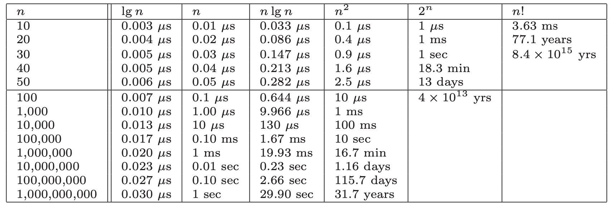
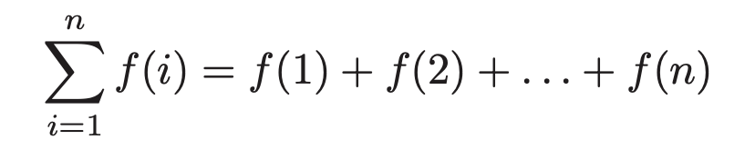

# Chapter 1 - Introduction to Algorithm Design
Algorithm's are procedures that solves *problems*. It must, in order to be correct, solve all *instances* of that problem. The difference between a general, well-specified problem and instances of that problem are key. Algorithms that only solve a subset of instances, and not the problem more generally, are incorrect.

Three desirable properties of a good algorithm:
1. Correct
2. Efficient
3. Easy to implement

These may not be achievable simultaneously.

An algorithm generally by describes as an input of some description and a desired output based upon that input.

Throughout the book he'll use the traveling salesman problem to describe various lessons on algorithms. In this chapter he ran through some of the naive approaches to solving the problem of how to minimize the total distance traveled when visiting a set of points exactly once. First was the idea randomly choosing a point and then walking the rest via a nearest neighbor search. This is obviously wrong as there's no way to choose the first point other than randomly. Then there was the idea of the closest-pair heuristic that would attempt to build a chain by repeatedly finding the closest pairs of points and then merging them correctly. This also has issues.

Generally the point is:
> There is a fundamental difference between *algorithms*, procedures that always produce a good result, and *heuristics*, which may usually do a good job but provide no guarantee of correctness.

## 1.2 Selecting the right jobs
He then describes the movie scheduling problem: if an actor has n number of possible jobs all of which pay equally but span different intervals, how do they select which jobs to take. The take home lesson is:
> Reasonable looking algorithms can easily be incorrect. Algorithm correctness is a property that must be carefully demonstrated.

## 1.3 Reasoning about Correctness
We need tool that we can use to determine which algorithms are correct. The primary tool is a mathematical proof. A proof has 3 parts:
1. A clear, precise statement of what you're trying to prove
2. A set of assumptions that can be taken as true
3. A chain of reasoning from the axioms to the statement being proved

Proofs are very hard and so aren't in the book. The work has been done by others, and so we learn about the available algorithm and not why they are correct.

### Problems and Properties
A problem has two parts:
1. The set of allowed input instances
2. The required properties of the algorithm's output

Remember: ask the wrong question -> get the wrong answer.

Often there can be a problem specification that allows too broad a class on instances for which no efficient algorithm exists. It's therefore usual and totally okay to restrict the problem specification to the point where such an algorithm does exist.

Defining the output requirements have two traps:
1. Asking an ill-defined question, like "find the best route". Without a definition of "best" this is meaningless.
2. Creating compound goals, where the output requires too many things. Such outputs may be well defined, but are complicated to reason about and solve.

### Expressing an algorithm
We can use human language, pseudocode, or actual code. Which depends on context. But we should always opt of the one that most clearly express the *idea* of the algorithm. If it's not clear enough, perhaps we're using too low-level a language.

### Demonstrating incorrectness
> Searching for counterexamples is the best way to disprove the correctness of a heuristic.

Good counter examples have two important properties:
1. **Verifiability**: A counterexample should calculate what answer the algorithm will give for a given instance and it should display a better answer to prove the algorithm didn't find it.
2. **Simplicity**: Good counterexamples strip everything unnecessary leaving the simplest form of why the algorithm didn;t work.

Techniques for hunting for counterexamples:
1. **Think small**: When algorithms fail, there is often a very simple example on which they fail. Amateurs tend to create big messy instances of how it fails, rather than finding the simplest test case.
2. **Think exhaustively**: For a small number of `n` (the size of the set of instances on which the algorithm is operated), there are usually only a small number of possible instances. Meaning a small number of outputs. One should think exhaustively in these possible outcomes when finding counterexamples.
3. **Hunt of the weakness**: Based on an definition of the problem, you can often use that to find a possible weakness. So if it's "find the biggest", then provide a case where two options are the same size.
4. **Go for a tie**: Provide instances of the same size.
5. **Seek extremes**: It's good to find extreme examples: big and small, left and right, few and many. These test the assumptions of the algorithm.

## 1.4 Induction and Recursion
Failure to find a counter example is not proof of correctness. For that we need a demonstration of correctness and for that mathematical induction is usually the way to go.

Induction is a chain of assumption that logically flow from one to another, starting with a base case. If A, then B, then C.

Two errors in inductive proofs we can look for:
1. **Boundary errors**: Assumptions can be made in an inductive proof that ignore boundary cases.
2. **Extension claims**: Inductive proofs often make a claim at a small scale and the assume that the same assumption holds for any size of `n`. This can often not be true.

Induction and recursion are both similar due to them both having general and boundary conditions. Induction has general claims and boundaries to which those claims are true. Recursion has a general function that has a boundary condition that stops infinite recursion. Therefore often recursive algorithms can be proved by induction.

## 1.5 Modeling the Problem
Modeling is the art of formulating your application in terms of precisely defined, well-understood problems. Algorithms in the literature are often designed to work on rigorously defined abstract structures, not specific real-world objects. Therefore in order to effectively use the many many algorithms that exist, we need to be able to model our application and the problems it solves in terms of these fundamental structures.

Remember though that not all problems always fit tidily within a well-defined abstract structure. Sometimes modeling in different ways is possible.

 > Modeling your application in terms of well-defined structures and algorithms is the most important single step towards a solution.

### Combinatorial objects
1. **Permutations**: arrangements, or orderings, of items. So {1,3,2,4} and {4,2,3,1} are distinct permutations of the same set.
	1. Likely the object in question when the problem seeks an "arrangement", "tour", "ordering", "sequence"
2. **Subset**: selections from a set of items. E.g. {1,3,4} and {2} are two distinct subsets of the first four integers. Order does not matter.
	1. Likely the object in question when the problem seeks an "cluster", "collection", "committee", "group", "packaging", "selection"
3. **Trees**: hierarchical relationships between items.
	1. Likely the object in question when the problem seeks an "hierarchy", "dominance relationship", "ancestor/descendant relationship", "taxonomy"
4. **Graphs**: relationships between arbitrary pairs of objects.
	1. Likely the object in question when the problem seeks an "network", "circuit", "web", "relationship"
5. **Points**: locations in geometric space.
	1. Likely the object in question when the problem seeks an "sites", "positions", "data records", "locations".
6. **Polygons**: regions in geometric space.
	1. Likely the object in question when the problem seeks an "shapes", "regions", "configurations", "boundaries".
7. **Strings**: sequences of characters, or patterns.
	1. Likely the object in question when the problem seeks an "text", "characters", "patterns", "labels".

### Recursive objects
**Thinking recursively is learning to look for bug things that are made from smaller things of *exactly the same type as the big thing*.**

Recursive structures occur everywhere in the algorithmic world. Each of the structures above have a way to describe in terms of recursion:
1. **Permutations**: Delete the first element of a permutation of `n` and you get a permutation of `n-1`.
2. **Subset**: Every subset of `{1, ..., n}` contains a subset of `{1, ..., n - 1}`.
3. **Trees**: Delete the root of a tree and you get a collection of smaller trees. Delete a leaf and you get a slightly smaller tree.
4. **Graphs**: Delete any vertex from a graph and you get a smaller graph. Divide vertices into groups of left and right and you get another collection of smaller graphs (and broken edges).
5. **Points**: Take a cloud of points and draw a line through them -> two groups of points.
6. **Polygons**: Inserting any internal chord between two non-adjacent vertices of a simple polygon cuts it into two smaller polygons.
7. **Strings**: Delete a character from a string -> still a string.

Recursive descriptions require both decomposition rules and basis cases. Basic cases = the specification of the smallest and simplest objects where the decomposition stops.

## 1.6 Proof by Contradiction
Basics of a contradiction argument:
1. Assume the hypothesis (the statement you want to prove) is false
2. Develop some logical consequences of this assumption
3. Show that one consequence is demonstrably false, therefore showing the assumption is incorrect hypothesis true.

Take Euclid's proof that there are infinite primes:
1. Let's take the negation and assume that there are a fixed number of primes `m`
2. If we take the product `N` of all of the primes in `m`, then it has the property that `N` is divisible by all primes within `m`.
3. But if we consider the integer `N + 1`. 1 effectively becomes a remainder of a division by any of the prime factors of `N`.
4. Therefore N is prime.
5. Therefore the assumption is wrong and the hypothesis true.

(I don't understand how this is true. Surely it only proves that N+1 is indivisible by any factor of N. But there are other integers between those factors, right?)

**NOTE**: 1.7 and 1.8 are the war stories that I'm not always making notes on.

## 1.9 Estimation
When you don't know the answer, estimate (principled guessing). E,g, the running time of a program.

Estimation is usually either principled calculation (function of quantities you already know or could easily find) or analogies (based on past experience). 

E.g. pennies in a jar. Using the prior calculation of how many pennies in a roll of pennies and how tall those rolls are, we can estimate how many rolls make up the volume.

A best practice in estimating is to use multiple methods to come up with an estimate to see if they are about equal.


# Chapter 2 - Algorithm Analysis
In order to understand the effectiveness of an algorithm, we need a way to compare it with others without actually implementing it. There are 2 important tools for this:

1. The RAM model of computation
2. The asymptotic analysis of computational complexity

Before we get started, remember that Big Oh is just a description of the asymptotic growth behaviour of a function as the size of its inputs grow. That wasn't always in my head as I read this, but always remember that's what we're doing is key.

## 2.1 The RAM model of Computation
Machine-independent algorithm design depends on a hypothetical machine called the *Random Access Machine*:

1. Each *simple* operation (+, \*, -, =, if, call) takes exactly one time step
2. Loops and subroutines are *not* considered simple operations. Instead they are a composition of many single-step ops.
3. Each memory access takes exactly one time step. We also have as much memory as we need. The RAM model doesn't differentiate between cache or disk access.


**Essentially: under RAM, we measure run time by counting the steps an algorithm takes.**

Although the assumptions made above are demonstratably not how a machine operates in reality, the simplified model proves to be a very good measure of real world performance. Think of it like the flat earth model. We know it's not reality, but in our daily lives, building houses, putting up shelves, etc, we use this model as a reliable measure of reality. The RAM model is the same.

### Best, Worst, and Average Complexity
To use the RAM model to understand the real-world performance of an algorithm, we need to use it to determine performance of an algorithm over *all possible instances*. Take sorting. With a sort algorithm, the possible instances include every arrangement of `n` keys, for all possible values of `n`. Each of these (a value of `n` and every arrangement of `n`) can be plotted on a graph:

```
                        │
            │
            │
            │                                                    .. x  Worst
            │                                                 ..    x
            │                                              .        x
            │                                            .          x
            │                                         .
            │                                     . x
            │                                  .                    x
Number of   │                               .                       x
  Steps     │                             .         x               x
            │                           .           x               x
            │                       .x
            │                    .                                  x
            │                 .            .     ..  .   .     .  ...  Average
            │             .     .    .                              x
            │          .   . .                      x               x
            │        x . ..   . ..                                  x
            │                        x .            x               x
            │                             .
            │                                .  .                   x
            │                                    .  x  .            x
            │                                              .    .   x
            │                                                       .  Best
            │
            └────────────────────────────────────────────────────────────

                     1               2              3               4

                                    Problem Size
```
Along the X axis is the size of the problem, with Y the number of steps, and the points the performance of a given arrangement of `n`.

There are 3 interesting plots over these points:

1. *Worst-case complexity*: the maximum steps taken in any instance of size `n`.
2. *Best-case complexity*: the minimum steps taken in any instance of size `n`.
3. *Average-case complexity* (or *expected time*): the average steps taken over all instances of size `n`.

Worst-case generally provdes to be the most useful. Best-case is often unlikely and so is useless to think about. Average case can often be difficult to determine. What does average even mean? Worst-case is often easy to calculate.

That said, average-case is useful with respect to *randomized algorithms* which use random numbers to make decisions in an algorithm.

## 2.2 Big Oh Notation
The best, worst, and average complexities are hard to work with in practice as their functions tend to:

1. *Have too many bumps*: There are often irregularities with the performance of algorithms based on some particular value of `n` (binary search is typically faster when `n = 2^k - 1` because the array partitions work out nicely). Capturing the irregularities exactly would serve no real purpose when talking about the generalized performance of an algorithm.
2. *Require too much detail to specify precisely*: We would essentially need to implement the entire algorithm to fully understand all the steps an algorithm could possibly take. Doing so would be exact, but offers little benefit over saying "the time grows quadratically with *n*".

Big Oh notation allows us to discuss the upper and lower bounds of an algorith while ignoring its impactless specifics.

**Note**: Big Oh ignores constants. So `f(n) = n == g(n) = 2n`. Constants tell us nothing aboout the performance of an algorithm as it scales. The constant might occur due to a difference in implementation (Java vs C) of the same algorithm.

Here are the formal definitions of Big Oh are:

1. `f(n) = O(g(n))` means `c · g(n)` is an *upper bound* on `f(n)`. Therefore, some constant `c` exists such that `f(n) <= c · g(n)` for every `n` large enough (meaning `n >= n₀` where `n₀` is some constant).
2. `f(n) = Ω(g(n))` means `c · g(n)` is a *lower bound* on `f(n)`. Therefore, some constant `c` exists such that `f(n) >= c · g(n)` for all `n >= n₀`.
3. `f(n) = Θ(g(n))` means `c₁ · g(n)` is an upper bound on `f(n)` and `c₂ · g(n)` is a lower bound on `f(n)`, for all `n >= n₀`, for all `n >= n₀`. Therefore, some constant `c` exists such that `f(n) <= c₁ · g(n)` and `f(n) >= c₂ · g(n)`, for all `n >= n₀`. This means that `g(n)` is a tight bound on `f(n)`. Essentially a marge of the previous two using two constants.

These all hold for a constant `n₀` such that `n >= n₀`. This reflects that there's always a lower bound on values of `n` that aren't particularly interesting and so we don't both modelling their complexity. E.g. evaluating a sorting algorithm for `n=4` isn't all that interesting, `n=10000` is far more interesting.

Generally when choosing constants we're looking for constants that prove the inequalities in an obvious way.


### Examples

Let's start with `O(g(n))`. Let's assume our function is `3n² - 100n + 6`. Let's figure out its `O(g(n))`. We're looking for a `g(n)` so that `f(n) <= c · g(n)`.

Let's start with `c=3`: is `3n² - 100n + 6` less than `3 · g(n)`? If `g(n)` is `n²`, then yes, because `3n² >= f(n) = 3n² - 100n + 6`. **So:** `f(n) = O(n²)`.

Let's see if it's `O(n³)`: starting with `c=1`, is `n³ >= 3n² - 100n + 6`? Yes, but only when `n > 3`. So, `f(n) = O(n³)` when `n₀ > 3`

Is it `O(n)`? Let's put `c=100` again: is `100n > 3n² - 100n + 6`? Well, yes, but only for values of `n <= (c + 100)/3` (derived from the `f(n)`). So even for a high constant, it only holds for small values of `n`. We're not intersted in that, so `f(n) != O(n)`.

There are examples in the book for `Ω(n)` and `Θ(n)`, but they follow the same logic as above. It's jarring to read `n² = O(n³)`. It's easier to read "=" as "one of the functions of". So `n²` is one of the functions of `n³`. To me it's also easy to read it as `n³` is an upper bound of `n²`.


One more: is `2ⁿ⁺¹ = O(2ⁿ)`? Well it is if there is a constant such that `2ⁿ⁺¹ <= c ·2ⁿ`. If `c=2` then, `2ⁿ⁺¹ = 2· 2ⁿ`, so clearly `2 · 2ⁿ ≤ c · 2ⁿ` for any `c >= 2`.


## 2.3 Growth Rates and Dominance Relations
It might seem crazy to ignore constants as it means `f(n) = 0.001n²` is identical to `f(n) = 1000n²`. How can that be? Growth rates baby. For most values of `n`, the constants become irrelevant, resulting in effectively the same runtime. 

Take a look at these runtimes to understand why:



From this we can see:

1. All algorithms take roughly the same time for `n=10`
2. Any algorithm with `n!` running time becomes useless for `n >= 20`
3. Algorithms whose running time is `2ⁿ` are useless for `n > 40`
4. Quadratic-time algorithms (`n²`) are usable up to `n = 10,000`, but deteriorate for larger inputs. `n > 1,000,000` is hopeless.
5. Linear-time and `nlogn` remain practical on inputs of one billion items.
6. Any `O(logn)` algorithm hardly sweats for any imaginable value of `n`.


Bottom line: even ignoring constant values, we get an excellent idea of performance for any given size of n.

### Function classes
The values of `g(n)` create distinct sets of classes we can use to describe most algorithms. Just a note, we say that a faster growing function *dominates* the slower growing one. So `n³` dominates `n²`. Sometimes written `n³ >> n²`.

The classes are:

1. *Constant functions*, `f(n) = 1`. No dependence on `n`.
2. *Logarithmic functions*, `f(n) = log n`. Shows up in binary search. Grows faster than constant, but still fairly slowly.
3. *Linear functions*, `f(n) = n`. Such functions measure the cost of looking at each item once (or twice, or ten times, remember constants aren't relevant) in an n-element array.
4. *Superlinear functions*, `f(n) = n log n`. Arise in algorithms like quicksort and mergesort.
5. *Quadractic functions*, `f(n) = n²`. Measure the cost of looking at most or all *pairs* of items in an n-element universe. Arise in insertion sort and selection sort.
6. *Cubic functions*, `f(n) = cⁿ` for any given constant `c > 1`. Functions like `2ⁿ` arise when enumerating all subsets of n items.
7. *Factorial functions*, `f(n) = n!`. Occur when generating all permutations or orderings of n items.

Using the dominance notation: `n! ≫ 2n ≫ n3 ≫ n2 ≫ nlogn≫ n≫ logn ≫ 1`.

## 2.4 Working with Big Oh
These various operations are common in simplifying functions to determine their complexity.

### Adding Functions
The sum of two functions is governed by the dominant one:

```
f (n) + g(n) → Θ(max(f (n), g(n)))
```

This is very useful in simplifying expressions. E.g. `n³ + n² + n + 1 = Θ(n3).` The intutition for this is that at least half of the bulk must come from the larger value. The dominant function will provide the larger value as `n → ∞`. Thus dropping the smaller functions has at most a factor of 1/2 reduction, which is just a multiplicative constant. Example, if `f(n) = O(n2)` and `g(n) = O(n2)`, then `f(n) + g(n) = O(n2)`.

### Multiplying Functions
Multiplication is like repeated addition. When multiplying by any constant, we know that the constant cannot affect its asymptotic behaviour, so `O(c · f(n)) → O(f(n))`.

But multipling a function with another function is different, as the two functions are increasing with `n`. So in general:

```
O(f (n)) · O(g(n)) → O(f (n) · g(n))
Ω(f (n)) · Ω(g(n)) → Ω(f (n) · g(n))
Θ(f (n)) · Θ(g(n)) → Θ(f (n) · g(n))
```

Also the Big Oh relationships are transitive, so if `f(n) = O(g(n)) and g(n) = O(h(n)), then f(n) = O(h(n))`.

## 2.5 Reasoning about Efficiency
Let's run through some examples of how to use Big Oh reasoning.

### Selection Sort
A selection sort in C:

```c

void selection_sort(item_type s[], int n) {
    int i, j; /* counters */
    int min; /* index of minimum */

    for (i = 0; i < n; i++) {
        min = i;
        for (j = i + 1; j < n; j++) {
            if (s[j] < s[min]) {
                min = j; }
        }
        swap(&s[i], &s[min]);
    }
}
```
It's a nested loop. The outer loop goes around `n` times, and the inner goes around `n - (i + 1)` times, where `i` is the index of the outer loop. So the number of steps is given by the series `T (n) = (n − 1) + (n − 2) + (n − 3) + ... + 2 + 1`. Each term in the series is the number of times for the inner loop, repeated `n` times.

One way to think of it is we're adding up `n - 1` terms, whose average value is `n/2`. So this gives: `T (n) ≈ (n − 1)n/2`. This becomes `(n² - n) / 2` which due to dominate addition, is `n² / 2`. As we ignore constants, it's therefore simply `O(n²)`.


### Insertion Sort
A basic rule of thumb is the worst-case running time follows from multiplying the largest number of times each nested loop can iterate. Take the insertion sort:

```c
for (i = 1; i < n; i++) {
    j = i;
    while ((j > 0) && (s[j] < s[j - 1])) {
        swap(&s[j], &s[j - 1]);
        j = j-1;
    }
}
```

So the question is how often does the inner loop go round? Well it has two termination conditions, one is to prevent out of bounds (`j > 0`) and the other is when it finds an element in its proper order. As worst-case seeks an upper bound, we ignore, and assume the inner loop always goes around `i` times. Since `i < n`, let's assume `n = i`. So therefore the inner loop goes `n` times. The outer loop also goes `n` times. Therefore it's worst-case is `O(n²)`.

### String Pattern Matching
Here's a basic pattern matching algorithm:

```c
int findmatch(char *p, char *t) {
  int i, j;       /* counters */
  int plen, tlen; /* string lengths */

  plen = strlen(p);
  tlen = strlen(t);

  for (i = 0; i <= (tlen - plen); i = i + 1) {
    j = 0;
    while ((j < plen) && (t[i + j] == p[j])) {
      j = j + 1;
    }
    if (j == plen) {
      return (i); /* location of the first match */
    }
  }

  return (-1); /* there is no match */
}
```

Again let's figure out the worst-case of the nested loops. The inner *while* goes around at most `m` times (where `m` is the number of characters in the substring). The outer loop goes around `n - m` times (as it makes no sense to go beyond `n - m` as there needs to be at least `m` characters to get a match). So the worst-case is: `O((n − m)(m + 2))`.

But we need to account of the time it takes to get the length of each string. As it has to count each character in the string it will be linear in the length of the string, so the worst-case is now `O(n + m + (n − m)(m + 2))`.

So now the job is to simplify using the rules of addition and multplication and when noticing when the terms satisfy the inequalities of the base function definitions.

So since `m + 2 = Θ(m)`, we get `O(n + m + (n − m)m)`. Multiplying this out yields `O(n + m + nm − m²)`.

In any interesting problem (this idea of only considering interesting values of `n` comes up a lot), `n >= m`, since the substring needs to be less than the text itself. This means that `n + m <= 2n`, which because of the Big Oh rules, means `n + m <= 2n = Θ(n)`. So replacing `n + m`: `O(n + nm − m²)`.

Next, we now that `n <= nm` as `m >= 1` for any intresting search pattern. Because in addition terms dominate, `n + nm` => `O(nm)`. We now have `O(nm - m²)`

Lastly, `-m²` is negative and therefore only lowers the value. Because we now `n > m` (pattern is less than the whole text), it implies `mn > m²`. It means then that `-m²` is not big enough to cancel out the `nm`. So finally, we have `O(nm)`.

### Matrix multiplication
Matrix multiplication involves 3 nested loops (for two-dimensional matrices). Because of that we should immediately think `O(n³)`. It can easily be derived by understanding that the number of steps in the multiplication (two matrices, one `X x Y`, the other `X x Z`) is calculated by knowing that the inner-most loop runs `z` times, the middle loop `y` times, and the outer `x` times. So `O(xyz)` The common case is where the dimensions of `x`, `y`, and `z` are all the same. So it can be written as `O(n³)`.

## 2.6 Summations
Summations often show up in algorithmic analysis due to the nature of computation (loops and such). So understanding how summations relate to complexity is key.

Summation formulae descrive the addition of an arbitrarily large set of numbers. The general formula:



For many simple summations, we can simplify. For example the sum of `n` ones, is just `n`, so we'd write that.

When `n` is even, the sum of the first `n = 2k` integers can be seen by pairing the `ith` and `(n - i + 1)th` integers. This ends up simplifying to `n(n+ 1)/2` (the same we saw in the selection sort), which we know simplifies to `O(n²)`.

Generally there are two base classes of summation formulae:

1. *Sum of a power of integers*: We know that the summation of the pairs evaluated in a selection sort is `n(n + 1)/2` = `O(n²)`. In general, for a sum of integers where the exponent is `p`, the complexity is `Θ(ⁿ⁺¹)`. Therefore the sume of sqaures is cubic, the sum of cubes is quartic.
2. *Sum of geometric progression*: In geomtric progressions, the index of the loop affects the exponent, that is the summation is `(aⁿ⁺¹ - 1)/(a - 1)`. How we interpret the sum depends on the base `a`. So if `a < 1`, then the complexity converges to a constant as `n -> infinity`. This is the "free lunch" of algorithmic analysis. If `a > 1` though, the sum rapidly grows with each new term -> `Θ(aⁿ⁺¹)` for `a > 1`.

## 2.7 Logarithms and Their Applications
A logarithm is simply an inverse exponential function. Saying `bٰˣ = y` is the same as saying `x = log_b(y)`. (Note: \_b means subscribt b but I can't easily write it).

Exponentials grow at a distressingly fast rate. Logarithms therefore grow refreshingly slow.

**Logarithms arise in any process where things are repeatedly halved**.

### Logarithms and Binary Search
Binary search is a good example of an `O(log n)` algorithm. You build the tree, and then on each iteration of the loop, you have the search space. Halving == logarithm. The number of steps is equal to the number of times we can halve `n` until we have only 1 left. By definition, this is exactly `log₂n`.

One of the most powerful ideas in algorithm design.

### Logarithms and Trees
If we consider a general tree, where each level of the tree multiplies the number of nodes by `d`. When `d=2`, we have a binary tree, so `n = 2ʰ`, where `h` is the height of the tree. So the height (and therefore the number of iterations until an algorithm exhausts the data structure) is `h = log₂n`.

But when `d` is larger it means that each level has more leaves. So each iteration has to consider more leaves, but discards more with each iteration. I think that's better but the book isn't clear.

**I believe that  log_3 is better than log_2, but I'm not sure. I should rewrite this when I've finished the book and am reviewing these notes.**

### Logarithms and Bits
To represent `n` different possibilities with bits, we need `n = 2ʷ`. So therefore `w` bits is needed: `w = log₂n` bits.

### Logarithms and Multiplication
Maybe feel this in when reviewing notes. By brain is too tired to remember multiplication rules for logs.

### Fast Exponentiation
The worst algorithm to compute `aⁿ` would just do `a x a x a ...` `n-1` times. But we can do better. We know that `n` is equal to itself times two. So we can use that to know that if `n` is even, then `aⁿ = (a^(n/2))²`. If it's odd, `aⁿ = a(a^(n/2)²)`. In either case, we've halved the size of the exponent (and therefore the amount of work) at the cost of two multiplications. So `O(lgn)` is enough to compute the value.

This generally leads us to *divide and conquer*. It always pays to divide a job as evenly as possible.

### Logarithms and Summations
Harmonic numbers are a special case of a sum of a power of integers, where the terms being summed are reciprocals of `i`. So `1 + 1 + 1/2 + 1/3 + 1/4` etc. The complexity is `θ(logn)`.

They are important as they arise in many algorithms are usually explain "where the log comes from" when one magically pops out of algebriac manipulation.

For example, analyzing quicksort requires the summation of `n * (sum of harmonic numbers up to n)`. Because the harmonic sequence is just `θ(logn)`, then the complexity of quicksort is `θ(nlogn)`.

### Properties of Logarithms
As we have seen `bˣ = y` is equivalent to `x = log_b(y)`. The `b` is the base of the logarithm. Three bases are important:

1. `Base b = 2`. The *binary logarithm*, usually denoted `lg x`. Arises when halving things. Most algorithmic applications imply binary logarithms.
2. `Base b = e`. The *natural logarithm*, using denoted `ln x`. Base is `2.71828...`. NOTE: He doesn't explain and I don't know where the number comes from.
3. `Base b = 10`. The *common logarithm*. Less common nowadays. Used before pocket calculators.

Important properties:
1. Log of the product is the sum of the logs of each: `logₐ(xy) = logₐ(x) + logₐ(y)`.
2. Easy to convert between bases: `logₐb = log_c(b) / logₐ(y)`. So converting from base a to c involves multiply by `log_c(a)`.

Two implications of these properties:
1. *The base of the logarithm has no real impact on the growth rate*: A big change in the base has little effect on the value. Because converting between bases involving multiplying, we can simply ignore bases in algorithmic analysis.
2. *Logarithms cut any function down to size*: The growth rate of the logarithm of any polynomial function is `O(lg n)`. This follow because:

```
logₐnᵇ = b · logₐn
```

which simplifies to `lgn` because we ignore the base `a` and the constant `b`. The effectiveness of binary search on a wide range of problems is a consequence of this observation. Note that a binary search on `n²` items is only twice as slow as `n` items.

**HEY**: this is important. The term binary search implies that its performance comes from the fact that each iteration splits the search space in half. So what if we were to split it not in half, but 1/3 and 2/3? So for a binaru tree of 1,000,000 items, the iterations is `log₂(1,000,000) = 20`. Taking 2/3 (worst case): `log_\[2/3\](1,000,000) = 35`. So not a lot.

**The main lesson:** changing the base of the log does not affect the asymptotic complexity. The effectiveness of binary search comes from its logarithmic running time, not the base of the log.


## 2.10 Advanced Analysis
These techniques are not used in the main text of the book and are considered optional. But to really understand some of the algorithms in the hitchikers guide part of the book, they will be useful.

**NOTE:** Come back to these and makes notes when I've finished the book.

## Chapter Notes
Little Oh notation: `f(n) = o(g(n))` if `g(n)` dominates `f(n)`. So asking for `o(n²)` means an algorithm that is better than quadratic in the worst case.


# Chapter 3 - Data Structures
Proper data structures are as crucial to performance as the algorithm itself. Although data structures can be swapped out in order to improve performance, it's better to design your algorithm around the appropriate data structure from the beginning.

There are 3 important *abstract data types* that will be focused on in this chapter:
1. Containers
2. Dictionaries
3. Priority queues

Each of these have many concrete data types. Some of those will be discussed in this chapter.

## 3.1 Contiguous vs Linked Data Structures
Data structures can be classified as either *contiguous* or *linked*, depending upon whether they are based on arrays or pointers.

*Contiguous allocated structures* are composed of single slabs of memory. They include:
1. Arrays
2. Matrices
3. Heaps
4. Hash tables

*Linked data structures* are composed of distinct chunks of memory bound together by *pointers* and include:
1. Lists
2. Trees
3. Graph adjacency lists

### Arrays
Arrays are the fundamental contiguous structure. They are fixed-sized data records such that each element can be efficiently located by its index or (equivalently) address.

Advantages:
1. *Constant-time access given the index*: As an index -> address, we can arbitrary data items instantly provided we know the index.
2. *Space efficiency*: Arrays are pure data - no data is wasted on linkage information. End-of-record info is not needed as arrays are built from fixed-sized records.
3. *Memory locality*: They have excellent memory locality when iterated through sequentially - common in programming. Physical continuity between successive data access helps exploit the high-speed *cache memory* on modern computer architectures (L1 cache and all that).

Downside: cannot adjust their size in the middle of execution. We can compensate by allocating more than we initially need, but this is wasteful.

A better technique is to use dynamic arrays. These start with a given array size and double when we run out of space (when `i` == `j - 1` if `j` is the length of the array). This seems wasteful, but surprisingly is not.

If we assume we start at an array of 1 and double until we get to `n`, it takes `ln(n)` (due to doubling every iteration) number of doubles until we get there. Plus 1 more when `i=n`. Each iteration involves `2ⁱ⁻¹` copy operations. So the complexity is given by the sum of `2ⁱ⁻¹` terms starting from `i=1` to `i=lg(n)`. This works out and simplified to `2n`. This means that each element is moved on average twice. ANd the total work in managing the array is `O(n)`, the same cost of allocated a fixed sized array.

What we lose with dynamic arrays is the guarantee that an insertion is constant time in the *worst case*. But all accesses and *most* insertions will still be constant. What we get is a promise that the nth element insertion will be completed quickly enough to give `O(n)` total effort expended in managing the array. This is an example of *amortized* guarantees, which occur frequently in data structure analysis.

### Pointers and linked data structures
*Pointers* are the connections that hold the pieces of linked structures together. They represent the address of a location in memory.

A linked list is defined by the following struct:

```c
typedef struct list {
    item_type item; /* data item */
    struct list *next; /* point to successor */
} list;
```

1. Each node in the data structure (here `list`) contains one or more data fields (here `item`) that stores the data.
2. Each node contains a pointer to another node (`next`). Much of the data in linked data structures therefore is devoted to pointers, not data.
3. We need a pointer to the head of the structure.

The list is the simplest linked data structure. There are three basic operations supported by lists:
1. Searching
2. Indexing
3. Deleting

In *doubly linked lists*, each node points to the predecessor and its successor, which simplifies certain operations at the expense of extra space.

#### Searching a list
Follow the links either recursively or iteratively until you find the element, or not.

#### Insertion into a list
Inserting into an unordered list simply involves adding it to the front of the list and updating some pointers.

#### Deletion from a list
We first find a pointer to the predecessor of the element to delete, update its next pointer to the element after the element to delete, then free the deleted element's memory.

### Linked vs static arrays
Advantages of linked structures over static arrays:
1. Overflow of linked structures never occur unless we run out of memory.
2. Insertion and deletion are simpler.
3. With large records, moving pointers is easier and faster than moving the items themselves.

Advantages of static arrays:
1. Space efficiency: no wasted space holding pointers.
2. Efficient random access to items in arrays.
3. Better memory locality and cache performance that random pointer jumping.

Both can be though of as recursive structures:
- *Lists*: Chopping the first element from a list leaves another list. Same or strings.
- *Arrays*: Splitting an array gives two smaller arrays.

This insight leads to simpler list processing and efficient divide-and-conquer algorithms such as quicksort and binary search.

## 3.2 Containers: Stacks and Queues
*Containers*: an abstract data type that permits storage and retrieval of data items *independent of content*. They store objects in an organized way that follow specific access rules. They are distiguished by the particular retrieval order they support.

Two important types:
1. *Stacks* support retrieval by LIFO. Easy to implement and are very efficient, so are good to use when retrieval order doesn't matter (e.g. processing batch jobs). The two *put* and *get* operations are `push` and `pop` which insert and remove from the top of the stack. LIFO exists in lots of places in the world. Tends to occur in recursive algorithms.
2. *Queues* support retrieval by FIFO. Jobs processed in FIFO order minimize the *maximum* time spent waiting. Average time is the same whether we use FIFO or LIFO. They are slightly tricker to implement than stacks so are good when insertion order matters. The *put* and *get* operations are usually called *enqueue* and *dequeue* which insert at the back and remove from the front of the queue, respectively.

## 3.3 Dictionaries
The *dictionary* date type permits access to data items by content. You stick an item into a dictionary so you can find it when you need it. The primary operations are:
1. *Search (D, k)*: Given a search key *k*, return a pointer to an element in the dictionary *D* whose key value is *k*, if it exists.
2. *Insert (D, x)*: Given a data item *x*, add it to the dictionary *D*.
3. *Delete (D, x)*: Given a pointer *x* to a given data item in the dictionary *D*, remove it from *D*.

Certain dictionaries structures efficiently support other useful operations:
1. *Max(D)* or *Min(D)*: Retrieve the item with the largest (or smallest) key from *D*. With this the dictionary can serve as a priority queue.
2. *Predecessor(D, x)* or *Succcessor(D, x)*: Retrieve the item from *D* whose key is immediately before (or after) item *x* in *sorted* order. With this we can iterate through the dictionary in sorted order.

Dicitonaries are often used for common data processing tasks. E.g. we could easily remove all duplicates names from a mailing list (construct the dictionary from the names (avoiding dupes by *search*), use *min* and *max* to iterate through using *successor*).

### Implementing dictionaries via arrays
Imagine we implement a dictionary via both an array and a sorted array. Below are the complexities of each operation:

| Dictionary Operation | Unsorted Array | Sorted Array |
|---|---|---|
| Search(A, k) | O(n) | O(logn) |
| Insert(A, x) | O(1) | O(n) |
| Delete(A, x) | O(1) | O(n) |
| Successor(A, x) | O(n) | O(1) |
| Predecessor(A, x) | O(n) | O(1) |
| Minimum(A) | O(n) | O(1) |
| Maximum(A) | O(n) | O(1) |

It's obvious why the above are so, so I won't go into detail. Just note that `O(logn)` for sorted arrays is due to using binary search. 

**Remember**: there are often trade-offs when considering which structures to use. Often increased efficiency on some set of operations will reduce efficiency on another set.

### Implementing dictionaries via linked lists

**Remember**: successor and predecessor refer to the keys in sorted order.

| Dictionary Operation | Single linked unsorted | Singly linked sorted | Doubly linked unsorted | Doubly linked sorted |
|---|---|---|---|---|
| Search(L, k) | O(n) | O(n) | O(n) | O(n) |
| Insert(L, x) | O(1) | O(n) | O(1) | O(n) |
| Delete(L, x) | O(n)\* | O(n)\* | O(1) | O(1) |
| Successor(L, x) | O(n) | O(1) | O(n) | O(1) |
| Predecessor(L, x) | O(n) | O(n) | O(n) | O(1) |
| Minimum(L) | O(1)\ | O(1) | O(n) | O(1) |
| Maximum(L) | O(1)\* | O(1)\* | O(n) | O(1) |

Most of these are self-explanatory, with the exception of those with an \*.

1. \*Deletion: Because we need to correct the link of the prior node in the list, when deleting from a singly linked list we need to traverse the list to the find the predecessor.
2. \*Maxmium: Usually for both singly and doubly linked list, we have to traverse the list to get to the tail, where the maximum lives. But we can maintain a pointer to the tail to, allowing O(1) for *Maxmimum(L)*. We just have to pay the maintenance cost on each insert and deletion to ensure the pointer remains up to date. For doubly linked lists this is O(1) as we just need to check if the `last` pointer's `last->next` is still `NULL` on inserts and change the `last->next` to `last->predecessor` if `last` is deleted. For singly linked lists, we just need to charge the cost to deletion operations. One linear sweep per deletion gives us constant time for max/min.

## 3.4 Binary Search Trees
So far the data structures have had fast search or flexible updating, but not both:
1. Unsorted, doubly linked lists support insertion and deletion in O(1) but search is linear in the worst case.
2. Sorted arrays support binary search (log query times) but at the cost of linear updates.

As binary search requires fast access to two element: median elements above and below the given node. Combining these ideas forms a linked list with two pointer nodes. This is the basic idea of binary search trees.

A *rooted binary tree* is defined as being either empty or consisting of a node called the *root* along with two rooted binary trees called the left and right subtrees. Order of the subtrees matters.

In a binary search tree, each node is uniquely labeled `x`, with its left subtree all with labels `< x`, and its right subtree all with labels `> x`.

### Implementing Binary Search Trees
Nodes have *left* and *right* pointer fields, with an optional *parent* pointer, along with a data field:

```c
typedef struct tree {
    item_type item;
    struct tree *parent;
    struct tree *left;
    struct tree *right;
} tree;
```

#### Searching in a Tree
Super simple:

```c

tree *search_tree(tree *l, item_type x) {
  if (l == NULL) {
    return (NULL);
  }

  if (l->item == x) {
    return (l);
  }

  if (x < l->item) {
    return (search_tree(l->left, x));
  } else {
    return (search_tree(l->right, x));
  }
}
```

This runs in `O(h)` where `h` is the height of the tree.

#### Finding the Min and Max Elements in a Tree
By definition the min and max live in the left-most and right-most descendants of the root, respectively.

```c
tree *find_minimum(tree *t) {
  tree *min; /* pointer to minimum */

  if (t == NULL) {
    return (NULL);
  }

  min = t;
  while (min->left != NULL) {
    min = min->left;
  }
  return (min);
}
```

#### Traversal in a Tree
Visiting everynode in a rooted binary tree is important in many algorithms. It's a special case of traversing all nodes and edges in a graph.

A simple application of traversal is listing all the labels in the tree. Doing so in *sorted* order is especially trivial due to the structure of the tree.

```c
void traverse_tree(tree *l) {
  if (l != NULL) {
    traverse_tree(l->left);
    process_item(l->item);
    traverse_tree(l->right);
  }
}
```

It obviously runs in `O(n)`.


#### Insertion in a Tree
Due to the structure of the tree, there is exactly one place to place a given node.

To implement this recursively, we need:
1. `l`: A pointer to the current node we're searching
2. `x`: The element to insert
3. `parent`: A pointer to the parent so we can hook up the new node to its parent

The algorithm then checks if `l` is `NULL`, if it is it means we've found the place to insert, otherwise search the next subtree (either left or right depending on the value of x):

```c
void insert_tree(tree **l, item_type x, tree *parent) {
  tree *p; /* temporary pointer */

  if (*l == NULL) {
    p = malloc(sizeof(tree));
    p->item = x;
    p->left = p->right = NULL;
    p->parent = parent;

    *l = p;
    return;
  }

  if (x < (*l)->item) {
    insert_tree(&((*l)->left), x, *l);
  } else {
    insert_tree(&((*l)->right), x, *l);
  }
}
```

Creating the node and linking it is `O(1)` but searching is `O(h)`.

#### Deletion from a Tree
There are 3 cases:
1. The node has no children: easy just remove it and unlink from the parent.
2. The node has a single child: easy just remove it and link the parent to the deleted node's child.
3. The node has two children: tricky, but there's an elegant solution: relabel the deleted node with the label of it's immediate success in sorted order. This is the left-most node in the right subtree of the node we're deleting. This results in a properly label tree.

It takes `O(h)` in the worst-case (the two children requires a search).

#### Performance of Binary Search
When implemented using binary search trees, each dictionary operation takes `O(h)`. The smallest height we can get is when the tree is perfectly balanced which means that `h = lg(n)`.

The balance, or lackof, depends on insertion order. The data structure has no control over where to insert as there is exactly one correct place for it to live. It entirely depends on the order in which we're given them. E.g. if we used a list of sorted numbers for insertion, we'd have a tree with only the right-most subtrees being used.

So therefore the heights of binary trees range from `lg(n) -> n`. In a complete random case (where we consider all `n!` possible insertion orders), we average to `lg(n)` so all is good. So random search trees are okay.


#### Balanced Search Trees
Random search trees are *usually* good. But what if we adjusted the tree a little after each insertion/deletion so that a balanced tree always remains?

There are sophisticated algorithms (which we get to later in the book) that efficiently rebalance, giving us `O(lg(n))` for the insert, delete, query operations.

It's usual to exploit balanced search trees and their `O(lg(n))` behaviour by treating them as a black box. It's possible for example to use them to sort a list in `O(nlgn)` using only a subset of the dictionary operations.


## 3.5 Priority Queues
We often need to process items in a specific order. A job queue that ranks jobs in importance for example. Rather than using a regular array and resorting on each new job insertions, we can use the much more cost-effective *priority queue*.

There are 3 primary operations:
1. *Insert(Q, x)*: Give item *x*, insertt it into priority queue *Q*.
2. *Find-Minimum(Q) / Find-Maximum(Q)*: Return a pointer to the item whose key is the smallest or largest among all keys.
3. *Delete-Minimum(Q) / Delete-Maximum(Q)*: Remove the item whose key value is the min or max from Q.

Example: dating. New people are introduced into our lives but we rank them according to some score (the key).

### Performance
| Operation | Unsorted Array | Sorted Array | Balanced Tree |
|---|---|---|---|
| Insert(Q, x) | O(1) | O(n) | O(lgn) |
| Find-Minimum(Q) | O(1) | O(1) | O(1) |
| Delete-Minimum(Q) | O(n) | O(1) | O(lgn) |

The trick to getting `O(1)` on Find-Minimum is to store a pointer to the min. On insertion we can just update the current min pointer if it's lower. Then on deletion we just search for the new minimum. On unsorted arrays this is `O(n)` but for sorted it's `O1()` and balanced trees is `O(lgn)`.

The other operations's cost is obvious.


## 3.7 Hashing
Hash tables are a very practical way to maintain a dictionary. It exploits the fact that with an index, lookup time in an array is constant.

A hash function is a mathematical function that maps keys to integers, which are then used as the index. It's important that the hash function maps to exactly the number of indices we have in our dictionary. So to do accomplish that we must take the remainder: `hash mod size`. With a well chosen table size (should be a large prime) the resulting hash values should be fairly uniformly distributed.

### Collision Resolution
But obviously with taking the remainder, we provide the opportunity for collisions.

Assume table size is `m`.

**For both these methods below, each item is stored along with its key.**

There are two approaches to maintaining a hash table:
1. *Chaining*: the hash table is an array of `m` linked lists (buckets). Each `ith` element contains all the items that hash to the value of `i`. If `n` keys are uniformly distributed in a table, each list will containy roughly `n / m` elements. A considerable amount of memory is used in this method to maintain all the pointers. That memory weould be better spent on increasing the size of the table and therefore collisions.
2. *Open addressing* maintains the hash table as a simple array of elements. The `ith` element contains the first element that was hashed to a given index. During insertion, if an item exists for a given hash, the array is sequentially probed for the next open slot. The same happens for searching. This is called *sequential probing*. There are other methods (double hashing, quadratic probing, etc). Deletion gets tricky as we have to make sure all items remain accessible. So we have to move all items of a given hash and reinsert them.

Chaining and open address both cost `O(m)` to initialize an m-element hash table to null elements prior to insertion.

Here are the given expected and worst-case times for chained hash table with doubly linked lists:


| Operation | Hash table (expected) | Hash table (worst case) |
|---|---|---|
| Search(L, k) | O(n/m) | O(n) |
| Insert(L, x)) | O(1) | O(1) |
| Delete(L, x)) | O(1) | O(1) |
| Successor(L, x)) | O(n + m) | O(n + m) |
| Predecessor(L, x)) | O(n + m) | O(n + m) | 
| Minimum(L)) | O(n + m) | O(n + m) | 
| Maximum(L)) | O(n + m) | O(n + m) | 

Some notes on this:
- Deletion seems to be `O(1)` for one of two reasons not made clear in the book:
  1. The item `x` is the item in the linked list *along with its next and prev* pointers. So deletion just involves fixes the linked list.
  2. The amortized cost is `O(1)` if the hash function has low-collision and the table size is sufficiently sized.
- For traversing all elements, with chaining it's `O(n + m)` as each bucket needs to be traversed. For open addressing, it's `O(m)` as we just iterate over the flat array (the number of elements must be not more than the size of the table).

### Duplicate Detection via Hashing
The key idea of hashing is to map a large obect (string, key, whatever) by a single number. Udi Manber, at one time the head of all search products at Google, said the three most important ideas in CS were "hashing, hashing, and hashing".

Example applications of duplicate detection:
1. *Is a large document unique with a large corpus?*: Searching via the context is obviously impractical. Instead we can generate a hash of the document and use that to compare with the hash codes of all other documents.
2. *Is part of this document plagiarized?*: As a single character will change a hash code of the whole document, we can instead generate hash codes from overlapping windows (substrings) within the document. We should make the length of the substring long enough to avoid chance collisions. The biggest downside: the hashtable is large. Later in the book we'll talk about how to create a well-chosen subset of hashcodes (min-wise hashing).
3. *How can I convince you that a file isn't change?*: We can simply use cryptographic hashing to ensure that a given file is the same at some other point in time.

Although the worst-case of anything involving hashing is dismal, with a well-chosen hash function we can confidently expect good behavioour.

### Canonicalization
We can take advantage of collisions to make otherwise complex problems far quicker. For example, say we're given a string of letters and we want to find all the words that can be made from those words (a,e,k,l => kale, lake, leak). If we were to search each word in a dictionary of `n` words, then the performance of that is `O(n)`.

We can instead hash each word to a sorted string of its letters. That way all words comprised of the same letters hash to the same key. That way finding all the words is simply running the hash function and then looking it up via a hash table. Now the complexity is proportional just to the number of words matching the key.

We can also use it to determine the list of letters that create the most words. Simply find the key with the greatest collisions. If we were to maintain a sorted list of the hash codes, then this becomes super simple.

This is generally an example of *canonicalization*: reducing complication objects to a standard (canonical) form. Another example is stemming: removing the suffixes like -ed and -s or -ing from words.

### Compaction
Sorting a large number of objects with large values is slow. E.g. sorting a library of books by their actual content. Instead of that, we can instead hash the first say 100 words of each book and sort those. Then we just need to sort the books that collide. This is called *compaction*, also called fingerprinting, whose goal is to reduce the size of the objects we're dealing with.


## 3.8 Specialized Data Structures
All the data structures so far represent an unstructed set of items designed for retrieval operations. There are data structures that are designed for a specific type of data:

1. *String data structures*: Suffix trees/arrays are special data structures that preprocess strings to make pattern matching operations faster.
2. *Geometric data structures*: Geo data typically consists of data points and regions. Regions in the plane are described by polygons, with a boundary of a closed chain of line segments. A polygon is described by a set of verts, with each consecutive pair of verts forming an a boundary of the polygon. Spatial data strucutures such as kd-trees organize points and regions by geometrics location to support fast search operations.
3. *Graph data structures*: Graphs are typically representing either using adjacency matrics or lists. The choice has a big impact on the algorithms we use on them. They'll be discussed later in [Chapter 7](#Chapter 7)
4. *Set data structures*: Typically represented using a dictionary to support fast membership queries. Alternatively, *bit vectors* are boolean arrays such that the *ith* bit is 1 if *i* is in the subset.


# Chapter 4 - Sorting
Sorting is considered one of the most fundamental categories of algorithms for several reasons:

1. Sorting is the basic building block of many other algorithms. Understanging sorting leads to an amazing amount of power to solve other problems.
2. Most of the interesting ideas used in the design of algorithms appear in the context of sorting.
3. It's the most studied problem in computer science.

## 4.1 Applications of Sorting
Before discussing the algorithms themselves, know this: **clever sorting algorithms run in `O(nlogn)`**. This is a big improvement over naive `O(n²)` algorithms.

Many important problems can be reduced to a sorting problem. So achieving an `O(nlogn)` sort allows us to avoid the otherwise required quadratic algorithm. Because of this, sorting is a basic build block of designing many solutions to other problems.

Consider the following applications of sorting:
1. *Searching*: Binary search allows us to test whether a dictionary holds an item in `O(logn)` only when the keys are all sorted. Search preprocessing might be the single most important application of sorting.
2. *Closest pair*: Finding the numbers in a list with the smallest difference between them becomes trivial once their sorted. It just requires a linear scan through a sorted list so is `O(nlogn)`.
3. *Element uniqueness*: This is a special case of the closest pair problem, where we're just finding pairs with zero difference.
4. *Finding the mode*: Which element occurs the most? Easy. We just sort, then sweep left to right counting occurences. To find the occurences of an arbitrary item `k`, use binary search in a sorted array of keys until we find `k`. Then we just sweep left from that point until we see a non-`k`, then do the same to the right, which is just `O(log n + c)` where c is the number of `k` occurences.
5. *Selection*: What is the kth largest item in the array? Well in a sorted array it's just the kth item in the array. We can also grab the median item in constant time: it's just an `n/2`.

Note: selection and median can be solved in linear time with more sophisticated algorithms. The point is that sorting is a route to very simple solutions to a large range of problems.

### Finding the Intersection
Problem: Determine if two sets (m and n) are disjoint (have no overlap). Assume m < n.

Three options involving sorting:
1. Sort the big array (n), then do a binary search through the big array using elements from the small array (m). Total time: `O((n + m)logn)`.
2. The reverse. Sort the small array and do a binary search through it using the items from the big array. Total time: `O((n + m)logm)`.
3. Sort both sets. Not sure I understand how this one works. Maybe research more when I come back to this.

Basically the end result is that the sorting the small array is fastest.

### Hashing vs Sorting
For the given problems, let's compare sorting with hashing:
1. *Searching*: Hash tables are great here as they allow searching in constant expected time, instead of `O(logn)` with binary search.
2. *Closest pair*: Hash tables can't help as normal hash functions scatter keys around the table.
3. *Element uniqueness*: Hashing is even faster than sorting. Build the hash using chaining, then check for duplicates within a given hash's bucket. No duplicates in the bucker => no duplicates at all.
4. *Finding the mode*: This isn't great; it's linear expected-time. We have to search each bucket and count elements within it.
6. *Finding the median*: Hashing is no good here. The median might be in any bucket, so we have to do it manually.

## 4.2 Pragmatics of Sorting
Each sorting algorithm presents a question: in what order do we sort the items?

1. *Increasing or decreasing order*
2. *Sorting just the key or an entire record*
3. *What should we do with equal keys*: Sometimes relative order within matching keys matters, so we might need a secondary key. Sometimes it's required to leave the items in their relative order pre- and post- sort. This is called *stable* sorting. Few fast algorithms are naturally stable. It can be achieved though by adding the initial position as a secondary key. We could just let it run, however some algorithms have quadratic performance unless ties are explictly handled.
4. *Non-numerical data*

The way to deal with these is to use an application-specific *comparison function*. It takes `a, b` and returns `<` if `a < b`, `>` if `a > b`, and `=` if `a = b`.

## 4.3 Heapsort
A selection sort is perhaps the simplist to implement. Here it is in pseudo:

```
SelectionSort(A)
    For i = 1 to n do
        Sort[i] = Find-Minimum from A
        Delete-Minimum from A
    Return(Sort)
```

It's time is `O(n²)` due to iterate through the list each time we iterate over an index. Classic nested loop badness.

But we have to iterate through the list each time to find the next smallest item, so what if we used a better data structure instead of a simple array? As the operations required (remove an item, find the smallest) are the same as required for a Priority Queue, we could use either a heap or a balanced binary tree. Then the search time within the nested loop take `O(logn)` vs `O(n²)`. Lovely.

This is the *heapsort*: a selection sort with a better data structure.

### Heaps
Heaps are a simple and elegant data structure for efficiently supporting the priority queue operations *insert* and *extract-min*. They work by maintaining a partial order of its elements that is weaker than sorted (so it's efficient) but strong than random (so it's quick to find the min).

It can do this because heaps are essentially binary trees. Binary trees are often space-inefficient due to pointer storage, but due to the requirements of a selection sort (priority queue semantics), we can actually implement a binary tree using a simple array and so removing the need to follow pointers.

A heap stores data as an array of keys, and use the position of the keys to *implicitly* play the role of pointers.
The root is stored in the first position of the array, with its direct children (left and right), in the 2nd and 33rd positions. Generally: we store the `2ˡ⁻¹` keys of the `lth` level of a complete binary tree from left to right in positions `2ˡ⁻¹` to `2ˡ - 1`. We're assuming the array starts at 1 here to simplify. From this we have simple operations to get a key's children and parents based on its position: `k`'s children are at `2k` and `2k + 1` and the parent is at `k/2`.

In order to maintain those operations above, we need to not have any holes in our tree. Normally it wouldn't matter, but here it's crucial. So for any given level, we have to pack every position with data, with the last level having all its data packed to the left. This means that for `n` nodes we only need an `n`-sized array.

We also can't easily do other operations normally used with a binary tree like moving subtrees. But for heapsort, it's great.

*min-heap*: parents are less than their children
*max-heap*: parents are greater than their children

### Constructing Heaps
We need to both fill the entire tree but also maintain the rule that any parent dominates its children. This is the only rule, the relationship between the children is irrelevant.

To do this:
1. Insert each item to the left-most open space in the arra.y
2. If the new element has the wrong relationship with its parent, swap them.
3. Then check the new parent with its parent, recursively until we're at the root. This bubbles up ensuring that the tree is properly organized.

Each insertion takes at most `O(logn)` (as the maximum bubbles is the height of the tree). And so for `n` elements, building the heap takes `O(nlogn)`.

### Extracting the Minimum
The heap should be built in a min-heap way. That means the minimum is simply the root of the tree. But we obviously need to fill the gap. We can do this moving the right-most leaf (sitting in `H[n]`) to the root. Then we need to ensure the relationships between each parent->children is correct. We can do this by doing the reverse of when we creating the heap: bubbling-down from the root to the right-most position but comparing each node with its right-most child.

This process of bubbling down is called *heapify* (as it techincally merges two heaps).

So repeatedly exchanging the maximum element with the last elent calling heapify yields a `O(nlogn)` sorting algorithm, called *heapsort*.

Pros:
1. It sorts in-place so no extra memory
2. Worst-case `O(nlogn)` is pretty good.
3. Simple to code.

Other algorithms are slightly faster in practice, this is great.

### Faster Heap Construction
Notice that half of the heap are leaves, namely the last half of the array. But by starting at the root and using bubble up to keep the tree organized, we're actually wasting time. We can instead place all items in the array without bubbling up each time (as we did before), and then use `bubble_down` on the last half items.

Although this is a time saver, constructing the heap wasn't significant in the runtime. But still, it shows how with careful analysis we can grab some free time.

### Insertion Sort
Insertion sort is where we iterate through an unsorted set and place it in the correct position in a sorted array. In it's worst case is `O(n²)`, but if the set is almost sorted then relatively few iteration of insertion sort will sort the entire array.

Insertion sort is an example of *incremental insertion*, where we build a complicated structure (of `n` items) by building it up from smaller stuctures (`n - 1` items). Faster algorithms based on incremental insertion exist where the data structure itself provides more efficiency.

## 4.5 Mergesort
Recursive algorithms reduce large problems into smaller ones. A recursive sorting algorithm involves splitting the array into two, then again and again, until we reach the basis case of a single element array. We then merge the split lists until we get a single sorted list. This is called *mergesort*.

Generally:

```
Mergesort(A[1, . . . , n])
    Merge( MergeSort(A[1, . . . , ⌊n/2⌋]), MergeSort(A[⌊n/2⌋ + 1, . . . , n]) )
```

Mergesort efficiency is dependent on how efficiently we can merge the two sorted halves. Concatenating them + running another algorithm like heapsort would destroy all the work spent sorting the component lists.

Instead notice that the smallest overall item must sit at the top of either of the two lists. So we can just grab that and then get the next smallest item. We can repeat until both sorted lists are empty and we have a single sorted list. We're essentially interleaving. This will require at most `n - 1` comparisons or `O(n)`.

As each level's merge requires `n` comparisons, the overall complexity is the product of `n` comparisons at each level by the total number of levels. `n` is halved at each level so the complexity is `O(nlogn)` in the worst-case.

Mergesort is great for sorting linked lists as it does not rely on random access to elements like heapsort and quicksort. Primary disadvantage: the auxiliary buffer required when soting arrays.

**Mergesort is a class divide-and-conquer algorithm**. The trick in reducing a complex problem to smaller chunks is ensuring the resolution of the those subproblems is efficient, as it is with the merge in mergesort.

### Implementation
A crucial concern with the merge in mergesort is ensuring we don't overrwrite data of each of the arrays. So we'll need to use a buffer.

## 4.6 Quicksort
Quicksort is similar to mergesort in that it's a recursive algorithm that works by repeatedly splitting the array into smaller subarrays.

The quicksort algorithm works by:
1. Pick a random element `p` from the array (size `n`)
2. Iterate through each element other than p, splitting the array into those < `p` and those `>=` p.
3. The pivot element `p` is now in its final position, as the items to the left are all < p and those to the right are >= p. And because of that no item from either subarray will ever need to jump across. Therefore each subarray can be sorted independently.
4. Repeat recursively until we hit the basis case of a single element.

Partitioning the array (equivalent to the merge step in mergesort) takes time linear in the number of keys. And as with mergesort it runs in `O(n · h)`, but the difference here is `h` isn't fixed (in mergesort it's `logn` as we're always splitting in two). Instead `h` is dependent on the random value of `p` we choose. In the best case, we choose the median and so end up with `logn`, but the worst case is choosing the smallest or largest element and so each partition level results in only a single element smaller than the parent array, resulting in `h = n` and so total time is `O(n²)` (as each step is linear in `n` so if `h` is `n` we have `n · n`).

To justify it's name the average case for quicksort will need to be a lot better than the worst case. In fact it's `O(nlogn)`. Understanding why requires some intution about random sampling.

### The Expected Case for Quicksort
Picking the median has a probably of 1/n so it's not very likely. To understand the expected case we have to understand what the expected random pivot point will be. Well it turns out it's the median between the worst possible point (`p = 1` or `p = n`) and the best possible case (`p = n/2`). A pivot around this expected point would leave `1n/4` to one side and `3n/4` on the other. The expected case then is when the height of the tree is `3n/4` at each level. The question is then how many times can we multiply `n` by `3/4` before reaching 1:

```
(3/4)ʰ ·n = 1 => n = (4/3)ʰ => h = log₄/₃(n)
```

Careful analysis shows that the average height after *n* insertions is approximately `2ln(n)`, which is `~1.386lgm`, only 39% taller than the perfectly balanced binary tree. The average time is then `O(nlogn)` as `n` work is done at each level. `O(n²)` is possible but vanishingly unlikely.

### Randomization
The above analysis makes the assumption that `p` is chosen randomly. But in the code presented in the book, `p` is chosen by selecting the last element of the array. If the array comes with some biased sort order, then we're not getting our randomness guarantees. Suppose instead we spent `O(n)` time pre-randomizing the array. Well then we're guaranteed our `O(nlogn)`.

Generally *randomization* is a great technique to improve algorithms with terrible worst-case but good average-case. It makes them more robust to boundary cases and efficient on highly structured input instances that cofound heuristic decisions.

Here's some basic approaches to randomized algorithms:
1. *Random sampling*: Want to get the median of a set but have neither the time not space to do it properly? Take a small random sample and calculate the median of that. The result should be representative of the full set. This is essentially what opinion polling is. The key is selecting truly random samples.
2. *Randomized hashing*: We only get `O(1)` expected time in a hashed dictionary search if the we have good distribution in the hash. The worst-case is where all elements hash to the same bucket. By randomly selecting from a large family of good ones, we get the same type of improved guarantee that we did with randomized quicksort.
3. *Randomized search*: Randomization can be used in search techniques. We'll see that later in the book.

### Is Quicksort really fast?
The question is it faster than heapsort and mergesort, all of which have `O(nlogn)`. We can't do this analysis using Big Oh and the RAM model as their too coarse. When algorithms have the same asymptotic complexity, the implementation details start to matter.

For quicksort, it's proved to be 2 to 3 times faster than mergesort or heapsort. The primary reason is the operations in the innermost loop are more simply. So less cache lookup, less procedure calls, etc. It's also an in-place algorithm so there's no memory overhead.

## 4.7 Distribution Sort
Say we have an address book we want to sort. We could partition the names based on the first letter of the last name. We now have 26 piles. All we need to do is sort the piles and concatenate and boom: sorted names. Assuming even distribution among the names, each of the 26 piles should be far smaller than the original list. Now we can partition again on the 2nd letter of the last name. We keep doing that until we have a lists with only a single name.

This is the *bucketsort* or *distribution sort*.

It's very effective when we're confident in the roughly uniform distribution of our data. This idea underpins hash tables, *kd*-trees, and a variety of other practical data structures. The downside: when the distribution is not uniform, the performance is terrible (in the worst-case, you end up with `n²` again).

We can give guarantees on data structures like balanced binary trees, but no such promise exists for heuristic data structures on unexpected input distributions, which often occur in real life (consider how frequency of last names is highly region-dependent).

### Lower bounds on sorting
So far we've spoken only about the upper bounds of sorting algorithms, which are often `O(logn)`, but none are linear `O(n)`. Could it be possible?

Well sorting `n` elements requires at least looking at them all so our lower bound has to be `Ω(n)`. What about the upper bound? Well it order for sorting to actually do it's job each inspect of `n` needs to be at least a comparison with something else, as if we did exactly the same operation for each of `n`, we couldn't possibly be doing anything useful.

We can think of all possible executions of pairs of `n` but considering a tree with `n!` leaves, where each leaf represents a unique permutation. The minimum height of this tree represents the faster algorithm and it turns out it's `lg(n!) = θ(nlogn)`.
